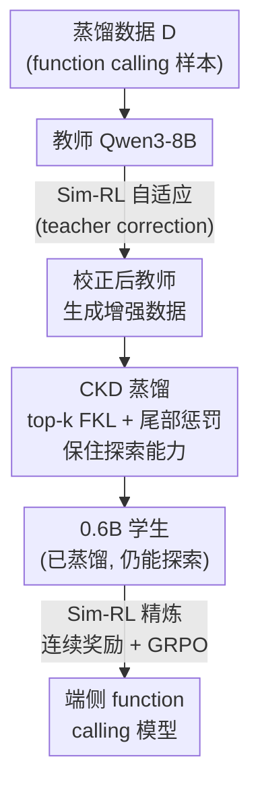

# STAR: Similarity-guided Teacher-Assisted Refinement for Super-Tiny Function Calling Models

**会议**: ICLR 2026  
**arXiv**: [2602.03022](https://arxiv.org/abs/2602.03022)  
**代码**: [github.com/Qwen-Applications/STAR](https://github.com/Qwen-Applications/STAR)  
**领域**: 模型压缩 / 知识蒸馏  
**关键词**: 知识蒸馏, 强化学习, Function Calling, 超小模型, 相似度奖励

## 一句话总结

提出 STAR 框架，通过约束知识蒸馏（CKD）和相似度引导的强化学习（Sim-RL）协同工作，将大模型的 function calling 能力有效迁移到 0.6B 级别的超小模型，在 BFCL 和 ACEBench 上大幅超越基线。

## 研究背景与动机

- LLM 的 function calling 能力对 AI Agent 至关重要，但大模型部署受限
- 直接对小模型做 SFT+RL 面临**三重挑战**：
  1. 小模型容易**过拟合** SFT 数据，记忆特定模式而非泛化
  2. 直接 RL 训练**不稳定**
  3. KD+RL 组合引入新问题：top-k 截断下 RKL 导致训练崩溃、二值奖励不适合多解任务、KD 与 RL 的协同难度

## 方法详解

### 整体框架

STAR 想把 Qwen3-8B 的 function calling 能力压进 0.6B 的端侧小模型，难点在于小模型直接 SFT 容易死记数据、直接 RL 又训不稳，而把蒸馏和 RL 串起来还会引入新的坑（top-k 截断下的崩溃、二值奖励不匹配多解任务）。它的解法是一条三阶段课程：先用「相似度引导的强化学习 Sim-RL」让教师自适应蒸馏数据，再用「约束知识蒸馏 CKD」把校正后教师的知识灌给学生、同时刻意保住学生后续 RL 要用的探索能力，最后再用 Sim-RL 拿连续奖励精炼学生策略。CKD 在第二步保住的探索能力，正是第三步 RL 跑得动的前提，三个阶段环环相扣而非简单拼接。

### 关键设计

**1. 约束知识蒸馏 CKD：让蒸馏别掐死后续 RL 要用的探索能力**

作者先把"为什么不能直接拿现成蒸馏目标"讲清楚。在 top-k 截断（只保留教师概率最高的 $V_k(x)$ 个 token）这个工程常规下，FKL 因为忽略尾部分布所以训练稳定，但 RKL 会对 $V_k(x)$ 之外的 token 施加不稳定的监督，直接导致灾难性崩溃；更隐蔽的是，RKL 的"模式寻求"特性会激进地把学生的尾部分布裁掉，降低输出熵——而低熵意味着弱探索，下游 RL 直接受拖累。CKD 因此设计成"只补不裁"：在 top-k FKL 的基础上加一项尾部惩罚，

$$\mathcal{L}_{CKD} = \mathcal{L}_{FKL\text{-}k} + \lambda_{tail} \mathcal{L}_{tail}$$

其中主项是常规的 top-k 前向 KL，

$$\mathcal{L}_{FKL\text{-}k} = \sum_{x} \sum_{v \in V_k(x)} P_T(v|x) \log \frac{P_T(v|x)}{P_S(v|x)}$$

尾部惩罚项只对"学生给了高概率、但教师认为不相关（落在 top-k 之外）"的 token 施压，

$$\mathcal{L}_{tail} = \sum_{x} \sum_{v \in V_m(x) \setminus V_k(x)} P_S(v|x)$$

这一项的作用是抑制学生"自信的错误"，但它并不强迫整条长尾分布归零，所以学生保住了 RL 阶段需要的探索能力——这正是 CKD 和直接 RKL 蒸馏的本质区别。

**2. 相似度引导的强化学习 Sim-RL：用连续奖励替代二值，匹配 function calling 的多解本质**

function calling 经常有多个等价的正确调用，二值"对/错"奖励会把大量"调对了大半"的样本判死，信号过稀。Sim-RL 改用一组连续奖励。格式奖励 $R_{format}$ 仍是二值，检查 `<think>`/`<tool_call>` 标签、JSON 格式与函数名有效性是否齐全。Function Call 奖励 $R_{fc}$ 借 IoU 的思路比较预测序列 $P$ 和真实序列 $G$，按参数级相似度算交并比：

$$R_{fc} = \frac{\sum_{i=1}^{\min(m,n)} \text{sim}(p_i, g_{\sigma(i)})}{|P| + |G| - |P \cap G|}$$

其中相似度函数 $\text{sim}(p,g)$ 按参数类型分别度量（字符串用 ROUGE-L，数值用精确匹配），比纯 AST 解析更灵活、比二值更细。纯文本回复另算一个 Response 奖励 $R_{response}$（用 ROUGE-L F1）。三者合成总奖励并约束到 $[-1, 1]$：

$$R = (R_{format} - 1) + R_{format} \cdot (R_{fc} + R_{response})$$

格式不合规先吃 $-1$ 的底，格式过关后才让内容奖励生效。优化用 GRPO，并借鉴 DAPO 的过滤机制：丢掉奖励全 0 或全 1 的同质组（这些组的优势全为零，对梯度没贡献），让训练聚焦在真正有区分度的样本上。

**3. STAR 训练课程：教师先自适应，再蒸馏，再精炼**

三个阶段串成一条课程。第一步先用 Sim-RL 微调教师模型 Qwen3-8B，让它适应目标蒸馏数据（teacher correction）——消融显示这一步对蒸馏质量有正面贡献；第二步用 CKD 把校正后教师的知识蒸馏到 0.6B 学生；第三步再用 Sim-RL 精炼学生策略。CKD 在第二步刻意保住的探索能力，正是为了让第三步的 RL 跑得动，三个阶段是环环相扣而非简单拼接。

## 实验关键数据

### BFCLv3 基准（Qwen3-0.6B）

| 方法 | Overall Acc | Non-Live | Live | Multi Turn |
|------|-----------|----------|------|------------|
| Base-model | 47.33 | 71.81 | 65.66 | 1.88 |
| SFT | 44.58 | 66.29 | 62.15 | 1.62 |
| SFT-think | 47.59 | — | — | — |
| FKL | — | — | — | — |
| ToolRL | — | — | — | — |
| **STAR** | **最优** | — | — | — |

### STAR 0.6B 关键成就

| 对比 | BFCL 相对增益 | ACEBench 相对增益 |
|------|-------------|-----------------|
| vs 基线 | +9.2% | >50% |
| vs 所有开源 <1B 模型 | **最优** | **最优** |
| vs 部分更大模型 | 超越 | 超越 |

### 消融实验

| CKD 组件 | 效果 |
|---------|------|
| top-k FKL alone | 稳定但下游 RL 增益有限 |
| top-k RKL/AKL | 训练崩溃 |
| CKD (FKL + tail penalty) | **稳定 + 保留探索 + RL 增益最大** |

### 关键发现

1. CKD 的尾部惩罚在保持训练稳定性的同时保留了足够的探索能力
2. Sim-RL 的连续奖励比二值奖励在多解任务上显著更有效
3. 精心设计的 KD+RL 课程可以让 0.6B 模型超越某些更大的模型
4. 教师先用 Sim-RL 适应数据（teacher correction）对蒸馏质量有正面贡献

## 亮点与洞察

- **诊断深入**：系统分析了 FKL vs RKL 在 top-k 截断下的行为差异和对下游 RL 的影响
- **奖励设计精巧**：参数级的相似度奖励比 AST 解析更灵活，比二值奖励信号更丰富
- **实用性极强**：0.6B 超小模型达到可部署水平的 function calling 性能
- **KD → RL 的衔接设计**：CKD 特别设计了保留探索能力的特性来服务后续 RL

## 局限性

- 仅在 Qwen 系列模型上验证，跨架构泛化性未知
- 奖励设计依赖特定的 function calling 格式（Qwen tool calling template）
- 教师模型质量直接决定蒸馏上限
- 训练流程相对复杂（教师微调 → CKD → Sim-RL 三阶段）

## 相关工作

- 知识蒸馏：GKD、AKL、FKL vs RKL 的讨论
- Function Calling：BFCL 基准、ToolRL
- 小模型训练：LUFFY（混合离线/在线）等

## 评分

- **新颖性**: ⭐⭐⭐⭐ — CKD 的尾部惩罚和 Sim-RL 的细粒度奖励都有技术贡献
- **技术深度**: ⭐⭐⭐⭐ — 对 KL 散度行为的分析深入，梯度层面的理论支撑
- **实验充分性**: ⭐⭐⭐⭐ — 多尺度模型 + 全面消融 + 两个主流基准
- **实用性**: ⭐⭐⭐⭐⭐ — 端侧部署的 0.6B function calling 模型有巨大实用价值

<!-- RELATED:START -->

## 相关论文

- [\[ICLR 2026\] Towards Reliable Benchmarking: A Contamination Free, Controllable Evaluation Framework for Multi-step LLM Function Calling](towards_reliable_benchmarking_a_contamination_free_controllable_evaluation_frame.md)
- [\[ICML 2026\] Critique-Guided Distillation for Robust Reasoning via Refinement](../../ICML2026/model_compression/critique-guided_distillation_for_robust_reasoning_via_refinement.md)
- [\[ICLR 2026\] Unveiling Super Experts in Mixture-of-Experts Large Language Models](unveiling_super_experts_in_mixture-of-experts_large_language_models.md)
- [\[CVPR 2026\] Teacher-Guided Routing for Sparse Vision Mixture-of-Experts](../../CVPR2026/model_compression/teacher-guided_routing_for_sparse_vision_mixture-of-experts.md)
- [\[ACL 2026\] Find Your Optimal Teacher: Personalized Data Synthesis via Router-Guided Multi-Teacher Distillation](../../ACL2026/model_compression/find_your_optimal_teacher_personalized_data_synthesis_via_router-guided_multi-te.md)

<!-- RELATED:END -->
