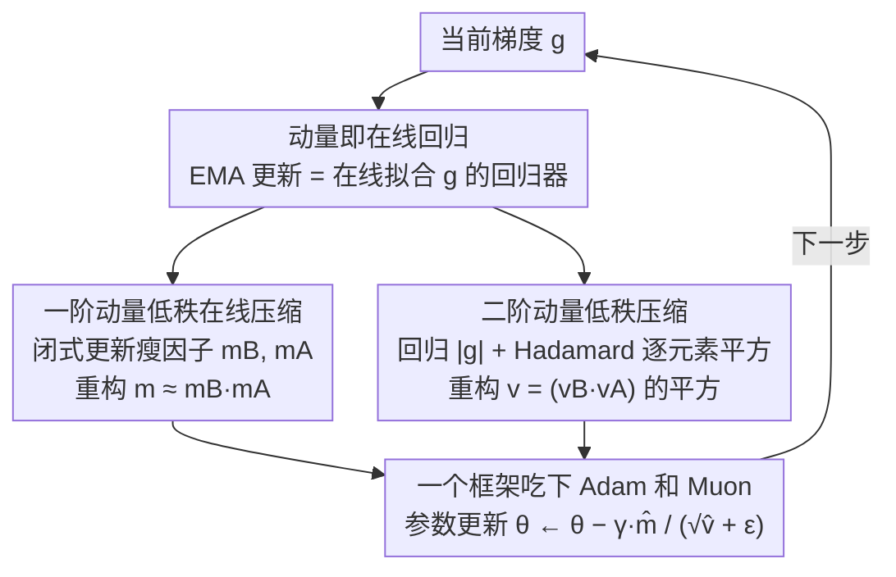

# Taming Momentum: Rethinking Optimizer States Through Low-Rank Approximation

**会议**: ICLR 2026 Oral  
**arXiv**: [2602.24283](https://arxiv.org/abs/2602.24283)  
**代码**: [github.com/mrflogs/LoRA-Pre](https://github.com/mrflogs/LoRA-Pre)  
**领域**: 模型压缩 / 高效优化器  
**关键词**: 低秩优化器, 动量压缩, 预训练效率, LoRA, Adam, Muon

## 一句话总结

揭示动量 EMA 更新等价于在线线性回归的梯度下降，基于此提出 LoRA-Pre，通过低秩分解压缩优化器动量，实现显存高效的 LLM 预训练和微调，在所有模型尺度上达到最优性能且仅需基线方法 1/8 的秩。

## 研究背景与动机

- Adam 等优化器维护一阶和二阶动量，使显存占用**三倍于模型权重**
- 现有低秩优化方法（GaLore、Flora、Fira 等）通过投影梯度降维度来压缩优化器状态
    - 周期性子空间更新导致**优化不连续和误差累积**
    - 无法即时适应变化的梯度子空间
- 需要一种能**连续适应子空间**的高效动量压缩方法

## 方法详解

### 整体框架

要省掉的不是模型权重，而是优化器为每个权重额外维护的两份动量——正是它们让 Adam 的显存膨胀到模型本身的三倍。本文的切入点是一个被忽略的观察：动量的 EMA 更新本质上就是一个在线回归器在拟合当前梯度。既然它在做回归，就可以像压缩权重那样用低秩分解去压缩它，而且不是周期性地重投影、而是每一步都在线地更新这个低秩表示。整条 pipeline 因此变成：把全秩动量 $m$ 换成两个瘦因子 $m_B m_A$，每步用闭式规则在线刷新这两个因子，参数更新时再把它们乘回来近似原动量。下面先说清"动量即回归"这个洞察，再分别处理一阶、二阶两份动量，最后说明它为什么对 Adam 和 Muon 都成立。

### 关键设计

**1. 把动量重读成在线线性回归：所有压缩的地基**

把 EMA 动量更新拆开看，它恰好是一步在线梯度下降：

$$m_{t+1} = \underbrace{m_t}_{weight} - \underbrace{(1-\beta)}_{lr} \cdot \underbrace{(m_t - g)}_{gradient}$$

也就是在以学习率 $1-\beta$ 最小化目标 $\min_m L(m; g) = \frac{1}{2}\|m - g\|_F^2$，其梯度正是 $m_t - g$。这一步把"动量"从一个状态量重新解释成"一个在线拟合梯度的回归器"，于是压缩动量就等价于给这个回归器换一个低秩的参数化——后面两点都建立在这个等价之上。

**2. 一阶动量的低秩在线压缩：把回归器塞进瘦因子里**

既然动量是在回归 $g$，就把全秩动量 $m \in \mathbb{R}^{p\times q}$ 分解成两个瘦因子 $m = m_B \cdot m_A$（$m_B \in \mathbb{R}^{p\times r}$，$m_A \in \mathbb{R}^{r\times q}$，$r \ll \min(p,q)$），回归目标随之变成

$$\min_{m_B, m_A} L(m_B, m_A; g) = \frac{1}{2}\|m_B m_A - g\|_F^2,$$

显存随即从 $p\times q$ 压到 $(p+q)\times r$。关键在于不靠反向传播去解这个目标：用 Newton 法可以推出一对闭式更新（Theorem 3.1）

$$m_B \leftarrow (1-\gamma_1)\, m_B + \gamma_1\, g\, m_A^T (m_A m_A^T)^{-1},$$
$$m_A \leftarrow (1-\gamma_1)\, m_A + \gamma_1\, (m_B^T m_B)^{-1} m_B^T g,$$

两条规则本身仍是 EMA 形式，因此能像原动量一样逐步在线刷新、连续跟踪梯度子空间，而不像 GaLore 那样隔一段时间才重投影一次。

**3. 二阶动量的低秩压缩：用 Hadamard 平方守住非负性**

二阶动量 $v$ 不能照搬一阶的做法，因为 Adam 更新要除以 $\sqrt{v}$，要求 $v$ 逐元素非负，而 $v_B v_A$ 这个低秩乘积没法保证这一点。解法是把 $v$ 重参数化成一个低秩乘积的逐元素平方 $v = (v_B v_A)^{\circ 2}$，再去回归梯度幅值：

$$\min_{v_B, v_A} L(v_B, v_A; g) = \frac{1}{2}\|v_B v_A - |g|\|_F^2.$$

平方天然保证了元素级正性，同时 $v_B v_A$ 仍是低秩的，于是二阶动量也被压进同样的 $(p+q)\times r$ 预算里。

**4. 一个框架同时吃下 Adam 和 Muon**

上述压缩只依赖"优化器维护一份动量"这一前提，与具体优化器无关，所以同一套低秩在线回归可以直接套到不同优化器上：对 Adam 同时压一阶 $m$ 和二阶 $v$，对 Muon 则压它自己的那份动量。这让 LoRA-Pre 不是一个针对单一优化器的补丁，而是一类动量压缩的通用配方。

## 实验关键数据

### 预训练：Llama 模型在 C4 数据集上的验证困惑度 (↓)

| 模型 | Full-rank Adam | GaLore | Flora | Fira | **LoRA-Pre** |
|------|---------------|--------|-------|------|-------------|
| 60M | 基线 | 次优 | — | — | **最优** |
| 130M | 基线 | 次优 | — | — | **最优** |
| 350M | 基线 | 次优 | — | — | **最优** |
| 1B | 基线 | 次优 | — | — | **最优** |

### 秩效率对比

| 方法 | 需要的秩（达到相当性能） |
|------|---------------------|
| GaLore | 基线秩 $r$ |
| Flora | 基线秩 $r$ |
| **LoRA-Pre** | **$r/8$** |

### 微调：MetaMathQA → GSM8K / MATH-500

| 方法 | Llama-3.1-8B | Llama-2-7B |
|------|-------------|------------|
| 标准 LoRA | 基线 | 基线 |
| **LoRA-Pre** | **+3.14** | **+6.17** |

### 消融实验

| 组件 | 效果 |
|------|------|
| 仅一阶压缩 | 有效但不如两阶 |
| 一阶+二阶压缩 | **最优** |
| 不同秩 $r$ | 对秩变化鲁棒，$r/8$ 即可 |
| Adam vs Muon 变体 | 两种优化器都受益 |

### 关键发现

1. LoRA-Pre 在**所有模型尺度**上取得最低验证困惑度
2. 仅需基线方法 **1/8 的秩**即可达到相当或更优性能
3. 在微调场景下同样有效，Llama-2-7B 上 +6.17 分提升
4. 闭式更新规则无需反向传播，计算高效
5. 二阶动量的 Hadamard 平方重参数化解决了正性约束问题

## 亮点与洞察

- **理论贡献优雅**：EMA ↔ 在线线性回归的等价性揭示了动量的新本质
- **从压缩模型到压缩优化器**：将 LoRA 的思想从模型权重迁移到优化器状态
- **连续子空间适应**：相比 GaLore 等周期更新方法，LoRA-Pre 在每步都适应梯度子空间
- **极强的秩效率**：1/8 秩 = 更少的显存占用 + 更好的性能
- **统一框架**：同一框架适用于 Adam 和 Muon，预训练和微调

## 局限性

- 需要计算 $(m_A m_A^T)^{-1}$ 或 $(m_B^T m_B)^{-1}$，$r$ 很大时有额外开销
- 二阶动量的 Hadamard 重参数化引入近似误差
- 仅在 Llama 架构上验证，跨架构泛化性待确认
- 分布式训练场景下的通信效率分析不足

## 相关工作

- 低秩预训练：GaLore（SVD 投影）、Flora（随机投影）、Fira（SGD 互补子空间）
- 在线动量压缩：MLorc、MoFaSGD、ADAPM
- 参数高效微调：LoRA、LoRA+、DoRA、LoFT、LoRA-Pro

## 评分

- **新颖性**: ⭐⭐⭐⭐⭐ — EMA=在线回归的洞察极其优雅
- **技术深度**: ⭐⭐⭐⭐⭐ — 理论推导严谨，闭式解优美
- **实验充分性**: ⭐⭐⭐⭐ — 60M-1B 预训练 + 7B-8B 微调全面覆盖
- **实用性**: ⭐⭐⭐⭐⭐ — 直接减少 LLM 训练显存，落地价值高

<!-- RELATED:START -->

## 相关论文

- [\[ICML 2026\] From Per-Image Low-Rank to Encoding Mismatch: Rethinking Feature Distillation in Vision Transformers](../../ICML2026/model_compression/from_per-image_low-rank_to_encoding_mismatch_rethinking_feature_distillation_in_.md)
- [\[ICLR 2026\] Revisiting Weight Regularization for Low-Rank Continual Learning](revisiting_weight_regularization_for_low-rank_continual_learning.md)
- [\[CVPR 2026\] UniComp: Rethinking Video Compression Through Informational Uniqueness](../../CVPR2026/model_compression/unicomp_rethinking_video_compression_through_informational_uniqueness.md)
- [\[ICLR 2026\] LoFT: Low-Rank Adaptation That Behaves Like Full Fine-Tuning](loft_low-rank_adaptation_that_behaves_like_full_fine-tuning.md)
- [\[NeurIPS 2025\] QSVD: Efficient Low-Rank Approximation for Unified Query-Key-Value Weight Compression](../../NeurIPS2025/model_compression/qsvd_efficient_low-rank_approximation_for_unified_query-key-value_weight_compres.md)

<!-- RELATED:END -->
