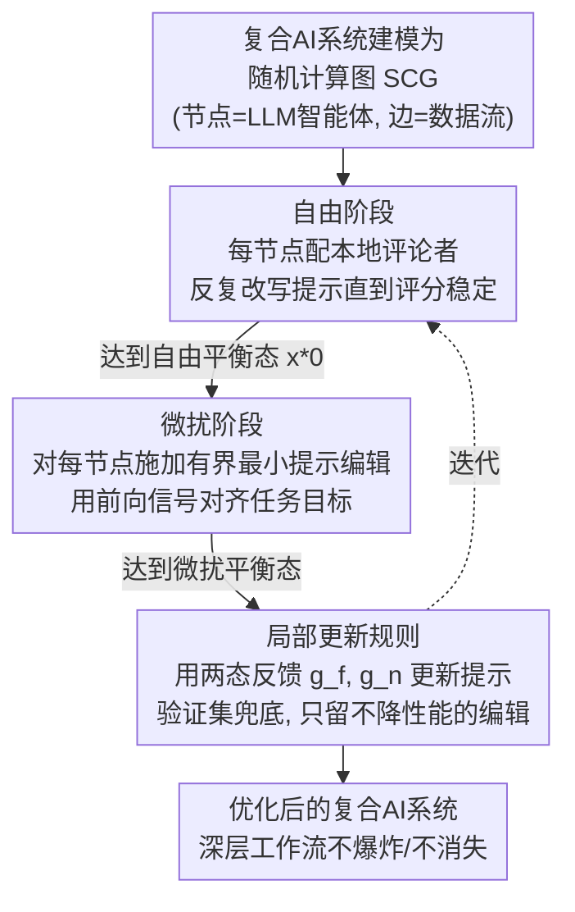

# Textual Equilibrium Propagation for Deep Compound AI Systems

**会议**: ICLR 2026  
**arXiv**: [2601.21064](https://arxiv.org/abs/2601.21064)  
**代码**: 未公开  
**领域**: 模型压缩 / 复合AI系统优化  
**关键词**: 复合AI系统, 文本梯度, 平衡传播, 提示优化, 多智能体工作流

## 一句话总结

提出文本平衡传播（TEP），一种基于局部学习原理的复合AI系统优化方法，通过自由阶段和微扰阶段的两阶段设计，避免全局文本反向传播中的梯度爆炸/消失问题，在深层工作流上显著优于 TextGrad。

## 研究背景与动机

现代复合AI系统由多个模块（检索器、工具、验证器等）协同工作，需要对整个管道进行端到端优化。TextGrad 开创了"通过文本的自动微分"，通过LLM-as-judge将文本反馈从下游反向传播到上游以更新提示。

然而，随着系统深度增加，TextGrad 面临两个关键失败模式：

**文本梯度爆炸**：反馈在各层累积，消息长度指数增长（$\mathbb{E}[B(g_u)] \geq c\gamma^k, \gamma > 1$），最终超出LLM的上下文窗口，且LLM-as-judge偏差在链中复合放大

**文本梯度消失**：为控制长度而压缩反馈时，具体可操作信息逐步丢失（$\mathbb{E}[S(g_u)] \leq C\alpha^k, \alpha \in (0,1)$），上游模块收到的反馈变为泛泛的"提高效率"等无用建议

这两个问题的根本原因是全局文本反向传播在深度复合AI系统中不可扩展。

## 方法详解

### 整体框架

TEP 要解决的是：复合AI系统一深，TextGrad 那条从末端损失一路回传的文本反馈链就会爆炸或消失。它的做法是把系统建模为随机计算图（Stochastic Computation Graph，SCG）$G=(V,E)$——节点是 LLM 智能体、边是数据流，优化目标为 $J(\theta) = \mathbb{E}_{o \sim D_{\text{task}}} \mathbb{E}_{Z \sim P_\theta(\cdot | o)} [\ell(o, Z)]$——然后借鉴能量基模型里的平衡传播，用两次"前向收敛"替代反向链：先让每个节点各自跑到一个局部平衡态（自由阶段），再用一个对齐任务目标的微扰把它轻轻拧一下、收敛到第二个平衡态（微扰阶段），最后用两个平衡态留下的本地反馈更新提示（局部更新规则），并迭代直到稳定。整条链里反馈始终只在单个节点内部循环、长度天然有界，所以深度再大也不会让消息指数膨胀或被压成空话。

### 关键设计

**1. 自由阶段（Free Phase）：让每个节点先各自收敛到局部最优**

针对的是框架里第一步——TextGrad 的反馈必须从最末端的损失一路回传，深度一大就累积失控。TEP 改为给每个节点 $v$ 配一个**本地 LLM 评论者**，它用结构化评分标准 $\theta_v^{\text{critic}}$（同时看 clarity / completeness / consistency 这类任务无关质量指标和任务相关性能指标）和一个采样温度 $\theta_v^{\text{temp}} \sim \mathcal{U}(0.3, 0.9)$（控制探索-利用）只评判本节点自己的输出，生成反馈 $g_v = C(z_v, \theta_v^{\text{critic}})$，**完全不依赖下游梯度** $g'$。节点据此反复改写提示，直到评论者评分跨轮稳定、不再建议改动，即达到局部"自由平衡态" $x_\star^0(\theta)$。因为反馈只在单个节点内部循环、长度天然有界，深度再大也不会让消息指数膨胀。

**2. 微扰阶段（Nudged Phase）：用前向信号把局部最优拧向全局目标**

纯局部收敛只保证每个节点自洽，却会让各节点收敛到互不协调的孤立最优、拼不成全局连贯的解。TEP 在自由平衡的基础上，对每个节点施加一次**有界的最小提示编辑**（proximal prompt edit），编辑用来强化那些与全局任务目标对齐的本地评分标准；关键在于这个对齐方向由任务级目标经**前向信号**（而非反向反馈链）传入，且修改强度有界、不破坏自由阶段已达到的局部最优。系统带着这些微扰再跑一遍并迭代，收敛到一个与自由平衡态不同的"微扰平衡态"——两个平衡态之间的差异，正是任务目标在本地留下的可用学习信号。

**3. 局部更新规则：用两态反馈更新提示并以验证集兜底**

有了两个平衡态后，每个节点按 $\theta_v' = U_v(g_v^f, g_v^n, \theta_v)$ 更新：$g_v^f$、$g_v^n$ 分别是自由阶段与微扰阶段的反馈信号（都被约束在有界长度和质量内），$U_v$ 是一个 LLM 定义的更新算子，把这两路反馈映射成新的提示编辑。这对应经典平衡传播里"用自由/微扰两相状态差近似梯度"的思想，只是 TEP 不取数值差、而让 LLM 直接联合两相反馈来改写文本。每一步更新（含两个阶段内部和最终合并）都做**验证集选择**，只保留不降低验证性能的编辑，避免单步评论者偏差被错误固化。

### 损失函数 / 训练策略

TEP 不使用显式数值损失，而是靠局部评论者的文本评分加验证集表现隐式优化，并对反馈施加两条与失败模式直接对应的约束：长度有界 $B(g) \ll \text{context limit}$（防爆炸）、质量保持 $S(g) \geq \tau$（防消失）。训练上自由阶段约 20 次迭代、微扰阶段约 40 次迭代，全程把黑盒 LLM 组件当模块化单元，无需访问任何模型参数。

## 实验关键数据

### 主实验结果

| 方法 | PubMedQA (Acc.) | STARK-PRIME (MRR) | HotpotQA (F1) | BigCodeBench (Pass) |
|------|----------------|-------------------|---------------|---------------------|
| CoT | 57.34±1.12 | 39.76±0.84 | 33.92±0.76 | 34.15±1.43 |
| DSPy | 60.26±0.40 | 41.40±0.04 | 44.90±0.32 | 33.81±2.75 |
| TextGrad | 56.96±2.24 | 41.31±1.67 | 24.86±1.19 | 35.71±0.10 |
| TextGrad+Sum | 56.12±1.85 | 40.72±1.21 | 24.12±1.25 | 35.12±0.67 |
| **TEP** | **62.02±1.31** | **42.72±0.65** | **48.72±1.32** | **38.97±0.39** |

TEP 在所有4个任务上均取得最佳，在HotpotQA上较次优方法提升8.1%，在BigCodeBench上提升3.4%。

### 消融实验

| 配置 | HotpotQA F1 | BigCodeBench Pass@1 |
|------|-------------|---------------------|
| Full TEP | 48.72 | 38.97 |
| 去掉微扰阶段 | 22.3 (-26.4) | 大幅下降 |
| 去掉自由阶段 | 36.8 (-11.9) | 36.3 (-2.7) |

去掉微扰阶段导致严重退化（HotpotQA下降26.4个点），说明纯局部平衡不足以实现系统级协调。去掉自由阶段也影响显著，因为它提供了有效微扰的高质量起点。

### 关键发现

- **深度扩展实验**：TextGrad的反馈token数从scale=1时的2K增长到scale=5时的32K+（约$2.2^s$指数增长）；TEP保持几乎恒定的token复杂度
- **有效更新率**：TextGrad+Sum的有效更新率从36%降至5%，TEP仅从37%缓降至33%
- **解优化**：在GPQA上TEP达44.5%（TextGrad为41.0%），在Object Counting上达81.6%（TextGrad为74.2%）

## 亮点与洞察

1. **精确类比**：将深度神经网络的梯度问题映射到复合AI系统的文本反馈问题，提出了严格的形式化定义（文本梯度爆炸和消失）
2. **生物启发**：从能量基模型的平衡传播借鉴思想到文本空间，是跨领域方法迁移的优秀案例
3. **实用性强**：保持黑盒LLM组件的模块化设计，无需访问模型参数，适用于任何LLM组合
4. **优势随深度增大**：与TextGrad相反，TEP的优势随工作流深度增加而扩大

## 局限性

- 自由阶段的20次迭代和微扰阶段的40次迭代带来额外计算成本
- 局部评论者的评分标准需要人工设计，不同任务可能需要不同的rubric
- 仅在固定SCG结构上验证，未探索动态图优化
- 微扰强度的超参数选择缺乏自动化方法

## 相关工作

- **TextGrad** (Yuksekgonul et al., 2025)：全局文本反向传播的先驱
- **DSPy** (Khattab et al., 2024)：程序化提示编译框架
- **OPTIMAS** (Wu et al., 2025)：局部训练奖励但需参数微调
- **Self-Refine** (Madaan et al., 2023)：迭代自我改进
- **Equilibrium Propagation** (Scellier & Bengio, 2017)：能量基模型的局部学习原理

## 评分

- 新颖性：⭐⭐⭐⭐（平衡传播→文本空间的创新类比）
- 理论性：⭐⭐⭐⭐（严格定义了文本梯度的失败模式并证明收敛性）
- 实验：⭐⭐⭐⭐（4个基准+深度扩展分析+消融研究）
- 实用性：⭐⭐⭐⭐（模型无关，适用于任意LLM管道）

<!-- RELATED:START -->

## 相关论文

- [\[ICLR 2026\] Rejuvenating Cross-Entropy Loss in Knowledge Distillation for Recommender Systems](rejuvenating_cross-entropy_loss_in_knowledge_distillation_for_recommender_system.md)
- [\[ICLR 2026\] Paper Copilot: Tracking the Evolution of Peer Review in AI Conferences](paper_copilot_tracking_the_evolution_of_peer_review_in_ai_conferences.md)
- [\[ICLR 2026\] Bridging Kolmogorov Complexity and Deep Learning: Asymptotically Optimal Description Length Objectives for Transformers](bridging_kolmogorov_complexity_and_deep_learning_asymptotically_optimal_descript.md)
- [\[CVPR 2026\] Rejection Mixing: Fast Semantic Propagation of Mask Tokens for Efficient DLLM Inference](../../CVPR2026/model_compression/rejection_mixing_fast_semantic_propagation_of_mask_tokens_for_efficient_dllm_inf.md)
- [\[NeurIPS 2025\] Efficient Parametric SVD of Koopman Operator for Stochastic Dynamical Systems](../../NeurIPS2025/model_compression/efficient_parametric_svd_of_koopman_operator_for_stochastic_dynamical_systems.md)

<!-- RELATED:END -->
