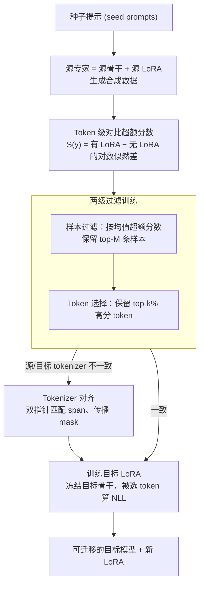

# TiTok: Transfer Token-level Knowledge via Contrastive Excess to Transplant LoRA

**会议**: ICLR 2026  
**arXiv**: [2510.04682](https://arxiv.org/abs/2510.04682)  
**代码**: [https://github.com/NaughtyMaltiz16/TiTok](https://github.com/NaughtyMaltiz16/TiTok)  
**领域**: 模型压缩  
**关键词**: LoRA 迁移, 知识蒸馏, Token 级选择, 参数高效微调, 对比超额分数

## 一句话总结

提出 TiTok 框架，通过 token 级对比超额分数（contrastive excess）实现 LoRA 适配器跨模型高效迁移，无需额外判别器模型，在推理和个性化任务上一致超越 TransLoRA 和知识蒸馏基线。

## 研究背景与动机

- **LoRA 的绑定问题**: LoRA 等 PEFT 方法虽然参数高效，但适配器参数依赖于特定基础模型，无法跨模型迁移
- **现有解决方案的局限**:
    - 知识蒸馏（KD）依赖原始训练数据，通常不可用
    - TransLoRA 通过合成数据解决数据依赖，但需要训练额外的判别器模型进行数据过滤，增加了复杂度
- **核心动机**: 能否用更轻量的方式，从 LoRA 中提取 token 级任务知识信号，指导跨模型的知识迁移？

## 方法详解

### 整体框架

TiTok 想把源模型上训好的 LoRA「移植」到另一个基础模型，但既拿不到原始训练数据，也不想像 TransLoRA 那样额外训一个判别器。它的做法是：先让源模型生成一批合成数据，再用源模型自身「带 LoRA」与「不带 LoRA」时的 token 级输出差异作为任务知识的信号，据此在样本和 token 两个层面筛选出最有价值的监督，最后用这些被筛过的数据以标准 NLL 损失训练目标模型上的新 LoRA。整套流程不引入任何外部模型，所有信号都来自源模型自带的有/无 LoRA 对比。

### 关键设计

**1. Token 级对比超额分数：从 LoRA 自身差异里读出任务知识。** 跨模型迁移最缺的是「哪些 token 才承载了 LoRA 注入的任务能力」这一信号，TiTok 用源模型有无 LoRA 时的预测差异直接度量它。对每个生成 token $y_i$，定义超额分数 $S(y_i) = L_e(y_i) - L_a(y_i)$，其中 $L_a(y_i) = \log P_{\mathcal{M}_s}(y_i \mid \mathbf{q}, \mathbf{y}_{<i})$ 是裸基础模型的对数似然、$L_e(y_i) = \log P_{\mathcal{M}_s + \mathcal{A}_s}(y_i \mid \mathbf{q}, \mathbf{y}_{<i})$ 是叠加源 LoRA 后的对数似然。当基础模型对某个 token 把握不大、而加上 LoRA 后却高置信地预测出来时，这个 token 就拿到高分——正是 LoRA 真正改变了模型行为的地方。这个量本质是 token 级对数似然比（LLR），由 Neyman-Pearson 引理可知它是区分「有 LoRA」与「无 LoRA」两个分布的最优统计量，因此用它筛选 token 在理论上有最优区分性的支撑。

**2. 两级过滤训练：在样本和 token 两个粒度上只留高信息量监督。** 合成数据里既有整段没什么任务信息的样本，也有样本内部大量无关 token，全盘训练会稀释信号。TiTok 先做样本过滤：对每条样本取其内部 token 超额分数的均值 $\bar{S}_j = \frac{1}{|\mathbf{y}_j|} \sum_{y_i \in \mathbf{y}_j} S(y_i)$，按此排序保留 top-$M$ 条最富信息的样本组成 $\mathcal{D}_f$。再在保留样本内部做 token 选择：只对超额分数排进 top-$k\%$ 的 token 计损失，用指示函数 $I_{k\%}(y_i)$ 把其余 token 屏蔽掉，监督目标写作 $\sum_{(\mathbf{q}_j, \mathbf{y}_j) \in \mathcal{D}_f} \sum_{y_i \in \mathbf{y}_j} I_{k\%}(y_i) \cdot L_t(y_i)$。实验里 $k\%$ 取 70% 在多数设置下最优，top 20% 的 token 经验证集中了最浓的任务知识（0.482 vs 底部 0.468）。

**3. Tokenizer 对齐：让源/目标分词不一致时 mask 仍能对上。** 源模型和目标模型常用不同 tokenizer，token 边界对不齐，源端算出的超额分数 mask 无法直接套到目标序列上。TiTok 用双指针对两边逐步递增解码、在文本层面匹配出对应的 span，再按四种情形传播 mask：一对一直接复制、一对多把同一分数复制到多个目标 token、多对一对源端多个分数取平均、多对多平均后复制。对齐完成后再在目标序列上做 top-$k\%$ 选择，保证最终参与训练的是目标侧最可信的 token。

### 损失函数 / 训练策略

目标 LoRA $\mathcal{A}_t$ 挂在冻结的目标骨干 $\mathcal{M}_t$ 上，只用过滤后的合成数据、按被选 token 计标准 NLL 损失训练：

$$\mathcal{L}_{\text{TiTok}} = \sum \sum I_{k\%}(y_i) \cdot \bigl(-\log P_{\mathcal{M}_t + \mathcal{A}_t}(y_i \mid \mathbf{q}, \mathbf{y}_{<i})\bigr)$$

骨干始终冻结，只更新 LoRA（实验用 rank=8），因此迁移本身依旧保持参数高效。

## 实验

### 主实验：四种迁移设置

| 迁移设置 | 方法 | BBH Acc | MMLU Acc | News R-1 | Scholarly R-1 |
|----------|------|---------|----------|----------|--------------|
| Mistral→Mistral | Vanilla | 0.397 | 0.557 | 0.117 | 0.381 |
| Mistral→Mistral | TransLoRA | 0.416 | 0.534 | 0.156 | 0.447 |
| Mistral→Mistral | **TiTok** | **0.424** | **0.561** | **0.161** | **0.473** |
| Mistral→Llama3 | Vanilla | 0.469 | 0.469 | 0.125 | 0.444 |
| Mistral→Llama3 | TransLoRA | 0.473 | 0.473 | 0.126 | 0.461 |
| Mistral→Llama3 | **TiTok** | **0.484** | **0.485** | **0.139** | **0.464** |
| Llama2→Llama3 | **TiTok** | **0.488** | **0.477** | **0.138** | **0.461** |

### 消融实验

| 样本过滤 | Token 选择 | BBH | MMLU | News R-1 | Scholarly R-1 |
|----------|-----------|-----|------|----------|---------------|
| ✗ | ✗ | 0.458 | 0.485 | 0.133 | 0.456 |
| ✗ | ✓ | 0.463 | 0.496 | 0.137 | 0.460 |
| ✓ | ✗ | 0.470 | 0.500 | 0.139 | 0.460 |
| ✓ | ✓ | **0.483** | **0.501** | **0.142** | **0.464** |

### 关键发现

- TiTok 平均优于 vanilla 目标模型 +9.94%，优于 KD +8.5%，优于 TransLoRA +4.4%
- 跨模型族（Mistral→Llama）、跨尺度（3B→8B）、跨版本（Llama2→Llama3）均有效
- Top 20% 超额分数 token 包含最集中的任务知识（0.482 vs bottom 0.468）
- 不同模型专家（Mistral 7B 和 Llama2 7B）在 top 20% token 选择上有 59.76% 重合度
- Token 选择比率 $k\%$ = 70% 在大多数设置下最优
- 使用不相关领域的外部数据时 TiTok 仍然有效

## 亮点

- **方法简洁有效**: 不需要训练额外模型（判别器），仅利用源模型自身的有/无 LoRA 差异
- **理论扎实**: 超额分数有对数似然比的统计检验理论支撑
- **全面的迁移场景**: 覆盖同族、跨族、跨尺度、跨版本四种设置
- **Tokenizer 对齐**: 优雅解决不同模型 tokenizer 不匹配问题

## 局限性

- 依赖合成数据质量，合成能力弱的源模型可能限制迁移效果
- Token 选择比率 $k\%$ 在不同迁移设置间不完全一致（Llama3 3B→8B 最优值为 30%）
- 仅在 LoRA（rank=8）上验证，未探索其他 PEFT 方法
- 评估任务主要集中在推理（BBH/MMLU）和个性化（LaMP），其他任务类型待验证

## 相关工作

- **PEFT 迁移**: TransLoRA 通过合成数据+判别器迁移 LoRA，方法更重
- **知识蒸馏**: 传统 KD 在 teacher-student 框架下以 logit/序列级操作，需原始数据
- **选择性 token 训练**: 受 selective training 文献启发，首次将 token 选择扩展到知识迁移场景

## 评分

| 维度 | 分数 |
|------|------|
| 创新性 | ★★★★☆ |
| 理论深度 | ★★★★☆ |
| 实验充分性 | ★★★★☆ |
| 实用价值 | ★★★★☆ |
| 写作质量 | ★★★★☆ |

<!-- RELATED:START -->

## 相关论文

- [\[ACL 2026\] LoRA on the Go: Instance-level Dynamic LoRA Selection and Merging](../../ACL2026/model_compression/lora_on_the_go_instance-level_dynamic_lora_selection_and_merging.md)
- [\[CVPR 2026\] SelecTKD: Selective Token-Weighted Knowledge Distillation for LLMs](../../CVPR2026/model_compression/selectkd_selective_token-weighted_knowledge_distillation_for_llms.md)
- [\[ICLR 2026\] Token Distillation: Attention-Aware Input Embeddings for New Tokens](token_distillation_attention-aware_input_embeddings_for_new_tokens.md)
- [\[ICLR 2026\] AMiD: Knowledge Distillation for LLMs with α-mixture Assistant Distribution](amid_knowledge_distillation_for_llms_with_α-mixture_assistant_distribution.md)
- [\[ICCV 2025\] Fuse Before Transfer: Knowledge Fusion for Heterogeneous Distillation](../../ICCV2025/model_compression/fuse_before_transfer_knowledge_fusion_for_heterogeneous_distillation.md)

<!-- RELATED:END -->
