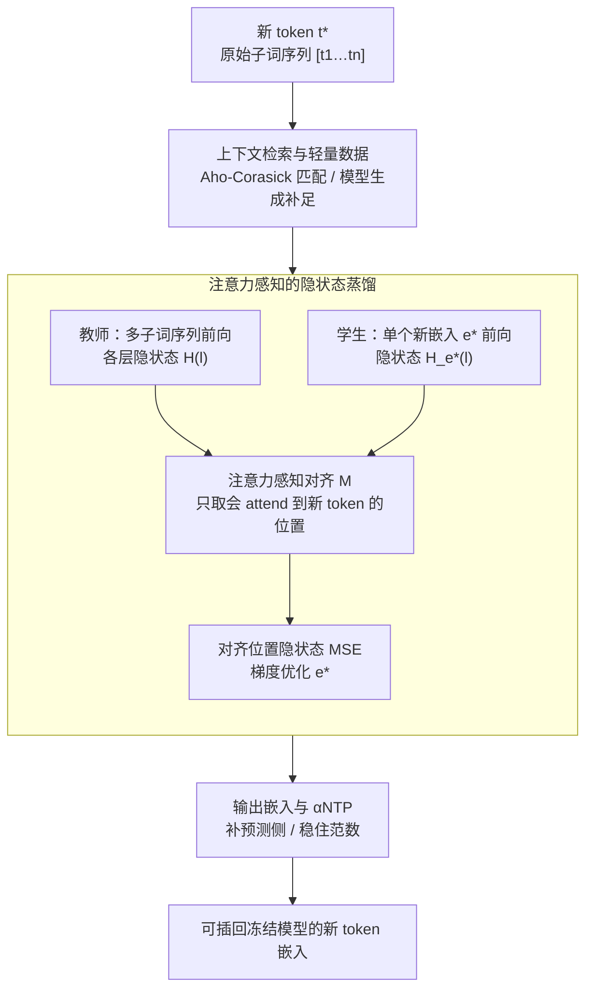

# Token Distillation: Attention-Aware Input Embeddings for New Tokens

**会议**: ICLR 2026  
**arXiv**: [2505.20133](https://arxiv.org/abs/2505.20133)  
**代码**: [https://github.com/konstantinjdobler/token-distillation](https://github.com/konstantinjdobler/token-distillation)  
**领域**: 模型压缩  
**关键词**: 词表扩展, Token 嵌入初始化, 知识蒸馏, 领域适应, 语言适应

## 一句话总结

提出 Token Distillation 方法，通过蒸馏 Transformer 各层编码的多子词交互信息到单一 token 嵌入中，实现高质量的新 token 嵌入初始化，无需预训练超网络且优于现有方法。

## 研究背景与动机

- **静态词表问题**: 预训练语言模型使用固定 tokenizer，对领域特定或新语言词汇过度分词，导致性能下降和计算开销增加
- **现有初始化方法的根本局限**:
    - 子词均值法仅利用 embedding 矩阵信息，忽略了 Transformer 层的功能性知识
    - 例如 `<_pal><at><able>` 的各子词 embedding 不包含 `<_palatable>` 的语义
    - 多子词的语义由 Transformer 的注意力/前馈层在上下文化过程中逐步构建（neural detokenization）
- **核心洞察**: 有效的新 token 嵌入必须捕获存储在所有 Transformer 层中的信息，而非仅依赖 embedding 矩阵

## 方法详解

### 整体框架

论文要解决的是给词表里新加的 token 一个好的输入嵌入。它的核心想法是：一个新 token $t^{\star}$ 的语义，原本是模型读完它对应的子词序列 $[t_1,\dots,t_n]$ 后，由 Transformer 各层在上下文里逐层"算"出来的（neural detokenization）；子词均值法只取 embedding 矩阵那一层，自然丢掉了这部分语义。于是 Token Distillation 把"原始模型读完整子词序列后产生的隐状态"当作教师信号，直接梯度优化单个新嵌入 $\mathbf{e}^{\star}$，让模型只看一个新 token 时的隐状态去逼近它。

整条流水线分三步：先从语料里**检索/生成**包含目标词的少量真实上下文；再让**教师（多子词序列）和学生（单个新嵌入）各跑一遍前向**，在"会注意到新 token"的位置上做隐状态 MSE 蒸馏、梯度优化 $\mathbf{e}^{\star}$；最后**补上输出侧嵌入并稳住范数**，得到可直接插回冻结模型使用的新嵌入。

### 关键设计

**1. 上下文检索与轻量数据：让蒸馏有真实语境又足够便宜**

蒸馏需要包含目标 token 的真实句子，否则学到的嵌入会脱离实际用法。论文给两条路：主方法用 Aho-Corasick 多模式串匹配算法，从领域或通用语料里一次性高效检索出所有包含目标词的片段，并把每段截断到目标词周围的小窗口；当语料里某些词找不到样本时（如完全无关语料场景），备选用新 token 直接做 prompt 让因果模型自己生成包含该词的文本补足。两条路都只为每个新 token 凑少量高质量上下文，因此数据极省：每个新 token 只取约 25 个片段、每段截到约 50 个 token。配合"每个 token 相互独立、且全程复用目标模型自身"，2500 个新 token 在单张 GPU 上 10 分钟内即可全部初始化完——相比 ZeTT 那种要预训练超网络的方法，这里没有任何额外训练成本，是它实用性上的关键。

**2. 注意力感知的隐状态蒸馏：把多子词交互压进单个嵌入**

子词均值法之所以差，是因为 `<_pal><at><able>` 三个子词的 embedding 里根本不含 `<_palatable>` 的语义——那个语义是注意力层在上下文里现算出来的。Token Distillation 把这件事变成一个回归问题：对采样自语料的句子 $s$，分别用原始多子词序列（教师）和单个新 token（学生）跑前向，最小化两者在指定层 $l$ 上、对齐位置处的隐状态 MSE：

$$\min_{\mathbf{e}^{\star} \in \mathbb{R}^d} \mathbb{E}_{s \sim S} \left[ \frac{1}{|\mathcal{M}(s_\tau, s_{\tau^{\star}})|} \sum_{(i,j) \in \mathcal{M}(s_\tau, s_{\tau^{\star}})} \left\| \mathcal{H}_{\mathbf{e}^{\star}}^{(l)}(s_{\tau^{\star}})_i - \mathcal{H}^{(l)}(s_\tau)_j \right\|_2^2 \right]$$

其中 $\mathcal{H}^{(l)}(s_\tau)$ 是教师在原始 tokenization 下第 $l$ 层的隐状态，$\mathcal{H}_{\mathbf{e}^{\star}}^{(l)}(s_{\tau^{\star}})$ 是学生用新嵌入时的隐状态。"注意力感知"体现在对齐映射 $\mathcal{M}$：它只保留 $s_{\tau^{\star}}$ 中那些会 attend 到新 token 的位置 $i$——只有这些位置才真正受新嵌入影响，约束它们就足以把多子词交互信息逼进 $\mathbf{e}^{\star}$。这样无需像 Token-to-Words 那样先定位语义被统一表示的层，蒸馏自动把分散在所有 Transformer 层里的信息抽进单个嵌入。实践中取最后一层隐状态做监督（消融显示换更早的层还能再省算力且略好）。

**3. 输出嵌入与 αNTP：补上预测侧并稳住范数**

蒸馏目标只约束输入侧隐状态，所以它只学输入嵌入——新 token 本就不在教师的预测词表里，没法直接蒸馏输出嵌入。输出嵌入因此要么置零，要么额外挂一个 NTP（next-token prediction，下一 token 预测）目标来训练。对 tied embedding（输入输出共享一张矩阵）的模型，直接这么训会触发一个失效模式：新嵌入 norm 无界增长直至爆炸。论文用 $\alpha$NTP 缓解——给 NTP 损失动态乘一个缩放系数 $\alpha$ 并对其做 stop-gradient，让 NTP 隐式约束输出嵌入范数、又不至于干扰蒸馏学到的输入嵌入。

## 实验

### 主实验：生物医学领域适应（8 个模型平均）

| 方法 | 平均准确率 |
|------|-----------|
| 原始 tokenization | 66.5 |
| Random | 57.5 |
| 子词均值 | 60.8 |
| NTP (仅新嵌入) | 63.0 |
| ZeTT (预训练超网络) | — (仅部分模型) |
| **Token Distillation** | **64.6** |
| **Token Distillation + αNTP** | **64.7** |

### 定义生成质量（LLM 评判）

| 方法 | 相似度 Avg | 正确性 Avg |
|------|-----------|-----------|
| Random | 0.0 | 0.1 |
| 子词均值 | 16.6 | 18.6 |
| NTP | 52.0 | 59.4 |
| ZeTT | — | — |
| **Token Distillation** | **68.5** | **74.4** |
| **Token Distillation + αNTP** | **76.7** | **83.3** |

### 法语语言适应

| 方法 | Mistral-7B | Llama3-8B | Llama3-8B-i | Avg |
|------|-----------|-----------|-------------|-----|
| 原始 | 69.5 | 69.4 | 72.1 | 73.2 |
| 子词均值 | 56.3 | 58.4 | 61.7 | 61.5 |
| NTP | 64.7 | 67.0 | 70.1 | 70.8 |
| **Token Distillation** | **68.5** | **68.9** | **72.9** | **72.9** |

### 关键发现

- Token Distillation 在所有 8 个模型上一致优于 NTP 和子词均值，且无需超网络预训练即超越 ZeTT
- 定义生成实验证实蒸馏后的嵌入质量更高，语义更完整
- 冻结原始嵌入仅更新新嵌入（NTP 变体）比调整全部嵌入效果更好
- Tied embedding 模型（Llama3.2-3B）可能出现 norm 爆炸，加 $\alpha$NTP 正则化可缓解
- 法语适应中 Token Distillation 甚至可超越原始 tokenization（Llama3-8B-i）

## 亮点

- **理论洞察深刻**: 指出现有方法忽略 Transformer 层知识的根本缺陷
- **方法极其轻量**: 每 token 仅需 25 个文本片段，10 分钟处理 2500 个新 token
- **无需额外模型**: 不需要预训练超网络，直接使用目标模型自身
- **广泛模型验证**: 覆盖 3B-8B、base/instruct、tied/untied embedding 等多种设置

## 局限性

- 仅学习输入嵌入，输出嵌入需额外处理
- 对 tied embedding 模型可能出现 norm 不稳定
- 蒸馏目标选择最后一层隐状态，是否最优未充分探索
- 每个新 token 需要少量包含该 token 的上下文文本，完全零资源场景适用性有限
- 相比超网络方法，推理时初始化速度较慢（需要梯度优化而非单次前向传播）

## 相关工作

- **无梯度方法**: 子词均值、加权线性组合（WECHSEL、FVT 等）——忽略 Transformer 层知识
- **基于梯度方法**: NTP 嵌入调优、超网络 ZeTT——前者目标不直接，后者需昂贵预训练
- **Token-to-Words**: 使用 PatchScopes 定位子词被统一表示的层，需训练映射模块
- **Token Distillation**: 无需定位，直接通过蒸馏捕获所有层的信息

## 评分

| 维度 | 分数 |
|------|------|
| 创新性 | ★★★★☆ |
| 理论深度 | ★★★★☆ |
| 实验充分性 | ★★★★★ |
| 实用价值 | ★★★★☆ |
| 写作质量 | ★★★★★ |

<!-- RELATED:START -->

## 相关论文

- [\[ICLR 2026\] FASA: Frequency-Aware Sparse Attention](fasa_frequency-aware_sparse_attention.md)
- [\[ICLR 2026\] TurboBoA: Faster and Exact Attention-aware Quantization without Backpropagation](turboboa_faster_and_exact_attention-aware_quantization_without_backpropagation.md)
- [\[ICLR 2026\] AgilePruner: An Empirical Study of Attention and Diversity for Adaptive Visual Token Pruning in LVLMs](agilepruner_an_empirical_study_of_attention_and_diversity_for_adaptive_visual_to.md)
- [\[CVPR 2026\] CORE: Compact Object-centric REpresentations as a New Paradigm for Token Merging in LVLMs](../../CVPR2026/model_compression/core_compact_object-centric_representations_as_a_new_paradigm_for_token_merging_.md)
- [\[NeurIPS 2025\] A Token is Worth over 1,000 Tokens: Efficient Knowledge Distillation through Low-Rank Clone](../../NeurIPS2025/model_compression/a_token_is_worth_over_1000_tokens_efficient_knowledge_distillation_through_low-r.md)

<!-- RELATED:END -->
