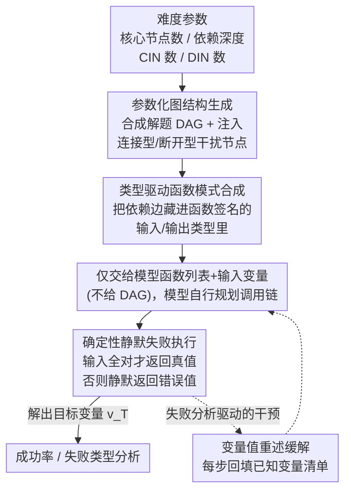

# Towards Reliable Benchmarking: A Contamination Free, Controllable Evaluation Framework for Multi-step LLM Function Calling

**会议**: ICLR 2026  
**arXiv**: [2509.26553](https://arxiv.org/abs/2509.26553)  
**领域**: 视频理解  
**关键词**: 工具增强LLM, 多步函数调用, benchmark, 数据污染, DAG图遍历

## 一句话总结

提出 FuncBenchGen 框架，通过将多步函数调用建模为 DAG 图遍历问题，实现无数据污染、可精细控制任务难度的 LLM 工具使用能力评估，并揭示了推理模型在长调用链和连接型干扰函数下的关键失败模式。

## 研究背景与动机

现有的工具增强语言模型（TaLM）评估基准面临两大核心问题：

**数据污染风险**：现有基准（如 API-Bank、BFCLv4、ToolBench 等）的问答对可能在预训练数据或测试时网页搜索中被泄露，导致评估结果不可靠

**任务复杂度不可控**：现有基准缺乏对任务难度的精细控制，无法系统地分析哪些因素最显著影响模型性能

| 基准 | 无污染 | 函数集大小控制 | 依赖深度控制 | 干扰函数类型控制 |
|------|--------|----------------|--------------|------------------|
| API-Bank | ✗ | ✗ | ✗ | ✗ |
| BFCLv4 | ✗ | ✓ | ✗ | ✗ |
| ToolBench | ✗ | ✓ | ✗ | ✗ |
| **FuncBenchGen** | **✓** | **✓** | **✓** | **✓** |

## 方法详解

### 整体框架

FuncBenchGen 把"多步函数调用"形式化成一个**有向无环图（DAG）遍历问题**：给定函数集 $\mathcal{F}=\{f_1,\ldots,f_n\}$、已知的输入变量集 $\mathcal{V}_{input}$ 和一个目标变量 $v_T$，模型必须自己规划并迭代执行一串函数调用，把中间结果逐层喂给下游函数，最终算出 $v_T$ 的值。整条流水线是这样转的：先按四个难度参数程序化合成一张依赖图，再把每个图节点实例化成带类型签名的函数（但只把函数列表交给模型、不告诉它依赖图），模型据此规划并执行调用链，执行环节用"输入全对才返回真值、否则静默返错"的规则放大状态错误；最后失败分析又反哺出一个"变量值重述"的轻量干预回环。由于整张图在评测时才程序化生成、答案随之确定，天然不存在被预训练语料污染的可能，而图的形状由几个参数精确控制，任务难度因此能沿不同维度独立调节。

### 关键设计

**1. 参数化图结构生成：把难度拆成可独立调节的几个旋钮**

要让难度"可控"，关键是把"任务有多难"拆成互不耦合的维度。FuncBenchGen 用四个生成参数做到这点，每个对应一种独立的难度来源。$n^{\text{core}}$ 是核心节点数，即解出目标真正需要调用的函数个数，直接决定调用链有多长；$d$ 是依赖深度，刻画从输入到目标要经过几层串联，深度越大错误越容易逐层累积。生成时先铺一条长度为 $d$ 的节点序列保证存在合法解路径，再迭代加入剩余的 $n^{\text{core}}-(d+1)$ 个核心节点（保持无环且不超深度）。另外两个参数专门注入干扰：$n^{\text{conn}}$ 是连接型无关节点数（connected irrelevant node, CIN），把无关函数挂作核心节点的孩子，使其与核心函数共享类型兼容的变量、看起来"像是用得上"，最难甄别；$n^{\text{dis}}$ 是断开型无关节点数（disconnected irrelevant node, DIN），是与核心子图完全没有变量连接的孤立节点，理论上一眼就该被排除。把这四个旋钮解耦，正是为了系统回答"到底是链长、深度还是哪类干扰最伤性能"。

**2. 类型驱动的函数模式合成：让 DAG 的边在函数签名里自然浮现**

图建好后，每个节点被实例化成一个完整的函数定义：随机生成的函数名（如 `func_yep`）、带语义类型标注的输入/输出参数，以及一段自然语言描述。关键在于——节点之间的依赖边**不**显式告诉模型，而是隐藏在类型系统里：只有上游函数的输出类型与下游函数的输入类型（及其子类型）相匹配时，才构成一条可用的数据通路。模型拿到的只有一堆函数列表和初始输入变量，必须像做类型推断一样反推出哪条调用路径能把输入一步步转化到目标。这既保证了"评测时才合成、无法被污染"，也复刻了真实工具编排里"从一堆 API 签名里拼出调用链"的核心难点。

**3. 确定性静默失败执行：用"错一步全错"逼出状态追踪能力**

每个变量被赋一个三位随机整数真值，函数只有在所有输入都恰好等于其正确真值时才返回正确输出，否则返回一个随机错误值、且**不抛任何异常**。这种静默失败刻意模仿真实 API：模型若中途用了未知或错误的变量值，后续调用会一路返回貌似合理却全错的结果，错误被悄悄放大到终点。于是评测真正考的不是语法是否合法，而是模型能否在多轮调用中准确记住并复用每一个中间状态——只要有一步状态记错，整条链就崩。

**4. 变量值重述缓解策略：给模型补一份外置工作记忆**

失败分析显示，绝大多数错误并非"调错函数"，而是"用了未知/错误的值"（GPT-5 错误中 79.6% 属此类）。据此作者提出一个极简干预：每次函数返回时，除输出值本身外，再附带一份当前所有已知变量及其取值的清单。这一步**不提供任何新信息**，只是把模型本该自己记住的状态重新摆回上下文。它有效恰恰反证了多步工具使用的真正瓶颈是工作记忆而非推理——状态显式外置后成功率大幅回升（GPT-5 由 62.5% 升至 81.3%）。

## 实验关键数据

### 主实验：不同核心节点数下的成功率

| 模型 | 5 核心节点 | 10 核心节点 | 20 核心节点 |
|------|-----------|------------|------------|
| GPT-5 | 72.5% | 38.2% | 15.0% |
| Gemini-2.5-Pro | 46.5% | 14.4% | 6.0% |
| GPT-5-mini | 16.0% | 7.6% | 4.2% |
| Qwen3 | 11.0% | 8.2% | 3.8% |
| GPT-4.1 | 12.0% | 2.2% | 0.2% |

### 失败类型分析

| 失败类型 | GPT-5 | Gemini-2.5-Pro | Qwen3 | GPT-4.1 |
|---------|-------|----------------|-------|---------|
| 函数不存在 | 0.0% | 2.4% | 0.0% | 0.0% |
| 输入参数数量错误 | 0.0% | 0.2% | 0.1% | 0.0% |
| 使用未知值 | 79.6% | 69.1% | 74.0% | 73.2% |
| 使用错误值 | 20.4% | 28.3% | 25.8% | 26.8% |

### 依赖深度影响

- GPT-5 在深度为 1（星型结构）时接近 90% 成功率，深度增至 4-8 时降至不到 30%
- 路径结构（深度 8-9）相比中等分支结构（深度 5-7）略有改善，表明分支少的序列化调用链更易处理
- 更大思考预算（medium vs minimal）在复杂场景中显著提升性能

### 关键发现

1. **推理模型显著优于通用模型**：GPT-5 在 5 核心节点时达到 72.5%，而 GPT-4.1 仅 12.0%
2. **性能随序列长度急剧下降**：GPT-5 从 72.5%（5 节点）降至 15.0%（20 节点）
3. **连接型干扰函数（CIN）危害最大**：因共享类型兼容变量，模型难以区分相关/无关函数
4. **缓解策略显著有效**：变量重述使 GPT-5 成功率从 62.5% 提升至 81.3%
5. **GPT-5 调用效率不佳**：即使成功，也多调用约 10% 的冗余函数
6. **充足推理预算至关重要**：minimal 思考预算下，GPT-5 在有干扰函数时成功率低于 20%

## 亮点与洞察

1. **优雅的形式化**：将工具使用抽象为 DAG 遍历问题，实现评估维度的正交分解
2. **失败分析深刻**：揭示所有模型最大的短板是**状态追踪**而非语法理解——79.6% 的 GPT-5 错误来自使用未知变量值
3. **简单有效的缓解**：仅重述已知变量值（不提供新信息），就能大幅提升性能，说明 LLM 的工作记忆是多步工具使用的核心瓶颈
4. **对 MCP 生态的警示**：即使是断开型干扰函数在函数集增大到 40 时也严重降低 GPT-5 性能（<10%），意味着当前 LLM 尚未准备好处理大规模 MCP 服务器
5. **失败模式差异揭示模型性格**：失败时 GPT-5 倾向于多次尝试（调用更多函数），而 Gemini-2.5-Flash 则倾向于放弃（调用更少函数）

## 局限性

1. 合成函数与真实 API 存在差距，真实场景中函数语义更复杂
2. 仅考虑 DAG 结构，未覆盖条件逻辑和循环等更复杂控制流
3. 每个函数固定一个输出变量，不支持多输出函数
4. 未评估开源小模型在该任务上的能力
5. 函数间通过类型匹配建立连接，缺乏自然语言语义推理的评估
6. 未考虑模型在调用失败后的修复和重试能力

## 评分 ⭐⭐⭐⭐

系统性强、分析深入的评估框架工作。核心贡献在于揭示了 LLM 多步工具使用中的状态追踪瓶颈，对 Agent 系统设计有重要指导意义。DAG 建模的抽象优雅，缓解策略虽简单但洞察深刻。不足之处在于合成任务与真实场景仍有距离，且分类为视频理解领域但论文主题更偏向 LLM Agent 评估。

<!-- RELATED:START -->

## 相关论文

- [\[ICLR 2026\] BeyondBench: Contamination-Resistant Evaluation of Reasoning in Language Models](beyondbench_contamination-resistant_evaluation_of_reasoning_in_language_models.md)
- [\[ICLR 2026\] STAR: Similarity-guided Teacher-Assisted Refinement for Super-Tiny Function Calling Models](star_similarity-guided_teacher-assisted_refinement_for_super-tiny_function_calli.md)
- [\[ICLR 2026\] ODESteer: A Unified ODE-Based Steering Framework for LLM Alignment](odesteer_a_unified_ode-based_steering_framework_for_llm_alignment.md)
- [\[ICLR 2026\] Multi-View Encoders for Performance Prediction in LLM-Based Agentic Workflows](multi-view_encoders_for_performance_prediction_in_llm-based_agentic_workflows.md)
- [\[ICLR 2026\] The Unseen Frontier: Pushing the Limits of LLM Sparsity with Surrogate-Free ADMM](the_unseen_frontier_pushing_the_limits_of_llm_sparsity_with_surrogate-free_admm.md)

<!-- RELATED:END -->
