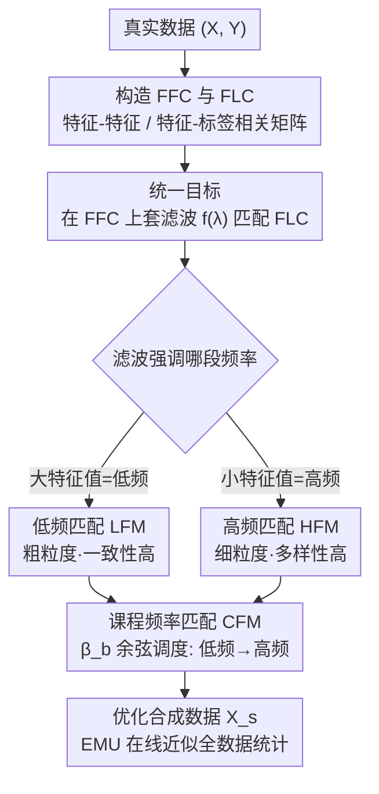

# Understanding Dataset Distillation via Spectral Filtering

**会议**: ICLR 2026  
**arXiv**: [2503.01212](https://arxiv.org/abs/2503.01212)  
**代码**: 未提供  
**领域**: 模型压缩 / 数据集蒸馏  
**关键词**: dataset distillation, spectral filtering, frequency matching, curriculum learning, unified framework

## 一句话总结

本文提出 UniDD 谱滤波框架，将多种数据集蒸馏方法统一为在特征-特征相关矩阵（FFC）上应用不同滤波函数来匹配特征-标签相关矩阵（FLC）的频率信息，并基于此洞见提出了课程频率匹配（CFM）方法。

## 研究背景与动机

数据集蒸馏（DD）通过将大规模数据集压缩为紧凑的合成数据集来加速模型训练。现有方法在优化目标上差异很大：
- **统计匹配**（DM）：对齐均值等统计量
- **梯度匹配**（DC）：最小化梯度方向差异
- **轨迹匹配**（MTT）：模拟参数更新轨迹
- **核方法**（FrePo）：通过闭合形式解绕过内层优化

核心问题：**这些方法之间有何联系？是否存在统一框架？**

## 方法详解

### 整体框架

UniDD 的核心观察是：看似五花八门的蒸馏目标，其实都在做同一件事——在特征-特征相关矩阵（FFC）上套一个滤波函数 $f(\cdot)$，再去匹配真实数据与合成数据的特征-标签相关信息（FLC）。定理 1 把它们统一写成 $\min_{X_s} \| f(X^\top X)\, g(X^\top Y) - f(X_s^\top X_s)\, g(X_s^\top Y_s) \|_F^2$，其中 $X^\top X$、$X_s^\top X_s$ 是 FFC 矩阵，$X^\top Y$、$X_s^\top Y_s$ 是 FLC 矩阵，$g$ 取恒等 $I$ 或 $X^\top Y$。不同方法的区别只剩下 $f$ 作用在 FFC 特征值 $\lambda$ 上的形状，于是「设计蒸馏算法」就被还原成「设计滤波函数」这一个问题；本文据此把方法分为低频与高频两族，并提出一个让滤波随训练动态变化的课程方案。

### 关键设计

**1. 低频匹配（LFM）：用恒等/线性滤波抓粗粒度信息**

当滤波函数偏好大特征值时，目标只保留 FFC 的主成分，对应的是模糊但稳定的类平均表示。统计匹配 DM 取 $f(\lambda)=1$（恒等滤波），目标退化为 $\|X^\top Y - X_s^\top Y_s\|_F^2$，即直接对齐类平均表示；梯度匹配 DC 经梯度差异上界推导后得到 $f(\lambda)\in\{1,\lambda\}$，目标变成 $\|X^\top X - X_s^\top X_s\|_F^2 + \|X^\top Y - X_s^\top Y_s\|_F^2$，在恒等之外又加了一项线性项。这族方法捕获的是粗粒度颜色与轮廓，收敛快、类内一致性高，但合成图像之间太像，多样性不足。

**2. 高频匹配（HFM）：用逆向/高通滤波抓细粒度纹理**

反过来，若滤波函数放大小特征值，目标就强调 FFC 的高频成分，对应细粒度纹理。轨迹匹配 MTT 的滤波形如 $f(\lambda)=(1-\alpha\lambda)^{\{p,q\}}$，在 $\alpha\lambda<1$ 时表现为高通；核方法 FrePo 则用 $f(\lambda)=(\lambda+\beta)^{-1}$ 做逆向加权，$\beta$ 越小、对高频的强调越强。它们合成出的图像纹理丰富、多样性更好，代价是计算量更大、也更容易把噪声当成有用信号引进来。一致性与多样性在这里构成一对此消彼长的矛盾。

**3. 课程频率匹配（CFM）：让滤波从低频滑向高频，两头都占**

既然固定的 $f$ 只能学到单一频率，CFM 干脆把控制频率的 $\beta$ 做成随训练推进的课程：$\beta_b = \beta \cdot (1 + \cos(\pi b / B)) / 2$，其中 $b$ 为当前 batch、$B$ 为总 batch 数。$\beta_b$ 按余弦从大滑到小，等价于滤波从低通逐渐过渡到高通——训练早期先用低频锁住一致的整体结构，后期再用高频补上多样的细节，从而在一次蒸馏里同时覆盖低频的一致性与高频的多样性，绕开了单一滤波必须二选一的困境。

### 损失函数 / 训练策略

总损失把分类项与两个匹配项相加：$\mathcal{L} = \mathcal{L}_{cls}(H_s, Y_s) + \eta \mathcal{L}_{filter} + \eta \mathcal{L}_{signal}$，权重统一取 $\eta = 0.1$。两个匹配项正好对应框架里 $g=I$ 与 $g=X^\top Y$ 两种取法：$\mathcal{L}_{filter} = \sum_{b,l} \|(\Psi^l + \beta_b I)^{-1} - (\Psi_s^{l,b} + \beta_b I)^{-1}\|$ 只看 FFC 的滤波结构，$\mathcal{L}_{signal} = \sum_{b,l} \|(\Psi^l + \beta_b I)^{-1}\Phi^l - (\Psi_s^{l,b} + \beta_b I)^{-1}\Phi_s^l\|$ 进一步把 FLC 信号一并对齐，二者都按上面的 $\beta_b$ 逐 batch 调度。由于矩阵 $\Psi$、$\Phi$ 是全数据集的统计量，逐 batch 重算代价高，CFM 用指数移动更新（EMU）在线近似全 batch 统计，让训练在小 batch 上也能稳定推进。

## 实验

### CIFAR-10/100 主实验

| 数据集 | IPC | DM | DC | MTT | FrePo | CFM |
|--------|-----|------|------|------|-------|------|
| CIFAR-10 | 10 | 48.9 | 44.9 | 65.3 | 65.5 | **52.1** |
| CIFAR-10 | 50 | 63.0 | 53.9 | 71.6 | 71.7 | **64.0** |
| CIFAR-100 | 10 | 29.7 | 25.2 | 33.1 | 42.5 | **58.3** |
| CIFAR-100 | 50 | 43.6 | 30.6 | 42.9 | 44.3 | **67.1** |

在 ResNet-18 上的 CIFAR-100 (IPC=50) 上，CFM 达到 71.4%，大幅超越所有基线。

### ImageNet-1K

| IPC | SRe2L | G-VBSM | RDED | DWA | CFM |
|-----|-------|--------|------|-----|------|
| 10 | 21.3 | 31.4 | 42.0 | 37.9 | **40.6** |

### 消融实验

| 组件 | 效果 |
|------|------|
| 仅 $\mathcal{L}_{filter}$ | 次优 |
| 仅 $\mathcal{L}_{signal}$ | 次优 |
| 固定 $\beta$（低频） | 一致性好但多样性差 |
| 固定 $\beta$（高频） | 多样性好但噪声大 |
| CFM（动态 $\beta$） | 最优平衡 |

### 关键发现

1. 低通滤波（DM、DC）产生模糊合成图像，类内相似度高
2. 高通滤波（MTT、FrePo）产生细粒度纹理，多样性好但可能引入噪声
3. 课程式频率调度在所有 benchmark 上一致优于固定频率方法
4. CFM 具有更好的跨架构泛化能力

## 亮点

- 首次从谱滤波角度统一四大类数据集蒸馏方法
- 理论优雅：将复杂的蒸馏目标化简为滤波函数设计问题
- CFM 方法简单有效，超参数仅一个 $\eta = 0.1$ 对所有数据集通用
- 清晰揭示了低通/高通滤波与合成数据特性（一致性 vs 多样性）的关系

## 局限性

- 统一框架仅覆盖线性核（linear kernel）情况，非线性核（如高斯、多项式）未分析
- FFC/FLC 矩阵计算在大规模数据集上可能存在数值溢出问题（需使用协方差替代）
- 理论推导基于上界近似，实际目标与近似之间的差距未量化
- CFM 的余弦退火调度是否最优未充分探讨

## 相关工作

- **统计匹配**：DM (Zhao & Bilen)、IDM、SRe2L
- **梯度匹配**：DC (Zhao et al.)、IDC、DSA
- **轨迹匹配**：MTT、DATM、FTD
- **核方法**：KIP、FrePo、RFAD
- **谱域方法**：FreD、NSD（与 UniDD 在分析对象上不同）

## 评分

- 新颖性：⭐⭐⭐⭐⭐ — 统一框架具有重要理论意义
- 理论深度：⭐⭐⭐⭐ — 推导清晰但部分基于上界近似
- 实验充分性：⭐⭐⭐⭐ — CIFAR/ImageNet 全面验证
- 实用价值：⭐⭐⭐⭐ — CFM 简单有效，实践门槛低
- 写作质量：⭐⭐⭐⭐⭐ — 框架清晰，表格和可视化出色

<!-- RELATED:START -->

## 相关论文

- [\[ICLR 2026\] Grounding and Enhancing Informativeness and Utility in Dataset Distillation](grounding_and_enhancing_informativeness_and_utility_in_dataset_distillation.md)
- [\[ACL 2026\] CBRS: Cognitive Blood Request System with Bilingual Dataset and Dual-Layer Filtering](../../ACL2026/model_compression/cbrs_cognitive_blood_request_system_with_bilingual_dataset_and_dual-layer_filter.md)
- [\[AAAI 2026\] Distillation Dynamics: Towards Understanding Feature-Based Distillation in Vision Transformers](../../AAAI2026/model_compression/distillation_dynamics_towards_understanding_feature-based_di.md)
- [\[ICLR 2026\] Dataset Distillation as Pushforward Optimal Quantization](dataset_distillation_as_pushforward_optimal_quantization.md)
- [\[ICLR 2026\] Rectified Decoupled Dataset Distillation: A Closer Look for Fair and Comprehensive Evaluation](rectified_decoupled_dataset_distillation_a_closer_look_for_fair_and_comprehensiv.md)

<!-- RELATED:END -->
