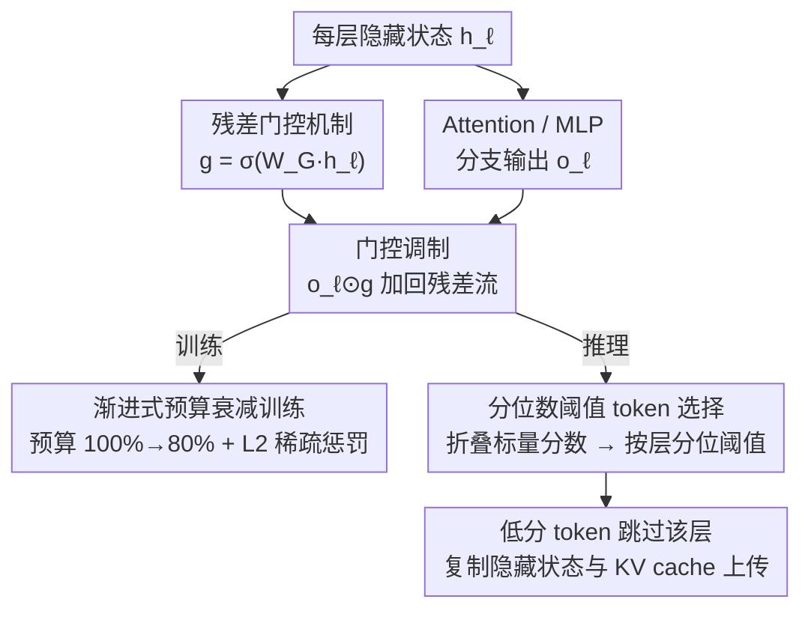

# What Layers When: Learning to Skip Compute in LLMs with Residual Gates

**会议**: ICLR 2026  
**arXiv**: [2510.13876](https://arxiv.org/abs/2510.13876)  
**领域**: 模型压缩  
**关键词**: 残差门控, token级层跳过, 自适应深度, GateSkip, 推理加速

## 一句话总结

提出 GateSkip——在 decoder-only Transformer 每个 Attention/MLP 分支输出处插入一个 sigmoid-linear 门控，微调时联合学习门控稀疏性与语言建模目标，推理时按门控值用分位数阈值确定性跳过低重要性 token，实现 token 级逐层自适应深度；在 Llama 8B 上节省 15% 计算保持 >90% 精度，指令微调模型全计算反而提升精度、约 50% 节省仍匹配基线，且与 INT4 量化/结构化剪枝/自推测解码正交可组合。

## 研究背景与动机

**领域现状**：当前 LLM 对每个 token 在每一层分配相同的计算量，不区分 token 难度或层的重要性。这种均匀分配在延迟敏感和资源受限场景下造成大量浪费。自适应计算（adaptive compute）试图根据需要动态调整每个 token 的计算深度，主流方向分为两类：路由式（Mixture-of-Depths, MoD）和早退出（Early Exit）。

**现有痛点**：路由式方法（如 MoD）在每层放一个 router 做离散的 top-k 决策，决定跳过哪些 token。这种硬路由训练不稳定，需要复杂的负载均衡损失，而且大多要求从预训练阶段就引入，无法后置添加。早退出方法在中间层加辅助 LM head，达到置信度阈值就提前停止。但辅助 head 改变了预训练的隐藏状态分布，校准困难，且在长序列生成任务上表现急剧下降。

**核心矛盾**：现有自适应深度方法要么依赖离散决策导致训练不稳定，要么需要修改预训练流程，无法在已有模型上轻量化添加。关键需求是：一种可微、可后训练添加、推理时能做确定性跳过的机制。

**切入角度**：作者观察到 Transformer 的残差流（residual stream）本身就是信息传递的控制通道——每层的输出通过 $h_{\ell+1} = h_\ell + o_\ell$ 加回残差流。如果在 $o_\ell$ 加回之前乘一个可学习的门控，就能连续地控制每层对残差流的贡献大小。训练时门控可微保证梯度稳定，推理时对门控值做阈值化即可得到确定性的跳/不跳决策。

**核心 idea**：在残差流出口处放一个 sigmoid-linear 门控，将离散路由问题转化为连续可微的门控学习问题，训练时学习稀疏门控+保持语言建模质量，推理时按门控值排序做 token 级层跳过。

## 方法详解

### 整体框架

GateSkip 想解决的是「LLM 对每个 token 在每一层都花同样算力」的浪费。它在标准 decoder-only Transformer 的每个 Attention 和 MLP 分支**出口**各插一个轻量门控：门控读当前隐藏状态、输出一个 sigmoid 值，决定这个分支算出来的东西有多少值得加回残差流。整套流程分三步走——先把门控插进残差流（核心机制），训练时让门控和骨干联合优化、在「保住语言建模质量」和「门控尽量稀疏」之间找平衡（用渐进式预算衰减喂稳），推理时把每个 token 的门控值折叠成标量重要性分数、按层取分位数阈值，分数低的 token 直接跳过该层、隐藏状态与 KV cache 原样上传到下一层。训练连续可微保证梯度稳，推理离散阈值保证真省算力，两端解耦是 GateSkip 比离散路由（MoD）和早退出更稳的根本原因。

### 关键设计

**1. 残差门控机制：在残差流出口放一个 sigmoid 门控，把"跳不跳"变成连续可学的量**

标准残差连接是 $h_{\ell+1} = h_\ell + o_\ell$，模块输出 $o_\ell$ 无条件加回残差流，这正是「每层都满额计算」浪费的源头。GateSkip 在加回前乘一个可学习门控，改为 $h_{\ell+1} = h_\ell + o_\ell \odot g_\ell(h_\ell)$，其中 $g_\ell(h_\ell) = \sigma(W_G h_\ell + b)$ 是一个 sigmoid 激活的线性投影。$W_G \in \mathbb{R}^{H \times H}$ 让门控输出与隐藏维度等宽，实现逐维度的细粒度调节，而不是整体一个开关；偏置 $b$ 初始化为大正值（$\sigma(b)\approx 1$），训练初期门控几乎全开，模型行为贴近原始预训练权重，避免一上来就破坏已学到的表示。

这一步直接绕开了 MoD 离散 top-k 路由训练不稳定的问题：sigmoid 输出落在 $[0,1]$ 连续可微、梯度平滑。门控放在模块**出口**而非入口也是有意为之——它学的是"这个模块算完的输出有多少值得加进残差流"，能拿到模块下游的梯度信号；放在入口则只能盲猜"要不要进这个模块"，消融里入口门控生成精度直接崩到 1.0（见后文）。

**2. 渐进式预算衰减训练：让模型先学会判断重要性，再逐步适应更激进的跳过**

门控可微只是让训练能跑，但要让门控真正学会"谁该跳"，还得在训练时就让它体验被跳过的工况。难点在于：如果训练一开始就按高跳过率走，模型还没学好门控该给谁高分就被迫丢大量 token，容易不稳定。GateSkip 让保留预算从 $b_1 = 1.0$ 线性衰减到 $b_2 = 0.8$，即 $b_t = b_1 - (b_1 - b_2)\frac{t}{T_{\text{total}}}$。训练全程都用分位数阈值真实跳过 token，但梯度只通过保留下来的 token 正常回传。这样模型先在近乎全计算下打好门控重要性的判断基础，再慢慢适应越来越多 token 被跳过的工况，骨干也被联合微调去把重要性线索编码进隐藏状态供门控读取。

**3. 分位数阈值 token 选择：推理时把连续门控值切成确定性的跳/不跳决策**

训练学到的门控是连续值，但推理要落到硬跳过才能省算力。GateSkip 在每层 $\ell$ 先把每个 token 的门控向量折叠成一个标量重要性分数 $\bar{g}_{\ell,i} = \frac{1}{H}\sum_k g_\ell(h_\ell)_{i,k}$，再在该层所有 token 的分数上取分位数阈值 $\tau = \text{Quantile}(\{\bar{g}_{\ell,i}\}, 1-\hat{b})$，其中 $\hat{b}$ 是推理时固定的保留预算（保留分数最高的那部分）。分数低于 $\tau$ 的 token 跳过该层，隐藏状态和 KV cache 直接向上复制到下一层。

用分位数而不是一个全局固定阈值，是因为论文观察到门控分布在**层内范围很窄、层间差异很大**；分位数按每层各自的分布动态定线，天然适配这种差异，省掉了为每层校准统一阈值的麻烦。这一步把训练时学到的连续重要性翻译成确定性的跳过决策，正是 GateSkip 在生成任务上能画出平滑「精度-效率」曲线（而非像早退出那样在长序列直接失效）的落地环节。

### 损失函数 / 训练策略

总训练损失为 $\mathcal{L} = \mathcal{L}_{CE} + \lambda_S \mathcal{L}_S$。第一项是标准的 next-token 预测交叉熵。第二项是门控稀疏性惩罚，采用 L2 距离：$\mathcal{L}_S = \frac{1}{N_L H}\sum_\ell \sum_k \|g_\ell(h_\ell)_k\|_2$，鼓励门控值趋近于零。论文设定 $\lambda_S = 0.1$。消融实验表明 L2 损失优于 L1 和 KL 散度变体——L1 在零跳过时 log-likelihood 更强但跳过时下降快，KL 散度在零跳过时生成性能最好但微小跳过率即崩溃。所有参数（骨干 + 门控）用 AdamW 联合更新。

## 实验关键数据

### 主实验：与先前自适应计算方法对比 (Llama-3.2-1B)

| 方法 | 生成任务 0% 跳过 | 生成任务 15% 跳过 | 生成任务 25% 跳过 | Log-Likelihood 0% | Log-Likelihood 30% |
|------|:---:|:---:|:---:|:---:|:---:|
| 原始 Llama-1B | **30.97** | - | - | 49.12 | - |
| Random Skipping | - | 1.67 | 0.67 | - | 23.62 |
| CALM (saturation) | 3.43 | 3.43 | 3.43 | 30.73 | 30.73 |
| FREE (saturation) | 11.57 | 11.57 | 11.57 | 36.02 | 36.02 |
| LayerSkip | 10.65 | 10.65 | 10.65 | 38.25 | **38.25** |
| MoD | 20.83 | 3.96 | 2.91 | 44.18 | 29.33 |
| **GateSkip (本文)** | 23.53 | **22.14** | **17.67** | 47.35 | 31.74 |

GateSkip 在生成任务上大幅领先所有基线：15% 跳过时准确率 22.14%，是 MoD 的 5.6 倍，是 CALM/FREE 的 6 倍以上。CALM、FREE、LayerSkip 的生成精度不随跳过率变化（它们的自适应机制在长序列生成时实际失效），而 GateSkip 呈现平滑的精度-效率曲线。

### 消融实验

| 设计选择 | 生成@15% 跳过 | Log-Likelihood@15% | 说明 |
|----------|:---:|:---:|------|
| **向量门控 (默认)** | **23.2** | **37.8** | 逐维度门控，完整模型 |
| 标量门控 | 20.4 | 36.8 | 精度下降 2.8，粗粒度不够 |
| 共享门控 | 20.7 | 38.4 | 层间差异被抹平 |
| 只跳 Attention | 14.9 | 37.5 | MLP 层也含冗余，不能只跳一半 |
| 只跳 MLP | 7.8 | 32.0 | 跳 MLP 影响更大 |
| MLP 门控（非线性）| 18.5 | 33.9 | 额外参数反而过拟合 |
| 门控放模块入口 | 1.0 | 35.7 | **灾难性失败**——入口无法获取模块计算后的梯度信号 |
| 冻结骨干 | 12.7 | 37.5 | 骨干适应对跳过至关重要 |

最关键发现：门控放在模块出口 vs 入口差异巨大（23.2 vs 1.0）。这验证了核心设计假设——门控需要从模块输出下游获取梯度信号来学习哪些计算可以跳过。

### 模型规模扩展性

| 模型 | 生成@0% | 生成@15% | 生成@25% | 精度保持率@15% |
|------|:---:|:---:|:---:|:---:|
| Llama-3.2-1B | 26.8 | 23.2 | 19.8 | 86.6% |
| Llama-3.2-3B | 45.0 | 43.3 | 42.1 | 96.2% |
| Llama-3.1-8B | 57.3 | 55.0 | 53.6 | 96.0% |
| Gemma-2-2B | 38.0 | 36.1 | 34.8 | 95.0% |

模型越大，相同跳过率下精度保持越好。Llama 3B 在 15% 跳过时保持 96.2% 的精度，说明大模型中冗余计算比例更高。跨架构（Llama vs Gemma）一致性验证了方法的通用性。

### 指令微调模型 (Llama-3B-Instruct)

| 设置 | 生成任务 | Log-Likelihood |
|------|:---:|:---:|
| 原始 Llama-3B-Instruct | 36.5 | 46.3 |
| + Random Skipping @20% | 0.5 | 34.7 |
| + **GateSkip @0% (全计算)** | **49.0 (+12.5)** | 36.7 |
| + GateSkip @20% | 49.0 | 38.8 |
| + GateSkip @30% | 45.6 | 32.9 |
| + GateSkip @45% | 35.0 | 31.0 |

反直觉的发现：在指令微调模型上，GateSkip 在全计算模式下反而比基线提升了 12.5 个点。这说明门控起到了自适应正则化的作用——抑制不必要的计算噪声。即使跳过 20% 计算（49.0），仍高于无门控基线（36.5）。

### 与正交效率技术组合

| 组合 | 生成@0% | 生成@25% | LL@15% |
|------|:---:|:---:|:---:|
| GateSkip (32-bit) | 45.0 | 42.1 | 35.6 |
| GateSkip + INT4 量化 | 42.5 | 41.0 | 35.6 |
| GateSkip + ShortGPT 剪枝 | - | - | 31.1 |
| GateSkip + Self-Speculative Decoding | - | - | 39.4 |

INT4 量化后生成精度保持 94.4%，log-likelihood 完全不变；与自推测解码组合在 15-30% 节省时 LL 达 39.4（优于单独 GateSkip 的 37.8）。验证了 GateSkip 与多种正交技术可叠加。

### 关键发现

- 门控放置位置是最关键设计：出口 vs 入口在 5% 跳过时精度差 20 个点（25.5 vs 5.5），入口门控几乎完全失效
- 向量门控显著优于标量门控（+2.8），说明逐维度控制信息流比整体开关更有效
- 骨干网络需要联合微调（unfrozen vs frozen 差 10.5 个点）——骨干需要适应性地将重要性线索编码到隐藏状态中供门控读取
- 门控学到的稀疏模式具有可解释性：BOS token 在早期层始终获得最高门控值（充当信息锚点），标点符号跨层保持高门控（信息聚合作用），深层门控越来越选择性地聚焦内容词
- 端到端延迟实测：在 vLLM 上 50% token 跳过对应 16.3% 吞吐提升（2698→3141 tokens/s），70% 跳过对应 35% 吞吐提升

## 亮点与洞察

- **残差流从被动通道变为主动控制机制**：传统理解中残差连接只是梯度传播的辅助通道，GateSkip 证明在残差流出口加门控就能实现精细的自适应深度控制，这为 Transformer 效率优化开辟了一个低侵入性的新方向。
- **指令微调 + 门控 = 意外的精度提升**：这是论文最反直觉的发现。门控并非只减少计算——它同时起到了自适应正则化的作用，抑制了对最终输出贡献为负的层计算。这暗示 Transformer 中存在大量"有害计算"，而非仅仅是"冗余计算"。
- **可微训练 + 确定性推理的优雅解耦**：训练时门控是连续的 sigmoid 值保证梯度平滑，推理时用分位数阈值转化为硬跳过决策。这种"训练连续、推理离散"的范式比 MoD 的 straight-through estimator 更稳定，比早退出的置信度校准更简单。
- **门控值作为 Transformer 可解释性工具**：门控值直接反映"什么 token 在什么层重要"，发现 BOS token 是早期层的信息锚点（与近期 "attention sink" 研究呼应），可作为分析 Transformer 信息流的免费副产品。

## 局限与展望

- **规模受限**：仅验证到 8B 参数，缺乏在 70B+ 模型上的实验。更大模型冗余可能更高，GateSkip 的收益可能更显著
- **任务范围有限**：仅测试英文推理和语言建模，缺乏多模态（VLM）、代码生成、长上下文（>128K）等场景的验证
- **端到端加速有限**：论文主要报告理论 FLOP 节省，实测吞吐提升（16-35%）明显低于理论值（50-70%），说明 token 掩码和 KV cache 复制的工程开销不容忽视
- **门控粒度探索不足**：当前是 token×layer 粒度，可以考虑 token×head 粒度（对不同注意力头做差异化跳过），可能带来更精细的计算分配
- **缺乏动态预算调度**：当前推理时每层用固定预算，但不同层的冗余程度不同（消融实验已揭示）。如果根据输入内容动态调整每层预算，可能进一步提升效率

## 相关工作与启发

- **vs Mixture-of-Depths (MoD)**：MoD 用离散 top-k router 选择 token，需要负载均衡损失且训练不稳定；GateSkip 用连续 sigmoid 门控，训练可微稳定，推理时再离散化。在生成任务上 GateSkip 以 5-10 倍的优势碾压 MoD
- **vs LayerSkip/CALM/FREE**：这三种方法的自适应机制在长序列生成时完全失效（精度不随跳过率变化），本质是它们的退出/跳过决策在生成模式下无法正确触发。GateSkip 的 token 级门控在生成时逐 token 独立计算，不存在这个问题
- **vs Early Exit 方法**：早退出需要额外的 LM head 且改变隐藏状态分布，GateSkip 只加轻量线性层（参数开销 0.004%-4%），不改变原始表示空间

## 评分

- 新颖性: ⭐⭐⭐⭐ 残差门控的 idea 简洁优雅，"训练连续推理离散"的解耦设计巧妙，但门控本身不算全新概念
- 实验充分度: ⭐⭐⭐⭐⭐ 4 个模型规模 × 2 种架构 × 生成+LL 双评估 × 完整消融 × 3 种正交技术组合 × 端到端延迟测试 × 门控可解释性分析，非常全面
- 写作质量: ⭐⭐⭐⭐⭐ 方法描述简洁清晰，实验组织层次分明，每个消融选择都有明确的对照和解释
- 价值: ⭐⭐⭐⭐⭐ 对 LLM 高效推理有直接实用价值，后训练可加+与量化/剪枝可组合使其工程落地门槛很低

<!-- RELATED:START -->

## 相关论文

- [\[ICLR 2026\] Compute-Optimal Quantization-Aware Training](compute-optimal_quantization-aware_training.md)
- [\[ICML 2026\] RaBiT: Residual-Aware Binarization Training for Accurate and Efficient LLMs](../../ICML2026/model_compression/rabit_residual-aware_binarization_training_for_accurate_and_efficient_llms.md)
- [\[ICLR 2026\] Draft-based Approximate Inference for LLMs](draft-based_approximate_inference_for_llms.md)
- [\[ACL 2026\] Quantize What Counts: More for Keys, Less for Values](../../ACL2026/model_compression/quantize_what_counts_more_for_keys_less_for_values.md)
- [\[CVPR 2026\] OneSparse: A Unified Framework for Sparse Activation Layers in Vision Models](../../CVPR2026/model_compression/onesparse_a_unified_framework_for_sparse_activation_layers_in_vision_models.md)

<!-- RELATED:END -->
