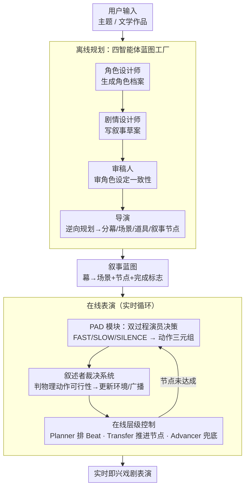

# HAMLET: A Hierarchical and Adaptive Multi-Agent Framework for Live Embodied Theatre

**会议**: ICLR 2026  
**arXiv**: [2507.15518](https://arxiv.org/abs/2507.15518)  
**代码**: [https://github.com/HAMLET-2025/HAMLET](https://github.com/HAMLET-2025/HAMLET)  
**领域**: LLM Agent / 交互叙事  
**关键词**: 多智能体框架, 戏剧表演, LLM Agent, 感知与决策, 交互叙事

## 一句话总结

提出 HAMLET 多智能体框架，将 AI 戏剧创作和在线表演解耦为离线规划和在线表演两阶段，通过叙事蓝图、感知与决策（PAD）模块和层级控制系统，实现了具有主动性、物理环境交互能力和即兴表演自由的 AI 戏剧体验。

## 研究背景与动机

### 问题背景
创建沉浸式交互戏剧体验是交互叙事领域的长期目标。LLM 的出现为此提供了新路径，但现有 LLM 驱动的戏剧生成方法存在三个关键问题：

**缺乏主动性**：AI 智能体通常被动等待指令，无法独立决策

**无法交互物理环境**：角色行为不影响舞台环境，戏剧变成抽象对话

**依赖详细用户输入**：需要完整故事大纲或详细引导段落，限制了灵活性

### 核心挑战
从被动响应到主动引导的范式转变——AI 演员需要能够自主决策、在开放场景中合作或冲突、并主动推动剧情发展。这是 Agentic AI 理念在戏剧表演中的具体体现。

## 方法详解

### 整体框架

HAMLET 要解决的问题是：让 AI 自己把一场沉浸式戏剧从无到有地"创作 + 实时演出"，既不跑偏又有即兴自由。它把这件事解耦成两个阶段。**离线规划阶段**用四个分工协作的智能体，把用户给的一个简单主题（或一部文学作品）凝练成结构化的**叙事蓝图（Narrative Blueprint）**——分好幕、场景、可交互道具，并把剧情切成一串带"完成标志"的叙事节点。**在线表演阶段**加载蓝图后进入一个实时循环：每个角色用各自的感知-决策模块产出一个候选动作，叙述者智能体裁决这个动作在舞台上是否真能发生并更新环境，三个控制智能体则负责把节拍排好、判断节点是否达成、并在剧情卡住时兜底推进。前一阶段保证戏有骨架不散，后一阶段保证演员能主动、能即兴、能真正"动手"改变舞台。

### 关键设计

**1. 离线规划：四智能体协作 + 逆向规划的蓝图工厂**

单个 LLM 一次性写出可演的剧本既容易逻辑松散又难以约束，HAMLET 把"写戏"拆成四个分工明确、能互相审稿的智能体流水线。角色设计师（Actor Designer）先根据用户输入生成角色档案，既含背景、性格等静态属性，也含初始目标、核心关系等动态属性，必要时还能查外部知识库补全设定；剧情设计师（Plot Designer）据此写出初步叙事草案；审稿人（Reviewer）专门审角色设定是否合理、动机是否清晰、关系是否成立，把不一致的设定挡在表演之前；最后导演（Director）做结构化收尾——划分幕（Acts）与场景（Scenes）、列出每个场景的可交互道具、并把剧情拆成一串**叙事节点（Narrative Points）**，每个节点都带明确的完成标志和结果。关键的一招是导演采用**逆向规划（reverse planning）**：先把结尾节点定下来，再反向逐个补出前序节点，让每一步都朝既定结局收敛，从机制上避免实时表演时剧情越走越散。

**2. PAD 模块：把双过程理论塞进演员的脑子**

蓝图只钉死了走向，每个角色当下到底说什么、做什么，由一个**感知与决策（Perceive And Decide, PAD）**模块产出，它显式融合直觉与反思两种推理。输入端同时给两类视角：主观的内部状态（Persona、主观关系、Memory、Goal）和客观的外部刺激（环境描述、在场角色列表、对话历史、可交互物体）。决策还受**双目标**牵引——当前节点公开的完成标志（公共目标）和角色自己的私有目标（每个节点会刷新）。输出端对应 Kahneman 双过程理论的双系统：FAST 是 System 1 的快速直觉反应，SLOW 是 System 2 的深思熟虑，SILENCE 表示选择沉默/不行动，并通过工具调用生成结构化的潜在动作三元组（主语-动词-宾语）交给环境裁决。PAD 本身是一个微调过的 8B 模型，专门学会在快慢系统之间切换，让角色既能即时反应、又能在关键处停下来想清楚。

**3. 叙述者裁决系统：让角色真正能"动手"改变舞台**

纯对话戏的通病是角色说什么都算数、行为不影响环境。HAMLET 引入一个叙述者智能体（Narrator Agent）专门裁决所有物理交互：当某角色尝试一个物理动作时，叙述者依据当前环境状态和物理规则判断它是否可行——可行就确认动作、更新环境状态、并向所有角色广播一段客观描述；不可行就判定失败并给出合乎逻辑的解释（如"匕首不在持有物里""人不能凭空飞起来""该角色不在当前场景"）。正是这道裁决把戏剧从抽象对白拉回到有因果、有后果的具身舞台。

**4. 在线层级控制：Beat 多轨迹即兴 + 三智能体调度**

表演被组织成"幕 → 场景＋节点 → 节拍（Beat）"的层级，Beat 是最小的有效交互步骤，即一个角色采取一次能推动局面的有效行动。蓝图只规定"必须从哪个节点走到哪个节点"，两节点之间允许**多条轨迹**，怎么吵、怎么合作、怎么绕路都由现场决定——这就是结构化叙事与开放即兴之间的平衡点。为保证这套自由不至于失控，三个控制智能体协同推进：Planner 把当前节点的完成标志拆成可执行的 Beat 序列、并预设多条候选轨迹；Transfer 定期检查节点标志是否满足，满足就推进到下一节点，同时管理角色进场与退场；Advancer 是兜底机制——当剧情停滞超过时间阈值时主动引导相关角色采取行动把情节往前推。消融实验显示去掉 Advancer 会让任务完成率显著下降（到 68.7%）、停滞率升高，印证了它作为"防卡死保险丝"的必要性。

## 实验关键数据

为给"戏演得好不好"立可量化的标尺，HAMLET 从三个维度评分：角色表演（角色一致性、情感表达）、叙事质量（剧情连贯性、结构完整性）、交互体验（环境交互自然度、沉浸感）。为降低评估成本，作者训练了一个 8B critic 模型 **HAMLETJudge** 替代昂贵的人工或大模型评分，并以 GPT-4o 为基线做胜率比较，使下面的三维评分能在 100 个案例上自动给出。

### 主实验：多模型评估排行榜

| 模型 | 英文平均分 | 中文平均分 | 总分 |
|------|----------|----------|------|
| Claude-4-sonnet-Thinking | 78.98 | 79.92 | **79.45** |
| Claude-4-sonnet | 76.92 | 79.68 | 78.30 |
| Qwen3-32B-Thinking | 69.10 | 78.59 | 73.85 |
| OpenAI-o3 | 69.45 | 77.89 | 73.67 |
| Qwen3-235B-A22B-Thinking | 70.74 | 75.92 | 73.33 |
| DeepSeek-R1-0528 | 66.58 | 79.37 | 72.98 |
| Qwen3-235B-A22B | 69.65 | 72.76 | 71.21 |
| Llama-3.1-8B | 35.51 | 33.83 | 34.67 |

### 数据集构成

| 来源 | 数量 | 说明 |
|------|------|------|
| 中国文学经典 | 25部 | 文学摘录 |
| 英文经典文学 | 25部 | 文学摘录 |
| 自定义主题 | 50个 | 涵盖10个不同主题 |
| **总计** | **100个案例** | |

### 关键发现
- 推理型模型（如 Claude-4-sonnet-Thinking）总体表现最佳，但优势不如预期明显
- 中文表演普遍优于英文表演（可能与中文文学要求更贴合框架设计有关）
- 小模型（如 Llama-3.1-8B）在戏剧表演上表现显著较差
- PAD 模块（8B）在决策任务上达到 SOTA 表现
- HAMLETJudge（8B）提供了成本效益高的可靠评估

## 亮点与洞察

1. **完整的 AI 戏剧流水线**：从主题输入到实时在线表演的端到端框架，填补了 AI 戏剧领域的系统性空白
2. **PAD 模块的认知理论基础**：基于 Kahneman 双过程理论将快系统和慢系统融入 AI 演员决策，使反应更加人类化
3. **逆向规划策略**：导演先确定结尾再反向补充剧情，有效防止剧情偏离，这在交互叙事中是一个聪明的设计
4. **Beat 驱动的多轨迹即兴**：两个叙事节点之间允许多条轨迹，在结构化叙事和自由即兴之间取得平衡
5. **物理环境交互**：叙述者裁决系统使戏剧不再是纯对话，增加了具身性和沉浸感

## 局限与展望

- 评估主要依赖 LLM-as-Judge（GPT-4o 和 HAMLETJudge），缺乏大规模人类评估
- 100 个案例的评估数据集规模有限
- 当前框架主要支持文本戏剧，未涉及多模态（语音、视觉、动作捕捉）
- PAD 模块是 8B 微调模型，在实时表演中可能存在延迟问题
- 人类玩家参与的交互体验未在论文中充分评估
- 长剧（多幕）表演中的一致性维护可能面临长上下文挑战

## 相关工作与启发

- **Dramatron** (Mirowski et al., 2023)：层级方法分离规划与生成，但不支持实时表演
- **CoSER** (Wang et al., 2025)：扩展角色数量但缺乏整体戏剧表演评估
- **CharacterEval** (Tu et al., 2024)：多轮对话多维评分，但限于双角色场景
- **Kahneman 双过程理论**：PAD 模块的认知科学基础
- 启发：层级控制 + 即兴自由的平衡设计对其他智能体系统（游戏NPC、虚拟助手）也有借鉴价值

## 评分
- 新颖性: ⭐⭐⭐⭐ — 框架设计全面新颖，PAD 模块有认知理论支撑
- 实验充分度: ⭐⭐⭐ — 排行榜评估有价值但缺乏人类评估和消融研究
- 写作质量: ⭐⭐⭐⭐ — 框架描述清晰，图示丰富，但论文较长
- 价值: ⭐⭐⭐⭐ — 对交互叙事和 AI 戏剧领域有重要推动作用

<!-- RELATED:START -->

## 相关论文

- [\[AAAI 2026\] Hierarchical Pedagogical Oversight: A Multi-Agent Adversarial Framework for Reliable AI Tutoring](../../AAAI2026/multi_agent/hierarchical_pedagogical_oversight_a_multi-agent_adversarial_framework_for_relia.md)
- [\[CVPR 2026\] Visual Document Understanding and Reasoning: A Multi-Agent Collaboration Framework with Agent-Wise Adaptive Test-Time Scaling](../../CVPR2026/multi_agent/visual_document_understanding_and_reasoning_a_multi-agent_collaboration_framewor.md)
- [\[ACL 2026\] PosterForest: Hierarchical Multi-Agent Collaboration for Scientific Poster Generation](../../ACL2026/multi_agent/posterforest_hierarchical_multi-agent_collaboration_for_scientific_poster_genera.md)
- [\[AAAI 2026\] Adaptive Theory of Mind for LLM-based Multi-Agent Coordination](../../AAAI2026/multi_agent/adaptive_theory_of_mind_for_llm-based_multi-agent_coordination.md)
- [\[CVPR 2025\] Collaborative Tree Search for Enhancing Embodied Multi-Agent Collaboration](../../CVPR2025/multi_agent/collaborative_tree_search_for_enhancing_embodied_multi-agent_collaboration.md)

<!-- RELATED:END -->
