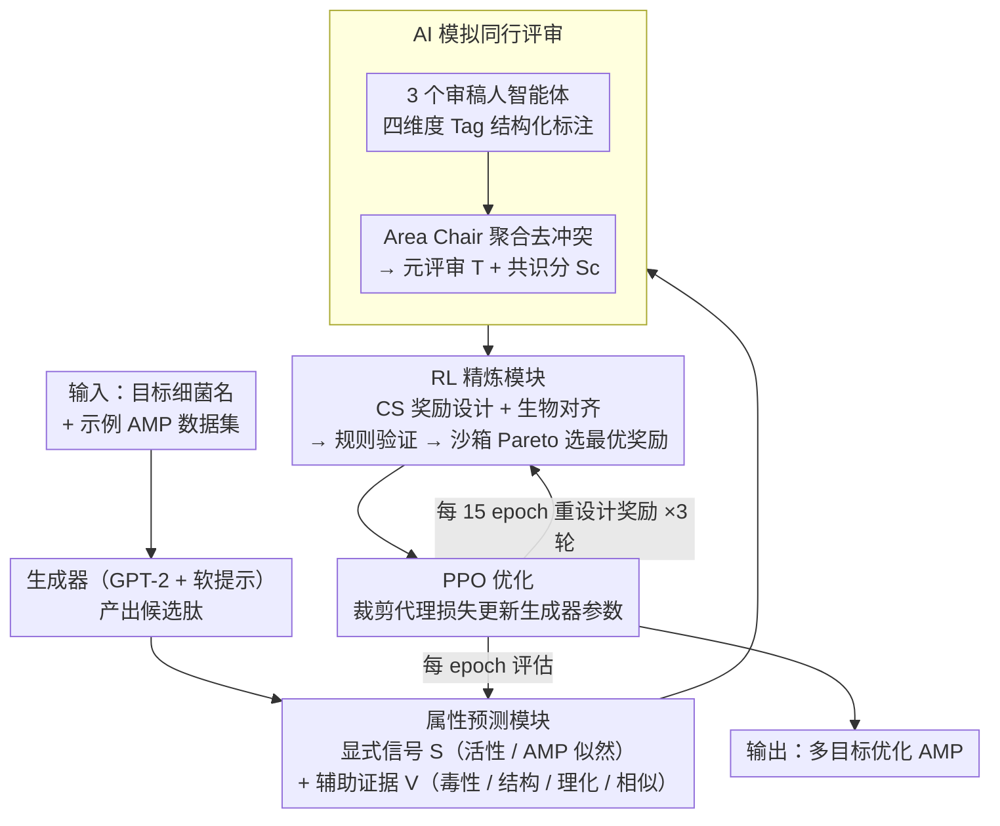

# MAC-AMP: A Closed-Loop Multi-Agent Collaboration System for Multi-Objective Antimicrobial Peptide Design

**会议**: ICLR 2026  
**arXiv**: [2602.14926](https://arxiv.org/abs/2602.14926)  
**代码**: [GitHub](https://github.com/CLMFAP/MAC-AMP_v1/)  
**领域**: 多智能体  
**关键词**: 抗菌肽设计, 多智能体协作, 闭环强化学习, 多目标优化, LLM agent

## 一句话总结

提出 MAC-AMP，首个闭环多智能体协作系统，将抗菌肽（AMP）设计重构为协调多智能体优化问题，通过 AI 模拟同行评审和自适应奖励设计实现多目标优化。

## 研究背景与动机

- **抗菌素耐药性（AMR）危机**：2021 年直接导致约 114 万人死亡，预计 2025-2050 年间将直接导致超 3900 万人死亡
- **现有 AMP 设计模型的局限**：
    - 大多数仅优化抗菌活性，忽略毒性、稳定性和新颖性
    - 多目标优化不稳定，静态权重容易导致 reward hacking 或多样性崩溃
    - 输出为分散的分数或文本，难以转换为可复现的学习信号
- **现有多智能体系统的不足**：
    - 输出多为自然语言，缺乏可训练的优化信号
    - 大多是开环系统，依赖人工干预

## 方法详解

### 整体框架

MAC-AMP 把抗菌肽设计建模成一个闭环优化过程：用户只需给出目标细菌名称和示例数据集，系统就在「属性预测—AI 模拟同行评审—奖励重设计—PPO 训练—生成」之间反复循环。它的核心思路是用一支由 LLM 智能体组成的「评审委员会」把分散的属性打分和自然语言点评，凝练成可直接喂给强化学习的奖励信号，从而让多目标优化不再依赖人工拍脑袋设权重。整条流水线由生成器产出候选肽起步，依次经属性预测、同行评审、RL 精炼三道处理后，由 PPO 把奖励学回生成器，再回到评估端形成闭环。

### 关键设计

**1. 属性预测模块：把多目标拆成奖励信号与辅助证据两类**

要做多目标优化，首先得把「好肽段」量化。MAC-AMP 用一组成熟工具对候选肽打分，并刻意区分两种角色。一类是直接进奖励的显式信号 $S$：抗菌活性分数 $S_a$（用 ProtBERT 微调的 MIC 预测器给出）和 AMP 似然分数 $S_b$（Macrel 1.5）；另一类是不直接进奖励、而是留给评审智能体解读的辅助证据 $V$，包括毒性 $V_a$（ToxinPred 3.0）、结构可靠性 $V_b$（OmegaFold）、理化性质 $V_c$（ProtParam）和模板相似性 $V_d$（Foldseek）。这样分层的好处是：硬指标稳稳地约束训练方向，而毒性、稳定性这些更需要语境判断的属性交给后面的评审环节，避免一股脑塞进静态加权奖励里引发 reward hacking。

**2. AI 模拟同行评审：用结构化标注把自然语言点评变成可训练信号**

这是全系统打通「文本到奖励」的关键。三个独立审稿人智能体（GPT-5、Gemini 2.5、Perplexity）从效率、安全性、发育结构和原创性四个维度审阅候选肽，每个维度都挂一张加权词典子表，审稿意见以 Tag 格式 $\text{ID}(\text{State}, \text{Weight})$ 落成结构化标注——这一步把零散的自然语言意见压成可被程序消费的字段，而不是停留在难以复用的纯文本。随后 Area Chair 智能体扮演领域主席，聚合三位审稿人的标注、解决彼此冲突的判断，算出维度级元评分，最终输出一段元评审文本 $T$ 和一个平均元分数 $S_c$。$T$ 供下游奖励对齐智能体阅读，$S_c$ 则作为可量化的共识分数参与奖励，正是这套「模拟同行评审」让模型输出格式和训练信号之间的鸿沟被填平。

**3. RL 精炼模块：两类奖励智能体协作 + 阶段自适应重设计**

有了共识信号还不够，奖励函数本身也要会进化。MAC-AMP 让两类智能体分工：CS 基础奖励设计智能体根据可观测信号和数学属性写出奖励函数的骨架，生物医学奖励对齐智能体则读元评审文本 $T$、用领域知识提出修订建议。候选奖励先经规则验证器过滤掉不合法的写法，再进沙箱做短期训练，最后用 Pareto 优化在多个目标间挑出折中最好的那个，从而避免单目标被刷爆。整个过程是阶段自适应的：每 15 个 epoch 就重新设计一次奖励函数，共迭代 3 次，让奖励随训练进程动态校准，而不是从头到尾用一套固定权重。

**4. PPO 优化：用裁剪代理损失稳定地把共识奖励落到生成策略上**

最后由 PPO 把奖励真正学进生成器。优势先做标准化 $A = \text{norm}(R - \bar{V}_\phi)$ 以稳定梯度尺度，策略更新采用裁剪代理损失

$$L_{policy}(\theta) = \mathbb{E}[\min(r(\theta)A, \text{clip}(r(\theta), 1-\epsilon, 1+\epsilon)A)]$$

把每步的策略比 $r(\theta)$ 限制在 $1\pm\epsilon$ 区间，防止单次更新跨度过大导致多样性崩溃。总损失再叠加值回归损失 $L_{value}$ 和熵正则项 $L_{ent}$：

$$L = L_{policy} + c_v L_{value} - c_e L_{ent}$$

其中熵项以系数 $c_e$ 鼓励探索、维持生成多样性，值项以系数 $c_v$ 校准价值估计——配合前面每 15 个 epoch 刷新的奖励，使整个闭环既能持续逼近多目标最优，又不至于塌缩到单一模式。

## 实验关键数据

### 主实验：目标特异性 AMP 测试

| 模型 | 抗菌活性 (↑) | AMP 似然 (↑) | 毒性 (↓) | 结构可靠性 (↑) |
|------|-------------|-------------|---------|-------------|
| **MAC-AMP** | **0.943±0.008** | 0.797±0.012 | **0.154±0.008** | **0.873±0.009** |
| AMP-Designer | 0.807±0.021 | 0.811±0.011 | 0.251±0.024 | 0.817±0.017 |
| BroadAMP-GPT | 0.831±0.025 | **0.821±0.018** | 0.246±0.033 | 0.763±0.023 |
| PepGAN | 0.823±0.023 | 0.572±0.035 | 0.247±0.064 | 0.637±0.026 |
| Diff-AMP | 0.822±0.006 | 0.554±0.036 | 0.235±0.072 | 0.752±0.020 |

*E. coli 目标结果*

### 广谱活性测试

| 模型 | E. coli | S. aureus | P. aeruginosa | K. pneumoniae | E. faecium |
|------|---------|-----------|---------------|---------------|------------|
| **MAC-AMP** | **0.94** | 0.81 | **0.94** | **0.98** | 0.95 |
| AMP-Designer | 0.81 | 0.81 | 0.85 | 0.96 | 0.96 |
| PepGAN | 0.82 | **0.89** | 0.91 | 0.98 | 0.96 |

### 关键发现

1. MAC-AMP 在抗菌活性、毒性和结构可靠性上全面超越基线
2. E. coli 设计的 AMP 在革兰氏阴性菌上泛化优异（共享外膜结构）
3. 对 E. faecium（革兰氏阳性菌）也展现出强泛化能力
4. 训练成本：47.61 GPU 小时，853 API 调用，API 费用 $36.56

## 亮点与洞察

1. **首创闭环多智能体系统**：将自然语言评审共识转化为可执行的 RL 奖励信号，打破了输出格式与训练信号之间的鸿沟
2. **全链路可解释性**：通过透明日志、重放轨迹和共识感知决策跟踪，克服了黑盒局限
3. **跨领域迁移能力**：在英语表到文本生成任务上也验证了框架的通用性
4. **多目标平衡**：通过结构化智能体共识而非手动静态权重实现多目标优化

## 局限性

- 生成的肽段尚未进行体外实验验证
- API 调用成本可能限制大规模应用
- 同行评审模块依赖特定商业 LLM，可复现性受限
- 阶段数（15 epochs）和迭代次数（3 次）为超参数，可能需要针对不同任务调整

## 相关工作

- **AMP 生成**：AMPGAN v2, Diff-AMP, AMP Designer
- **LLM 多智能体协作**：Virtual Lab, CAMEL, AutoGen, ReviewAgents
- **LLM 增强 RL**：RLAIF, Eureka

## 评分

- 新颖性：⭐⭐⭐⭐ — 首个将闭环多智能体协作用于分子设计的框架
- 技术深度：⭐⭐⭐⭐ — 模块化设计精细，多层次验证充分
- 实验完整性：⭐⭐⭐⭐ — 五种细菌目标、四个基线、多维消融
- 实用价值：⭐⭐⭐⭐ — 可扩展至其他分子设计任务

<!-- RELATED:START -->

## 相关论文

- [\[ICLR 2026\] Multi-Agent Design: Optimizing Agents with Better Prompts and Topologies](multi-agent_design_optimizing_agents_with_better_prompts_and_topologies.md)
- [\[CVPR 2025\] NADER: Neural Architecture Design via Multi-Agent Collaboration](../../CVPR2025/multi_agent/nader_neural_architecture_design_via_multi-agent_collaboration.md)
- [\[ACL 2026\] Social Dynamics as Critical Vulnerabilities that Undermine Objective Decision-Making in LLM Collectives](../../ACL2026/multi_agent/social_dynamics_as_critical_vulnerabilities_that_undermine_objective_decision-ma.md)
- [\[AAAI 2026\] LungNoduleAgent: A Collaborative Multi-Agent System for Precision Diagnosis of Lung Nodules](../../AAAI2026/multi_agent/lungnoduleagent_a_collaborative_multi-agent_system_for_precision_diagnosis_of_lu.md)
- [\[AAAI 2026\] A Graph-Theoretical Perspective on Law Design for Multiagent Systems](../../AAAI2026/multi_agent/a_graph-theoretical_perspective_on_law_design_for_multiagent_systems.md)

<!-- RELATED:END -->
