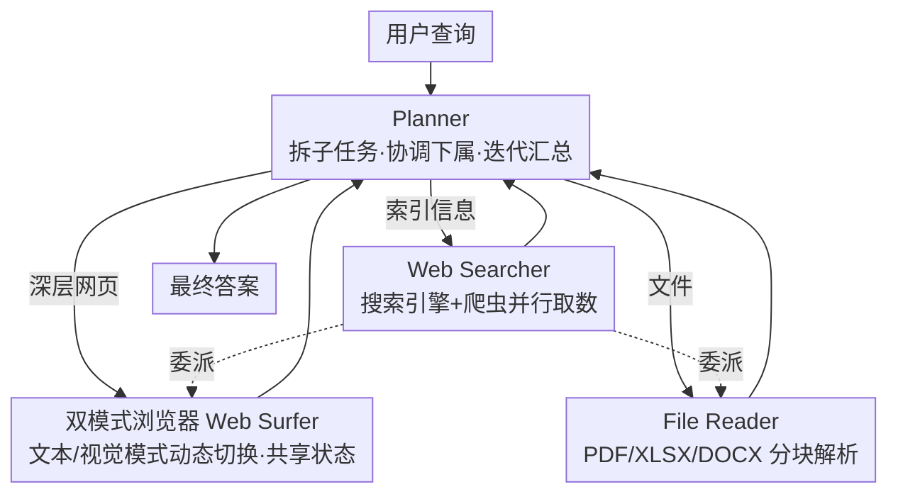

# UIS-Digger: Towards Comprehensive Research Agent Systems for Real-world Unindexed Information Seeking

**会议**: ICLR 2026  
**arXiv**: [2603.08117](https://arxiv.org/abs/2603.08117)  
**代码**: [https://huggingface.co/datasets/UIS-Digger/UIS-QA](https://huggingface.co/datasets/UIS-Digger/UIS-QA)  
**领域**: LLM评测  
**关键词**: 未索引信息检索, 多Agent框架, 双模式浏览器, SFT+RFT训练, 信息检索基准

## 一句话总结
识别并形式化"未索引信息检索"(UIS) 问题——搜索引擎无法直接检索的动态网页/嵌入文件/交互式内容，提出首个 UIS 基准 UIS-QA（110 题）和多 Agent 框架 UIS-Digger，以 ~30B 参数模型经 SFT+RFT 训练后达到 27.27% 准确率，超越集成 O3/GPT-4.1 的系统。

## 研究背景与动机
**领域现状**：LLM 信息检索 Agent（WebSailor、OWL、DDv2 等）在 GAIA（70.90%）和 BrowseComp-zh（46.70%）上取得了极高成绩，但这些基准主要考察通过搜索引擎可直接获取的**索引信息**。

**关键痛点**：互联网上大量关键信息属于**未索引信息**（UIS）：政府公告的深层页面、需要多次导航才能到达的产品规格、嵌入在 PDF/XLSX 文件中的数据、需要日期选择器或过滤器交互才能显示的动态内容。当前 Agent 对这些信息无能为力。

**核心矛盾**：现有评估体系**不区分**索引与未索引信息，导致 Agent 能力被高估。SOTA Agent 在 UIS-QA 上准确率从 GAIA 的 70% 骤降至 24.55%，暴露出两个瓶颈：(a) **动作空间不足**——搜索引擎 Agent 缺乏网页交互能力；(b) **基础模型能力受限**——模型难以在大动作空间中正确决策。

**本文切入点**：UIS 不是边缘问题，而是信息检索 Agent 评估体系的**根本盲区**。作者将互联网信息严格划分为索引信息 $\mathcal{II}$ 和未索引信息 $\mathcal{UI}$，给出数学定义，并提出首个 UIS-QA 基准和 UIS-Digger 系统。

**核心idea**：通过首个专门的 UIS 基准暴露问题严重性，并用多 Agent 系统 + 领域专项训练来应对 UIS 挑战。

## 方法详解

### 整体框架
本文有两个并列的产出：一把新尺子和一个新系统。尺子是 UIS-QA 基准，专门把"搜索引擎直接拿不到"的题目筛出来，用来戳穿现有评估的虚高；系统是 UIS-Digger，要真的去把这些未索引信息挖出来。

UIS-Digger 的运行时是一个**四 Agent 协作系统**，每个 Agent 配一套工具、负责一类子任务，整体按 ReAct 范式（思考→行动→观察迭代）跑。流程上，顶层的 Planner 接到用户查询后先初始化空记忆、把查询拆成子任务，再把子任务分派给三个下属 Agent：Web Searcher 走搜索引擎+爬虫这条索引信息通道、Web Surfer 操作浏览器去深层网页里抠交互式内容、File Reader 解析下载下来的 PDF/XLSX/DOCX 文件。Web Searcher 在干活时还能把网页浏览、文件解析的子任务进一步委派给后两者。各 Agent 的结果回流给 Planner 汇总，迭代若干轮后产出最终答案。

下面三个关键设计：第一个是用来量问题的尺子（UIS-QA），后两个分别撑起图里 Web Surfer 和 Web Searcher/File Reader 两条挖取通道；让模型真能用好这套大动作空间的 SFT+RFT 训练，放在「训练策略」里讲。

### 关键设计

**1. UIS-QA 基准：用三重过滤把"搜索引擎拿不到"的题目筛出来**

整套系统要解决的前提是"未索引信息检索"根本没有合适的尺子来量。现有基准（GAIA、BrowseComp）不区分索引与未索引信息，Agent 在上面拿高分，可能只是反映了搜索引擎索引范围内的检索能力，评估因此"虚高"。UIS-QA 的构造方式是先由专家组手动导航深层网站、标注 QA 对，再过一道三重 UIS 过滤：人工 Google 搜索验证、z.ai 自动验证、以及 DeepSeek-R1 内部知识检查，三关都确认答案无法通过搜索引擎直接获取才会保留。最终 110 题覆盖政府公告、产品介绍、代码仓库、游戏、公司年报等领域（84 中文 + 26 英文），并要求答案客观、权威、时间稳定，使得这把尺子既难又可复现。

**2. 双模式浏览器（Web Surfer）：文本与视觉动态切换，共享同一份状态**

UIS 题目里大量信息藏在需要交互才显示的网页元素中——日期选择器、过滤器、图表。纯文本 Agent 看不懂这些视觉交互元素，而全程开视觉模式（截图理解）又太慢。Web Surfer 因此在两种模式间动态切换：文本模式高效处理结构化文本，视觉模式用截图理解复杂 UI 布局。关键之处在于两种模式**共享记忆和浏览器状态**，切换时不需要重新同步页面，消除了多模态 Agent 常见的模式切换开销，从而在功能性与效率之间取到平衡。它的动作空间相应地覆盖点击、滚动、输入、选择下拉框、导航、提交表单、下载文件、截图等一整套网页操作。

**3. 并行工具执行与文件解析：补齐搜索之外的另两条信息通道**

只靠浏览还不够，UIS 信息也常嵌在文件里或需要广撒网式检索。为此 Web Searcher 可以同时调用搜索引擎和爬虫工具并行取数，缩短索引信息的获取链路；File Reader 则负责把 PDF / XLSX / DOCX 等格式解析出来，遇到超长文件按块增量读取（参考 Yu et al., 2025b），避免一次性塞爆上下文。三个下属 Agent 各管一条通道——搜索、深层浏览、文件解析——合在一起才覆盖了 UIS 所需的完整动作空间。

### 训练策略
两阶段合成数据+训练：
- **数据构造**：(a) 从 100+ 真实网站深层浏览收集信息→LLM 生成 QA 对→LLM Judge 过滤；(b) 构建三类虚拟网站（航班预订、统计查询场景），针对日期选择器、单选按钮、过滤器等交互弱点定向生成训练数据
- **SFT 阶段**：使用强教师模型 $\mathcal{X}^*$（temperature=0）解题产生一条轨迹/题，LLM Judge 验证正确性和非平凡性后进行 reject sampling
- **RFT 阶段**：SFT 模型 $\mathcal{X}^s$（temp=0.4, 每题采样 4 条轨迹）自我采样，同样 reject sampling，**按难度加权**——困难问题（正确次数少）的轨迹优先保留，最终得到 $\mathcal{X}^r$

## 实验关键数据

### 主实验

| 系统 | 骨干模型 | UIS-QA | GAIA | BrowseComp-zh |
|------|---------|--------|------|---------------|
| GPT-5 直接推理 | GPT-5 | 0.9% | - | - |
| WebSailor | 32B | 7.3% | 53.2% | 25.5% |
| OWL | GPT-4.1 | 25.45% | 70.90% | 46.70% |
| DDv2 | - | 24.55% | - | - |
| **UIS-Digger** | **~30B** | **27.27%** | - | - |

### 训练策略消融

| 配置 | UIS-QA 准确率 | 说明 |
|------|-------------|------|
| 仅搜索（无浏览） | ~7% | 动作空间不足导致理论不可解 |
| 文本模式 only | ~20% | 缺少视觉模式处理动态 UI |
| 完整系统（无训练） | ~18% | 基础模型无法有效利用工具 |
| SFT only | ~23% | 冷启动有效但未充分探索 |
| **SFT + RFT** | **27.27%** | 难度加权 RFT 带来最终 4pp 提升 |

### 关键发现
- SOTA Agent 在 UIS-QA 上经历剧烈性能下降（GAIA 70% → UIS-QA 25%），证明 UIS 是独立且严峻的挑战
- ~30B 参数模型通过专项训练超越集成 O3/GPT-4.1 的通用系统，说明 UIS 需要**专门优化**
- 失败模式分析：错误搜索策略 42%、工具使用错误 28%、推理错误 30%
- 双模式浏览器和文件解析是区分 UIS 解题能力的关键能力差异

## 亮点与洞察
- **首次形式化 UIS 问题**：将互联网信息集合 $\mathcal{P}$ 严格分为索引 $\mathcal{II}$ 和未索引 $\mathcal{UI}$，并区分理想定义与实际近似，为这一被忽视的方向奠定理论基础
- 双模式浏览策略的**共享状态设计**非常巧妙——避免了多模态Agent中常见的模式切换同步问题，可迁移到其他需要多模态感知的Agent
- 虚拟网站数据生成策略值得借鉴：直接针对 Agent 弱点（如日期选择器交互）设计训练环境，用模拟取代昂贵的真实标注
- 难度加权的 RFT 策略简单有效——困难问题的正确轨迹信号更强，优先保留能更高效地提升 Agent 的弱能力

## 局限与展望
- UIS-QA 仅 110 题，规模偏小且 84/110 为中文，语言和领域覆盖有限
- 绝对准确率仅 27.27%，UIS 问题远未解决——需要更强的基础模型和更完善的工具链
- 未考虑需要登录/CAPTCHA 的网站，真实场景中这类情况非常常见
- 评估仅限于准确率，缺乏对交互步数、时间成本等效率指标的分析
- 训练数据构造依赖特定教师模型，泛化性存疑

## 相关工作与启发
- **vs GAIA/BrowseComp**：这些基准不区分 UIS，高分可能仅反映搜索引擎索引范围内的检索能力
- **vs WebArena/Mind2Web**：聚焦浏览器操作但在受控环境中评估，UIS-QA 在真实开放互联网中评估
- **vs ReAct/Reflexion**：单 Agent 动作空间有限，UIS-Digger 的多 Agent 架构覆盖搜索+浏览+文件解析的完整空间
- 启发：Agent 评估需要按信息来源细分（索引 vs 未索引），才能真实反映 Agent 能力边界

## 评分
- 新颖性: ⭐⭐⭐⭐⭐ 首次识别和形式化 UIS 问题，开创性贡献
- 实验充分度: ⭐⭐⭐⭐ 多系统对比全面，但 UIS-QA 规模偏小
- 写作质量: ⭐⭐⭐⭐ 问题定义清晰，形式化完整
- 价值: ⭐⭐⭐⭐⭐ 揭示信息检索 Agent 的根本评估盲区，奠定 UIS 研究基础

<!-- RELATED:START -->

## 相关论文

- [\[ACL 2026\] Towards Robust Real-World Spreadsheet Understanding with Multi-Agent Multi-Format Collaboration](../../ACL2026/multi_agent/towards_robust_real-world_spreadsheet_understanding_with_multi-agent_multi-forma.md)
- [\[CVPR 2026\] MOTOR-Bench: A Real-world Dataset and Multi-agent Framework for Zero-shot Human Mental State Understanding](../../CVPR2026/multi_agent/motor-bench_a_real-world_dataset_and_multi-agent_framework_for_zero-shot_human_m.md)
- [\[ICML 2025\] Is Your LLM-Based Multi-Agent a Reliable Real-World Planner? Exploring Fraud Detection in Travel Planning](../../ICML2025/multi_agent/is_your_llm-based_multi-agent_a_reliable_real-world_planner_exploring_fraud_dete.md)
- [\[AAAI 2026\] FinRpt: Dataset, Evaluation System and LLM-based Multi-agent Framework for Equity Research Report Generation](../../AAAI2026/multi_agent/finrpt_dataset_evaluation_system_and_llm-based_multi-agent_framework_for_equity_.md)
- [\[ICLR 2026\] Stochastic Self-Organization in Multi-Agent Systems](stochastic_self-organization_in_multi-agent_systems.md)

<!-- RELATED:END -->
