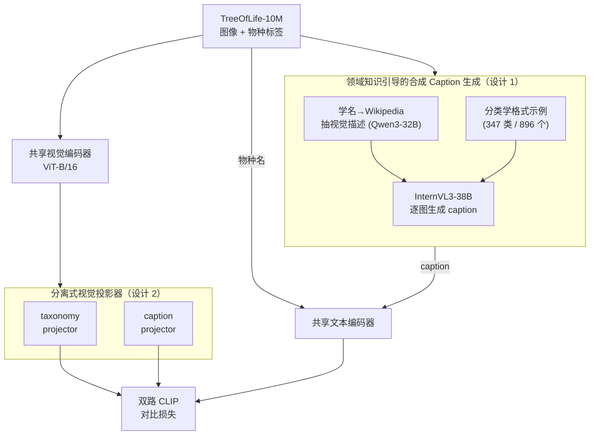

# BioCAP: Exploiting Synthetic Captions Beyond Labels in Biological Foundation Models

**会议**: ICLR 2026  
**arXiv**: [2510.20095](https://arxiv.org/abs/2510.20095)  
**代码**: [https://imageomics.github.io/biocap](https://imageomics.github.io/biocap)  
**领域**: 多模态VLM  
**关键词**: biological foundation model, synthetic captions, contrastive learning, species classification, CLIP

## 一句话总结
提出 BioCAP，通过用 MLLM 生成 wiki 知识引导的合成描述性 caption（而非仅用物种标签）来训练生物学多模态基础模型，在 10 个物种分类 benchmark 上比 BioCLIP 平均提升 8.8%，在文本-图像检索任务上提升 21.3%。

## 研究背景与动机
**领域现状**：生物学领域有海量标注了物种名的图像（如 TreeOfLife-10M），但缺乏实例级的描述性文本。现有生物学基础模型（BioCLIP）仅用物种分类名作为文本监督，基于 CLIP 对比学习训练。

**现有痛点**：物种名作为文本编码太粗粒度——同一物种内的个体外观差异大（颜色、姿态、环境等），仅靠名字无法捕捉细粒度的形态学特征。Wikipedia 有物种描述但不是实例特定的。直接用 MLLM 生成 caption 则容易产生幻觉（如把鸟的颜色描述错误）。

**核心矛盾**：想要实例级 caption 但人工标注不可能（数百万图像），自动生成又容易产生幻觉。物种辨别依赖细微的形态学细节，这恰恰是 MLLM 最容易出错的地方。

**本文目标** 如何为生物学图像大规模生成忠实的、实例特定的描述性 caption？

**切入角度**：用 Wikipedia 提取的物种视觉信息 + 按分类学类别定制的格式示例作为领域上下文来引导 MLLM 生成 caption，减少幻觉。

**核心 idea**：用领域知识引导的合成 caption 为生物学 CLIP 提供超越标签的额外监督信号。

## 方法详解

### 整体框架
BioCAP 要解决的问题是：生物学图像有海量物种标签却没有实例级描述，仅靠物种名训练 CLIP 抓不住细粒度形态特征，而直接让 MLLM 写 caption 又会幻觉连篇。它的做法可以一句话概括为 BioCLIP + Captions——先用一条领域知识引导的管线为 TreeOfLife-10M 的每张图自动生成忠实的描述性 caption，再让模型在「物种名」和「caption」两种文本视图下做 CLIP 对比训练。图像和文本各过一个共享编码器，但图像侧挂了两个独立的投影头，分别对接两种文本视图。整套系统基于 ViT-B/16 CLIP checkpoint 初始化。

### 关键设计

**1. 领域知识引导的合成 Caption 生成：用 Wikipedia 先验 + 分类学格式示例压住 MLLM 的幻觉**

物种辨别依赖的恰是颜色、花纹、翅形这些细微形态，也正是 MLLM 最容易写错的地方，所以"实例级 caption"的难点不在生成，而在忠实。BioCAP 用三步管线把领域知识喂给 MLLM：第一步，用学名去 Wikipedia 抓物种页面，再用 Qwen3-32B 从中抽出视觉描述信息（颜色、花纹、形状、纹理等），这一步覆盖了 447K 物种里的 29.5%；第二步，为 347 个分类学 class 各准备 1-3 个格式示例（Gemini Deep Research 检索 + 人工验证），合计 896 个，用来告诉模型每一类该盯着哪些特征——鸟看羽色翅形、昆虫看翅纹体节，关注点天差地别；第三步，用 InternVL3-38B，把该物种的 Wikipedia 视觉信息和对应类别的格式示例一起作为上下文，对每张图生成 caption。换句话说，Wikipedia 提供"这个物种长什么样"的物种级先验防止瞎编，格式示例提供"该描述哪些特征"的结构模板，两者一起把 MLLM 框在可信范围内——消融里无引导直接生成 caption 反而掉点，正说明了这层约束的必要性。

**2. 分离式视觉投影器（Separated Visual Projectors）：让物种名和 caption 各走各的投影头，互不干扰**

物种名是离散的类别标签，caption 是连续的语义描述，两者对视觉表示的诉求并不一样，硬塞进同一个投影空间会互相拉扯。BioCAP 共享视觉编码器和文本编码器，但在 image encoder 之后挂两个独立的 projection head：配对文本是物种名时只更新 taxonomy projector，配对是 caption 时只更新 caption projector。这样一张图像的特征会被投影到两个针对性子空间，一个服务分类、一个服务描述，两个对比目标各自优化而不打架。实验中分离投影器稳定优于共享投影器，印证了这两种监督确实需要不同的视觉表示。

**3. 形态空间的理论动机：用因果生成视角解释 caption 为什么有用**

为什么多一路 caption 监督就能学到更好的表示，BioCAP 从表示学习角度给了个解释：每个物种对应形态空间中的一个潜在向量 $\mathbf{z}^*$，而图像和 caption 都可以看成 $\mathbf{z}^*$ 的有噪投影——图像里混着姿态、光照、背景这些环境噪声，caption 里混着语言表达的噪声。对这两个含不同噪声的视图做对比学习，模型被迫去恢复它们共享的那部分潜在结构，也就是 $\mathbf{z}^*$，同时把各自独立的噪声抑制掉。这给"caption 不只是数据增强、而是提供了正交的监督信号"提供了一个理论解释，而非单纯的工程堆叠。

### 损失函数 / 训练策略
标准 CLIP 对比损失，两个文本视图（物种名 / caption）交替训练，各自更新对应的投影头。基于 ViT-B/16 CLIP checkpoint 初始化，在 TreeOfLife-10M 上训练 50 epochs。

## 实验关键数据

### 主实验（Zero-shot 物种分类 Accuracy）

| 模型 | NABirds | Plankton | Insects | Camera Trap | Fungi | Rare Species | **平均** |
|------|---------|----------|---------|-------------|-------|-------------|---------|
| CLIP | 39.0 | 3.3 | 7.4 | 28.1 | 8.6 | 25.7 | 19.4 |
| BioCLIP | 58.8 | 6.1 | 34.9 | 31.7 | 40.9 | 37.1 | 37.6 |
| **BioCAP** | **67.6** | **7.2** | **41.9** | **37.4** | **64.4** | **44.2** | **46.4** |

### 文本-图像检索（Recall@10）

| 模型 | INQUIRE (AP@50) | Cornell Bird I2T | PlantID I2T | **平均提升 vs BioCLIP** |
|------|----------------|-----------------|-------------|----------------------|
| BioCLIP | ~31 | 15.4 | 48.4 | - |
| **BioCAP** | ~35 | **55.3** | **59.6** | **+21.9%** |

### 关键发现
- Caption 质量至关重要：用无引导的 MLLM 直接生成 caption 反而会降低性能；有 Wikipedia 和格式示例引导后显著提升（Fungi 从 40.9→64.4%，提升 23.5%）
- 分离投影器比共享投影器好——验证了物种名和 caption 需要不同的视觉表示
- 仅覆盖 29.5% 物种的 Wikipedia 信息就带来了 8.8% 的平均提升，说明覆盖更多物种有进一步提升空间
- 在最 challenging 的 Rare Species benchmark 上提升 7.1%，证明 caption 帮助模型更好地泛化到罕见物种

## 亮点与洞察
- **"caption 比 label 更好"的有力验证**：在生物学这个标签丰富但 caption 稀缺的领域，证明了描述性文本作为额外监督信号的巨大价值
- **领域知识引导减少幻觉的方法论**：Wikipedia 抽取 + 分类学格式示例的管线是一个可复用的模板，适用于任何需要用 MLLM 生成忠实领域 caption 的场景
- **形态空间的理论框架**：用因果生成模型解释 caption 为什么有用，不是简单的工程堆叠

## 局限与展望
- Wikipedia 可视化信息只覆盖 29.5% 的物种，大量物种可能因无领域先验而 caption 质量不高
- 基于 ViT-B/16，未在更大模型上验证（ViT-L 或更大 CLIP）
- Caption 生成使用 InternVL3-38B 可能引入模型偏差
- 格式示例需要人工验证（896 个），规模扩展时可能成为瓶颈

## 相关工作与启发
- **vs BioCLIP**: BioCAP 在 BioCLIP 基础上加入 caption 监督，平均提升 8.8%，证明标签之外的监督重要性
- **vs LaCLIP/VeCLIP**: 这些方法在通用域用 LLM 改写 caption，BioCAP 面对的是领域无 caption 的困境，需要从零生成
- **vs FG-CLIP**: FG-CLIP 用长 caption 做细粒度对齐，但在生物学任务上不如 BioCLIP，因为缺乏领域知识引导

## 评分
- 新颖性: ⭐⭐⭐⭐ 领域知识引导的 caption 生成管线有创意
- 实验充分度: ⭐⭐⭐⭐⭐ 10 个分类 benchmark + 3 个检索任务 + 充分消融
- 写作质量: ⭐⭐⭐⭐⭐ 理论动机清晰，方法描述详细，图示精美
- 价值: ⭐⭐⭐⭐ 为科学领域的多模态基础模型提供了有价值的方法论

<!-- RELATED:START -->

## 相关论文

- [\[CVPR 2026\] Beyond What's Shared: Recovering Lost Unique Information from Intermediate Layers to Boost Multimodal Geo-Foundation Models](../../CVPR2026/multimodal_vlm/beyond_whats_shared_recovering_lost_unique_information_from_intermediate_layers_.md)
- [\[CVPR 2026\] Thinking Beyond Labels: Vocabulary-Free Fine-Grained Recognition using Reasoning-Augmented LMMs](../../CVPR2026/multimodal_vlm/thinking_beyond_labels_vocabulary-free_fine-grained_recognition_using_reasoning-.md)
- [\[CVPR 2026\] Scaling Spatial Intelligence with Multimodal Foundation Models](../../CVPR2026/multimodal_vlm/scaling_spatial_intelligence_with_multimodal_foundation_models.md)
- [\[CVPR 2026\] Towards Multimodal Domain Generalization with Few Labels](../../CVPR2026/multimodal_vlm/towards_multimodal_domain_generalization_with_few_labels.md)
- [\[CVPR 2026\] SOTA: Self-adaptive Optimal Transport for Zero-Shot Classification with Multiple Foundation Models](../../CVPR2026/multimodal_vlm/sota_self-adaptive_optimal_transport_for_zero-shot_classification_with_multiple_.md)

<!-- RELATED:END -->
