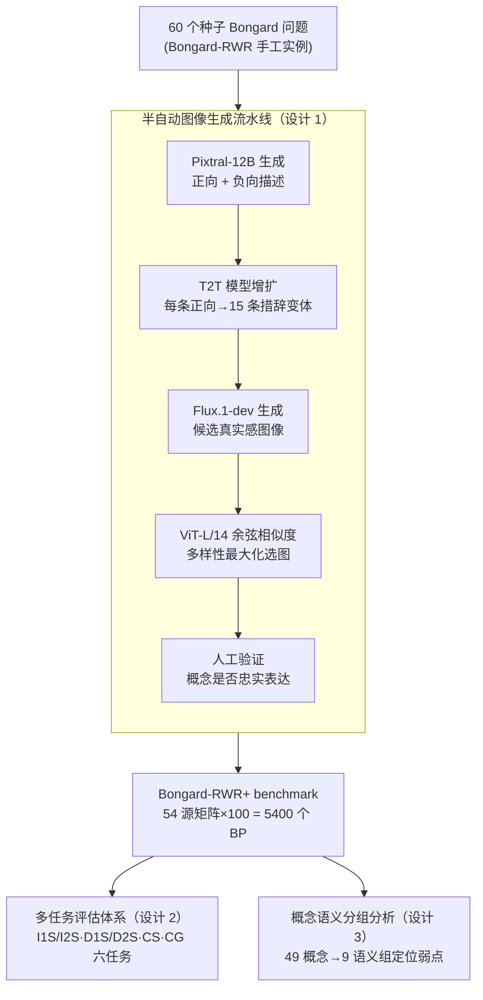

# Bongard-RWR+: Real-World Representations of Fine-Grained Concepts in Bongard Problems

**会议**: ICLR 2026  
**arXiv**: [2508.12026](https://arxiv.org/abs/2508.12026)  
**代码**: 有  
**领域**: 多模态VLM  
**关键词**: Bongard problems, abstract visual reasoning, few-shot learning, VLM benchmark, fine-grained concepts

## 一句话总结
构建 Bongard-RWR+，一个包含 5400 个 Bongard 问题的 benchmark，使用 VLM 流水线（Pixtral-12B + Flux.1-dev）自动生成真实感图像来表示抽象概念，系统评估揭示 SOTA VLM 在辨别细粒度视觉概念（如轮廓、旋转、角度）时表现挣扎，准确率低至 19%。

## 研究背景与动机
**领域现状**：Bongard 问题（BP）是抽象视觉推理的经典测试——给定左右各 6 张图，识别区分两组的抽象概念。现有 BP 数据集要么是合成黑白图（Bongard-LOGO），要么用真实图表示粗粒度概念（如"人在开车"）。

**现有痛点**：Bongard-RWR 虽然用真实图表示细粒度抽象概念，但手工构建仅有 60 个实例，规模太小无法做鲁棒评估。同时缺乏对 VLM 在不同推理维度上能力的系统诊断。

**核心矛盾**：VLM 在粗粒度概念识别上表现尚可，但对细粒度抽象概念（如"箭头方向相同 vs 不同"）的识别能力未知——需要足够大的 benchmark 来系统测试。

**本文目标** 如何大规模构建包含细粒度抽象概念的真实感 Bongard 问题？并系统评估 VLM 的视觉推理能力边界？

**切入角度**：用 I2T（描述图像）→ T2T（增广描述）→ T2I（生成图像）→ 人工验证的半自动流水线，将 60 个 Bongard-RWR 实例扩展到 5400 个。

**核心 idea**：用 VLM 流水线自动化生成 Bongard 问题中的真实感图像，大规模测试 VLM 的细粒度抽象推理极限。

## 方法详解

### 整体框架
这是一篇 benchmark 论文而非方法论文，要解决的问题是：原始 Bongard-RWR 只有 60 个手工实例，规模太小无法系统诊断 VLM 的细粒度抽象推理能力。作者的做法是搭一条半自动流水线，把这 60 个种子 BP 里的真实图像「批量复制」成大量表达相同抽象概念的新真实感图像，最终从 54 个源矩阵各生成 100 个变体 = 5400 个 BP（覆盖 49 个抽象概念）。流水线整体走的是 I2T（图像→描述）→ T2T（增广描述）→ T2I（描述→图像）→ 多样性选图 → 人工验证这条链路，生成的数据再配上一套从二分类到自由生成、由易到难的 6 任务评测体系，外加按语义把概念分组的诊断分析，构成完整的评估框架。

### 关键设计

**1. 半自动图像生成流水线：把手工不可扩展的构建变成可批量复制概念**

手工标注 60 个 BP 就到头了，所以核心是让生成过程在「概念保真」的前提下自动放量。流水线分四步：先用 Pixtral-12B 对每张种子图同时生成一条正向描述（捕获该 BP 要表达的概念）和一条负向描述（明确抑制对立概念）；再用一个 T2T 模型把每条正向描述增扩成 15 条措辞各异的描述，撑开图像的多样性；接着用 Flux.1-dev 从这些描述里生成候选图像；最后人工验证每张图是否忠实表达了目标概念。这里正/负描述成对出现是关键——细粒度概念往往是成对对立的（如"箭头方向相同 vs 不同"），不给负向约束的话 T2I 很容易把对立概念画混。生成出一大批候选后，再用 ViT-L/14 嵌入算两两余弦相似度，做多样性最大化选择，挑出彼此差异最大的若干张填进 BP，避免一组图像高度雷同。

**2. 多任务评估体系：用 6 种由易到难的任务精确卡 VLM 的能力边界**

只用一种任务测不出 VLM 到底卡在哪一环，所以作者设计了 6 种任务覆盖从感知到推理到生成的全链条。最基础的是 I1S/I2S——直接给单张或双张测试图，让模型二分类判断它属于左侧还是右侧概念组；D1S/D2S 则先用 I2T 把图像转成文字描述再做同样的分类，用来隔离「视觉感知」和「文本推理」哪一步是瓶颈；CS（Concept Selection）让模型从 K 个候选概念里选出正确的那个，K 取 2/4/8/16 逐步加干扰项，测区分能力随干扰增长的退化曲线；最难的 CG（Concept Generation）要求模型直接用自由文本生成正确的概念描述。从二分类→多选→开放生成，难度递增，每一档都能定位到具体哪类能力开始失效。

**3. 概念语义分组分析：把 49 个概念归到 9 个语义组，定位到底哪类抽象概念最难**

光看整体准确率只知道 VLM 难，不知道难在哪里。作者把 49 个抽象概念按语义归并成 9 组——Size、Position、Count、Branching、Similarity、Contour、Shape、Rotation、Angle——再分组统计准确率，从而把弱点精确定位到具体维度。这套分组直接支撑了后面的关键发现：依赖精确空间关系的 Contour / Rotation / Angle 组准确率不到 50%，而 Shape / Size / Branching 这类更整体性的概念能到约 75%。

### 损失函数 / 训练策略
N/A（benchmark 论文，只评估现有模型，不涉及训练）

## 实验关键数据

### 主实验（Concept Selection 任务）

| 模型 | K=2 | K=4 | K=8 | K=16 |
|------|-----|-----|-----|------|
| InternVL2.5-78B | **91%** | **78%** | **68%** | **57%** |
| Qwen2-VL-72B | 85% | 65% | 48% | 33% |
| LLaVA-Next-110B | 73% | 45% | 30% | 19% |
| MiniCPM-o-8B | 72% | 44% | 28% | 19% |

### 二分类任务（I1S/I2S）

| 模型 | I1S | I2S | D1S | D2S |
|------|-----|-----|-----|-----|
| InternVL2.5-78B | 0.50 | 0.39 | 0.57 | 0.49 |
| Qwen2-VL-72B | 0.49 | 0.44 | 0.58 | 0.42 |
| Random baseline | 0.50 | 0.50 | 0.50 | 0.50 |

### 关键发现
- **二分类接近随机**：所有 VLM 在 I1S/I2S 上准确率约 50%，等同随机猜测！说明 VLM 几乎无法从 few-shot 图像中推断细粒度抽象概念
- **概念选择尚可但退化快**：InternVL2.5 在 K=2 时 91%（区分能力尚在），但 K=16 时降到 57%（干扰项增多后崩溃）
- **语义组差异显著**：Shape/Size/Branching 易（~75%），Contour/Rotation/Angle 难（<50%）——后者依赖精确空间关系
- DeepSeek-R1 在纯文本 D2S 上达 0.56，说明文本推理比视觉推理更有效——VLM 的瓶颈在视觉感知而非推理
- 彩色 vs 灰度无显著差异，确认概念是结构性的不依赖颜色
- 小模型（MiniCPM-8B）和大模型（LLaVA-110B）性能持平，模型大小不是决定因素

## 亮点与洞察
- **揭示了 VLM 的根本弱点**：在 few-shot 抽象视觉推理上，即使最强的 78B VLM 也近乎随机——这不是可以靠缩放解决的问题
- **半自动数据生成流水线的方法论价值**：用 I2T→T2T→T2I→人工验证的流程可以复用到其他需要大规模概念性数据集的场景
- **多任务评估设计很完善**：从二分类到多分类到生成，难度递增，能精确定位能力边界

## 局限与展望
- 生成图像的概念保真度仍需人工验证（不完全自动化）
- 49 个概念数量有限，未覆盖原始 Bongard 问题的全部 394 个概念
- 评估只用 zero-shot/few-shot 的 VLM，未测试 fine-tuning 是否能提升
- 生成图像可能包含 T2I 模型的 artifact，影响概念判断

## 相关工作与启发
- **vs Bongard-LOGO**: LOGO 有 12K 实例但全是合成黑白图；RWR+ 有 5.4K 实例用真实感图像，更接近 VLM 训练分布
- **vs Bongard-HOI/OpenWorld**: 这些用粗粒度概念（如"人在开车"），VLM 相对擅长；RWR+ 用细粒度抽象概念，暴露了 VLM 的真正弱点
- **vs ARC (Chollet)**: 同样测试抽象推理但在网格域，RWR+ 在真实图像域，互补

## 评分
- 新颖性: ⭐⭐⭐⭐ 半自动生成 + 多维评估体系
- 实验充分度: ⭐⭐⭐⭐⭐ 4 个大模型、6 种任务、9 个语义组、多消融
- 写作质量: ⭐⭐⭐⭐ 结构清晰，评估全面
- 价值: ⭐⭐⭐⭐ 定义了 VLM 细粒度推理的能力上限和瓶颈

<!-- RELATED:START -->

## 相关论文

- [\[ICML 2025\] Reasoning Limitations of Multimodal Large Language Models. A Case Study of Bongard Problems](../../ICML2025/multimodal_vlm/reasoning_limitations_of_multimodal_large_language_models_a_case_study_of_bongar.md)
- [\[ICLR 2026\] Can Vision-Language Models Answer Face to Face Questions in the Real-World?](can_vision-language_models_answer_face_to_face_questions_in_the_real-world.md)
- [\[CVPR 2026\] See What I Mean: Aligning Vision and Language Representations for Video Fine-grained Object Understanding](../../CVPR2026/multimodal_vlm/see_what_i_mean_aligning_vision_and_language_representations_for_video_fine-grai.md)
- [\[CVPR 2025\] FLAIR: VLM with Fine-grained Language-informed Image Representations](../../CVPR2025/multimodal_vlm/flair_vlm_with_fine-grained_language-informed_image_representations.md)
- [\[ICLR 2026\] MMR-Life: Piecing Together Real-life Scenes for Multimodal Multi-image Reasoning](mmr-life_piecing_together_real-life_scenes_for_multimodal_multi-image_reasoning.md)

<!-- RELATED:END -->
