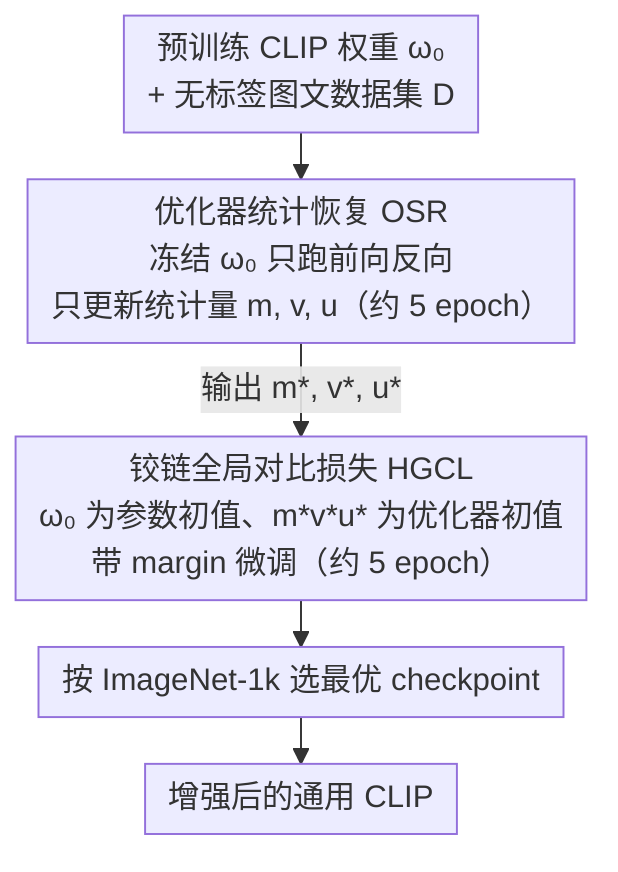

# Breaking the Limits of Open-Weight CLIP: An Optimization Framework for Self-supervised Fine-tuning of CLIP

**会议**: ICLR 2026  
**arXiv**: [2601.09859](https://arxiv.org/abs/2601.09859)  
**代码**: 基于 FastCLIP 代码库实现  
**领域**: 多模态VLM  
**关键词**: CLIP, 自监督微调, 对比学习, 优化器统计恢复, 假负样本

## 一句话总结
本文提出 TuneCLIP，一个自监督微调（SSFT）框架，通过两阶段设计——先恢复优化器统计量（OSR）消除冷启动偏差，再用带margin的铰链全局对比损失（HGCL）缓解假负样本过度惩罚——在不使用任何标签的条件下持续提升已有开源 CLIP 模型的通用性能，在 ImageNet 及变体上提升最高 +2.5%，在 DataComp 基准上提升 +1.2%。

## 研究背景与动机

**领域现状**: CLIP 已成为多模态表示学习的基石，但提升其性能通常需要在数十亿样本上从头预训练，代价极其高昂。现有改进路线主要有两条：(a) 构建更大数据集/新损失函数从头训练；(b) 有监督微调适配特定下游任务。

**现有痛点**: 
   - 从头训练成本极高（数百 GPU 跑数天到数周），不可扩展
   - 有监督微调虽然便宜，但强烈的域适配会损害泛化性和分布鲁棒性，本质上是"特定任务调优"而非"通用能力提升"
   - 直接从预训练权重开始用标准训练流程微调（如 OpenCLIP/FastCLIP），往往在第一个 epoch 就出现严重的性能退化

**核心矛盾**: 
   - **冷启动偏差**: 优化器状态（一阶矩、二阶矩及 GCL 的样本级统计量 $u_{i,x}, u_{i,z}$）在微调开始时被零初始化。对于预训练好的模型，这些统计量的真实值远非零，巨大的估计误差导致初始梯度方向严重偏离，破坏已有的良好表示
   - **假负样本问题**: 自监督对比学习中，语义相似但非配对的样本会被当作负样本。随着模型变强，这种错误惩罚加剧，尤其损害检索性能

**本文切入角度**: 作者提出了一个根本性不同的问题——"能否只用自监督数据就把现有 CLIP 变得更好？"不瞄准特定下游任务，而是追求通用性能的全面提升。

**核心 idea**: 用"冻结模型权重先恢复优化器统计量 + 带margin的铰链损失避免假负样本过惩罚"的两阶段策略，实现 CLIP 的自监督通用增强。

## 方法详解

### 整体框架

TuneCLIP 想回答的问题是：只给一堆没有标签的图文对，能不能把一个已经训练好的开源 CLIP 变得更强，而不是从头烧几百张 GPU。它把这件事拆成前后衔接的两个阶段，两阶段都不引入额外网络，只是在标准的对比学习训练流程上动手脚。第一阶段优化器统计恢复（OSR）把模型权重 $\omega_0$ 完全冻住，照常跑前向和反向，但梯度只用来"喂养"优化器的内部统计量，不更新一个参数；约 5 个 epoch 后，这些被零初始化的统计量才追上预训练模型真实的梯度分布。第二阶段才真正微调：以 $\omega_0$ 为参数初值、以恢复好的统计量为优化器初值，换上带 margin 的铰链全局对比损失（HGCL）把模型再训约 5 个 epoch，最后挑在 ImageNet-1k 上表现最好的 checkpoint 收尾。两阶段的顺序不能颠倒——必须先用 OSR 把优化器喂熟、再换 HGCL 更新权重，缺了前一步，后面再好的损失也会被冷启动偏差带崩。

### 关键设计

**1. 优化器统计恢复 OSR：先让优化器"热身"，再开始更新权重**

直接从预训练权重接着微调之所以第一个 epoch 就崩，根子在优化器状态被零初始化。Adam 的一阶矩 $m_t$、二阶矩 $v_t$，以及 GCL（SogCLR 那一支）维护的样本级统计量 $u_{i,x}^{(t)}, u_{i,z}^{(t)}$，开训时全是零；但对一个已经收敛的模型，这些量的真值离零很远，于是头几步的梯度方向严重失真，把原本良好的表示直接打坏——论文把这种由统计量初始误差引发的退化称作**冷启动偏差**。OSR 的做法干脆利落：冻结 $\omega_0$，照正常公式更新 $m_t, v_t, u_{i,x}^{(t)}, u_{i,z}^{(t)}$，但权重一动不动，相当于让优化器空转几个 epoch 把统计量"养"到位。这之所以重要，是因为 GCL 损失本身没有无偏的随机梯度估计——它的梯度精度严重依赖样本级统计量 $\Phi_1, \Phi_2$ 是否准确；统计量从零起步，分母估得离谱，梯度方向自然错。论文还给了理论支撑：Theorem 4.1 表明收敛所需迭代数由统计量初始误差 $M_0, U_{x,0}, U_{z,0}$ 主导（而非预训练模型本身的次优程度 $\Delta_0$），Theorem 4.2 证明 OSR 能以 $O(1/\sqrt{BE})$ 的速率把这些误差压下去（$B$ 为 batch size，$E$ 为恢复轮数），实测 $E=5$ 即可。整套方案不需要额外网络、不需要蒸馏，几乎零实现成本。

**2. 铰链全局对比损失 HGCL：给负样本的惩罚设一个"适可而止"的上限**

OSR 解决了开训崩坏，但进入第二阶段后还有一个新麻烦：随着微调推进，训练集上的检索越来越好、测试集（如 Flickr）上的检索反而下滑。病根是假负样本——web 数据里大量图文对语义相似却不是配对，标准 GCL 却会一视同仁地把它们越推越远，模型越强这种错误分离越狠，最终扭曲了原本良好的嵌入结构。HGCL 的改法是把标准 GCL 里那项配对损失 $\ell(s_{ij} - s_{ii})$ 换成带 margin 的平方铰链形式：

$$\ell(s_{ij} - s_{ii}) = [\,s_{ij} - s_{ii} + m\,]_+^2$$

含义是，一旦正样本相似度 $s_{ii}$ 已经比负样本相似度 $s_{ij}$ 高出 margin $m$（即 $s_{ii} > s_{ij} + m$），括号取正后归零，这个负样本的梯度就变成零、不再被继续推开。等于给"该分离多少"画了条线，把语义相近的假负样本保护在阈值之内，不再硬拆嵌入空间的良好结构。这个铰链项随后被代入图锚 / 文锚两个统计量 $\Phi_1^m, \Phi_2^m$，再组成最终的 HGCL 损失，仍用 SogCLR 算法配合 OSR 优化。margin 是这里唯一的关键超参，本质是个权衡——大了对真负样本分离不足、小了假负样本问题又卷土重来，实测取 $m=0.1$ 最好。

## 实验关键数据

### 主实验

| 基础模型 | 方法 | IN & Variants | Retrieval | DataComp |
|---------|------|-------------|-----------|----------|
| OpenAI ViT-B/16 | Baseline | 57.67 | 57.46 | 56.26 |
| OpenAI ViT-B/16 | FastCLIP | 54.57 (↓) | 51.88 (↓) | 53.53 (↓) |
| OpenAI ViT-B/16 | OpenCLIP | 54.99 (↓) | 57.81 (↓) | 55.11 (↓) |
| OpenAI ViT-B/16 | **TuneCLIP** | **59.36 (+1.69)** | **64.12 (+6.66)** | **58.62 (+2.36)** |
| SigLIP ViT-B/16 | Baseline | 63.12 | 69.32 | 62.32 |
| SigLIP ViT-B/16 | FastCLIP | 39.22 (↓) | 43.37 (↓) | 45.80 (↓) |
| SigLIP ViT-B/16 | **TuneCLIP** | **65.58 (+2.46)** | **69.44 (+0.11)** | **63.47 (+1.15)** |

- **ViT-H/14 SOTA**: TuneCLIP 将 DFN-5B 预训练的 ViT-H/14 在 ImageNet 上从 71.80% 提升至 73.23%（+1.43%），创下新 SOTA

### 消融实验

| 配置 (OpenAI ViT-B/16) | IN & Variants | Retrieval | DataComp | Mean |
|------------------------|-------------|-----------|----------|------|
| 无 OSR | 54.91 | 58.64 | 54.49 | 56.01 |
| OSR (仅 $m_t, v_t$) | 59.48 | 63.70 | 58.56 | 60.58 |
| OSR (完整: $m_t, v_t, u_t$) | **59.36** | **64.12** | **58.62** | **60.70 (+4.69)** |

| 数据源 | IN & Variants | Retrieval | DataComp |
|--------|-------------|-----------|----------|
| CC12M (含噪) | 57.68 (+0.01) | 65.83 (+8.37) | 56.47 (+0.21) |
| DFN-12M (过滤后) | **59.36 (+1.69)** | 64.12 (+6.66) | **58.62 (+2.36)** |

### 关键发现
- **baseline 方法全面退化**: FastCLIP 和 OpenCLIP 直接微调不仅无法提升，反而导致零样本分类、检索和 DataComp 全面下降（SigLIP 上甚至从 63.12% 暴跌至 39.22%），凸显冷启动偏差的严重性
- **OSR 是成功的关键**: 不做 OSR 时 mean 仅 56.01，完整 OSR 提升至 60.70（+4.69）。其中一阶/二阶矩的恢复贡献最大
- **HGCL 保护检索性能**: 标准 GCL 可以提升分类但会降低检索（假负样本被错误分离），HGCL 通过 margin 机制在保持分类的同时稳定检索
- **数据质量有影响但不是必须**: 在噪声更大的 CC12M 上微调仍有正向收益，说明 TuneCLIP 不依赖特定数据集属性
- **数据规模效应递减**: 从 12M 扩展到 60M 带来的提升有限，因为微调是在已有良好表示基础上的精炼

## 亮点与洞察
- **自监督微调（SSFT）范式的提出**: 与有监督微调和从头预训练截然不同，SSFT 追求"用自监督数据通用增强已有模型"。这个方向此前几乎空白，本文填补了重要缺口
- **冷启动偏差的理论分析 (Theorem 4.1)**: 首次从收敛理论角度量化了优化器统计量初始误差对训练的影响。$U_{x,0}, U_{z,0}$ 的贡献甚至可以主导收敛速度，远超模型初始点的次优程度 $\Delta_0$
- **OSR 的简洁优雅**: 解决方案极其简单——冻结权重跑几个epoch让优化器"空转"。不需要额外网络、不需要蒸馏、不需要特殊架构，几乎零实现成本，但效果显著
- **GCL vs HGCL 的差异化分析**: 在有监督微调中 GCL 更好（真负样本确实需要分离），在 SSFT 中 HGCL 更好（需要容忍假负样本），这个对比揭示了有/无标签场景在对比学习中的本质区别

## 局限与展望
- OSR 需要额外 5 个epoch的前向传播（虽然不更新模型参数），对大数据集是额外开销
- margin $m$ 需要搜索（0.01~0.5），且最优值可能随模型架构变化
- 未考虑数据选择或过滤策略——好的子集选择可能进一步加速微调
- 仅在 CLIP 架构上验证，对 DINO 等其他自监督架构的适用性待探索
- 数据规模从 12M 到 60M 的提升效果有限，如何设计更"信息密集"的数据策略值得研究
- 微调的超参数搜索范围仍较大（学习率 3 个量级、margin 从 0.01 到 0.5）

## 评分
- 新颖性: ⭐⭐⭐⭐ (SSFT 范式新颖，冷启动偏差分析有深度)
- 实验充分度: ⭐⭐⭐⭐⭐ (多模型×多数据集×多基准，消融详尽，包含 ViT-H/14 大规模验证)
- 写作质量: ⭐⭐⭐⭐ (结构清晰，理论与实验对应良好)
- 价值: ⭐⭐⭐⭐⭐ (开辟 SSFT 新方向，实用性极强，可直接应用于现有 CLIP 模型)

<!-- RELATED:START -->

## 相关论文

- [\[CVPR 2026\] Reconstructing CLIP for Open-Vocabulary Dense Perception](../../CVPR2026/multimodal_vlm/reconstructing_clip_for_open-vocabulary_dense_perception.md)
- [\[CVPR 2026\] TRivia: Self-supervised Fine-tuning of Vision-Language Models for Table Recognition](../../CVPR2026/multimodal_vlm/trivia_self-supervised_fine-tuning_of_vision-language_models_for_table_recogniti.md)
- [\[NeurIPS 2025\] Advancing Compositional Awareness in CLIP with Efficient Fine-Tuning](../../NeurIPS2025/multimodal_vlm/advancing_compositional_awareness_in_clip_with_efficient_fin.md)
- [\[ICML 2026\] Left-Right Symmetry Breaking in CLIP-style Vision-Language Models Trained on Synthetic Spatial-Relation Data](../../ICML2026/multimodal_vlm/left-right_symmetry_breaking_in_clip-style_vision-language_models_trained_on_syn.md)
- [\[ICML 2026\] ATHA: 通过打破尾部对齐改进 CLIP 在源数据无关跨域小样本上的适配](../../ICML2026/multimodal_vlm/improving_clip_adaptation_by_breaking_tail_alignment_for_source-free_cross-domai.md)

<!-- RELATED:END -->
