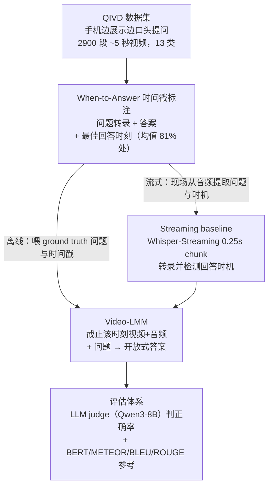

# Can Vision-Language Models Answer Face to Face Questions in the Real-World?

**会议**: ICLR2026  
**arXiv**: [2503.19356](https://arxiv.org/abs/2503.19356)  
**代码**: [https://www.qualcomm.com/developer/software/qualcomm-interactive-video-dataset-qivd](https://www.qualcomm.com/developer/software/qualcomm-interactive-video-dataset-qivd)  
**领域**: 多模态VLM  
**关键词**: situated understanding, real-time interaction, video QA, multimodal benchmark, streaming VLM

## 一句话总结
提出 QIVD（Qualcomm Interactive Video Dataset），一个面对面实时问答 benchmark（2900 个视频+音频+时间戳标注），揭示现有 VLM 在实时情境理解上远落后人类（最佳模型 60% vs 人类 87%），主要瓶颈在指代消歧、回答时机判断和情境常识，微调可显著缩小差距。

## 研究背景与动机

**领域现状**：大型多模态模型（LMM）在图像描述和 VQA 上取得了显著进展，也开始支持实时音视频对话。但现有能力仅限于"离线推理"——接收完整视觉输入和完整问题后再回答。

**现有痛点**：(a) 现有视频理解 benchmark 都是离线范式，模型提前看到整个视频和完整问题；(b) 缺少测试"面对面对话"能力的 benchmark——即模型连接摄像头和麦克风，实时对话回答问题；(c) 模型不知道"何时该回答"——对话中的时机判断（when-to-speak）被严重忽视。

**核心矛盾**：真实世界 AI 助手和人形机器人需要实时理解场景+理解口头问题+判断何时回答，但训练数据和 benchmark 都是离线的，导致模型没有这种能力。

**本文目标** (a) 构建首个面对面实时问答数据集；(b) 系统评估现有模型的能力边界；(c) 证明微调这类数据可提升实时交互能力。

**切入角度**：设计一个简单的在线 QA 范式——用户用手机拍视频边做动作边提问，模型需要从视频+音频输入中实时理解场景并在正确时机回答。

**核心 idea**：通过构建带音频+视频+回答时间戳的实时交互 QA 数据集，首次系统测量 VLM 的面对面交互能力并识别三大失败模式。

## 方法详解

### 整体框架
这篇工作要回答的问题是：当 VLM 像人一样连着摄像头和麦克风、需要边看边听边在合适的时机开口时，它到底行不行。为此作者把"数据集 + 评估 benchmark + 流式 baseline"打包成一套东西 QIVD。整条 pipeline 从一段众包工人用手机录的 ~5 秒短视频出发：录制者一边展示场景一边口头提问（"这是什么颜色？""我手里有几个苹果？"），系统实时转录音频、判断问题何时说完、把截止当前的视频帧连同问题喂给 Video-LMM 生成答案，再用 LLM judge 对照标注的标准答案打分。关键在于每个视频都标了三样东西——问题转录、答案、以及"最佳回答时间戳"，后者让评估同时覆盖了"答得对不对"和"开口时机准不准"两个维度。评估又分流式（streaming，问题和时机都由 ASR 现场提取）和离线（offline，直接给模型 ground truth 问题和时间戳）两套设置。

### 关键设计

**1. QIVD 数据集：把问题嵌进视频音频里，而不是事后补一个问题**

现有视频理解 benchmark 几乎都是"先看完整段视频、再附上一个文字问题"的离线模式，模型永远拥有完整信息。QIVD 反其道而行：让众包工人用手机或电脑录短视频，录制过程中直接口头发问，问题以音频形式内嵌在视频里。这样一来答案常常不在问题说完的那一刻就能给出——可能要等录制者继续把场景展示完。最终收集到 2900 个视频，每个标注问题转录、答案和回答时间戳，覆盖 13 个语义类别：物体属性/计数/检测/引用、动作属性/计数/检测/理解、场景理解、音视频融合、OCR、主观判断。这种"问题与视觉同步发生"的形式，天然把指代消歧、时序依赖、实时理解这些难点都带了进来，而不需要人为设计。

**2. When-to-Answer 时间戳标注：把"何时开口"变成一个可量化的指标**

实时对话里，知道"什么时候该回答"和"回答什么"同样重要，但前者几乎没人单独研究过。QIVD 给每个视频标了一个最佳回答时间戳——即视频中第一次出现足够信息可以回答问题的时刻。它不一定等于问题说完的时刻：如果录制者先问"这是什么动作？"再开始做动作，最佳时机是动作完成之后。统计上平均回答时间戳落在视频 81.47% 处，其中动作计数类最晚（92.22%，必须等动作全部做完才能数），物体检测类最早（76.95%）。有了这个标注，"开口时机"就能被独立评估和优化，而不再被淹没在答案正确率里。

**3. Streaming baseline：用现成 ASR + VLM 拼一条模块化的实时 pipeline**

现有 LMM 普遍不支持音视频同步流式处理，作者于是搭了个简单的级联框架当 baseline：Whisper-Streaming ASR 以 0.25 秒为 chunk 实时转录音频并检测问题是否结束，一旦判定问题说完，就把截止该时间点的视频帧连同转录出的问题送进 Video-LMM 生成答案。在此之上还微调了 Qwen2.5-Omni（即 Stream-Qwen-Omni），让它直接从流式输入里检测最佳回答时机。这条 pipeline 本身就是个结论——即便把当下最强的 ASR 和 VLM 拼在一起，实时面对面交互依然很难，说明问题不在某个零件，而在缺乏端到端的流式建模。

**4. 评估体系：用 LLM judge 给自由形式答案打分，并用双设置隔离误差来源**

QIVD 的答案是开放式自由文本，没法用精确匹配判对错，因此主评估指标是用 LLM judge（Qwen3-8B）判断答案正确性，再辅以 BERT、METEOR、BLEU、ROUGE-L 等文本相似度指标做参考。评估刻意分成两套设置：streaming 设置下问题和时间戳全由 ASR 现场提取，离线设置下直接喂 ground truth 问题和时间戳。两套对照能把"ASR/时机检测的误差"和"视觉理解本身的误差"分开——离线设置反映模型理解能力的上限，streaming 设置才是真实部署会遇到的难度。

### 训练策略
微调实验用 VideoLLaMA2.1-7B-AV 在 QIVD 上做 5 折交叉验证：冻结视觉编码器，只微调 LLM backbone 和 audio pathway，每折训练 2 个 epoch。时机检测则微调 Qwen2.5-Omni 得到 Stream-Qwen-Omni，让它支持流式输入并学会发射一个特殊 token 来标记"该回答了"。

## 实验关键数据

### 主实验（离线设置，ground truth 问题+时间戳）

| 模型 | 正确率 (Corr.) | BERT | METEOR | BLEU | ROUGE-L |
|------|--------------|------|--------|------|---------|
| **Human** | **87.33** | 93.01 | 53.21 | 17.40 | 49.76 |
| Qwen3-VL-8B | 60.07 | 87.58 | 36.72 | 6.64 | 35.89 |
| GPT-4o | 58.76 | 89.36 | 51.18 | 15.72 | 42.55 |
| Gemini-2.5-Flash | 58.07 | 90.43 | 43.07 | 8.33 | 36.05 |
| VideoLLaMA3-7B | 56.38 | 91.63 | 48.56 | 12.72 | 43.84 |
| VideoLLaMA2-72B | 50.83 | 92.29 | 51.13 | 16.12 | 45.76 |
| Qwen2.5-VL-7B | 50.62 | 87.58 | 37.37 | 4.66 | 29.44 |

### 消融实验（音频影响 + 微调效果）

| 配置 | 总体正确率 | 动作计数 | 音视频任务 | 主观判断 |
|------|----------|---------|----------|---------|
| VideoLLaMA2.1-7B（仅视频） | ~43% | ~13% | ~27% | ~23% |
| VideoLLaMA2.1-7B（视频+音频） | ~40% | ~10% | ~23% | ~16% |
| 微调后（视频+音频） | **~52%** | **~30%（+17%）** | **~45%（+17%）** | **~47%（+23%）** |
| 微调后（仅视频） | ~47% | ~22% | ~27% | ~37% |

### 关键发现
- **人类 vs 最佳模型差距 27%**：人类 87.33% vs Qwen3-VL 60.07%，即使用 ground truth 问题和时间戳，模型仍远落后
- **音频未必有帮助**：未微调时加音频反而降低性能（可能因为预训练时音视频融合训练不足），但微调后音频成为关键助力，尤其在音视频任务和主观判断上
- **回答时机影响显著**：Stream-Qwen-Omni 的时间戳检测 MAE 为 0.52s（vs Whisper-Streaming 的 0.83s），更精确的时机判断直接提升回答正确率
- **动作计数最难**：即使微调后仍只有 ~30%，说明时序推理可能需要更强的架构归纳偏置
- **指代消歧是核心挑战**：物体引用（Object Referencing）占比最大（24.34%），模型经常误解"this""that"等指示词

## 亮点与洞察
- **首个真正的面对面交互 benchmark**：将问题嵌入视频音频中而非事后附加，自然产生指代消歧、时机判断等挑战——这比事后标注更真实地反映实际交互场景
- **When-to-Answer 的独立研究价值**：何时开口是对话的基础但几乎未被研究。回答时间戳标注使这个问题可以被独立评估和优化
- **微调的非均匀收益**：微调在动作计数（+17%）、音视频（+17%）等类别收效巨大，但物体属性和场景理解收效甚微——说明不同情境理解能力需要不同的训练策略
- **模块化 streaming 设计**：ASR 检测时机 → VLM 回答的架构简单但有效，可作为实时交互系统的起点

## 局限与展望
- **视频太短**：平均仅 5 秒，无法测试长时间交互、多轮对话、上下文切换等能力
- **单轮 QA**：仅测试单一问题-单一回答，真实对话需要多轮理解和上下文维护
- **英语限定**：仅英语音频，跨语言和口音多样性未覆盖
- **类别分布不均**：音视频融合（0.76%）和 OCR（0.79%）样本很少，评估可能不稳定
- **评估依赖 LLM judge**：自由形式答案的评估主观性强，不同 LLM judge 可能给出不同结论

## 相关工作与启发
- **vs AVSD/SocialIQ（视频对话 benchmark）**：它们基于预录视频配后标注问题。QIVD 的问题在录制时同步提出，自然包含指代表达和时序依赖
- **vs VideoLLM-online/FlashVStream（流式模型）**：它们尝试实时处理但不含音频且限于特定领域。QIVD 提供了更通用的评估平台
- **vs Ego4D Social**：同样涉及面对面交互，但 Ego4D 是任务特定标签而非自由形式 QA。QIVD 的开放式问答更贴近真实对话

## 评分
- 新颖性: ⭐⭐⭐⭐ 首个面对面实时交互 QA benchmark，when-to-answer 标注是亮点
- 实验充分度: ⭐⭐⭐⭐⭐ 20+ 模型全面评估，streaming/offline/音频消融/微调/时机分析面面俱到
- 写作质量: ⭐⭐⭐⭐ 问题定义清晰，实验分析深入
- 价值: ⭐⭐⭐⭐⭐ 直指实时 AI 助手/机器人的核心能力缺口，对领域发展有引导意义

<!-- RELATED:START -->

## 相关论文

- [\[CVPR 2025\] Rethinking Vision-Language Model in Face Forensics: Multi-Modal Interpretable Forged Face Detector](../../CVPR2025/multimodal_vlm/rethinking_vision-language_model_in_face_forensics_multi-modal_interpretable_for.md)
- [\[NeurIPS 2025\] Face-Human-Bench: A Comprehensive Benchmark of Face and Human Understanding for Multi-modal Assistants](../../NeurIPS2025/multimodal_vlm/face-human-bench_a_comprehensive_benchmark_of_face_and_human_understanding_for_m.md)
- [\[CVPR 2026\] VinQA: Visual Elements Interleaved Long-form Answer Generation for Real-World Multimodal Document QA](../../CVPR2026/multimodal_vlm/vinqa_visual_elements_interleaved_long-form_answer_generation_for_real-world_mul.md)
- [\[CVPR 2026\] Face-Guided Sentiment Boundary Enhancement for Weakly-Supervised Temporal Sentiment Localization](../../CVPR2026/multimodal_vlm/face-guided_sentiment_boundary_enhancement_for_weakly-supervised_temporal_sentim.md)
- [\[ICML 2026\] TimeSpot: Benchmarking Geo-Temporal Understanding in Vision-Language Models in Real-World Settings](../../ICML2026/multimodal_vlm/timespot_benchmarking_geo-temporal_understanding_in_vision-language_models_in_re.md)

<!-- RELATED:END -->
