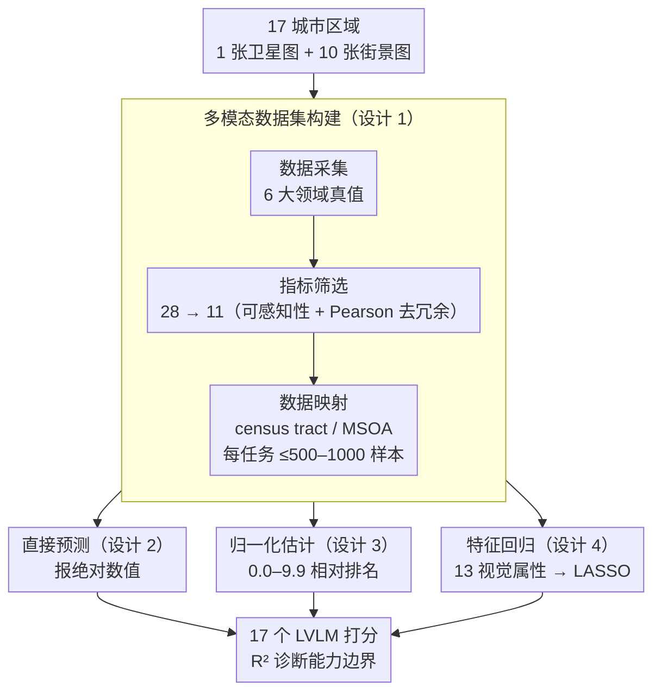

# CityLens: Evaluating Large Vision-Language Models for Urban Socioeconomic Sensing

**会议**: ICLR2026  
**arXiv**: [2506.00530](https://arxiv.org/abs/2506.00530)  
**代码**: [https://github.com/tsinghua-fib-lab/CityLens](https://github.com/tsinghua-fib-lab/CityLens)  
**领域**: 多模态VLM  
**关键词**: urban computing, socioeconomic sensing, benchmark, vision-language model, street view

## 一句话总结
构建 CityLens——迄今最大规模的城市社会经济感知 benchmark（17 城市、6 大领域、11 个预测任务），评估 17 个 LVLM 在直接预测、归一化估计、特征回归三种范式下从卫星/街景图像推断社会经济指标的能力，发现通用 LVLM 在多数任务上仍不及领域特化的对比学习方法。

## 研究背景与动机

**领域现状**：从城市图像推断社会经济指标（GDP、犯罪率、教育水平等）是城市计算的核心任务。传统方法用对比学习（UrbanCLIP、UrbanVLP）从街景/卫星图提取视觉特征再回归，但面临跨国泛化差、无法处理非结构化多模态数据、不能理解文化语义等限制。

**现有痛点**：(a) LVLM 具备多模态理解和全球知识，理论上适合这类任务，但缺乏系统评估——现有工作空间覆盖有限、指标单一、模型规模小。(b) 没有统一 benchmark 衡量 LVLM 在不同任务、区域、模态下的城市感知能力。

**核心矛盾**：LVLM 有强大的视觉理解和推理能力，但能否从城市图像中有效提取社会经济信号——这是一个开放问题，需要大规模系统评估来回答。

**本文目标**：构建最全面的城市社会经济 benchmark，系统评估 LVLM 的能力边界。

**切入角度**：大规模多城市、多领域、多模态的统一 benchmark + 三种互补的评估范式。

**核心 idea**：用 17 城市 × 11 指标 × 3 评估范式 × 17 模型的大规模实验，全面测度 LVLM 在城市社会经济感知中的能力与不足。

## 方法详解

### 整体框架
CityLens 要回答的是"LVLM 到底能不能从城市图像里读出社会经济信号"，所以它不提新模型，而是把一套数据和一套评估协议搭起来当尺子。数据侧覆盖横跨 6 大洲的 17 个全球城市（美、英、中、非洲、南美等），每个区域配 1 张卫星图加 10 张街景图，再挂上 11 个社会经济指标的真值标签。评估侧设计了三种互补的提问范式——直接预测、归一化估计、特征回归——分别从"能不能给出精确数值""有没有粗粒度的空间直觉""提取的视觉特征里有没有信息"三个角度去逼问同一个 LVLM。17 个模型在这套尺子上跑下来，就能定位它们各自的能力边界。整套流程就是「数据集构建 → 三范式并行评估 → 17 模型打分」：先把可感知的指标筛出来铺成底座，再让同一份区域图像分别走三条提问路径，最后汇总成能力诊断。

### 关键设计

**1. 多模态数据集构建：先把"图像里看得见的指标"挑出来**

社会经济指标五花八门，但不是每一个都能从图像合理推断——"每日通勤距离"这类视觉无关的指标如果留着，评估的就成了瞎猜而不是视觉感知。因此作者从初始的 28 个指标出发，按"视觉可感知性 + Pearson 相关去冗余"两道筛子收敛到 11 个，覆盖经济（GDP、房价、收入基尼）、教育（学士比例）、犯罪（暴力/非暴力犯罪）、交通（公交/驾车比）、健康（心理健康、医疗可及性、预期寿命）、环境（碳排放、建筑高度）六大领域。空间粒度按地区就高对齐：美国到 census tract 级、英国到 MSOA 级、其余全球区域用卫星图覆盖区，每个任务最多保留 500–1000 个样本。这样每个区域都有"卫星图 + 多张街景图 + 真值标签"的完整三元组，构成迄今最大规模的城市社会经济感知底座。

**2. 直接预测（Direct Metric Prediction）：直接问数值，测最硬的精确量化能力**

最直接的考法是把区域图像丢给模型，让它扮演城市社会经济学家，直接报出具体数值，比如"该区域的公交出行比例是多少？"。这一范式不给任何缓冲，要求模型把视觉线索一步转化成精确的绝对数字，因此也是三种范式里最难的——它检验的是 LVLM 有没有把"看到的街景"映射到"准确指标"的能力，而不只是定性判断。

**3. 归一化估计（Normalized Metric Estimation）：把绝对值换成相对排名，测粗粒度空间直觉**

直接报数值太难，于是借鉴 GeoLLM 的做法，把每个指标归一化到 0.0–9.9 的区间（保留一位小数），让模型估计相对水平而非绝对值。这相当于把"精确量化"降级成"相对排序"：即便模型说不出准确的 GDP，只要它能判断出"这片区域经济水平偏高"，就能在归一化尺度上给对位置。这个范式专门用来测 LVLM 是否具备粗粒度的空间知识，与直接预测形成难度梯度上的对照。

**4. 特征回归（Feature-Based Regression）：把 LVLM 当特征提取器，测它表征的信息上限**

前两个范式让模型自己出答案，这一个则换个角度——不要求模型预测指标，而是让它沿 Fan et al. (2023) 的视觉分类法、按 13 个预定义视觉属性（绿化、车辆、建筑立面、人行道等）给每张街景图打分；一个区域的 10 张街景图各属性取均值，聚成一条特征向量，再喂进 LASSO 回归（5 折交叉验证）去拟合目标指标。这样测的是 LVLM 提取的视觉特征里到底有没有社会经济信息：如果连经过回归"放大"后的特征都拟合不出指标，那直接预测就更无从谈起。因此这一范式给出的是 LVLM 作为特征提取器的"能力上限"，与前两个"直接出答案"的范式互补，三者合起来才能完整诊断模型在城市感知上的强项与短板。

## 实验关键数据

### 主实验（Feature-Based Regression，R² 分数）

| 模型 | GDP | 人口 | 房价 | 犯罪 | 公交 | 建筑高度 | 心理健康 | 学士比例 | 均值 |
|------|-----|------|------|------|------|---------|---------|---------|------|
| UrbanVLP | 0.717 | 0.132 | 0.559 | 0.149 | 0.551 | 0.807 | 0.403 | 0.422 | **0.417** |
| GPT-4o | 0.500 | 0.330 | 0.140 | 0.083 | 0.470 | 0.620 | 0.138 | 0.300 | 0.310 |
| Gemma3-27B | 0.463 | 0.324 | 0.141 | 0.077 | 0.567 | 0.590 | 0.211 | 0.297 | 0.338 |
| Qwen2.5VL-72B | ~0.52 | ~0.35 | ~0.10 | ~0.08 | ~0.53 | ~0.65 | ~0.22 | ~0.30 | ~0.35 |

### 消融实验（街景图数量的影响）

| 街景图数量 | GDP R² | 房价 R² | 学士比例 R² | 说明 |
|-----------|--------|---------|------------|------|
| 1 张 | 较低 | 较低 | 较低 | 单张信息不足 |
| 5 张 | 中等 | 中等 | 中等 | 性能快速提升 |
| 10 张 | 最高 | 最高 | 最高 | 接近饱和 |

### 关键发现
- **通用 LVLM 在多数任务上不及领域特化方法**：UrbanVLP（对比学习基线）在 GDP、房价、交通、建筑高度等任务上大幅领先所有 LVLM，说明 LVLM 的通用视觉特征在城市感知中不如领域特化表征
- **心理健康和学士比例最难**：这些指标与视觉线索的对应关系微弱（R² 接近 0），说明当前 LVLM 无法从图像中推断深层社会特征
- **模型规模提升有限**：从 3B 到 72B，R² 提升幅度很小（~0.05-0.10），说明瓶颈不在模型规模，而在城市视觉理解的根本方法论
- **归一化估计优于直接预测**：粗粒度相对判断比精确数值预测容易得多——LVLM 有一定的空间直觉但缺乏精确量化能力
- **建筑高度最容易**：R² 均超 0.5，因为这是最直接的视觉可观察指标

## 亮点与洞察
- **最全面的城市社会经济 benchmark**：17 城市 × 11 指标 × 3 评估范式 × 17 模型——规模远超之前的 GeoLLM 等工作。为社区提供了统一的评估基础设施
- **三种范式的互补设计**：直接预测测精确性、归一化估计测粗粒度感知、特征回归测表征质量——三管齐下全面诊断 LVLM 的能力边界
- **视觉可感知性的指标筛选原则**：不是所有社会经济指标都应该从图像预测——只选择"人类也能从图像推断"的指标，避免了不合理的评估设定
- **发现了 LVLM 在城市感知中的系统性不足**：对研究方向有重要指引——需要城市领域特化的视觉预训练而非单纯放大通用模型

## 局限与展望
- **benchmark 但非方法论文**：论文的核心贡献是评估框架而非提出新方法。缺少对"如何提升 LVLM 城市感知能力"的方法探索
- **标签时效性**：社会经济数据和街景图的采集时间可能不一致（例如 2019 年的犯罪数据 vs 2024 年的街景），时间错位可能影响结果
- **文化偏见**：LVLM 的训练数据偏向发达国家城市，在非洲/南美城市的感知能力可能系统性偏低——但论文对此分析不足
- **改进方向**：(a) 城市领域的视觉指令微调；(b) 街景+卫星+POI 多源融合；(c) 时序街景分析城市变化

## 相关工作与启发
- **vs GeoLLM**：GeoLLM 只用文本 prompt 不用图像，且仅全球粗粒度。CityLens 是多模态（卫星+街景）+细粒度（census tract 级）
- **vs UrbanVLP/UrbanCLIP**：它们是领域特化的对比学习方法——效果更好但泛化性差。CityLens 揭示了通用 LVLM 与领域方法的差距，为弥合这个差距提供了评估基准
- **vs PlacePulse/StreetScore**：早期工作只做"城市感知评分"（安全感、美观度），CityLens 扩展到可量化的社会经济指标

## 评分
- 新颖性: ⭐⭐⭐⭐ 最全面的城市社会经济 benchmark，三范式评估设计新颖，但方法创新有限
- 实验充分度: ⭐⭐⭐⭐⭐ 17 模型 × 11 任务 × 3 范式，消融分析全面（模态、图数量、模型规模）
- 写作质量: ⭐⭐⭐⭐ 数据构建流程清晰，分析深入，但篇幅较长
- 价值: ⭐⭐⭐⭐ 为 LVLM 在城市计算中的应用提供了急需的评估基础设施

<!-- RELATED:START -->

## 相关论文

- [\[ICLR 2026\] GTR-Bench: Evaluating Geo-Temporal Reasoning in Vision-Language Models](gtr-bench_evaluating_geo-temporal_reasoning_in_vision-language_mod.md)
- [\[NeurIPS 2025\] CHOICE: Benchmarking the Remote Sensing Capabilities of Large Vision-Language Models](../../NeurIPS2025/multimodal_vlm/choice_benchmarking_the_remote_sensing_capabilities_of_large_vision-language_mod.md)
- [\[ICML 2026\] Benchmarks for Vision-Language Models in Urban Perception Should Be Reliability-Aware and Negotiated](../../ICML2026/multimodal_vlm/benchmarks_for_vision-language_models_in_urban_perception_should_be_reliability-.md)
- [\[CVPR 2026\] Enhancing Video Vision Language Model with Hippocampal Sensing](../../CVPR2026/multimodal_vlm/enhancing_video_vision_language_model_with_hippocampal_sensing.md)
- [\[ICLR 2026\] Detecting Misbehaviors of Large Vision-Language Models by Evidential Uncertainty Quantification](detecting_misbehaviors_of_large_vision-language_models_by_evidential_uncertainty.md)

<!-- RELATED:END -->
