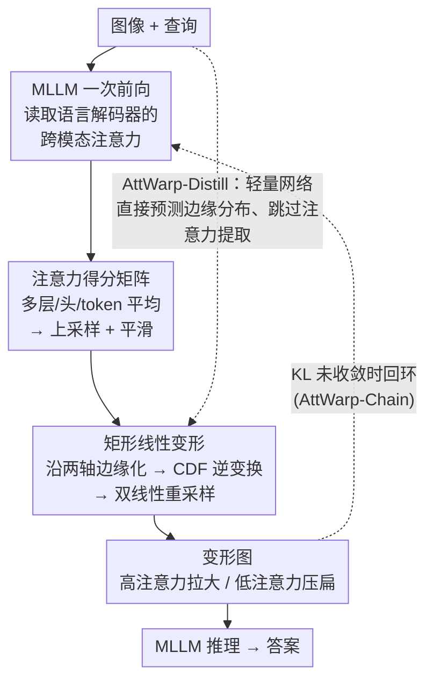

# Constructive Distortion: Improving MLLMs with Attention-Guided Image Warping

**会议**: ICLR 2026  
**arXiv**: [2510.09741](https://arxiv.org/abs/2510.09741)  
**代码**: [项目页](https://dwipddalal.github.io/Attwarp/)  
**领域**: 多模态VLM  
**关键词**: MLLM, image warping, attention-guided, fine-grained perception, test-time intervention

## 一句话总结
提出 AttWarp，一种即插即用的测试时图像变形方法，利用 MLLM 自身的跨模态注意力图进行矩形网格重采样，
扩展高注意力区域、压缩低注意力区域，在5个基准和4个 MLLM 上一致提升准确率、改善组合推理和减少幻觉。

## 研究背景与动机
**领域现状**: 多模态大语言模型（MLLM）如 LLaVA、Qwen-VL 在图像对话和推理方面取得进展，但在细粒度感知方面仍有明显缺陷——遗漏小目标、混淆相似物体、误解空间关系。

**现有痛点**: 现有改进方法要么需要外部检测器（bounding box/mask），要么需多步推理链，要么裁剪/遮挡导致丢失全局上下文。

**核心矛盾**: 小目标在特征提取阶段已丢失空间细节，后续的注意力改进无法挽回；但简单放大/裁剪又会丢失全局布局。

**本文目标**: 在不修改模型权重和架构的前提下，通过输入层面的空间变换增强查询相关区域的分辨率。

**切入角度**: 类比人类的中央凹视觉（foveal vision）——对关注区域密集采样，对外围稀疏采样，同时保留全局信息。

**核心 idea**: 用模型自身的注意力引导一次矩形线性变形，让同一个模型"看得更清楚"。

## 方法详解

### 整体框架
AttWarp 是一层套在 MLLM 外面的测试时图像预处理：先让模型对"图像+查询"跑一次前向，从解码器的跨模态注意力里读出"它想看哪儿"，把注意力聚合成一张**注意力得分矩阵**；再据此做**矩形线性变形**，把图像重新采样——高注意力区域被拉大、低注意力区域被压扁，最后把这张变形图喂回同一个模型得到最终答案。整个过程不碰权重、不改架构，靠的是把注意力分布转成一个保持规则网格的空间映射。在这个基础框架上，论文给了两个扩展：**AttWarp-Chain** 把"提注意力 → 变形"这步迭代起来形成正反馈；**AttWarp-Distill** 用一个轻量网络直接预测变形所需的边缘分布，省掉昂贵的注意力提取，把两次前向压成一次。

### 关键设计

**1. 注意力得分矩阵：把"模型想看哪儿"读成一张可用的热力图**

要让变形有的放矢，第一步得有一张干净的、和图像像素对齐的注意力图。AttWarp 从 MLLM 指定的若干解码器层 $\mathcal{L}$ 里取出跨模态注意力，对所有输出 token、所有注意力头、所有选定层做平均，得到每个图像位置的聚合得分 $\tilde{A}_{i,j} = \frac{1}{n_{\text{out}} \cdot n_{\text{heads}} \cdot |\mathcal{L}|} \sum_{\ell \in \mathcal{L}} \sum_m \sum_h a^{(\ell,h)}_{m,t}$。原始注意力分辨率很低（对应视觉 token 网格），所以再上采样到图像尺寸并做平滑，抹掉离散网格的锯齿。这一步的关键是它完全免费——注意力本来就是前向时算出来的副产品，不需要任何外部检测器或额外标注。

**2. 矩形线性变形：用 CDF 逆变换重新分配像素密度，又不破坏网格结构**

拿到 2D 注意力图后，难点是怎样"放大重点"却不让视觉编码器认不出来。如果做自由形变（per-pixel flow），网格会扭成不规则形状，标准 ViT patch 切分立刻失配，引入巨大分布偏移。AttWarp 的做法是把变形约束成可分离的矩形线性映射：先把 2D 注意力沿两个轴各自边缘化，得到水平、垂直方向的一维分布 $m_x(j)$ 和 $m_y(i)$；对每个分布算累积分布函数（CDF）再取逆，作为该方向的坐标重映射 $f_X^{\text{Warp}}(j) = W \cdot M_x^{-1}(j/W)$、$f_Y^{\text{Warp}}(i) = H \cdot M_y^{-1}(i/H)$，最后按这两个映射做双线性重采样。CDF 逆变换的几何含义很直观：注意力密集的区间在 CDF 上斜率大，逆变换后被拉伸占据更多像素；注意力稀疏处被压缩。因为映射在每个轴上单调、可分离，行还是行、列还是列，规则网格被完整保留，整张图所有像素也都还在——这是它和裁剪/遮挡的本质区别，后者直接丢信息，而 AttWarp 只重新分配采样密度。实验里这点至关重要：矩形变形相对训练分布的 KID 只有 31.5，而同样放大重点的非矩形自由变形 KID 飙到 174.9。

**3. AttWarp-Chain：让"变形改善注意力、注意力改善变形"滚成正反馈**

一次变形后，模型在更清晰的重点区域上能给出更聚焦的注意力，而更好的注意力又能驱动更准的变形，于是很自然地把这步迭代起来。每一轮用上一轮的变形图重新提注意力、重新变形，直到相邻两轮的注意力分布趋于稳定为止——终止条件取 KL 散度 $\mathcal{D}_{KL}(P^{(d)} \| P^{(d-1)}) < \epsilon_{KL}$，分布几乎不再变化就停。这样既避免了固定迭代次数的浪费，又防止过度变形把图压坏。

**4. AttWarp-Distill：把两次前向蒸馏成一次，换来低延迟部署**

原始 AttWarp 需要"提注意力 + 推理"两次前向，延迟翻倍。蒸馏版把前半截直接换成一个轻量预测网络：用 CLIP ViT-L/14 编图、FiLM 按文本查询做条件调制、Conv1D 直接吐出两个轴的边缘分布预测 $(\hat{m}_x, \hat{m}_y)$，从而跳过昂贵的注意力提取。训练时以教师 MLLM 在 TextVQA/GQA/DocVQA 上算出的真实边缘分布为目标做 L1 回归。推理时只需这一次轻量前向加一次 MLLM 推理，整体约 8.7 TFLOPs，几乎和 Base MLLM 的 8.5 TFLOPs 持平，比 ViCrop 的 24.2 TFLOPs 快约 3 倍，适合 AR/具身等低延迟场景。

## 实验关键数据

### 主实验
LLaVA-v1.5-7B 上的结果（准确率%）:

| 方法 | TextVQA | GQA | MMMU | POPE | DocVQA |
|------|---------|-----|------|------|--------|
| Base MLLM | 49.3 | 60.5 | 36.9 | 85.3 | 18.1 |
| ViCrop | 56.3 | 60.9 | 37.2 | 87.0 | 22.5 |
| AttWarp | 58.1 | 63.7 | 40.4 | 87.5 | 25.5 |
| AttWarp-Chain | **60.3** | **64.4** | **41.6** | **88.2** | **27.6** |
| Δ vs 最强基线 | +4.0 | +3.5 | +4.4 | +1.2 | +5.1 |

Qwen2.5-VL 上同样一致提升 (+2.1~3.6%)。

### 消融实验
注意力分布改善验证 (TextVQA):

| 指标 | 无变形 | 有 AttWarp |
|------|--------|------------|
| Pointing Game Accuracy | 37.4% | 42.4% (+5%) |
| Proportion (bbox 内注意力占比) | 0.117 | 0.155 (+3.8%) |

分布偏移分析：AttWarp KID=31.5 vs Non-Rectilinear Warp KID=174.9（与训练分布的距离），证明矩形线性变形几乎不引入分布偏移。

### 关键发现
- 变形确实让注意力更集中于正确区域，Pointing Game 准确率提升 5%
- 矩形线性设计是关键——非矩形变形导致严重分布偏移（KID 从 31.5 增至 174.9）
- AttWarp-Distill 仅 8.7 TFLOPs，接近 Base MLLM 的 8.5 TFLOPs，远优于 ViCrop 的 24.2 TFLOPs
- 错误分析显示 AttWarp 主要减少了细粒度细节和组合推理的错误

## 亮点与洞察
- **"建设性扭曲"的哲学**: 受人类中央凹视觉启发，主动变形输入是合理且有效的策略
- **即插即用**: 无需修改模型，跨 4 种不同架构的 MLLM（LLaVA, Qwen-VL, InternVL, InstructBLIP）一致有效
- **保信息性**: 与裁剪/遮挡不同，变形保留了所有像素信息，仅重新分配密度
- **CDF 逆变换框架**: 将注意力分布转化为变形映射的数学框架优雅简洁，单次 CDF 前向传播即可
- **AttWarp-Chain 的正反馈**: 变形改善注意力、注意力改善变形的迭代增强，KL 散度自动终止
- **分布保持分析**: 严格验证了矩形变形不引入分布偏移（KID/FID/Mahalanobis）

## 局限与展望
- 需要两次 MLLM 前向传播（一次提取注意力、一次推理），延迟翻倍
- 变形可能抑制外围上下文对全局推理的帮助，特别是需要全场景理解的问题
- 绝对尺度信息在变形后丢失，尺寸相关问题可能受影响
- AttWarp-Chain 的迭代次数依赖 KL 阈值超参
- 注意力质量是前提——如果初始注意力完全偏离，变形会适得其反
- 变形幅度无理论上界，极端变形可能导致非目标区域的严重压缩
- 未探索在视频理解模型中的应用（时序一致性的变形）

## 相关工作与启发
- 与 FGVP/SoM/ViCrop 等测试时干预方法对比：AttWarp 是唯一保留完整图像信息的方法
- 与 APIPrompting 对比：后者叠加注意力热力图，引入了非原始信息； AttWarp 保持纯图像输入
- seam carving、saliency-aware warping 等经典方法的现代复兴，但传统方法多基于优化（单张数分钟），AttWarp 基于 CDF 单次前向传播
- 启发：在输入层面干预（而非中间表征）是改善感知模型的被忽视但有效的策略
- 对具身 AI / AR 设备的启发：AttWarp-Distill 的单次推理适合低延迟场景

## 评分
- 新颖性: ⭐⭐⭐⭐ 注意力引导变形的思路新颖，CDF 逆变换框架优雅，受 foveal vision 启发
- 实验充分度: ⭐⭐⭐⭐⭐ 5基准+4模型+分布分析+注意力验证+错误分析，非常充分
- 写作质量: ⭐⭐⭐⭐⭐ 动机→方法→实验逻辑流畅，图示清晰，分析彻底
- 价值: ⭐⭐⭐⭐ 即插即用的实际价值高，但本质是测试时 trick，理论深度有限

<!-- RELATED:START -->

## 相关论文

- [\[CVPR 2026\] Token Warping Helps MLLMs Look from Nearby Viewpoints](../../CVPR2026/multimodal_vlm/token_warping_helps_mllms_look_from_nearby_viewpoints.md)
- [\[ICML 2026\] Seeing is Understanding: Unlocking Causal Attention into Modality-Mutual Attention for Multimodal LLMs](../../ICML2026/multimodal_vlm/seeing_is_understanding_unlocking_causal_attention_into_modality-mutual_attentio.md)
- [\[CVPR 2026\] Personalized Image Descriptions from Attention Sequences](../../CVPR2026/multimodal_vlm/personalized_image_descriptions_from_attention_sequences.md)
- [\[CVPR 2026\] A More Word-like Image Tokenization for MLLMs](../../CVPR2026/multimodal_vlm/a_more_word-like_image_tokenization_for_mllms.md)
- [\[ECCV 2024\] Attention Prompting on Image for Large Vision-Language Models](../../ECCV2024/multimodal_vlm/attention_prompting_on_image_for_large_visionlanguage_models.md)

<!-- RELATED:END -->
