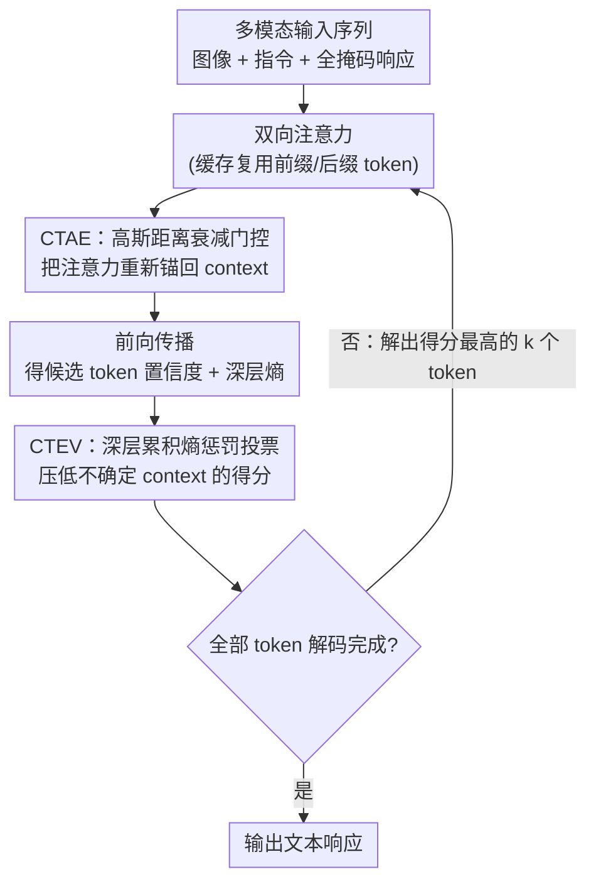

# Context Tokens are Anchors: Understanding the Repetition Curse in dMLLMs from an Information Flow Perspective

**会议**: ICLR 2026  
**arXiv**: [2601.20520](https://arxiv.org/abs/2601.20520)  
**代码**: [GitHub](https://github.com/ErikZ719/CoTA)  
**领域**: 多模态VLM  
**关键词**: 扩散语言模型, 重复生成, 信息流分析, 缓存加速, 注意力机制

## 一句话总结

通过信息流分析揭示扩散多模态大语言模型（dMLLMs）在使用缓存加速时产生"重复诅咒"的内在机制——context token 作为锚点聚合语义信息，缓存破坏了这一信息流模式——并提出 CoTA 方法将重复率降低高达 92%。

## 研究背景与动机

**dMLLMs 的推理效率问题**：扩散式大语言模型（如 LLaDA）通过迭代去噪并行生成 token，每步需要对全序列计算注意力。由于采用双向注意力，传统 KV-cache 不适用，推理延迟高

**缓存加速的副作用**：dLLM-Cache 等方法利用前缀和后缀 token 的注意力值在迭代间变化小的特点设计缓存复用，有效降低延迟但引发严重的文本重复——作者称之为"Repeat Curse"

**定量度量**：提出 4 个互补指标定义重复程度——相邻重复率（ARR）、样本重复率（SRR）、最大重复长度（MRL）、平均重复长度（ARL）

**三个关键信息流发现**：
   - context token（目标 token 及其最近邻）在 dMLLMs 中充当锚点，跨层逐步聚合语义信息并吸收注意力
   - 正常解码下，context token 的信息熵在深层收敛，反映模型预测确定性增加
   - 缓存导致注意力分配随机化，context token 熵在深层无法收敛→产生重复

## 方法详解

### 整体框架

CoTA 是一套免训练、即插即用的推理期方法，专门修复缓存给 dMLLMs 带来的"重复诅咒"。它的出发点是前面诊断出的病灶：缓存让 context token（目标 token 及其最近邻）失去了锚点作用，注意力分配被随机化、深层熵不再收敛。CoTA 因此在 dMLLMs 的迭代去噪解码回环里插了两道修正——前向计算时，CTAE 在注意力矩阵上施一道随距离衰减的门控，把被稀释的注意力重新拉回 context token；解码投票时，CTEV 把 context 在深层的累积熵当作惩罚项接进置信度评分，压低那些熵居高不下、最可能引发重复的候选。两者一前一后，每一步去噪都先恢复信息流模式、再过滤不确定预测，循环往复直到全部 token 解码完成。

### 关键设计

**1. CTAE（Context-token Attention Enhancement）：用距离衰减把注意力重新锚回 context**

缓存破坏信息流的直接表现是 context token 的注意力被稀释，于是 CTAE 直接在注意力矩阵上乘一个随相对距离衰减的高斯门控，让每个 token 更多地关注自己附近的 context。论文的假设是相对距离越近的 token 语义相关性越强，所以加强对邻近 context 的注意力有利于维持局部语义连贯。门控项写作 $\mathcal{G}_{i,j} = \gamma_{\min} + (1-\gamma_{\min}) \exp\!\left(-\left(\frac{|i-j|}{\tau}\right)^2\right)$，修正后的注意力为 $\tilde{A}_{i,j} = A_{i,j} \cdot \mathcal{G}_{i,j}$（对每层每个注意力头逐元素相乘）。其中温度因子 $\tau=5$ 控制有效窗口宽度——$\tau$ 太小（如 3）窗口偏窄会漏掉相关 context，太大（如 10）又退化回被稀释的状态，实验中 $\tau=5$ 最优；下限 $\gamma_{\min}\in(0,1]$ 保证远距离 token 的注意力不会被压到零，维持数值稳定。这一步几乎不增加计算量，却能把被缓存打乱的信息流模式拉回到接近正常解码的形态。

**2. CTEV（Context-token Entropy-Guided Voting）：用深层累积熵给不确定的预测降权**

光恢复注意力还不够，模型在重复出错时往往是 context 的熵在深层迟迟不收敛，而原始 dMLLMs 只用置信度投票、完全忽略了这个不确定信号。CTEV 把它直接接进解码的置信度评分：先对每个候选 token 按 softmax 分布算归一化信息熵 $E = -\frac{1}{\log V}\sum_{v} p_v \log p_v$，再把目标 token 及其两个最近邻 $\mathcal{C}(i)$ 在深层（26–30 层）上的熵逐层累加成 $E_{sum}^{ctx}(i) = \sum_{j \in \mathcal{C}(i)} \sum_{l=26}^{30} E^{(l)}(j)$，最后以系数 $\alpha$ 加进原置信度：

$$\text{Score}(i) = c_{(i)} + \alpha \cdot E_{sum}^{ctx}(i)$$

熵越高说明这块 context 越不确定、越可能引发重复——CTEV 把这个累积熵作为惩罚项接入投票得分，压低来自高熵 context 的候选，使解码每一步选出的 token 更倾向于来自确定性高的 context，从而抑制重复。CTAE 负责保住正确的信息流模式，CTEV 负责在投票阶段把残余的不确定预测过滤掉，两者互补才把重复率压到接近无缓存基线。

## 实验关键数据

### 主实验（LLaDA-V 8B, COCO Caption）

| 方法 | ARR↓(512) | MRL↓(512) | SRR↓(512) | ARR↓(64) |
|------|-----------|-----------|-----------|----------|
| LLaDA-V 基线 | 0.2 | 2.0 | 6.9 | 0.1 |
| +Cache | 14.3 | 11.0 | 82.3 | 7.1 |
| +Cache+CTAE | 3.5 | 3.2 | 22.1 | 2.8 |
| +Cache+CTEV | 4.1 | 3.8 | 25.3 | 3.2 |
| **+Cache+CoTA** | **1.2** | **1.3** | **6.3** | **1.0** |

### 多模态基准

| 基准 | LLaDA-V | +Cache | +Cache+CoTA |
|------|---------|--------|-------------|
| DocVQA | 78.2 | 72.6 | 76.9 |
| MMStar | 55.1 | 49.3 | 54.2 |
| MME | 1892 | 1645 | 1856 |

### 消融实验

| 配置 | ARR↓(512) | 说明 |
|------|-----------|------|
| CTAE only | 3.5 | 各自独立有效 |
| CTEV only | 4.1 | 各自独立有效 |
| **CTAE+CTEV** | **1.2** | 互补协同效果最佳 |
| CTAE τ=3 | 2.1 | 窗口偏小 |
| CTAE τ=5 | 1.2 | 最优温度 |
| CTAE τ=10 | 1.8 | 窗口偏大 |

### 关键发现

- CoTA 将 ARR 降低最多 92%（14.3→1.2），几乎恢复到无缓存基线水平
- 长文本（512 tokens）比短文本（64 tokens）更容易出现重复——缓存累积效应
- CTAE 和 CTEV 各有侧重但互补——注意力增强保模式，熵引导防投票
- CoTA 在 8 个多模态基准上均恢复了因缓存导致的性能下降

## 亮点与洞察

- **首次系统分析 dMLLMs 中缓存导致的重复现象**：从信息流角度给出了清晰的因果链
- 发现 context token 在双向注意力中起类似自回归模型"attention sink"的角色——是跨模型架构的普遍现象
- 方法简洁优雅：**完全免训练、即插即用、计算开销极小**
- 定量指标设计（ARR/SRR/MRL/ARL）为后续研究提供了标准化评估框架

## 局限与展望

- 仅在 LLaDA-V 一个 dMLLM 上验证，其他扩散 LM（dMDT、MDLM 等）上的泛化性待考察
- 温度参数 $\tau=5$ 和深层定义（26-30 层）均为经验性设定，不同架构可能需要调整
- 对超长文本生成（>1024 tokens）和多轮对话场景的效果未充分验证
- CTAE 的高斯衰减假设近距离 token 语义相关性更强，但跳跃式引用等场景可能违反此假设

## 相关工作与启发

- **自回归模型 attention sink**：Chen et al. 和 Wang et al. 发现 AR 模型中特殊 token 聚合注意力；本文首次在 dMLLMs 中发现类似机制
- **dLLM-Cache / TinyCache**：加速方法本身有效，但 CoTA 揭示并修复了其副作用
- **ADLM**：讨论了扩散语言模型中 anchor 的语义引导角色，与本文发现互印证

## 评分

- 新颖性: ⭐⭐⭐⭐ 信息流分析角度新颖，问题定义清晰
- 实验充分度: ⭐⭐⭐⭐ 消融完整，多基准验证，定量指标全面
- 写作质量: ⭐⭐⭐⭐ 可视化清晰，因果链完整
- 价值: ⭐⭐⭐⭐ 解决实用问题，方法即插即用，工业价值高

<!-- RELATED:START -->

## 相关论文

- [\[CVPR 2026\] Aligning What Vision-Language Models See and Perceive with Adaptive Information Flow](../../CVPR2026/multimodal_vlm/aif_adaptive_information_flow_vlm.md)
- [\[CVPR 2025\] Cross-modal Information Flow in Multimodal Large Language Models](../../CVPR2025/multimodal_vlm/cross-modal_information_flow_in_multimodal_large_language_models.md)
- [\[ICLR 2026\] SpinBench: Perspective and Rotation as a Lens on Spatial Reasoning in VLMs](spinbench_perspective_and_rotation_as_a_lens_on_spatial_reasoning_in_vlms.md)
- [\[CVPR 2026\] Reversing the Flow: Generation-to-Understanding Synergy in Large Multimodal Models](../../CVPR2026/multimodal_vlm/reversing_the_flow_generation-to-understanding_synergy_in_large_multimodal_model.md)
- [\[AAAI 2026\] CAMU: Context Augmentation for Meme Understanding](../../AAAI2026/multimodal_vlm/trace_textual_relevance_augmentation_and_contextual_encoding_for_multimodal_hate.md)

<!-- RELATED:END -->
