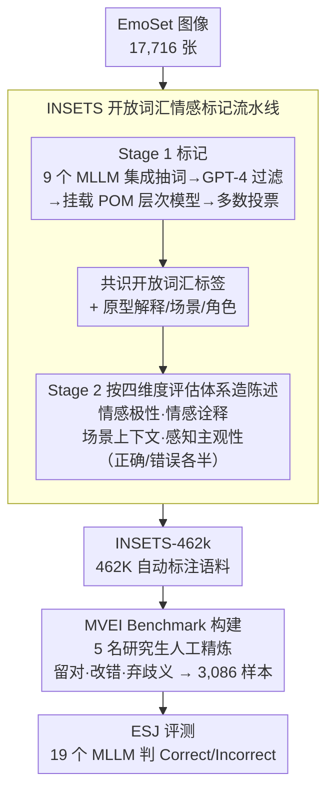

# Customizing Visual Emotion Evaluation for MLLMs: An Open-vocabulary, Multifaceted, and Scalable Approach

**会议**: ICLR 2026  
**arXiv**: [2509.21950](https://arxiv.org/abs/2509.21950)  
**代码**: [GitHub](https://github.com/wdqqdw/MVEI)  
**领域**: 多模态VLM  
**关键词**: Visual Emotion, MLLM Evaluation, Open-vocabulary, ESJ, MVEI Benchmark

## 一句话总结

提出情感陈述判断（ESJ）任务与 INSETS 自动标注流水线，将视觉情感评估从"开放式分类"重构为"陈述真伪判断"，构建了 MVEI benchmark（3,086 样本、424 种情感标签、四个认知维度），系统评估 19 个 MLLMs，发现即使 GPT-4o 也与人类（91.6%）存在 13.3% 的准确率差距。

## 研究背景与动机

**领域现状**：情感图像内容分析（AICA）是多模态理解的关键方向。随着 MLLMs 在通用视觉任务上不断突破，其视觉情感感知能力受到关注，但研究结论存在矛盾——有研究认为 MLLMs 情感识别能力有限，也有研究成功将其用作情感标注器进行数据增强。

**现有痛点**：作者系统分析了这种矛盾的来源，归因于传统评估方法与 MLLMs 之间的不兼容，具体体现在四个方面：（1）固定标签排除了其他合理答案——情感感知本质上具有主观性，同一图像可引发不同反应；（2）情感分类粒度太粗——主流 benchmark（FI、Artemis）仅有 8 种情感类别；（3）忽视上下文因素——只关注图像内在属性，忽略场景、观者身份等心理学证实的外部影响因素；（4）标注代价高昂——EMOTIC 数据集需要协调 23,788 名标注者进行众包。

**核心矛盾**：现有评估用开放式问题对 MLLMs 提问（如"这张图片的情感是什么？"），一方面答案空间开放导致评判标准模糊，另一方面分类体系封闭又无法覆盖细粒度情感差异，评估精度和评估覆盖面之间存在根本冲突。

**本文目标** （1）如何消除开放式情感评估的答案歧义？（2）如何在保持可扩展性的同时覆盖细粒度情感？（3）如何将场景上下文和主观性纳入评估维度？（4）如何以最小人工代价构建大规模评估数据？

**切入角度**：受认知心理学启发，将情感评估从"生成式回答"转为"判断式验证"——让模型判断图像与情感陈述是否匹配，同时设计四个互补维度覆盖从基本情感识别到主观性理解的完整能力谱。

**核心 idea**：用"判断情感陈述对错"替代"回答情感是什么"，从根本上消除开放式评估的歧义，同时通过自动化流水线实现开放词汇、多维度、大规模评估。

## 方法详解

### 整体框架

整个方案由两个核心组件构成：ESJ 任务定义了评估的"怎么测"，INSETS 流水线解决了"测什么"。Pipeline 为：首先 INSETS 从 EmoSet 的 17,716 张图像中自动提取开放词汇情感标签（通过 9 个 MLLMs 的集成投票），然后基于标签构建四个维度的情感陈述（正确/错误各半），自动生成 462K 条标注语料（INSETS-462k），最后经人工精炼得到 3,086 条高质量 MVEI benchmark 样本。评测时，MLLMs 接收图像+陈述对，仅需输出 "Correct" 或 "Incorrect"。

### 关键设计

**1. 四维度评估体系：把"认出情感"和"理解情感如何因人因境而异"分开测**

现有 benchmark 几乎只盯着图像本身（情感是什么、为什么），而心理学研究早就指出场景、观者身份这些外部因素同样左右情感感知。因此 ESJ 把评估拆成四个互补维度，每个维度都用"陈述真伪判断"的形式出题，但出题素材和造错陈述的方式各不相同。

**情感极性**（Sentiment Polarity）判断图像的情感基调是正面、负面还是混合：陈述的正确性根据该情感标签在 POM 中所属的谱系自动确定，配合三条预定义的极性陈述出题。**情感诠释**（Emotion Interpretation）把原型解释和情感状态组合起来，匹配为正确、不匹配为错误；造错陈述用两种干扰策略——图像间干扰（用视觉相似但情感不同的图像替换解释）和图像内干扰（同一张图里对立极性的标签互换）。**场景上下文**（Scene Context）把原型场景背景和情感结论组合，错误陈述通过极性翻转（在 POM 对立谱里随机采样）或同图对立极性场景交换来构建。**感知主观性**（Perception Subjectivity）把原型观者角色和它对候选情感的偏好倾向组合，错误陈述则通过反转偏好顺序构建。前两个维度对应图像内在属性，后两个对应外部因素，四者拼起来正好是一条从"能认出情感"到"理解情感如何随人随境变化"的完整能力谱。

**2. INSETS 开放词汇情感标记流水线：用多模型集成+心理学层次约束顶替众包标注**

单个 MLLM 标情感既有幻觉又有偏差，但众包又贵得离谱（EMOTIC 动用了 23,788 名标注者）。INSETS 的思路是让多个模型投票、再用心理学分类体系兜底，把标注成本压到约 115 人时却仍保住质量。它分两阶段跑。

Stage 1（标记）：9 个 MLLMs 各自对每张图像提取潜在情感词（平均每模型 8-13 个），汇总成情感池后由 GPT-4 过滤掉不合适的词，再把保留的词挂载到 Parrott 层次情感模型（6 个一级 / 25 个二级 / 113 个三级类别，构成扩展版 POM）。最后做一次基于 POM 的集成多数投票选共识标签——先在二级类别上分配配额，再在类内按出现频率排序取 top-k。Stage 2（构建）：为每个选定标签在它的来源 MLLM 上生成原型解释、场景、角色三种陈述，再按上面四个维度各自的规则组合出成对的正确/错误陈述。这套约束让标注同时拿到了可靠性（90.6% 准确率）和开放词汇的灵活性（共 751 种不同情感标签），从而自动产出 462K 条语料（INSETS-462k）。

**3. MVEI Benchmark 构建：自动语料再过一遍人工，换来黄金标准**

自动标注效率高但难免出错，直接拿 462K 条当 benchmark 风险太大，所以再补一道人工精炼。从 INSETS-462k 里采样 3,164 条，招募 5 名研究生按四维度任务指南逐条评估标注准确性，以 ≥4/5 共识判为正确、≤1/5 判为错误、落在中间的判为歧义。处理规则是保留正确的、修正错误的、丢弃歧义的，最终得到 3,086 条 MVEI 样本。这一步只花约 100 人时，远低于传统从零标注的代价，却把 benchmark 拉到了可信的黄金标准质量。

## 实验关键数据

### 主实验

| 模型 | 参数量 | 情感极性 | 情感诠释 | 场景上下文 | 感知主观性 | 总准确率 |
|------|--------|---------|---------|-----------|-----------|---------|
| GPT-4o | - | 72.5% | 84.3% | 81.6% | 69.2% | 78.3% |
| InternVL2.5 | 8.3B | 75.7% | 80.2% | 79.4% | 61.3% | 74.7% |
| mPLUG-Owl3 | 8.1B | 73.9% | 79.3% | 81.7% | 75.0% | 78.1% |
| Qwen2.5-VL | 8.3B | 63.2% | 81.5% | 83.9% | 66.3% | 75.9% |
| Qwen2-VL | 8.3B | 70.7% | 75.0% | 86.1% | 72.8% | 76.6% |
| LLaVa-1.6 | 7.6B | 66.4% | 69.7% | 55.3% | 49.7% | 60.2% |
| **人类平均** | - | **92.3%** | **90.1%** | **95.3%** | **89.6%** | **91.6%** |

### 消融实验（MLLM 适配策略对 Qwen2.5-VL 的提升）

| 适配策略 | 情感极性 | 情感诠释 | 场景上下文 | 感知主观性 | 总准确率 |
|---------|---------|---------|-----------|-----------|---------|
| 直接推理 | 63.2% | 81.5% | 83.9% | 66.3% | 75.9% |
| Chain-of-Thought | 67.4 (+4.2) | 81.5 (+0.0) | 84.6 (+0.7) | 67.0 (+0.7) | 76.6 (+0.8) |
| ICL 8-shot | 70.1 (+6.9) | 81.7 (+0.2) | 84.9 (+1.0) | 67.0 (+0.7) | 77.3 (+1.4) |
| LoRA 微调 | 78.6 (+15.4) | 84.7 (+3.2) | 86.3 (+2.4) | 70.3 (+4.0) | 80.7 (+4.8) |
| 全参数微调 | 84.3 (+21.1) | 84.8 (+3.3) | 87.0 (+3.1) | 71.1 (+4.8) | 81.9 (+6.0) |
| GRPO | 83.2 (+20.0) | 82.5 (+1.0) | 86.5 (+2.6) | 71.1 (+4.8) | 80.7 (+4.8) |

### 关键发现

- **情感极性是最大短板之一**：MLLMs 在判断正/负/混合方面表现差，但可通过微调大幅改善（全参数微调 +21.1%），说明问题在于类别边界混淆而非能力缺失
- **感知主观性是根本性挑战**：即使全参数微调也只提升 +4.8%，人类 89.6% vs 最好 MLLM 仅 75.0%，说明这与模型固有属性相关
- **INSETS 自动标注准确率达 90.6%**：正确陈述 89.7%、错误陈述 91.5%，验证了流水线的高可靠性
- **无单一模型全维度最优**：GPT-4o 整体最强但感知主观性不如 mPLUG-Owl3（69.2% vs 75.0%）

## 亮点与洞察

- **ESJ 任务设计精妙**：将主观开放问题转化为客观二分类判断，既保留了评估深度（四个维度）又消除了答案歧义。这种"陈述验证"思路可迁移到任何主观性强的评估任务（如美学、幽默、讽刺理解）
- **INSETS 的"低成本高质量"范式**：通过多 MLLM 集成 + 心理学分类模型约束，仅需约 115 人时就构建了 462K 标注语料，相比 EMOTIC 的 23,788 标注者效率提升数个数量级。这种"AI 初标注 + 人工精炼"的流水线模式具有广泛适用性
- **四个维度的发现具有指导意义**：揭示了"可通过适配改善的能力"（极性识别）与"需要根本性改进的能力"（主观性理解）之间的区别，为 MLLM 改进指明方向

## 局限与展望

- **数据分布偏斜**：正面情感图像占 65.2%，继承自 EmoSet 的社交媒体偏差，可能导致负面情感评估可靠性不足
- **评估颗粒度有限**：ESJ 仅判断对/错，无法评估 MLLMs 对情感强度的连续感知能力
- **自动角色生成的隐含偏差**：感知主观性维度中的观者角色可能隐含人口统计刻板印象
- **未覆盖动态情感**：仅评估静态单图，视频中情感的时序演变和多模态情感（配合文本/音频）未涉及

## 相关工作与启发

- **vs EmoSet/FI**：传统 benchmark 用固定 8 类做分类，本文用 751 种开放词汇做陈述判断，评估灵活性和粒度质变性提升
- **vs EmoBench-M/EEmo-Bench**：扩展了任务覆盖但仍用开放式问题，未从根本上解决答案歧义问题；本文 ESJ 从任务形式上消除歧义
- **vs FABA-Bench**：聚焦面部表情和动作，忽略了场景上下文和主观性等更深层维度

## 评分

- 新颖性: ⭐⭐⭐⭐ ESJ 任务设计和四维度评估体系有创新，但核心是评估方法论而非模型架构突破
- 实验充分度: ⭐⭐⭐⭐⭐ 评估了 19 个 MLLMs、5 种适配策略、25 名人类参与者，分析全面深入
- 写作质量: ⭐⭐⭐⭐ 逻辑清晰，心理学理论与技术方案结合自然，伦理讨论详尽
- 价值: ⭐⭐⭐⭐ 为视觉情感评估提供了新范式，MVEI benchmark 和 INSETS-462k 语料对后续研究有实用价值

<!-- RELATED:START -->

## 相关论文

- [\[AAAI 2026\] O3SLM: Open Weight, Open Data, and Open Vocabulary Sketch-Language Model](../../AAAI2026/multimodal_vlm/o3slm_open_weight_open_data_and_open_vocabulary_sketch-language_model.md)
- [\[CVPR 2026\] Vocabulary Scaling Law: Tuning Open-vocabulary Predictors for Their Openness](../../CVPR2026/multimodal_vlm/vocabulary_scaling_law_tuning_open-vocabulary_predictors_for_their_openness.md)
- [\[CVPR 2026\] Reconstructing CLIP for Open-Vocabulary Dense Perception](../../CVPR2026/multimodal_vlm/reconstructing_clip_for_open-vocabulary_dense_perception.md)
- [\[AAAI 2026\] Towards Scalable Web Accessibility Audit with MLLMs as Copilots](../../AAAI2026/multimodal_vlm/towards_scalable_web_accessibility_audit_with_mllms_as_copilots.md)
- [\[CVPR 2026\] Towards Open-Vocabulary Industrial Defect Understanding with a Large-Scale Multimodal Dataset](../../CVPR2026/multimodal_vlm/towards_open-vocabulary_industrial_defect_understanding_with_a_large-scale_multi.md)

<!-- RELATED:END -->
