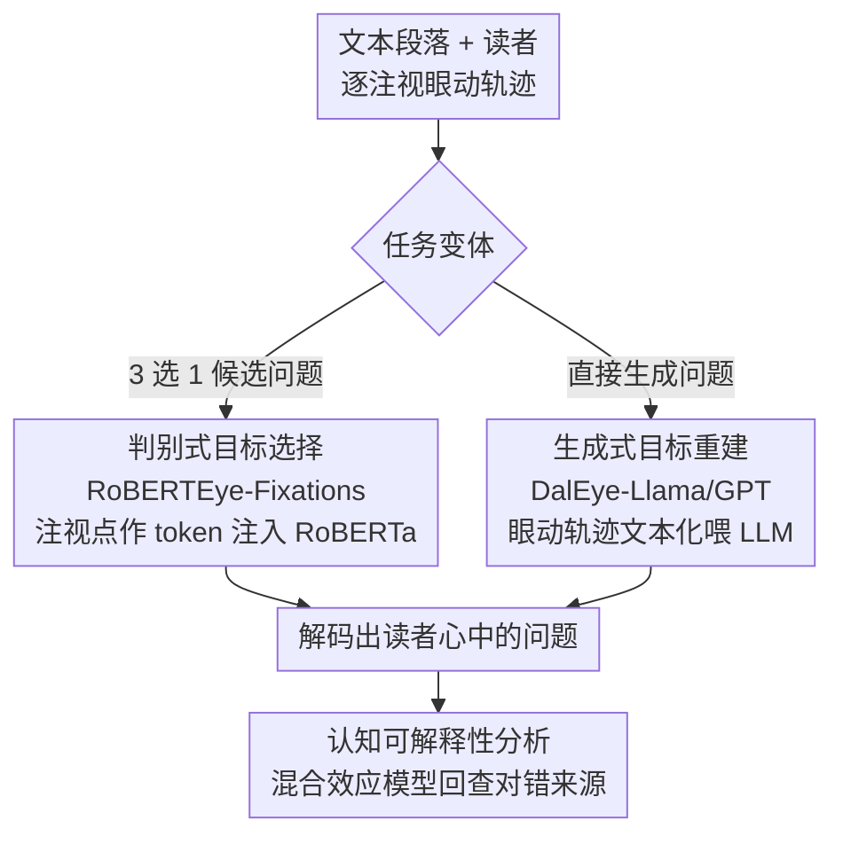

# Decoding Open-Ended Information Seeking Goals from Eye Movements in Reading

**会议**: ICLR2026  
**arXiv**: [2505.02872](https://arxiv.org/abs/2505.02872)  
**代码**: 待确认  
**领域**: 视频理解  
**关键词**: 眼动追踪, 阅读理解, 信息检索目标解码, 多模态LLM, 认知状态解码  

## 一句话总结
提出从阅读时眼动轨迹解码开放式信息检索目标的新任务，基于 OneStop 眼动数据集（360人、486问题、162段落），开发判别式和生成式多模态模型；RoBERTEye-Fixations 在三选一目标选择上达 49.3%（随机 33%），不同 critical span 达 70.9%；DalEye-Llama/GPT 在目标重建中也显著优于无眼动基线。

## 研究背景与动机

**领域现状**：眼动追踪是研究阅读认知的核心方法，但现有工作主要关注"为理解而读"的通用场景，忽略了日常生活中更普遍的信息检索式阅读。

**现有痛点**：已有的认知状态解码工作仅区分少数预定义阅读模式（如泛读 vs 精读），无法处理开放式、文本特定的信息检索目标。

**核心idea**：给定一段文本和读者的眼动数据，自动解码读者心中的具体问题——不依赖任何文本之外的先验，仅从注视时长、扫视序列等眼动特征中提取目标信号。

## 方法详解

### 整体框架
给定一段文本和读者逐注视点的眼动轨迹，目标是反推读者心里想找的那个问题。任务拆成两个变体：**目标选择**从 3 个候选问题里挑出读者真实的那个，**目标重建**直接生成问题文本。两者都建在 OneStop 信息检索数据集上——每段文本配 3 个问题，其中 2 个共享同一 critical span（答案所在文本区域）、1 个落在不同 span，这种 same-span / different-span 的配对天然形成了难度分层。选择变体由判别式模型 RoBERTEye 处理，重建变体由生成式 LLM（DalEye 系列）处理，两条路解码出问题后，再用混合效应模型回查解码为何成立。

### 关键设计

**1. 判别式目标选择：把逐注视眼动作为 token 注入 RoBERTa 联合编码**

对应框架里的选择变体。最朴素的做法是用注视时长加权 RoBERTa 词嵌入再和候选问题算余弦相似度（Reading-Time 加权嵌入相似度），但这种方式把眼动压成了一个静态权重向量，丢掉了注视的时序，表现几乎贴着随机线。本文的主模型 RoBERTEye-Fixations 改为把逐个注视点的眼动特征作为额外 token 注入 RoBERTa，让注意力机制同时处理文本 token 序列和注视序列，从而保留"先看哪、后看哪、停多久"的动态结构。训练用 10-fold 交叉验证，并按是否见过文本/读者拆出新文本、新读者两种泛化设定。正是注视顺序这条时序信息让模型能区分关注同一区域的两个问题——消融时移除词嵌入排序带来的性能损失最大。

**2. 生成式目标重建：把眼动轨迹文本化后喂给 LLM**

对应框架里的重建变体。重建问题文本无法靠相似度比对，于是把任务描述、原文、以及眼动轨迹（注视词的索引 + 注视时长 + 扫视方向）统一序列化成一段文本提示。在这套表示上微调 Llama 3.1 与 GPT-4o-mini 得到 DalEye-Llama / DalEye-GPT；同样的文本化眼动还可直接喂给 Gemini-3-Pro 做 zero-shot / few-shot 生成。这样设计的好处是无需为眼动单独造一个编码器，借 LLM 的语言先验把"读者扫视模式"翻译回"读者想问的问题"，相比只给文本不给眼动的基线显著更准。

**3. 认知可解释性分析：用混合效应模型反查解码为何成立**

模型不只是黑箱预测器，还被当作探针来验证认知假说。本文用线性混合效应模型回归 RoBERTEye 的对错与 11 个试验级特征的关系，得到一条清晰规律：critical span 内阅读时间越长、span 外时间越短，模型准确率越高（$p < 10^{-275}$）。换句话说读者越目标导向、注意力越聚焦，眼动里的目标信号就越强、越好解码——这也反过来解释了 same-span 场景为何最难。

## 实验关键数据

### 目标选择精度

| 模型 | All (3选1) | 不同Span (2选1) | 相同Span (2选1) |
|------|-----------|----------------|----------------|
| 随机基线 | 33.0% | 55.3% | 49.9% |
| Haller RNN | 41.8% | 65.6% | 52.1% |
| **RoBERTEye-Fixations** | **49.3%** | **70.9%** | **57.3%** |

### 目标重建对比

| 模型 | Question Word Acc | BERTScore | QA Acc |
|------|------------------|-----------|--------|
| Text-only Llama（无眼动） | 基线 | 基线 | 基线 |
| DalEye-Llama | 显著优于无眼动 | 显著优于无眼动 | 显著优于无眼动 |
| DalEye-GPT | 显著优于无眼动 | 显著优于无眼动 | 显著优于无眼动 |
| Gemini few-shot | 新读者条件下最佳 | 显著优于无眼动 | 新读者条件下最佳 |

### 关键发现
- 即使两个候选问题关注文本的同一区域（same span），RoBERTEye 仍能以 57.3% 准确率区分（$p < 0.001$），说明眼动包含超越"看哪里"的精细认知信息
- 眼动序列中注视顺序（fixation order）比单个注视特征更重要——消融分析显示移除词嵌入排序导致最大性能下降
- 生成任务中眼动信息在新文本泛化场景下仍有显著贡献

## 亮点与洞察
- **开创性任务定义**：首次将"开放式阅读目标解码"形式化为选择和重建两个任务，且设计了 same-span vs different-span 的精巧难度分层
- **认知-计算双向桥梁**：模型表现可用认知理论解释（目标导向的阅读行为 → 信息过滤 → 更强信号），反之模型也可作为分析工具验证认知假说
- 数据规模大（105万词级眼动数据），实验评估全面（新读者/新文本/新读者+文本三种泛化评估）

## 局限与展望
- 当前准确率（49.3%）距实际应用仍有差距，尤其在 same-span 场景（57.3%）仅略高于随机
- 仅在英语上实验，跨语言、跨人群（如L2读者、阅读障碍）的泛化性未知
- 生成模型在新文本场景下性能下降明显，可能需要更好的眼动编码方式

## 相关工作与启发
- 与传统任务式阅读研究（skimming、proofreading 等少数预定义模式）不同，本文处理的是上百种文本特定目标
- 可启发教育系统（实时检测学生阅读目标）、内容个性化（根据用户信息需求调整呈现方式）等应用

## 评分
- 新颖性: ⭐⭐⭐⭐⭐ 全新任务定义 + 精巧实验设计
- 实验充分度: ⭐⭐⭐⭐⭐ 多模型多基线多评估维度，认知可解释性分析深入
- 写作质量: ⭐⭐⭐⭐⭐ 问题动机清晰，从认知科学到NLP的叙事流畅
- 价值: ⭐⭐⭐⭐ 科学价值大，但实际应用需更高准确率

<!-- RELATED:START -->

## 相关论文

- [\[ECCV 2024\] Towards Open-ended Visual Quality Comparison](../../ECCV2024/multimodal_vlm/towards_open-ended_visual_quality_comparison.md)
- [\[NeurIPS 2025\] MIRAGE: A Benchmark for Multimodal Information-Seeking and Reasoning in Agriculture](../../NeurIPS2025/multimodal_vlm/mirage_a_benchmark_for_multimodal_information-seeking_and_reasoning_in_agricultu.md)
- [\[CVPR 2026\] GUIDE: A Benchmark for Understanding and Assisting Users in Open-Ended GUI Tasks](../../CVPR2026/multimodal_vlm/guide_a_benchmark_for_understanding_and_assisting_users_in_open-ended_gui_tasks.md)
- [\[AAAI 2026\] SToLa: Self-Adaptive Touch-Language Framework with Tactile Commonsense Reasoning in Open-Ended Scenarios](../../AAAI2026/multimodal_vlm/stola_self-adaptive_touch-language_framework_with_tactile_commonsense_reasoning_.md)
- [\[NeurIPS 2025\] Reading Recognition in the Wild](../../NeurIPS2025/multimodal_vlm/reading_recognition_in_the_wild.md)

<!-- RELATED:END -->
