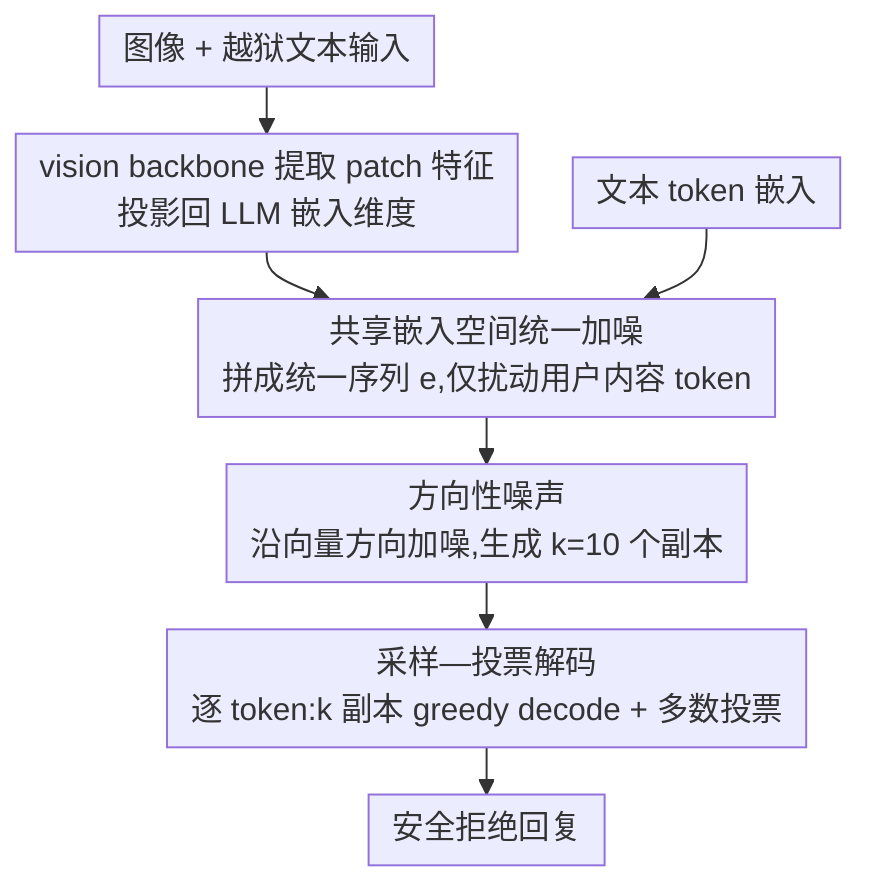

# Directional Embedding Smoothing for Robust Vision Language Models

**会议**: ICLR2026  
**arXiv**: [2603.15259](https://arxiv.org/abs/2603.15259)  
**代码**: 未开源  
**领域**: 多模态VLM  
**关键词**: VLM safety, jailbreak defense, randomized smoothing, embedding perturbation, directional noise

## 一句话总结
将 RESTA（Randomized Embedding Smoothing and Token Aggregation）防御方法从 LLM 扩展到 VLM，发现方向性嵌入噪声（directional noise）在安全-实用性权衡上显著优于各向同性噪声（isotropic noise），可作为推理时的轻量防御层抵御多模态越狱攻击。

## 背景与动机
- 视觉-语言模型（VLM）在 agentic AI 系统中的广泛部署使其安全性与可靠性成为关键问题
- 尽管经过 safety alignment 训练，VLM 仍然容易受到越狱攻击（jailbreaking attacks），攻击者通过精心构造的文本+图像输入绕过安全对齐
- 已有多种防御策略被提出，包括困惑度过滤、重复一致性检测、辅助 guard 模型、思维链安全推理等，但许多声称强效的防御后来被攻破
- RESTA 方法最初为 LLM 设计（Hase et al., 2024），受 randomized smoothing 启发，通过在嵌入空间注入噪声并多样本投票来增强鲁棒性
- 本文的动机是将 RESTA 自然地扩展到 VLM 场景，并系统评估不同噪声类型的效果

## 核心问题
1. RESTA 防御机制能否有效迁移到多模态 VLM 场景？
2. 嵌入噪声的方向性（directional vs. isotropic）对防御效果有多大影响？
3. 在安全性提升与实用性保持之间，能否找到合理的 tradeoff 工作点？

## 方法详解

### 整体框架

RESTA 把 randomized smoothing（随机平滑）的思路搬到嵌入空间：推理时对输入嵌入注入随机噪声、生成多个加噪副本，再逐 token 用多数投票合成最终输出，从而把越狱攻击所依赖的脆弱激活路径"抹平"。本文之所以能把原本面向 LLM 的 RESTA 无缝搬到 VLM，靠的是一个架构事实——LLaVA、Gemma 这类 VLM 的图像经 vision backbone 提取 patch 特征后会被投影回 LLM 的输入嵌入维度，和文本 token 落进同一个嵌入空间。于是防御层不必区分模态，只要在这条统一序列上加噪、采样、投票即可。本文的真正发现不在流程本身，而在"怎么加噪"：沿嵌入向量**方向**加噪（directional）比对每个维度独立加噪（isotropic）能在更小的实用性代价下换来更强的安全提升。

### 关键设计

**1. 共享嵌入空间上的统一加噪：让防御层对视觉和文本一视同仁**

多模态越狱往往是图像和文本协同作案，防御若只盯文本就会漏掉视觉这条路。RESTA 利用的关键事实是：VLM 的视觉内容先经 vision backbone 提取 patch-level 特征，再投影回 LLM 的输入嵌入维度，与文本 token 拼成一条统一的嵌入序列 $\bm{e} = (e_1, \ldots, e_n) \in \mathbb{R}^{d \times *}$。既然图像和文本最终都落在同一个 $d$ 维空间，防御层就不必为视觉另设接口——只要在这条统一序列上加噪，图文协同的攻击成分会被一并覆盖。加噪还做了选择性处理：只扰动用户内容对应的 token 嵌入，系统提示和对话格式模板的 token（用户无法控制的部分）保持不变，避免破坏模型对自身角色与输出格式的理解。

**2. 方向性噪声 vs. 各向同性噪声：沿向量方向加噪以保住语义**

这是本文最核心的发现，决定了上一步该往嵌入里注入"什么样的"噪声。各向同性（isotropic / normal）噪声对嵌入每个维度独立加高斯扰动 $\mathcal{N}(0, \sigma^2)$，会同时改变向量的方向和模长；而 hard directional 噪声只沿原向量方向扰动：

$$e + \frac{ze}{\|e\|_2}, \quad z \sim \mathcal{N}(0, \sigma^2 d)$$

归一化因子 $\sqrt{d}$ 用来让两种噪声的有效功率对齐、保证公平比较。关键假设是嵌入向量的语义主要编码在**方向**而非幅度上：方向性噪声本质只缩放模长、几乎不偏转方向，既能扰乱越狱攻击赖以生效的精细激活，又尽量保住原始语义内容；各向同性噪声一旦偏转方向就连带破坏语义，于是安全和实用性同时垮掉。这正是 directional 在安全-实用性权衡上明显胜过 isotropic 的根源，而且这一方向性效应在 VLM 上比 Hase et al. (2024) 在 LLM 上观察到的更显著。

**3. 采样—投票解码：用多数表决稀释被攻击样本的影响**

光有一个加噪副本不够稳，单次扰动可能恰好没躲开攻击。RESTA 因此用加噪算子 $H_\sigma$ 生成 $k$ 个独立副本 $\tilde{\bm{e}}^i = H_\sigma(\bm{e})$，自回归解码的每一步对这 $k$ 个副本分别做 greedy decoding 得到 $k$ 个候选 token $\tilde{y}^i = \arg\max_j f(\tilde{\bm{e}}^i)[j]$，再取众数 $y = \mathrm{mode}(\tilde{y}^1, \ldots, \tilde{y}^k)$ 作为该步输出，并把选定 token 嵌入后追加回每个副本继续下一步，直到 EOS。直觉是：越狱依赖激活某条很窄的脆弱路径，单个噪声副本就有不小概率偏离它而回到安全行为，逐 token 投票把多数副本的"安全倾向"放大成稳定输出，对正常请求则几乎不损语义。$k=1$ 且噪声为恒等映射时即退化为普通 greedy decoding；实验取 $k=10$。

### 一个完整示例

以一条"无害图像 + 越狱文本"的多模态攻击输入为例：图像经 vision backbone 投影、与文本拼成统一嵌入序列后，RESTA 只对用户内容 token 用 hard directional 噪声生成 $k=10$ 个加噪副本。解码第一步，10 个副本里多数因方向扰动偏离了攻击诱导的"开始照做"路径、转而输出拒绝性 token，少数仍被攻击带偏；多数投票选出拒绝方向的 token，再把它嵌入后追加回各副本。后续每一步重复采样—投票，逐步累积出一段连贯的安全拒绝回复。而若换成正常的 ScienceQA 选择题，由于方向几乎不变、语义被保留，10 个副本大多给出同一正确答案，投票后准确率仅小幅下降——这正对应实验里 ASR 减半而准确率仅降 2.65% 的工作点。

## 实验关键数据

### 实验设置
- **模型**：LLaVA-1.5-7B 和 Gemma-3-4B
- **样本数**：$k=10$ 个扰动嵌入样本
- **安全性评估**：JailBreakV-28K benchmark（28K 多模态越狱攻击，14 种攻击策略 × 2000 有害查询）
- **实用性评估**：ScienceQA benchmark（4241 道多模态选择题）
- **越狱判定**：Llama-Guard-3-8B 自动评估 ASR

### 核心结果

| 模型 | 噪声类型 | ASR (↓) | ScienceQA Acc (↑) | 说明 |
|------|----------|---------|-------------------|------|
| LLaVA-1.5-7B | 无防御 | 50.13% | 64.07% | baseline |
| LLaVA-1.5-7B | Hard directional | **25.93%** | 61.42% | ASR 减半，准确率仅降 2.65% |
| LLaVA-1.5-7B | Isotropic | 较差 | 较差 | tradeoff 接近 trivial 对角线 |
| Gemma-3-4B | Hard directional | 显著降低 | 适度保持 | 同样优于 isotropic |

### 关键发现
- **方向性噪声全面优于各向同性噪声**：directional noise 的 safety-utility tradeoff 曲线在两个模型上均显著优于 isotropic noise
- **各向同性噪声接近 trivial tradeoff**：isotropic noise 的效果接近甚至不如简单的"随机拒绝"策略（对角线基准）
- 方向性的重要性比此前 Hase et al. (2024) 在 LLM 上观察到的效果更为显著

## 亮点
1. **简洁有效的推理时防御**：无需重训练模型，仅在推理时加噪+投票，实现轻量级防御
2. **方向性噪声的关键洞察**：揭示了嵌入空间中方向信息对语义保持的重要性，为后续防御设计提供了有价值的指导原则
3. **从 LLM 到 VLM 的自然扩展**：利用 VLM 中文本/视觉 token 共享嵌入空间的特性，无缝迁移 RESTA
4. **大规模多样化评估**：在 28K 攻击样本和 14 种攻击策略上评估，结果具有说服力

## 局限与展望
1. **缺乏自适应攻击评估**：仅在静态 benchmark 上测试，未评估针对 RESTA 设计的自适应攻击（adaptive attacks），防御是否真正鲁棒尚不确定
2. **理论基础薄弱**：虽然受 randomized smoothing 启发，但越狱攻击与传统对抗样本有本质区别（不限于小扰动、输出空间复杂），缺乏严格的理论保证
3. **模型覆盖有限**：仅测试了两个相对较小的模型（7B 和 4B），对更大规模或商用 VLM 的效果未知
4. **推理成本**：$k=10$ 的多样本解码意味着每次推理的计算量约为原来的 10 倍
5. **仅评估 greedy decoding + majority vote**：未探索其他聚合策略（如 logit 平均）的效果

## 与相关工作的对比

| 方法 | 类型 | 适用范围 | 特点 |
|------|------|----------|------|
| **RESTA (本文)** | 推理时嵌入扰动 | VLM/LLM | 轻量级、无需训练、方向性噪声关键 |
| SmoothLLM (Robey et al., 2023) | 输入级字符扰动 | LLM | 在 token 级别随机替换/插入/删除 |
| Llama Guard (Inan et al., 2023) | 辅助 guard 模型 | LLM | 需要额外模型、输入输出过滤 |
| Perplexity filtering (Alon et al., 2023) | 攻击检测 | LLM | 检测异常输入但不修改模型行为 |
| Safety reasoning (Rashid et al., 2025) | 思维链推理 | LLM | 利用 CoT 进行安全推理 |
| Activation intervention (Zou et al., 2025) | 中间层干预 | VLM | 修改模型中间激活值 |

RESTA 的优势在于其实施简单性和不依赖额外模型，但相比其他方法缺乏理论保证和自适应攻击验证。

## 启发与关联
- **嵌入方向 vs. 幅度**：方向性噪声有效而各向同性噪声无效的发现，强化了"嵌入向量方向编码语义"的假说，对嵌入空间的理解和利用有指导意义
- **越狱的脆弱性假说**：文中推测越狱攻击可能依赖于激活某些"窄路径"的脆弱性，因此可被噪声扰动破坏。这一假说若能被理论化，将对理解 VLM 安全性有重要意义
- **多层防御思想**：作者强调 RESTA 至多是整体安全框架中的一层，这种务实态度值得借鉴
- **与 agentic AI 安全的关联**：随着 VLM 被集成到自主代理系统中，推理时防御的重要性将持续增长

## 评分
- 新颖性: ⭐⭐⭐⭐ (RESTA 到 VLM 的扩展较直接，但方向性噪声的发现有价值)
- 实验充分度: ⭐⭐⭐⭐ (大规模 benchmark 但缺乏自适应攻击和更多模型)
- 写作质量: ⭐⭐⭐⭐⭐ (论述清晰，对局限性的讨论坦诚且深入)
- 价值: ⭐⭐⭐⭐ (实用的推理时防御思路，方向性噪声的洞察对领域有贡献)

<!-- RELATED:START -->

## 相关论文

- [\[CVPR 2026\] Dynamic Token Reweighting for Robust Vision-Language Models](../../CVPR2026/multimodal_vlm/dynamic_token_reweighting_for_robust_vision-language_models.md)
- [\[CVPR 2026\] Ego: Embedding-Guided Personalization of Vision-Language Models](../../CVPR2026/multimodal_vlm/ego_embedding-guided_personalization_of_vision-language_models.md)
- [\[ICLR 2026\] PPE: Positional Preservation Embedding for Token Compression in Multimodal Large Language Models](ppe_positional_preservation_embedding_for_token_compression_in_multimodal_large_.md)
- [\[CVPR 2026\] MASQuant: Modality-Aware Smoothing Quantization for Multimodal Large Language Models](../../CVPR2026/multimodal_vlm/masquant_modality-aware_smoothing_quantization_for_multimodal_large_language_mod.md)
- [\[ICML 2026\] Circle-RoPE: Cone-like Decoupled Rotary Positional Embedding for Vision-Language Models](../../ICML2026/multimodal_vlm/circle-rope_cone-like_decoupled_rotary_positional_embedding_for_large_vision-lan.md)

<!-- RELATED:END -->
