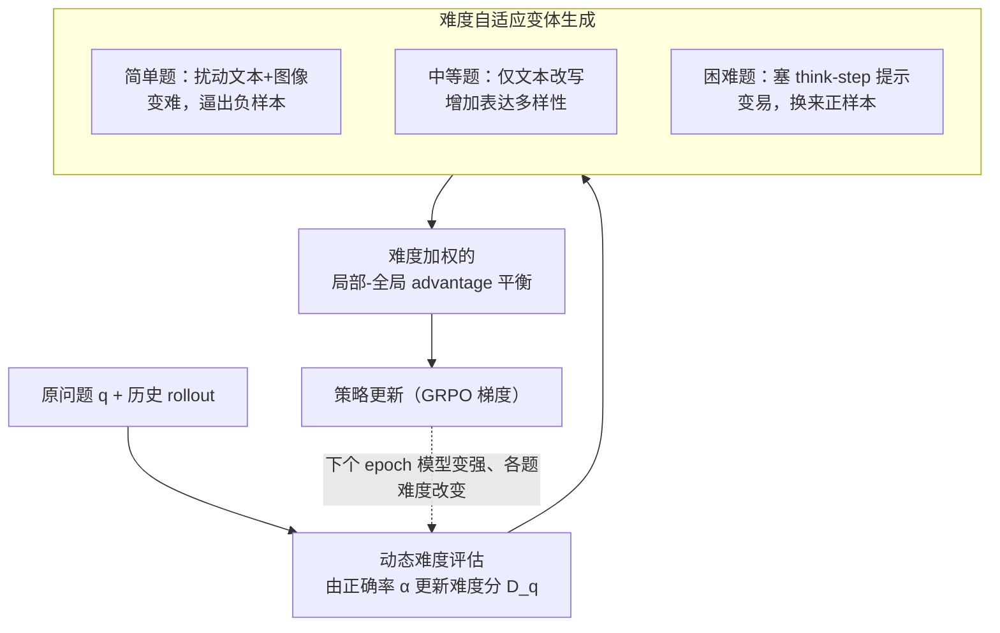

# DIVA-GRPO: Enhancing Multimodal Reasoning through Difficulty-Adaptive Variant Advantage

**会议**: ICLR 2026  
**arXiv**: [2603.01106](https://arxiv.org/abs/2603.01106)  
**代码**: [Siaaaaaa1/DIVA-GRPO](https://github.com/Siaaaaaa1/DIVA-GRPO)  
**领域**: 多模态VLM  
**关键词**: GRPO, 强化学习, 多模态推理, 难度自适应, advantage vanishing, 变体增强

## 一句话总结

提出 DIVA-GRPO，通过动态评估问题难度、自适应生成不同难度的语义一致变体、并结合难度加权的局部-全局 advantage 估计，解决 GRPO 训练中的 reward sparsity 和 advantage vanishing 问题，在 7B 规模模型上实现 SOTA 多模态推理性能。

## 研究背景与动机

**GRPO 在多模态推理中广泛应用**：GRPO 通过组内相对 advantage 估计实现无 critic 模型的长链推理训练，已成为增强 MLLM 推理能力的主流方法。

**Advantage vanishing 是核心瓶颈**：当问题对当前模型过于简单或过于困难时，组内所有回答全对或全错，导致 advantage 为零，优化信号消失，训练效率骤降。

**Reward sparsity 加剧问题**：在训练早期或面对困难问题时，只有极少数推理路径获得正奖励，正向反馈稀缺导致学习缓慢。

**现有方法各有局限**：(a) 样本增强扩展法（如添加 prompt、生成变体）未控制难度分布，可能加剧 advantage vanishing；(b) 选择性样本利用法丢弃部分数据，减少多样性；(c) 间接奖励设计法可能引入与最终目标不对齐的偏差。

**难度动态变化被忽视**：随着训练推进，模型能力增强，原本中等难度的问题变简单，advantage vanishing 持续恶化，但现有方法均未考虑难度的动态演变。

**核心洞察**：关键在于保证每个问题的组内奖励分布具有足够的方差，从而产生清晰的优化信号——这需要根据问题难度动态调整变体的难度分布。

## 方法详解

### 整体框架

DIVA-GRPO 要解决的是标准 GRPO 训练里的一个顽疾：当一道题对当前模型太简单或太困难时，组内回答全对或全错，相对 advantage 归零，优化信号消失（advantage vanishing），而且随着模型变强、原本中等的题逐渐变简单，这个问题会越训越重。它的破解思路是：与其被动接受零 advantage，不如主动构造一组难度可控、语义一致的变体，让每个问题的组内奖励始终保持足够方差。

为此它在标准 GRPO 外面套了一个随训练迭代的闭环：每个 epoch 先用该问题历史 rollout 的正确率给它打一个"相对于当前模型"的动态难度分；据此分三档生成变体——太简单的题加扰动变难、中等的只换表达、太难的塞推理提示变易；再把"原问题 + 变体"汇成扩展空间，做难度加权的局部-全局 advantage 估计去更新策略；更新后的模型在下个 epoch 又会改变各题难度，闭环继续。

### 关键设计

**1. 动态难度评估：让难度跟着模型能力走**

advantage vanishing 越训越重，根因在于把难度当成了问题的固有属性——可一道题对刚起步的模型是"难"，训到后期就成了"易"，组内全部答对、advantage 归零。DIVA-GRPO 为每个问题维护一个动态难度分 $D_q$（初始化 $D_q=5$，范围 1–9），每个 epoch 用该问题历史 rollout 的经验正确率 $\alpha$ 重新校准：

$$D^{\text{new}} = \text{clip}\big(D^{\text{old}} + \eta \cdot (0.5 - \alpha)\big), \quad \eta=4$$

正确率高于 50% 就调低难度、低于 50% 就调高，把难度分推向正确率约 50% 的水平——这恰好是组内正负样本最均衡、优化信号最强的点。这样难度分始终反映"相对于当前模型"的真实难易，后续的变体策略才不会脱靶。

**2. 难度自适应变体生成：把奖励方差"造"出来**

有了难度分，就能针对性补足组内缺失的那一类样本，保证既有正确回答也有错误回答。策略按难度分三档：简单题（$D_q < D_{\text{mid}}$）同时扰动文本和图像（旋转、加噪、模糊等）把题目变难，逼出负样本；中等题（$D_q \approx D_{\text{mid}}$）只做文本改写，难度不变但增加表达多样性；困难题（$D_q > D_{\text{mid}}$）则把部分推理步骤当提示（think-step）塞进 prompt 降低难度，换来正样本。所有变体都保持答案不变（语义一致），因此扩展后的组内奖励分布天然具备方差，从源头堵住了 advantage vanishing。实现上文本改写与推理提示由 GPT-o3 离线批量生成，图像扰动则在线施加。

**3. 难度加权的局部-全局 advantage 平衡：让难题上的正确答案更值钱**

扩展空间里有两种 advantage 视角——只看单个问题组内的"局部"视角，和把该问题所有变体合在一起看的"全局"视角，二者因样本量不同（全局组更大）量级差异很大。DIVA-GRPO 先对两者各做 batch 级 z-score 归一化消除量级差异得到 $\tilde{A}$，再叠一层难度加权：

$$\hat{A} = \exp\big(k \cdot (D_q^{(i)} - \bar{D}_q) \cdot \text{sgn}(\tilde{A})\big) \cdot \tilde{A}$$

直觉是对高于平均难度的变体放大其正确回答的 advantage、压低错误回答的影响，低于平均难度时反之——于是模型在难题上答对获得的收益更大，优化天然向难处倾斜，实现难度自适应的策略更新。

### 损失函数 / 训练策略

整体损失沿用标准 GRPO 策略梯度，只是把 advantage 换成上述难度加权、归一化后的 $\hat{A}$。额外引入一个即插即用的 **Reward-Range-Based Advantage Rescaling (RRB)**：$\hat{A}_{\text{range}} = \Delta r_q \cdot \tilde{A}$，其中 $\Delta r_q = (\max(\mathcal{R}_q) - \min(\mathcal{R}_q)) / R_{\max}$。它的作用是当组内奖励高度集中时，z-score 归一化会把本可忽略的微小差异错误放大，而 $\Delta r_q$ 用奖励的实际跨度去压缩这种伪信号，奖励越扁平缩放越狠。训练基座为 Qwen2.5-VL-7B-Instruct，AdamW 优化器，学习率 $10^{-6}$。

## 实验关键数据

### 表1：六个多模态数学推理基准上的主实验结果

| 模型 | MathVista | MathVerse | MathVision | OlympiadBench | WeMath | MMK12test | Avg. |
|---|---|---|---|---|---|---|---|
| GPT-4o | 63.8 | 50.2 | 30.4 | 35.0 | 68.8 | 49.9 | 49.68 |
| Qwen2.5-VL-7B (base) | 68.2 | 47.9 | 25.4 | 20.2 | 62.1 | 53.6 | 46.23 |
| Qwen2.5-VL-72B | 74.8 | 57.6 | 38.1 | 40.4 | 72.4 | 70.5 | 59.0 |
| R1-ShareVL-7B | 73.5 | 52.8 | 29.5 | 21.3 | 67.9 | 68.8 | 52.30 |
| MM-Eureka-7B | 71.7 | 50.3 | 26.9 | 20.1 | 66.1 | 64.5 | 49.93 |
| **DIVA-GRPO-7B (Ours)** | **74.2** | **57.6** | **32.1** | **23.1** | **69.3** | **70.2** | **54.58** |

- 7B 规模下六个基准均达 SOTA，平均 54.58 分
- 在 MathVista/MathVerse/WeMath 上已接近 72B 级别模型
- 相比基座 Qwen2.5-VL-7B 平均提升 **+8.35** 分

### 表2：消融实验结果

| 方法 | MathVista | MathVerse | MMK12test | Avg. |
|---|---|---|---|---|
| w/o Variant Generation | 70.0 | 53.7 | 61.1 | 61.6 |
| w/o Difficulty-Weighting | 69.9 | 55.7 | 66.5 | 64.0 |
| w/o RRB-Rescaling | 71.5 | 55.2 | 64.7 | 63.8 |
| w/o G-L Balance | 70.8 | 55.4 | 66.0 | 64.1 |
| **Full DIVA-GRPO** | **73.2** | **56.3** | **68.8** | **66.1** |

- 移除任一组件均导致性能下降，变体生成的影响最大（-4.5 avg）
- 训练效率方面：达到最优性能所需步数减少 **2.55×**，端到端加速 **1.76×**

## 亮点

- **问题定义精准**：从"如何保证组内奖励方差充足"的角度统一理解 advantage vanishing，提供了比现有三类方法更本质的解决思路
- **难度自适应闭环**：难度评估→变体生成→advantage 加权形成完整闭环，且难度随训练动态演化
- **理论支撑充分**：提供了梯度方差降低加速收敛的定理证明，以及正负样本比约 1:1 时优化信号最强的数学分析
- **训练效率显著提升**：2.55× 步数减少 + 1.76× 端到端加速，实用价值高
- **RRB-Rescaling 通用性强**：可独立于 DIVA-GRPO 应用到任何 GRPO 框架

## 局限与展望

- 变体的文本推理提示依赖 GPT-o3 离线生成，引入了对闭源模型的依赖和额外成本
- 在竞赛级数学任务（OlympiadBench 23.1 vs o1 的 68.0）上仍有很大差距，7B 模型容量限制明显
- 图像扰动方式（旋转、噪声等）相对简单，对需要精细视觉理解的场景可能不够
- 难度评估基于正确率，对于部分正确或推理过程正确但最终答案错误的情况缺乏区分

## 与相关工作的对比

- **vs GRPO/DAPO**：标准 GRPO 和 DAPO 未考虑难度自适应，在训练后期 advantage 信号衰减；DIVA-GRPO 通过变体生成维持奖励方差
- **vs GSPO**：GSPO 引入语义一致变体但未动态调整难度分布；DIVA-GRPO 根据模型当前能力动态匹配变体难度
- **vs Adora/MM-Eureka**：这些方法通过样本选择或间接奖励缓解问题，但分别存在数据浪费和优化方向偏差的风险
- **vs R1-ShareVL**：同为 7B 规模 SOTA 对手，DIVA-GRPO 在 MathVerse (+4.8) 和 MMK12test (+1.4) 上优势明显

## 评分

- 新颖性: ⭐⭐⭐⭐ — 难度自适应变体生成+三级策略+RRB rescaling 组合新颖
- 实验充分度: ⭐⭐⭐⭐ — 六个基准+详细消融+效率分析+理论证明，覆盖全面
- 写作质量: ⭐⭐⭐⭐ — 问题阐述清晰，方法动机层层递进
- 价值: ⭐⭐⭐⭐ — 解决 GRPO 训练的实际痛点，RRB 组件可即插即用

<!-- RELATED:START -->

## 相关论文

- [\[CVPR 2026\] Dr. Seg: Revisiting GRPO Training for Visual Large Language Models through Perception-Oriented Design](../../CVPR2026/multimodal_vlm/dr_seg_revisiting_grpo_training_for_visual_large_language_models_through_percept.md)
- [\[AAAI 2026\] Revisiting the Data Sampling in Multimodal Post-training from a Difficulty-Distinguish View](../../AAAI2026/multimodal_vlm/revisiting_the_data_sampling_in_multimodal_post-training_from_a_difficulty-disti.md)
- [\[ICLR 2026\] Enhancing Multi-Image Understanding through Delimiter Token Scaling](enhancing_multi-image_understanding_through_delimiter_token_scaling.md)
- [\[CVPR 2026\] Adversarial Style Optimization: Enhancing VLM Jailbreaks by GRPO-based Stylistic Triggers Optimization](../../CVPR2026/multimodal_vlm/adversarial_style_optimization_enhancing_vlm_jailbreaks_by_grpo-based_stylistic_.md)
- [\[ICLR 2026\] Shuffle-R1: Efficient RL Framework for Multimodal Large Language Models via Data-centric Dynamic Shuffle](shuffle-r1_efficient_rl_framework_for_multimodal_large_language_models_via_data-.md)

<!-- RELATED:END -->
