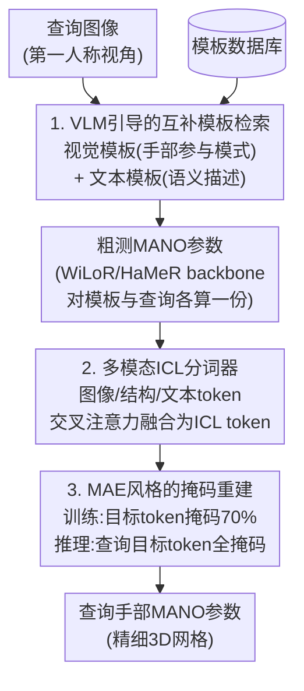

# EgoHandICL: Egocentric 3D Hand Reconstruction with In-Context Learning

**会议**: ICLR 2026  
**arXiv**: [2601.19850](https://arxiv.org/abs/2601.19850)  
**代码**: [有](https://github.com/Nicous20/EgoHandICL)  
**领域**: 多模态VLM  
**关键词**: 第一人称视角, 3D手部重建, 上下文学习, 视觉-语言模型, MANO

## 一句话总结

首次将上下文学习（ICL）范式引入3D手部重建，通过VLM引导的模板检索、多模态ICL分词器和MAE驱动的重建流程，在ARCTIC和EgoExo4D基准上显著超越SOTA方法。

## 研究背景与动机

第一人称视角下的3D手部重建面临三大核心困难：**深度模糊、自遮挡、复杂手-物交互**。现有方法通过扩大训练数据或引入辅助线索来应对，但在严重遮挡和陌生场景下仍表现不佳。

现有挑战：
- WiLoR、HaMeR等SOTA模型虽在通用场景下表现强劲，但在双手交叉遮挡、手融入背景等困难情况下容易**漏检手、混淆左右手、扭曲遮挡区域**
- WildHand等利用辅助监督信号需要额外标注，且仍无法解决严重遮挡

人类解决视觉歧义的方式是依靠先验经验和上下文推理——这与ICL的核心概念天然一致。ICL通过条件化少量相关示例来适应新问题，无需更新模型参数。本文首次将ICL范式引入3D手部重建。

## 方法详解

### 整体框架

EgoHandICL把手部重建重新表述为一个"看示例答题"的上下文推理过程：先用VLM为每张查询图像检索一张语义、视觉都对齐的模板图像，再用现成的重建 backbone（WiLoR/HaMeR）给模板和查询各自算出粗测 MANO 参数，把模板与查询的图像、结构、文本信息打包成统一的ICL token，最后用一个MAE风格的Transformer在掩码条件下解码出查询手部的MANO参数。三个组件——模板检索、ICL分词器、掩码重建——分别对应"找参照、拼上下文、推理作答"。

### 关键设计

**1. VLM引导的互补模板检索：用语义对齐对抗遮挡歧义**

困难场景下纯视觉检索容易被背景和遮挡误导，于是本文用两条互补策略从数据库里挑模板。一条是**预定义视觉模板**：用 Qwen2.5-VL-72B 把每张图像归类为"左手参与/右手参与/双手参与/无手参与"四种手部参与模式之一，只在同类型样本里检索，保证检索结果在手部构型上视觉一致。另一条是**自适应文本模板**：让 VLM 为图像生成语义描述，再按文本相似度检索；描述型提示刻画遮挡与交互细节，推理型提示则在严重遮挡时额外给出处理遮挡和复杂交互的指导。每个查询只取一张模板，两条策略一个管视觉一致、一个管语义对齐，互补地为后续推理提供可靠参照。

**2. 多模态ICL分词器：用统一MANO参数化弥合2D到3D的模态鸿沟**

模板和查询各自生成四组 token——模板输入 $T_{\text{tpl}}^{\text{in}}$、模板目标 $T_{\text{tpl}}^{\text{tar}}$、查询输入 $T_{\text{qry}}^{\text{in}}$、查询目标 $T_{\text{qry}}^{\text{tar}}$，其中"输入"来自2D观测、"目标"是3D手部参数。每组 token 融合三种模态：图像 token $F_i$ 由预训练 ViT（与 WiLoR 共享 backbone）提取外观与空间细节，结构 token $F_m$ 由 MANO 编码器把粗测或真值 MANO 参数编码为保留3D关节与形状先验的表示，文本 token $F_t$ 由 Qwen-7B 文本编码器嵌入 VLM 生成的语义描述，三者经交叉注意力融合成统一的 ICL token。关键之处在于输入和输出都用同一套 MANO 参数化表达，查询与模板之间结构对齐，从而把"2D图像输入"和"3D参数输出"放进同一个 token 空间，直接弥合了模态鸿沟。

**3. MAE风格的掩码重建：让训练条件模拟推理时目标缺失**

矛盾在于训练时模板和查询的真值都拿得到，但推理时查询目标恰恰是未知的。本文借鉴 MAE 的思路:训练时随机部分掩码模板和查询的目标 token（$T_{\text{tpl}}^{\text{tar}}$ 和 $T_{\text{qry}}^{\text{tar}}$），最优掩码率为70%；推理时则把查询目标 token 完全掩码，让 Transformer 仅从剩余的 ICL 上下文解码出查询的 MANO 参数。这样训练阶段就在模拟推理时的不完整监督，模型被迫学会从模板示例里推断缺失信息，而不是死记硬背。70% 这一较高掩码率与 MAE 的发现一致——遮得越多，模型越要依赖上下文线索，推理能力反而更强。

### 损失函数 / 训练策略

**参数级+顶点级+感知级三重监督**：

$$\mathcal{L} = \lambda_m \mathcal{L}_{mano} + \lambda_v \mathcal{L}_V + \lambda_{3D} \mathcal{L}_{3D}$$

- **MANO参数损失**：$\mathcal{L}_{mano} = \|\Theta - \Theta^{gt}\|_2^2 + \|\beta - \beta^{gt}\|_2^2 + \|\Phi - \Phi^{gt}\|_2^2$
- **顶点损失**：$\mathcal{L}_V = \|V_{3D} - V_{3D}^{gt}\|_1$
- **3D感知损失**（创新点）：$\mathcal{L}_{3D} = \|\phi(\mathcal{P}) - \phi(\mathcal{P}^{gt})\|_2^2$，使用Uni3D-ti作为3D特征编码器 $\phi$，在遮挡下强化语义一致性

对于缺少MANO真值的数据集（如EgoExo4D），使用3D关键关节约束替代。

损失权重：$\lambda_m = 0.05$, $\lambda_v = 5.0$, $\lambda_{3D} = 0.01$。单卡RTX 4090训练100 epoch。

## 实验关键数据

### 主实验

**ARCTIC数据集（手部网格重建，118.2K训练/16.9K测试）**：

| 方法 | P-MPJPE↓ | P-MPVPE↓ | F@5↑ | F@15↑ | 双手P-MPVPE↓ | MRRPE↓ |
|------|----------|----------|------|-------|-------------|--------|
| HaMeR | 9.9 | 9.6 | 0.046 | 0.911 | 9.9 | 10.1 |
| WiLoR | 5.5 | 5.5 | 0.524 | 0.994 | 5.7 | 9.8 |
| WildHand | 5.8 | 5.6 | 0.746 | 0.928 | 4.9 | 7.1 |
| **EgoHandICL** | **4.0** | **3.8** | **0.801** | **0.996** | **3.7** | **6.2** |

相比次优方法：通用设置 P-MPVPE 改善 **31.1%**，双手设置改善 **24.5%**，MRRPE 降低 **12%**。

**EgoExo4D数据集（关节估计，17.3K训练/4.1K测试）**：

| 方法 | MPJPE↓ | P-MPJPE↓ | F@10↑ | F@15↑ | 双手MRRPE↓ |
|------|--------|----------|-------|-------|------------|
| PCIE-EgoHandPose | 25.5 | 8.5 | 0.544 | 0.910 | 130.9 |
| WiLoR | 31.1 | 12.5 | 0.528 | 0.905 | 378.0 |
| **EgoHandICL** | **21.1** | **7.7** | **0.789** | **0.935** | **110.9** |

### 消融实验

**Backbone通用性**（ARCTIC数据集）：

| 配置 | P-MPVPE↓ | 相对backbone提升 |
|------|----------|-----------------|
| EgoHandICL + HaMeR | 8.1 | +10.4% |
| EgoHandICL + WildHand | 4.9 | +12.5% |
| EgoHandICL + WiLoR | 3.8 | **+30.9%** |

无论使用哪种粗测MANO backbone，ICL均带来一致的显著提升。

**掩码率影响**：70%掩码率最优（P-MPVPE=3.8, F@5=0.801）。与MAE的发现一致——更高掩码促使模型利用更强的上下文线索。

**损失函数消融**：

| 损失组合 | P-MPVPE↓ | F@5↑ |
|----------|----------|------|
| $\mathcal{L}_V$ 仅 | 4.7 | 0.6 |
| + $\mathcal{L}_{mano}$ | 4.3 | 0.6 |
| + $\mathcal{L}_{3D}$ | 3.9 | 0.7 |
| + $\mathcal{L}_{mano}$ + $\mathcal{L}_{3D}$ | **3.8** | **0.8** |

### 关键发现

1. ICL使EgoHandICL在遮挡和双手交叉场景下**大幅优于**直接回归方法
2. 上下文推理分析证实：模型确实在利用检索模板做推理而非简单模仿
3. Proposed-Full在所有手部参与类型上均最优，证明ICL的协同泛化优势
4. VLM推理型提示比描述型提示更有效，说明语义推理能力可增强检索质量
5. EgoHandICL可集成到EgoVLM中提升手-物交互推理能力（avg +3%）

## 亮点与洞察

1. **ICL迁移到3D视觉的首次成功尝试**：解决了2D图像到3D网格的模态鸿沟，通过MANO参数化统一输入输出
2. **VLM作为检索引擎**：利用大模型的语义理解能力选择上下文相关的模板，比纯视觉检索更鲁棒
3. **MAE+ICL的结合设计精巧**：训练时部分掩码模拟推理时的信息缺失，为视觉ICL提供了通用范式
4. **实用性强**：可作为插件增强现有手部重建方法（10-31%提升），且可提升EgoVLM的推理能力

## 局限与展望

1. 每个查询仅检索一个模板，多模板ICL是否能进一步提升有待验证
2. 需要VLM（72B参数）做检索预处理，数据预处理需4块A100，推理部署成本高
3. 仅在实验室（ARCTIC）和半受控（EgoExo4D）场景验证，在工业级复杂场景的鲁棒性有待检验
4. MANO模型本身的表达能力限制了对极端手势和变形的建模
5. 未探索视频序列中的时序ICL推理

## 相关工作与启发

- **HaMeR/WiLoR**：基于大规模ViT的图像到MANO回归，是本文的baseline backbone
- **视觉ICL（PIC/HiC）**：在点云识别和人体运动中探索ICL，但未处理2D→3D的模态鸿沟
- **MAE**：掩码自编码范式为ICL的训练-推理不对称提供了解决方案
- 启发点：ICL范式+VLM检索的组合可推广到其他存在遮挡/歧义的3D重建任务（人体姿态、物体重建等）

## 评分

- **新颖性**: ★★★★★ — 首次将ICL引入3D手部重建，问题定义和框架设计均有原创性
- **技术深度**: ★★★★☆ — 多模态分词器和MAE训练策略设计精巧
- **实验说服力**: ★★★★★ — 双数据集多指标验证，消融全面
- **实用价值**: ★★★★☆ — 有开源代码，可作为插件提升现有方法
- **表达清晰度**: ★★★★☆ — 图示清晰，框架组件逻辑明确

<!-- RELATED:START -->

## 相关论文

- [\[CVPR 2026\] EgoProx: Evaluating MLLMs on Egocentric 3D Proximity Reasoning Across a Cognitive Hierarchy](../../CVPR2026/multimodal_vlm/egoprox_evaluating_mllms_on_egocentric_3d_proximity_reasoning_across_a_cognitive.md)
- [\[ICLR 2026\] UniHM: Unified Dexterous Hand Manipulation with Vision Language Model](unihm_unified_dexterous_hand_manipulation_with_vision_language_model.md)
- [\[CVPR 2026\] VLM-3R: Vision-Language Models Augmented with Instruction-Aligned 3D Reconstruction](../../CVPR2026/multimodal_vlm/vlm-3r_vision-language_models_augmented_with_instruction-aligned_3d_reconstructi.md)
- [\[CVPR 2026\] HiFICL: High-Fidelity In-Context Learning for Multimodal Tasks](../../CVPR2026/multimodal_vlm/hificl_highfidelity_incontext_learning_for_multimo.md)
- [\[CVPR 2026\] Parallel In-context Learning for Large Vision Language Models](../../CVPR2026/multimodal_vlm/parallel_in-context_learning_for_large_vision_language_models.md)

<!-- RELATED:END -->
