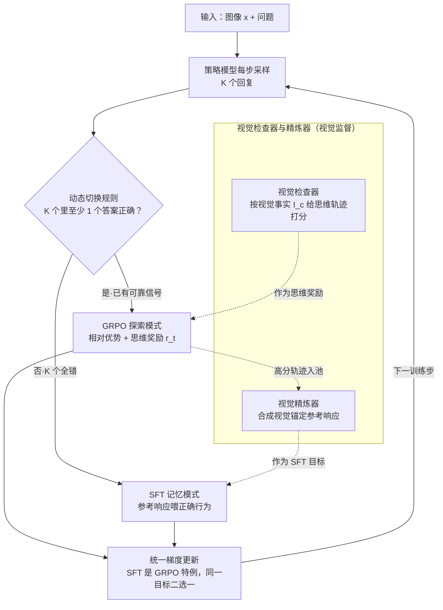

# Empowering Small VLMs to Think with Dynamic Memorization and Exploration

**会议**: ICLR 2026  
**arXiv**: [2506.23061](https://arxiv.org/abs/2506.23061)  
**代码**: [有](https://github.com/HKUST-LongGroup/DyME)  
**领域**: 多模态VLM  
**关键词**: 小规模视觉语言模型, 思维能力, 动态切换, SFT与RLVR融合, 视觉监督

## 一句话总结
提出 DyME（Dynamic Memorize-Explore），通过逐步动态切换 SFT 记忆模式与 GRPO 探索模式，首次赋予小规模视觉语言模型（<1B 参数）在特定任务上的思维推理能力。

## 研究背景与动机
- 大模型（如 Qwen2.5-VL-32B）可通过 SFT 或 RLVR 获得推理能力，但**小模型（SVLM，<1B）两种范式都失败**：
    - SFT 失败：CoT 数据冗长且含大量与视觉无关内容，SVLM 容量不足以吸收，导致"伪思维轨迹"
    - RLVR 失败：SVLM 指令遵循能力差，频繁生成无法验证的输出，引发"优势坍塌"（advantage collapse）
- 两阶段训练（SFT→RL）的静态平衡窗口极窄，SVLM 几乎不可能成功
- 实际需求：SVLM 适合边缘设备部署，赋予其思维能力有强烈实践意义

## 方法详解

### 整体框架
DyME 把 SFT 与 GRPO 从"先后两阶段"改成"逐步动态切换"：每个训练步先让策略模型对输入 $x$ 采样 $K$ 个回复，再依据这批回复的质量决定本步走"记忆"还是"探索"，两种模式的梯度被统一到同一目标里，因此切换不引入任何额外平衡项。在这条主干之上叠加一层视觉监督——用从图像中提取的视觉事实去检查探索轨迹的质量、并反过来精炼记忆模式的学习目标，让两种模式互相喂养而非各自为政，训练数据的质量在过程中自我改善。

### 关键设计

**1. 动态切换规则：用一个二值信号决定每步记忆还是探索**

SVLM 的根本困境是 SFT 与 RL 的有效窗口都很窄——全错时 GRPO 的优势值被噪声主导、训练崩溃，而盲目 SFT 又会把冗长 CoT 里的视觉无关内容硬塞进容量不足的小模型。DyME 的解法极简：对 $K$ 个采样回复做规则验证，只要**至少一个答案正确**就进入 GRPO 探索模式，让模型在已有正确性基础上用相对优势驱动改进；若 $K$ 个**全部错误**（含格式不合法），说明此刻没有可靠信号可供探索，就切到 SFT 记忆模式，直接用参考响应把正确行为"喂"进去。这个切换不含任何阈值、退火系数或预算超参，却恰好把每种范式用在它最稳的区间。

**2. SFT 与 GRPO 的梯度统一：让两种模式能无缝拼进同一目标**

二值切换之所以成立，是因为作者证明了两者在梯度层面本质同形：SFT 梯度是外部数据分布下的对数概率梯度，GRPO 梯度是内部采样分布下按优势值加权的对数概率梯度，而 SFT 恰好是 GRPO 在"样本来自真实参考、优势值恒为单位值"时的特例。因此完整目标可写成每步用指示函数在 GRPO 损失与 SFT 损失之间二选一，不引入任何额外平衡项，理论上等价于在同一梯度空间内连续游走。GRPO 这一侧还做了两处简化：引入对思维轨迹的辅助奖励 $r_t$（用 token 级 F1 与参考 CoT 比较），并**去掉** KL 惩罚和 clipping——因为动态切回 SFT 本身已隐式提供了稳定性，无需再靠裁剪兜底。

**3. 视觉检查器与精炼器：把"探索成功"沉淀成更好的"记忆目标"**

纯文本式的切换只看答案对错，容易让小模型学到漂浮、不锚定图像的伪推理。DyME 先用领域工具从图像中提取视觉事实 $I_c$（对象、属性、状态等细粒度组件，如医学用 BiomedGPT、图表用 DePlot）。**视觉检查器**沿两个维度给探索轨迹打分——是否包含足够多正确的视觉元素、是否贴合风格示例——这个分数直接作为 GRPO 的思维奖励，逼模型把推理建立在真实视觉证据上。高分轨迹会进入一个动态示例池，**视觉精炼器**再从池中采样，结合结构模板与 $I_c$ 合成出视觉锚定的参考响应，作为下一次 SFT 模式的学习目标。于是"探索成功 → 提升记忆目标 → 记忆又支撑更好的探索"形成正反馈，训练数据的质量在过程中自我改善。视觉事实的提取、检查、精炼统一由 Qwen2.5-14B 的结构化 prompt 完成，整套训练仅需几千条样本。

## 实验关键数据

### 主实验（跨三个领域）

| 模型 | 方法 | Medical | Chart | Geometry | Avg |
|------|------|---------|-------|----------|-----|
| SmolVLM (0.5B) | 基线 | 72.1 | 63.2 | 14.6 | 49.9 |
| SmolVLM | + SFT | 60.1 | 57.7 | 14.5 | 44.1 (↓) |
| SmolVLM | + GRPO | 61.1 | 53.8 | 17.1 | 44.0 (↓) |
| SmolVLM | + Two-stage | 59.4 | 60.1 | 16.7 | 45.4 (↓) |
| SmolVLM | **+ DyME** | **78.1** | **69.7** | **18.9** | **55.6 (+5.7)** |
| LLaVA-OV-S (0.5B) | 基线 | 74.9 | 61.4 | 15.9 | 50.7 |
| LLaVA-OV-S | **+ DyME** | **78.3** | **67.5** | **20.4** | **55.4 (+4.7)** |
| InternVL2-S (0.5B) | 基线 | 78.3 | 71.9 | 18.7 | 56.3 |
| InternVL2-S | **+ DyME** | **80.0** | **74.5** | **19.8** | **58.1 (+1.8)** |

DyME 训练的 SVLM 性能超过 7B 参数的 MoVA（54.2）。

| 切换策略对比（Medium 数据） | Acc | 额外代价 |
|--------------------------|-----|---------|
| Reward Thresholding (t=0.5) | 52.4 | 无 |
| SFT Annealing (Cosine) | 64.0 | +25% |
| SFT Budget (Hard Mining) | 59.6 | 依赖预算 |
| **Binary Switch (DyME)** | **64.9** | 基线 |

### 消融实验

| DyME 变体 | Medical | Chart | Geometry | Avg |
|-----------|---------|-------|----------|-----|
| DyME (完整) | 78.3 | 67.5 | 20.4 | 55.4 |
| 去除记忆模式 | 63.2 | 53.4 | 15.0 | 43.9 (↓20.6%) |
| 去除探索模式 | 75.5 | 61.3 | 14.5 | 50.4 (↓9.0%) |
| 去除视觉精炼器 | 75.6 | 62.3 | 16.8 | 51.6 (↓6.9%) |
| 去除视觉检查器 | 76.9 | 64.3 | 17.1 | 52.8 (↓4.7%) |

### 关键发现
1. 记忆模式是基石（去除后↓20.6%），探索模式是增益引擎（去除后↓9.0%）
2. 开源模型（Qwen2.5-14B）+Full DyME 可达到 GPT-4o 数据 + Pure DyME 的同等效果
3. DyME 跨模态通用：纯文本 Qwen2.5-0.5B 在 GSM8K 上 +5.8%；7B 模型上也可 +2.3%
4. 训练效率：Pure DyME 与标准 GRPO 速度相当（约 14s/step），Full DyME 约 1.6 倍开销
5. 外部辅助模型从 14B 换成 7B 性能损失微乎其微（67.5% vs 66.8%）

## 亮点与洞察
- **参数无关的切换规则**：不需要任何阈值/退火系数等超参数，二值切换本身就是最优策略
- SFT 和 GRPO 的**梯度兼容性证明**为统一损失函数提供了理论基础
- 视觉精炼器实现了"探索成功→提升记忆目标"的正反馈循环，数据质量在训练中自我改善
- 证明了"能力弱的模型需要更智能的训练范式"这一直觉
- 使用低质量（Undesigned）CoT 数据 + DyME 也能获得显著提升，降低了数据门槛

## 局限与展望
- 视觉监督依赖视觉事实 I_c 的可提取性，对涉及抽象语义（如 meme 讽刺）或非结构化感知的场景可能失效
- 仅在 ≤7B 模型上验证，更大规模模型是否需要 DyME 待研究
- 当前依赖外部 LLM（Qwen2.5-14B）做视觉精炼，完全闭环的自主改善更理想
- 三个领域的训练样本仅几千条，更大规模数据下的行为待观察

## 相关工作与启发
- 直接动机来自 DeepSeek-R1：纯 RL 可激励推理，但需要强底模能力
- 与 R1-V、LMM-R1 等视觉 RLVR 工作互补：它们聚焦大模型，DyME 聚焦小模型
- 两阶段训练（SFT→RL）的失败分析为理解 SVLM 能力边界提供了实证
- Multimodal-CoT 是早期尝试但数据规模受限；G-LLaVA、LLaVA-CoT 依赖大规模 CoT 数据

## 评分
- 新颖性: 5/5 （首次解决 SVLM 思维能力问题，动态切换设计优雅）
- 实验充分度: 5/5 （算法验证+系统验证双轨实验，三领域三模型，消融详尽）
- 写作质量: 5/5 （动机阐述清晰，SFT/GRPO 梯度统一分析精彩）
- 价值: 5/5 （实用性极强，对边缘端 SVLM 部署有直接推动）

<!-- RELATED:START -->

## 相关论文

- [\[ICLR 2026\] VTool-R1: VLMs Learn to Think with Images via Reinforcement Learning on Multimodal Tool Use](vtool-r1_vlms_learn_to_think_with_images_via_reinforcement_learning_on_multimoda.md)
- [\[CVPR 2026\] Downscaling Intelligence: Exploring Perception and Reasoning Bottlenecks in Small VLMs](../../CVPR2026/multimodal_vlm/downscaling_intelligence_exploring_perception_and_reasoning_bottlenecks_in_small.md)
- [\[CVPR 2026\] Dynamic Logits Adjustment and Exploration for Test-Time Adaptation in Vision Language Models](../../CVPR2026/multimodal_vlm/dynamic_logits_adjustment_and_exploration_for_test-time_adaptation_in_vision_lan.md)
- [\[ICLR 2026\] Small Drafts, Big Verdict: Information-Intensive Visual Reasoning via Speculation](small_drafts_big_verdict_information-intensive_visual_reasoning_via_speculation.md)
- [\[ICML 2026\] What You Think is What You See: Driving Exploration in VLM Agents via Visual-Linguistic Curiosity (GLANCE)](../../ICML2026/multimodal_vlm/what_you_think_is_what_you_see_driving_exploration_in_vlm_agents_via_visual-ling.md)

<!-- RELATED:END -->
