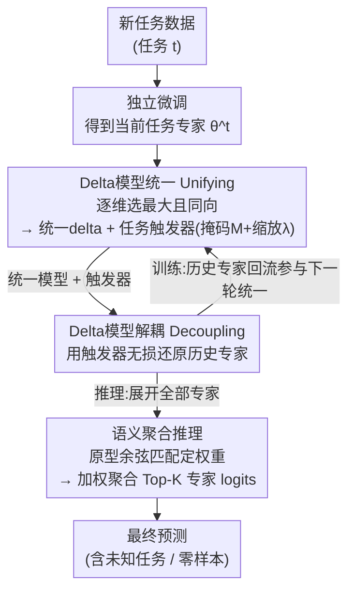

# Enhanced Continual Learning of Vision-Language Models with Model Fusion

**会议**: ICLR 2026  
**arXiv**: [2503.10705](https://arxiv.org/abs/2503.10705)  
**代码**: [GitHub](https://github.com/zhangzicong518/ConDU)  
**领域**: 多模态VLM  
**关键词**: 持续学习, 模型融合, 灾难性遗忘, CLIP, 零样本能力保持

## 一句话总结
提出Continual Decoupling-Unifying（ConDU）框架，首次将模型融合引入VLM持续学习，通过维护统一模型并结合任务触发器进行解耦-统一迭代操作，在MTIL基准上平均性能超SOTA 2%，同时增强了零样本能力。

## 研究背景与动机
VLM（如CLIP）通过整合视觉和文本模态实现了出色的零样本能力。然而在多个下游任务上顺序微调时，VLM同样面临灾难性遗忘问题。现有VLM持续学习方法存在明显局限：

**蒸馏方法**（如ZSCL、Dual-RAIL）需要额外参考数据集进行知识蒸馏，性能对数据集选择敏感，且需要精心调节多个超参数来平衡遗忘缓解、零样本保持和当前任务优化

**参数高效微调方法**（如DPeCLIP、MulKI）仅适用于adapter或LoRA场景，无法处理全参数微调

**核心insight**: 如果允许为每个任务维护独立微调模型，已知任务ID时直接选用对应模型即可。关键思路是：将这些独立模型的共享部分提取并融合为一个统一VLM，任务特异性差异存储在有限内存中，从而用"一个主VLM+少量辅助内存"模拟多个专用模型的行为。模型融合（model fusion）天然适合这一场景——无需访问原始训练数据即可合并多个模型。

## 方法详解

### 整体框架
ConDU的核心想法是用"一个统一模型 + 少量辅助内存"来模拟为每个任务单独保留一个专家模型的效果。它贯穿持续学习维护三样东西：一个统一模型、一组任务触发器（task trigger）、一组类别原型（prototype）。训练时每当新任务到来，先独立微调出当前任务的专家，再用"统一"操作把当前专家与历史专家压成一个新的统一模型并顺带产出该批任务触发器，下一轮开始时又用"解耦"操作借触发器把统一模型无损还原回所有历史专家，参与新一轮统一——解耦与统一都是无训练的参数运算，整套额外开销仅约微调时间的1%。推理时再做一次解耦展开全部专家，靠类别原型的语义匹配挑出最该信任的几位专家加权聚合，于是即便任务ID未知或纯零样本也能预测。

### 关键设计

**1. Delta模型统一（Unifying）：把多个专家压回一个统一模型而不互相抵消**

直接平均多个微调模型会让各任务的权重互相抵消、丢掉关键能力，因此ConDU不在原始权重上操作，而是先把每个专家相对预训练模型的"增量"抽出来，定义delta模型 $\delta^t = \theta^t - \theta^0$。统一时逐参数维度做一个"选最大且方向一致"的选举式决策：先看所有delta在该维度上的总和符号，若 $\sum_i \delta^i_j > 0$ 就取 $\max_i(\delta^i_j)$，否则取 $\min_i(\delta^i_j)$，这样既保留了跨任务幅度最大的那份知识，又避免了正负相消。统一的同时，为每个任务记下两个轻量触发器：二值掩码 $M^i_j$ 标记该任务的delta在每个位置是否与统一delta同号，缩放标量 $\lambda^i$ 用来补偿统一后整体幅度的变化，二者就是日后重建该专家所需的全部"差异信息"。

**2. Delta模型解耦（Decoupling）：从统一模型无损还原任意历史专家**

有了触发器，任何历史任务专家都能在不保存完整模型的前提下重建出来：用该任务的缩放标量和掩码在统一delta上做一次筛选与缩放，$\tilde{\delta}^i = \lambda^i \cdot M^i \odot \delta^{1:t}$，再叠回预训练权重得到专家 $\tilde{\theta}^i = \theta^0 + \tilde{\delta}^i$。这一步既用在训练阶段（取回历史专家一起参与下一轮统一，保证旧知识不被新任务覆盖），也用在推理阶段（按需展开出对应专家），由于只是掩码与标量乘法，几乎不耗时——这正是只存"统一模型 + 触发器"就能模拟一堆独立专家的关键。

**3. 语义聚合推理：任务ID未知或零样本时也能选对专家**

测试时若任务ID未知甚至是纯零样本场景，ConDU先解耦出全部任务专家，再用一套原型匹配机制决定该信任谁。它用未微调的预训练VLM提取测试图像特征，与各任务各类别的原型算余弦相似度，每个任务取自身最高的那一档相似度作为该专家的可信权重，挑出权重最高的K个专家、把它们的输出logits加权聚合作为最终预测。这里原型不是单纯的图像中心，而是把类别文本特征也并进来：$P^i_k = f(y, \theta^0) + \frac{1}{|\mathcal{D}^t_k|}\sum_m f(x_m, \theta^0)$，让相似度匹配同时利用视觉和语义信号，从而在未知任务和零样本上都能稳健路由。

### 损失函数 / 训练策略
训练阶段只做标准微调（全参数或LoRA均可），不引入任何蒸馏损失、不依赖外部参考数据集；解耦与统一全程无需训练。整个流程唯一的超参数是推理时聚合的专家数K，消融实验显示性能对K的取值非常不敏感。

## 实验关键数据

### 主实验

**MTIL基准（11个跨域任务）:**

| 方法 | Transfer↑ | Average↑ | Last↑ |
|------|-----------|----------|-------|
| Zero-shot | 65.3 | 65.3 | 65.3 |
| ZSCL | 68.1 | 75.4 | 83.6 |
| Dual-RAIL | 69.4 | 77.8 | 86.8 |
| DPeCLIP | 69.1 | 77.5 | 86.9 |
| MulKI | 70.1 | 77.3 | - |
| **ConDU (LoRA)** | **70.3** | **78.3** | **86.2** |
| **ConDU (FT)** | **70.8** | **78.8** | **87.1** |

**Task-Agnostic MTIL（无任务ID）:**

| 方法 | Average↑ | Last↑ |
|------|----------|-------|
| 最佳基线 | 76.1 | 84.6 |
| **ConDU (LoRA)** | **78.0** | **85.1** |
| **ConDU (FT)** | **78.1** | **86.4** |

### 消融实验
- ConDU在全参数微调和LoRA两种场景下均有效，是唯一同时支持两种范式的方法
- Few-shot MTIL（每类5样本）：Transfer 70.0%/70.3%(FT/LoRA)超最佳基线1.4%，Average 72.3%/72.7%超1.3%，Last 76.6%/77.4%超1.3%
- 推理时聚合权重的专家数K对性能非常不敏感（详见附录F）
- 解耦-统一操作的时间开销仅为微调时间的约1%
- 多个专家并行前向传播的推理时间接近单模型推理
- 统一操作中"选最大绝对值+一致方向"策略优于简单平均等基线融合策略

**Few-shot MTIL对比:**

| 方法 | Transfer↑ | Average↑ | Last↑ |
|------|-----------|----------|-------|
| 最佳基线 | 68.6 | 71.4 | 76.1 |
| ConDU (FT) | 70.0 | 72.3 | 76.6 |
| ConDU (LoRA) | 70.3 | 72.7 | 77.4 |

### 关键发现
- Transfer指标超预训练VLM 5.5%，说明持续学习过程反而增强了零样本能力
- 全参数微调版本（ConDU FT）通常优于LoRA版本，说明全参数微调在持续学习中仍有优势
- 模型融合中的"选最大绝对值+一致方向"策略在保留多任务知识方面效果显著

## 亮点与洞察
- 首次将模型融合引入VLM持续学习，开辟了一个新的研究方向
- 框架设计优雅：解耦-统一操作完全无需训练，任务触发器（掩码+缩放标量）存储开销极低
- 同时兼容全参数微调和参数高效微调，灵活性远超现有方法
- 零样本能力不仅不退化反而增强，这在持续学习中非常难得

## 局限与展望
- 任务触发器中的二值掩码与统一delta模型同维度，任务数增加时存储可能成为瓶颈
- 统一操作中"选最大绝对值"的策略是否最优有待更多理论分析
- 实验仅在CLIP架构上验证，更多VLM架构（如BLIP、LLaVA）的适用性待探索
- 语义聚合推理需要前向传播多个任务专家，任务数极多时推理成本增加

## 相关工作与启发
- **与Task Arithmetic的关系**: ConDU的统一操作受TIES Merging启发，但针对持续学习场景设计了解耦机制
- **与ZSCL/Dual-RAIL对比**: 这些方法需要参考数据集和蒸馏，ConDU完全不需要
- **启发**: 模型融合视角为持续学习提供了新的思路——不再是"如何防止遗忘"，而是"如何高效存储和重建多个专家"

## 评分
- 新颖性: ⭐⭐⭐⭐⭐ 首次将模型融合引入VLM持续学习，框架设计新颖
- 实验充分度: ⭐⭐⭐⭐ MTIL基准覆盖三种设定，但仅在CLIP上验证
- 写作质量: ⭐⭐⭐⭐ 框架图清晰，方法描述规范，数学符号统一
- 价值: ⭐⭐⭐⭐⭐ 开辟新方向，框架通用性强，无需额外数据和蒸馏设计，实用价值高

<!-- RELATED:START -->

## 相关论文

- [\[CVPR 2026\] Enhancing Continual Learning of Vision-Language Models via Dynamic Prefix Weighting](../../CVPR2026/multimodal_vlm/enhancing_continual_learning_of_vision-language_models_via_dynamic_prefix_weight.md)
- [\[CVPR 2026\] Continual Learning with Vision-Language Models via Semantic-Geometry Preservation](../../CVPR2026/multimodal_vlm/continual_learning_with_vision-language_models_via_semantic-geometry_preservatio.md)
- [\[AAAI 2026\] ReCAD: Reinforcement Learning Enhanced Parametric CAD Model Generation with Vision-Language Models](../../AAAI2026/multimodal_vlm/recad_reinforcement_learning_enhanced_parametric_cad_model_generation_with_visio.md)
- [\[AAAI 2026\] Branch, or Layer? Zeroth-Order Optimization for Continual Learning of Vision-Language Models](../../AAAI2026/multimodal_vlm/branch_or_layer_zeroth-order_optimization_for_continual_lear.md)
- [\[ICLR 2026\] KeepLoRA: Continual Learning with Residual Gradient Adaptation](keeplora_continual_learning_with_residual_gradient_adaptation.md)

<!-- RELATED:END -->
