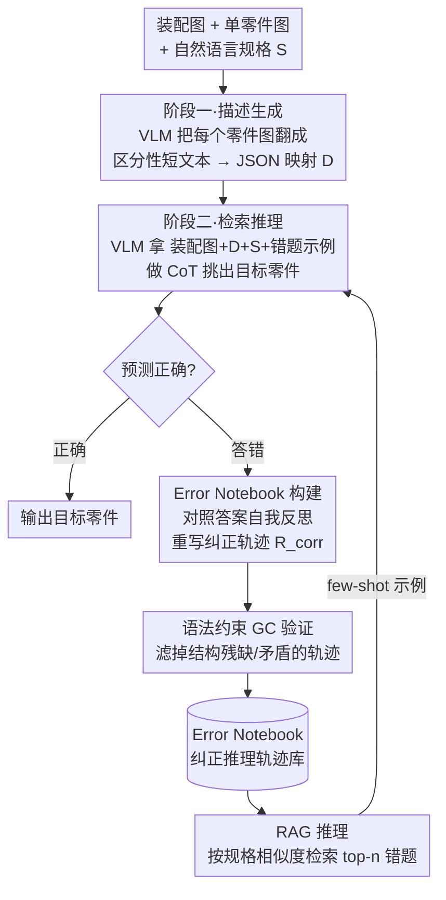

# Error Notebook-Guided, Training-Free Part Retrieval in 3D CAD Assemblies via Vision-Language Models

**会议**: ICLR 2026  
**arXiv**: [2509.01350](https://arxiv.org/abs/2509.01350)  
**代码**: 无  
**领域**: 多模态VLM  
**关键词**: CAD零件检索, 推理时适应, Error Notebook, RAG, 无训练VLM推理

## 一句话总结
提出一种无训练的两阶段VLM框架，通过Error Notebook记录纠正后的推理轨迹并结合RAG进行推理时适应，在3D CAD装配体的规格驱动零件检索任务上，GPT-4o准确率从41.7%提升至65.1%（+23.4%），并通过语法约束验证器进一步提升4.5%。

## 研究背景与动机
在复杂CAD装配体中进行规格驱动的零件检索是自动化工程任务的核心需求。然而直接用LLM/VLM处理这一任务面临关键挑战：

**序列长度爆炸**: CAD模型元数据（如STEP文件）通常超出模型token限制

**非自然语言输入**: CAD元数据是结构化技术数据，而非自然语言

**无法微调**: GPT/Gemini等高性能模型通常不提供微调接口

**细粒度推理困难**: 即使将STEP数据转为图像，现成模型仍频繁误识零件，因为任务需要对零件关系和属性进行精细推理

**核心idea**: 从训练方法中汲取灵感——错误推理链配对纠正方案可以教模型反思和修正自身错误——但将这一思路操作化到推理阶段：构建Error Notebook存储纠正后的推理轨迹，通过RAG检索相似案例作为few-shot示例引导模型推理，无需任何权重更新。

## 方法详解

### 整体框架
整个系统是一条无需任何权重更新的两阶段VLM管线：先让一个VLM把每个零件的图像翻译成一句区分性文字描述，再让第二个VLM拿着装配图、这组描述和自然语言规格做CoT推理，挑出目标零件。两阶段之外的核心是一本Error Notebook——它把模型过去答错又被纠正的推理轨迹存起来（入库前还要过一道语法约束验证、滤掉结构残缺的轨迹），推理时按规格相似度检索相关条目当few-shot示例喂回去，让模型"借鉴自己的错题"再答一遍。整条链路因此带一个回环：答错的样本被反思、纠正、验证后沉淀进错题本，再通过检索反哺下一次推理。

### 关键设计

**1. 两阶段VLM策略：绕开STEP文件过长无法塞进上下文的问题**

CAD装配体的原始STEP元数据动辄超出token上限，且是结构化技术数据而非自然语言，直接喂给VLM既装不下又读不懂。本文不碰原始数据，而是把任务拆成两步。第一阶段对每个零件 $P_i$ 输入整体装配图 $\mathcal{I}_{assembly}$ 和单零件图 $\mathcal{I}_{P_i}$，生成一句简洁的区分性描述 $d_i = f_{desc}(\mathcal{I}_{assembly}, \mathcal{I}_{P_i}, prompt_{desc})$，所有描述组织成一个JSON映射 $\mathcal{D}$。第二阶段拿着装配图、描述映射 $\mathcal{D}$ 和规格 $S$ 做检索推理 $\hat{\mathcal{P}}^* = f_{retr}(\mathcal{I}_{assembly}, \mathcal{D}, S, prompt_{retr})$。这样长而生硬的几何元数据被压缩成可读的短文本，VLM处理的始终是它擅长的图文输入。

**2. Error Notebook构建：把训练阶段的"错误反思+纠正"搬到推理阶段**

对初次推理就答错的样本，本文不丢弃错误，而是让VLM对照标准答案自我反思、重写一条正确的推理链。给定之前的错误推理 $R^{prev}$ 和正确零件 $\mathcal{P}^{*(gt)}$，模型生成纠正后的轨迹 $R^{corr}$，它由三段拼接而成：到第一个出错点为止保留的正确步骤、一段标记并转换错误的反思文本（TR）、以及从纠正点续写到正确答案的推理步骤，形式化为 $R^{corr} = R^{prev}_{sub} \oplus TR \oplus R^g$。这种"在出错处转弯而非推倒重来"的写法，保留了原始推理的上下文又显式暴露了错误模式，比单纯给出标准答案更能教模型反思。

**3. 语法约束（GC）验证器：过滤掉结构上不合格的纠正轨迹，保证错题本质量**

自我纠正难免产出格式残缺或自相矛盾的轨迹，若混进Error Notebook会污染后续检索。为此引入一个确定性验证器，检查纠正轨迹的结构完整性：最终回答行是否存在、是否至少给出一个文件名、所有预测文件名是否都落在允许集合内。它分两档：严格模式（sGC）要求显式的"Final Answer:"标记，宽松模式（rGC）容忍缺标记但只要推理结论正确即可放行。实验显示严格模式对小模型偏苛刻——常因漏写标记而把本来正确的轨迹误删，因此宽松模式是适配轻量模型的关键。

**4. RAG推理：用规格相似度检索错题，做推理时的few-shot适应**

有了Error Notebook，推理时不再让模型"裸答"。系统计算当前查询规格与本子中各条目规格的相似度，取top-n最相似的条目作为few-shot示例，把它们的纠正CoT轨迹拼进提示，引导模型沿着相似情境下被验证过的推理方式作答；检索时排除查询自身以避免数据泄漏。这一步是整套方法增益的直接来源，把"知识增强"的传统RAG升级为"推理增强"。

### 损失函数 / 训练策略
全程无任何训练或微调，VLM均以API方式调用，遇错按指数退避重试（最多3次），所有装配体并行处理。数据集基于Fusion 360 Gallery 的 Assembly Dataset（archive a1.0.0_00，752个装配体）构建：先用GPT-4o为每个零件生成区分性名词短语描述，再用GPT-4o生成刻画零件间物理/空间/功能关系的装配规格，最后人工剔除描述过于雷同的零件、整体与部件难以区分的装配以及存在歧义的案例，产出带人类偏好标注的多模态CAD数据集。

## 实验关键数据

### 主实验

**各模型在人类偏好数据集上的表现:**

| 模型 | 无E-Notebook | 有E-Notebook | 有E-Notebook+sGC |
|------|-------------|-------------|-----------------|
| GPT-4o (Omni) | 41.7% | 65.1% (+23.4) | 66.8% (+25.1) |
| GPT-4o mini | 19.3% | 35.4% (+16.1) | 36.4% (+17.1) |
| Gemini 2.5 Pro | 54.0% | 59.5% (+5.5) | 62.1% (+8.1) |
| Gemini 2.0 Flash | 44.2% | 56.8% (+12.6) | 57.0% (+12.8) |

**与其他无训练基线对比（GPT-4o, 人类偏好数据集）:**

| 方法 | Overall↑ | <10零件 | 10-20零件 |
|------|----------|---------|-----------|
| Standard few-shot | 37.7% | 42.9% | 29.4% |
| Self-consistency | 54.8% | 61.7% | 42.6% |
| **E-Notebook (Ours)** | **65.1%** | **75.5%** | **42.6%** |

### 消融实验
- **Exemplar数量**: 1到50个示例对最终准确率影响很小（~3%波动），说明关键因素是Error Notebook本身而非示例数量
- **CoT vs Non-CoT**: 对简单装配体（<10零件），无CoT的直接答案反而更好；对复杂装配体（10-50零件），CoT推理一致性地优于无CoT
- **开源模型验证**: Qwen2-VL-2B从0.8%提升到6.4%（+5.6%），跨模型设置（用GPT-4o构建Error Notebook）下进一步到8.4%（+7.6%）
- **跨模型GC设置**: 2B模型配GPT-4o的Error Notebook后，在人类偏好数据集<10件组中仅落后GPT-4o mini约4个点

### 关键发现
- Error Notebook的增益在所有模型和零件数量分组中一致存在，包括挑战性极高的>50零件组
- GC验证器的严格模式对小模型可能过于苛刻（因缺少Final Answer标记被误过滤），需要宽松模式适配
- Error Notebook可作为高质量推理痕迹从强力模型向轻量模型的"蒸馏"机制，无需任何微调
- RAG检索的exemplar数量对最终准确率影响很小（1到50个之间仅~3%波动），关键因素是Error Notebook本身的存在
- Error Notebook引入的额外推理延迟几乎可忽略（8.04s vs 6.50s），纠正步骤也很轻量（7.39s/样本）
- Cloud Vision + Gemini 2.0 Flash组合（62.3%）效果优于纯Gemini 2.0 Flash（57.0%）

## 亮点与洞察
- 将训练阶段的"错误反思+纠正"思想迁移到推理阶段，概念新颖且实用
- 两阶段VLM策略巧妙解决了CAD数据过长的问题，将结构化技术数据转为可处理的自然语言描述
- 跨模型Error Notebook展示了一种新型的无训练知识转移范式

## 局限与展望
- Error Notebook质量依赖于初始推理和纠正的模型能力，弱模型可能生成低质量纠正
- 当前仅在零件检索任务上验证，框架在更多工程任务（如设计验证、装配规划）上的适用性待探索
- 数据集规模（752个装配体）相对有限，更大规模的验证有价值
- 两阶段VLM增加了API调用成本，特别是第1阶段需为每个零件单独调用

## 相关工作与启发
- **与Self-Consistency的关系**: Self-Consistency通过多次采样+投票提升准确率，Error Notebook通过高质量纠正示例引导推理，后者更有效
- **与RAG的关系**: 传统RAG检索文档知识，Error Notebook检索纠正推理轨迹——从"知识增强"到"推理增强"
- **启发**: Error Notebook范式可推广到任何需要复杂推理的VLM应用场景

## 评分
- 新颖性: ⭐⭐⭐⭐ Error Notebook+推理时适应的组合新颖，但各组件（CoT纠正、RAG、GC）均有先驱
- 实验充分度: ⭐⭐⭐⭐ 覆盖多个商业和开源模型、详细消融，但数据集单一
- 写作质量: ⭐⭐⭐⭐ 框架描述清晰，形式化规范，但论文整体略冗长
- 价值: ⭐⭐⭐⭐ 工程实用性强，跨模型蒸馏思路有启发性，但应用场景较窄

<!-- RELATED:START -->

## 相关论文

- [\[ICCV 2025\] Training-Free Personalization via Retrieval and Reasoning on Fingerprints](../../ICCV2025/multimodal_vlm/training-free_personalization_via_retrieval_and_reasoning_on_fingerprints.md)
- [\[CVPR 2026\] Uncertainty-guided Compositional Alignment with Part-to-Whole Semantic Representativeness in Hyperbolic Vision-Language Models](../../CVPR2026/multimodal_vlm/uncertainty-guided_compositional_alignment_with_part-to-whole_semantic_represent.md)
- [\[ICCV 2025\] Exploiting Vision Language Model for Training-Free 3D Point Cloud OOD Detection](../../ICCV2025/multimodal_vlm/exploiting_vision_language_model_for_training-free_3d_point_cloud_ood_detection_.md)
- [\[CVPR 2026\] LLMind: Bio-inspired Training-free Adaptive Visual Representations for Vision-Language Models](../../CVPR2026/multimodal_vlm/llmind_bio-inspired_training-free_adaptive_visual_representations_for_vision-lan.md)
- [\[AAAI 2026\] ReCAD: Reinforcement Learning Enhanced Parametric CAD Model Generation with Vision-Language Models](../../AAAI2026/multimodal_vlm/recad_reinforcement_learning_enhanced_parametric_cad_model_generation_with_visio.md)

<!-- RELATED:END -->
