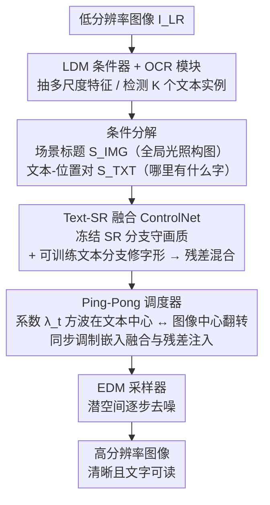

# GLYPH-SR: Can We Achieve Both High-Quality Image Super-Resolution and High-Fidelity Text Recovery via VLM-Guided Latent Diffusion Model?

**会议**: ICLR 2026  
**arXiv**: [2510.26339](https://arxiv.org/abs/2510.26339)  
**代码**: 有（论文提到release）  
**领域**: 扩散模型  
**关键词**: 图像超分辨率, 场景文本恢复, ControlNet, 扩散模型, OCR

## 一句话总结
提出GLYPH-SR，一个视觉-语言引导的扩散框架，通过双分支Text-SR融合ControlNet和ping-pong调度器同时优化图像质量和文本可读性，在SVT ×8上将OCR F1提升15.18个百分点。

## 研究背景与动机
图像超分辨率(SR)是许多视觉系统的基础技术，但现有SR方法存在两个系统性偏差：(1) 指标偏差——PSNR/SSIM等全局指标对小文本区域（通常不到图像1%）的贡献极小，字符损坏几乎不受惩罚；(2) 目标偏差——常用训练损失将文字视为普通高频纹理而非OCR所需的离散语义单元。这导致两种失败模式：幻觉（生成清晰但错误的字符）和保守恢复（保持模糊不改善）。核心问题是如何同时实现视觉真实感和文本可读性——两个目标之间存在明显tension。

## 方法详解

### 整体框架
GLYPH-SR要解决的是「图像超分时把文字越修越糊、甚至改错字」这件事。它以一个预训练的潜在扩散模型（Juggernaut-XL）为底座，输入低分辨率图像，输出既清晰又文字可读的高分辨率结果。关键在于不让模型把文字当普通纹理处理：先用 OCR 把图里的文字内容和位置抠出来，转成语义提示，再通过一个外挂的 Text-SR 融合 ControlNet（TS-ControlNet）把这份「文字级引导」注入扩散过程；去噪时再用一个 ping-pong 调度器在「专注修字」和「专注修图」两种模式间来回切换，让两个目标互不拖累。

### 关键设计

**1. 条件分解（Condition Decomposition）：把引导信号拆成图像导向和文本导向两路**

问题出在引导信号太笼统——如果只给模型一句整体描述，小文本区域（往往不到全图 1%）会被当成普通高频纹理一带而过，字符自然修不准。GLYPH-SR 把条件显式拆成两路：一路是场景级标题 $\mathcal{S}_{\text{IMG}}$，概括光照、构图等全局属性；另一路由 OCR 模块检测出 $K$ 个文本实例，返回位置-文本对 $\{(\mathcal{S}_{\text{text}}^k, \mathcal{S}_{\text{pos}}^k)\}_{k=1}^K$，再转成结构化的自然语言提示（如「HSBC 显示在图像中心」）。这样模型拿到的不再是一句模糊的全局描述，而是明确知道「哪里有什么字」。

**2. Text-SR 融合 ControlNet（TS-ControlNet）：用双分支在不牺牲画质的前提下注入字形引导**

光把文字引导和图像引导分开还不够——如果直接拿文字引导去改，文字是清楚了，非文字区域却会被带坏。TS-ControlNet 用双分支架构化解这个矛盾：SR 分支保持冻结，负责守住整体图像质量的生成先验；文本分支可训练，专门负责字形恢复。两路的输出做残差混合后注入主干：

$$c = \frac{1}{2} s_{\text{ctrl}} \left[ \mathcal{C}_{\text{SR}}(z_t; \phi_{\text{img}}(\mathcal{S}_{\text{IMG}}+P)) + \mathcal{C}_{\text{TXT}}(z_t; \phi_{\text{txt}}(\mathcal{S}_{\text{TXT}}+P)) \right]$$

冻结的 SR 分支等于给非文字区域上了保险，可训练的文本分支只在字形上发力，二者相加既补上了字形线索，又不破坏原本的画质。

**3. Ping-Pong 调度器：沿去噪轨迹在修字和修图之间来回切换**

把两路引导按固定比例一直混着用，效果并不好——两个目标在同一步里互相牵制。GLYPH-SR 引入一个时间依赖系数 $\lambda_t$，同时调制嵌入融合和残差注入，并且不让它连续渐变，而是走二值方波：$\lambda_t=0$ 时是文本中心模式（注入精确字形线索），$\lambda_t=1$ 时是图像中心模式（稳定全局结构），切换周期 $\tau=1$，即每一步翻一次：

$$\lambda_t = \begin{cases} 0, & \left\lfloor \frac{t-t_0}{\tau} \right\rfloor \bmod 2 = 0 \\ 1, & \text{否则} \end{cases}$$

这种「乒乓」式硬切换比连续渐变更有效：文字和图像各自在自己那一拍里被充分优化，避免了渐变模式下两个目标被平均掉、谁都没修好的情况。

### 损失函数 / 训练策略
训练用标准的 $\varepsilon$-预测目标：$\mathcal{L}_{\text{text}} = \mathbb{E}_{z_0, t, \varepsilon} \| \varepsilon - \mathcal{D}_\theta(z_t, t, c) \|_2^2$。数据上构建了一份 4 分区合成语料，对字形质量和全局图像质量做独立扰动，从而能针对性地训练文本恢复能力。整个训练只微调文本分支，LDM 骨干和 SR 分支全程冻结。

## 实验关键数据

### 主实验（SVT ×4 OCR F1）

| 方法 | OpenOCR | GOT-OCR | LLaVA-NeXT | MANIQA | CLIP-IQA |
|------|---------|---------|------------|--------|----------|
| DiffBIR | 38.73 | 42.33 | 45.19 | 47.82 | 58.66 |
| InvSR | 57.79 | 60.96 | 65.00 | 46.78 | 57.30 |
| PiSA-SR | 63.30 | 65.23 | 67.75 | 37.41 | 44.30 |
| **GLYPH-SR** | **67.54** | **71.72** | **73.22** | **47.75** | **59.40** |

### 消融实验（核心组件贡献）

| 配置 | OCR F1 | MANIQA | 说明 |
|------|--------|--------|------|
| 仅分离条件 | 提升文字 | 下降 | 非文字区域退化 |
| +TS-ControlNet | 进一步提升 | 保持 | 双分支平衡 |
| +Ping-Pong | 最优 | 竞争力 | 方波优于连续渐变 |

### 关键发现
- SVT ×8上OCR F1比扩散/GAN基线提升最高15.18个百分点
- 在三个数据集(SVT/SCUT-CTW1500/CUTE80)×两个尺度(4×/8×)全面验证
- 在保持竞争力的MANIQA/CLIP-IQA/MUSIQ同时大幅提升OCR指标

## 亮点与洞察
- 将场景文本SR显式建模为双目标优化问题，首次标准化双轴评估协议
- 4分区合成数据设计巧妙：通过正交扰动字形和图像质量解耦学习
- Ping-pong调度器简单有效，比复杂的连续噪声级调度更优

## 局限与展望
- 依赖OCR模块提取文本位置，OCR模块本身可能在低分辨率下失败
- 合成训练数据可能不完全代表实际退化
- 仅验证了4×和8×，更高倍率的效果未知

## 相关工作与启发
- **vs StableSR/DiffBIR**: 这些方法优化感知质量但对字符完整性不敏感
- **vs TATT等文本SR**: 文本SR方法在全场景中表现不佳，因为假设简化场景

## 评分
- 新颖性: ⭐⭐⭐⭐ 双目标SR框架和ping-pong调度器设计新颖
- 实验充分度: ⭐⭐⭐⭐ 三个数据集两个尺度全面比较
- 写作质量: ⭐⭐⭐⭐ 问题定义清晰，动机充分
- 价值: ⭐⭐⭐⭐ 对场景文本SR有实际应用价值

<!-- RELATED:START -->

## 相关论文

- [\[CVPR 2026\] VLM-Guided Group Preference Alignment for Diffusion-based Human Mesh Recovery](../../CVPR2026/multimodal_vlm/vlm-guided_group_preference_alignment_for_diffusion-based_human_mesh_recovery.md)
- [\[CVPR 2026\] Efficient and High-Fidelity Omni Modality Retrieval](../../CVPR2026/multimodal_vlm/efficient_and_high-fidelity_omni_modality_retrieval.md)
- [\[CVPR 2026\] HiFICL: High-Fidelity In-Context Learning for Multimodal Tasks](../../CVPR2026/multimodal_vlm/hificl_highfidelity_incontext_learning_for_multimo.md)
- [\[ICML 2026\] CVSearch: Empowering Multimodal LLMs with Cognitive Visual Search for High-Resolution Image Perception](../../ICML2026/multimodal_vlm/cvsearch_empowering_multimodal_llms_with_cognitive_visual_search_for_high-resolu.md)
- [\[NeurIPS 2025\] SpatialTraceGen: High-Fidelity Traces for Efficient VLM Spatial Reasoning Distillation](../../NeurIPS2025/multimodal_vlm/spatialtracegen_high-fidelity_traces_for_efficient_vlm_spatial_reasoning_distill.md)

<!-- RELATED:END -->
