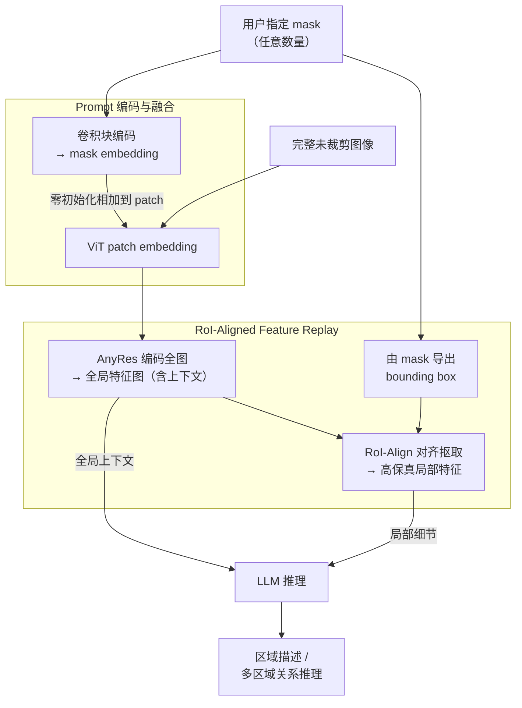

# Grasp Any Region: Towards Precise, Contextual Pixel Understanding for Multimodal LLMs

**会议**: ICLR2026  
**arXiv**: [2510.18876](https://arxiv.org/abs/2510.18876)  
**代码**: [GitHub](https://github.com/Haochen-Wang409/Grasp-Any-Region)  
**领域**: 多模态VLM  
**关键词**: Region-Level MLLM, RoI-Aligned Feature Replay, Multi-Prompt Reasoning, Visual Grounding  

## 一句话总结
提出 GAR（Grasp Any Region），通过 RoI-aligned feature replay 在保持全局上下文的同时提取高保真局部特征，实现精准的单区域描述、多区域交互建模和复合推理，1B 模型即超越 InternVL3-78B。

## 背景与动机
多模态大语言模型（MLLM）在全局图像理解上表现出色，但在密集场景下对细粒度区域的理解能力不足。Region-level MLLM 是一个有前景的方向，但现有方法存在根本性的 trade-off：

- **局部特征池化方法**（如 GPT4RoI、GLaMM）：将区域特征压缩为单一向量，丢失细节
- **裁剪式方法**（如 DAM）：仅处理裁剪区域，丧失全局上下文 —— 例如将青蛙形状的拖鞋误识别为真青蛙，因为缺少卧室场景的上下文
- **单 prompt 范式**（如 DAM、PAM）：将每个区域孤立处理，无法建模多区域间的关系

核心矛盾在于：如何同时保留全局场景上下文和细粒度局部细节。

## 核心问题
1. 如何在区域级理解中保持全局上下文感知，避免孤立分析导致的误判？
2. 如何支持任意数量 visual prompt 之间的交互建模？
3. 如何从被动描述升级为主动对话式推理（包括位置推理、非实体识别、关系推理等）？

## 方法详解

### 整体框架
GAR 想解决的核心矛盾是：既要细粒度地看清某个区域，又不能丢掉它所处的全局场景。它沿用标准 MLLM 的 ViT + LLM 骨架，只在视觉侧加了两个新组件。第一步，把用户指定的 mask 编码成 prompt、以不破坏原图表示的方式注入 ViT；第二步，在**完整未裁剪图像**编码出的全局特征图上，用 RoI-Align 把目标区域的高保真特征"回放"出来。这样送进 LLM 的既有整图上下文、又有放大后的局部细节——区别于裁剪式方法只看局部、池化式方法只剩一个粗向量。要让这套架构真正学会"先认得细、再讲清多区域关系"，作者另配了一套两轮迭代的数据引擎来喂训练语料。整条前向链路是：图像 + mask prompt → AnyRes 编码全局特征图 →（一路作全局上下文、一路按 mask 取 RoI 局部特征）→ 全局与局部特征一起喂给 LLM 推理。

### 关键设计

**1. Prompt 编码与融合：让模型知道"要看哪儿"又不破坏原图**

用户给的是 binary mask，怎么把它告诉一个已经预训练好的视觉骨架，而不打乱原有表示，是第一道坎。GAR 先用一个轻量卷积块把 mask 变成 mask embedding，再以**零初始化**的方式加到 ViT 的 patch embedding 上。零初始化保证训练初期这一路输出为零、完全不扰动预训练视觉特征，随训练逐步学到 prompt 的影响。又因为 prompt 是逐 patch 叠加的，天然支持同时输入**任意数量**的 mask——这正是后面多区域关系建模的前提。

**2. RoI-Aligned Feature Replay：在全局特征图上取局部，鱼和熊掌兼得**

这是论文最核心的技术贡献，正面解决"全局上下文 vs 局部细节"二选一的痛点。它分三步：先把完整未裁剪图像（连同编码后的 mask prompt）通过 AnyRes 编码，得到一张携带全局上下文的特征图；再根据输入 mask 导出对应的 bounding box；最后用 RoI-Align（来自 Mask R-CNN）从这张全局特征图里把目标区域的特征"对齐抠出"。关键在于：抠出来的局部特征源自整图特征图，所以**天生带着上下文**，又是高分辨率的局部表示，等于"放大细节却没丢掉全景"。这正是裁剪式方法做不到的——例如一只青蛙形状的拖鞋，裁剪后只剩拖鞋本体会被误判成真青蛙，而 GAR 保留了卧室场景，能借上下文纠正。最终全局上下文特征与局部细节特征一并送入 LLM 推理。

**3. 两轮数据引擎：从"认得细"到"讲清关系"**

架构再好，没有合适语料也喂不出区域级细粒度理解与多区域关系推理这两种能力，于是作者设计了一套 captioning-judging 交替的两轮数据引擎。**Round 1（增强识别）** 以 DAM 的 Describe Anything-1.5M 为底，补进 ImageNet-21K 的极细粒度分类子集：先用 seed captioner 生成描述、再让 LLM 对照真值类别验证，筛出 456K 细粒度描述样本，由此训练出一个 fine-grained captioner。**Round 2（支持多 Prompt）** 转向带丰富关系标注的 Panoptic Scene Graph（PSG）数据集，用上一轮的 fine-grained captioner 为每个区域写描述，再让 Qwen2.5-72B 充当 LLM-Merger，结合 PSG 原始标注融合出关系语料——144K 融合关系上下文的区域描述、144K 关系理解 QA、126K 多选题，合计 414K 样本。正是这条"先把单区域看细、再把多区域的关系讲清"的数据流，把设计 1、2 给出的架构能力真正落到了关系推理上。

## 实验关键数据

为系统评估区域级理解，作者还构建了 **GAR-Bench**，分两块。**GAR-Bench-Cap** 考多 prompt 关系描述，含 Simple（直接问两个 prompt 间关系）与 Detailed（生成含关系的详细描述）两种协议。**GAR-Bench-VQA** 考多维度视觉问答：Perception（198 题，颜色/形状/纹理/材质等基础属性）与 Reasoning（226 题），其中 Reasoning 又细分 Position（空间位置推理，如"第三行左起第二个"）、Non-Entity（非实体识别，如镜中倒影、屏幕中的人脸）、Relation（多 prompt 间复合推理，且故意混入干扰 prompt）。

### GAR-Bench-VQA 核心对比

| 模型 | Overall | Texture | Non-Entity | Relation |
|------|---------|---------|------------|----------|
| GPT-4o | 53.5 | 48.3 | 60.2 | 61.4 |
| InternVL3-78B | 50.5 | 58.6 | 47.5 | 45.5 |
| DAM-3B | 38.2 | 41.4 | 36.1 | 31.7 |
| **GAR-1B** | **50.6** | **69.0** | **62.3** | **56.4** |
| **GAR-8B** | **59.9** | **75.9** | **60.7** | **68.3** |

- GAR-1B（1B 参数）即超越 InternVL3-78B 的总分
- GAR-8B 超越 GPT-4o（非思考模式）

### GAR-Bench-Cap 关系描述

| 模型 | Overall | Simple | Detailed |
|------|---------|--------|----------|
| Gemini-2.5-Pro | 59.3 | 51.6 | 66.4 |
| DAM-3B | 13.1 | 17.5 | 10.3 |
| **GAR-1B** | **57.5** | **56.7** | **63.6** |
| **GAR-8B** | **62.2** | **66.0** | **64.5** |

### DLC-Bench 详细描述
- GAR-1B：67.9（+3.4 vs DAM-3B），GAR-8B：67.4
- 使用 GPT-4o+裁剪图像评判：GAR-1B 达 77.1，GAR-8B 达 77.0

### 类别级识别（LVIS / PACO）
- GAR-8B 在 LVIS 上 Sim=93.6 / IoU=88.7，PACO 上 Sim=95.5 / IoU=91.8，大幅领先

### 视频零样本迁移
- 零样本 GAR-8B 在 VideoRefer-Bench^Q 上超越有监督的 VideoRefer-7B，表明能力可直接迁移到视频

## 亮点
1. **RoI-aligned feature replay 设计简洁而有效**：在全图特征图上做 RoI-Align，自然地统一了全局上下文和局部细节，无需复杂的双分支设计
2. **极高的参数效率**：1B 模型在 GAR-Bench-VQA 上超越 78B 模型，说明架构设计比纯堆参数更重要
3. **多 Prompt 交互建模**：首次系统地处理任意数量区域间的关系推理，超越单 prompt 范式
4. **GAR-Bench 的评估维度丰富**：非实体识别、干扰 prompt 下的关系推理等场景设计新颖
5. **零样本视频迁移**：仅用图像训练即可超越视频专用模型，证明表示能力的通用性

## 局限与展望
1. **时序理解能力弱**：仅用图像训练导致在视频时序描述（TD）和未来预测任务上得分偏低
2. **依赖外部 mask**：需要先有分割结果才能使用，未端到端集成分割能力
3. **训练数据依赖 LLM 生成**：Round 2 数据大量使用 Qwen2.5-72B 生成，可能引入 LLM 的偏差
4. **AnyRes + RoI-Align 的计算开销**：全图高分辨率编码 + 额外的 RoI 特征提取，推理成本高于裁剪式方法
5. **Position 子任务表现欠佳**：GAR-1B 在 Position 上仅 21.9，远低于通用模型，暗示网格结构推理仍有改进空间

## 与相关工作的对比

| 维度 | DAM | PAM | GPT4RoI / GLaMM | GAR |
|------|-----|-----|-----------------|-----|
| 区域表示 | Mask（裁剪） | Mask（裁剪） | Box→池化向量 | Mask→RoI-Align |
| 全局上下文 | ✗ | ✗ | ✓（但细节丢失） | ✓ |
| 局部细节 | ✓ | ✓ | ✗ | ✓ |
| 多 Prompt | ✗ | ✗ | 有限 | ✓（任意数量） |
| 关系推理 | ✗ | ✗ | ✗ | ✓ |

GAR 的核心优势在于通过 feature replay 同时解决了全局上下文和局部细节的矛盾，这是之前方法未能解决的根本问题。

## 启发与关联
- **RoI-Align 的回归**：经典检测技术在 MLLM 时代找到新的应用场景，"旧酒新瓶"但效果显著
- **与 grounding 模型的互补**：GAR 需要 mask 输入，可与 SAM、Grounding DINO 等模型组合使用
- **多区域推理方向**：从单区域描述到多区域关系推理是一个重要的范式升级，启发未来 MLLM 在场景图生成、视觉推理等任务上的发展
- **评估范式的启示**：GAR-Bench 中非实体识别和干扰 prompt 的设计，为评估 MLLM 的真实理解能力提供了新思路

## 评分
- 新颖性: 8/10 — RoI-aligned feature replay 思路简洁有效，多 prompt 交互建模是新方向
- 实验充分度: 9/10 — 覆盖 7+ 基准，含消融实验，还验证了视频迁移
- 写作质量: 8/10 — 问题清晰、结构完整、图表丰富
- 价值: 8/10 — 解决了区域级 MLLM 的根本矛盾，GAR-Bench 有望成为标准评测

<!-- RELATED:START -->

## 相关论文

- [\[CVPR 2026\] PIX-TAB: Efficient PIXel-Precise TABle Structure Recognition Approach with Speculative Decoding and Region-Based Image Segmentation](../../CVPR2026/multimodal_vlm/pix-tab_efficient_pixel-precise_table_structure_recognition_approach_with_specul.md)
- [\[ACL 2025\] R-VLM: Region-Aware Vision Language Model for Precise GUI Grounding](../../ACL2025/multimodal_vlm/r-vlm_region-aware_vision_language_model_for_precise_gui_grounding.md)
- [\[CVPR 2026\] Describe Anything Anywhere At Any Moment](../../CVPR2026/multimodal_vlm/describe_anything_anywhere_at_any_moment.md)
- [\[ACL 2026\] Region-R1: Reinforcing Query-Side Region Cropping for Multi-Modal Re-Ranking](../../ACL2026/multimodal_vlm/region-r1_reinforcing_query-side_region_cropping_for_multi-modal_re-ranking.md)
- [\[CVPR 2026\] Visual Funnel: Resolving Contextual Blindness in Multimodal Large Language Models](../../CVPR2026/multimodal_vlm/visual_funnel_resolving_contextual_blindness_in_multimodal_large_language_models.md)

<!-- RELATED:END -->
