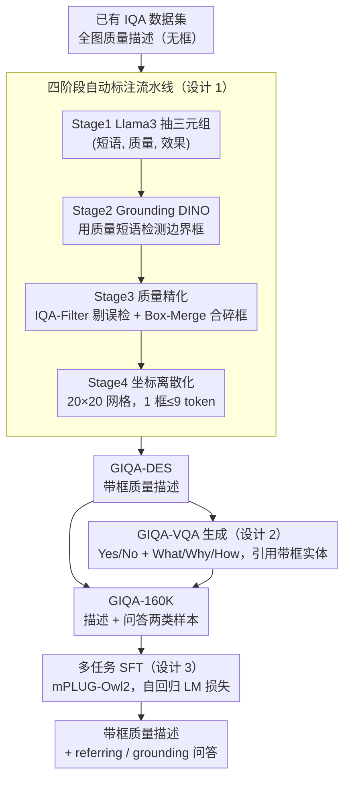

# Grounding-IQA: Grounding Multimodal Language Models for Image Quality Assessment

**会议**: ICLR 2026  
**arXiv**: [2411.17237](https://arxiv.org/abs/2411.17237)  
**代码**: [https://github.com/zhengchen1999/Grounding-IQA](https://github.com/zhengchen1999/Grounding-IQA)  
**领域**: 目标检测 / 多模态VLM / 图像质量评估  
**关键词**: 图像质量评估, 空间定位, 多模态LLM, 细粒度感知, grounding

## 一句话总结
将空间定位（referring + grounding）与图像质量评估结合，构建 GIQA-160K 数据集训练多模态 LLM 生成带有边界框的质量描述和空间 VQA，在细粒度质量感知上显著优于通用 MLLM。

## 研究背景与动机

**领域现状**：图像质量评估（IQA）已从传统指标（PSNR/SSIM）发展到基于多模态 LLM 的语义 IQA（如 Q-Instruct），能生成自然语言描述的质量评估。

**现有痛点**：现有 IQA 方法只给出全图级别的质量描述（如"图像整体模糊"），无法精确指出哪个区域有什么质量问题。对于复杂图像（如部分区域清晰、部分模糊），全图描述过于粗糙。

**核心矛盾**：IQA 需要细粒度的空间定位能力，但现有 IQA 数据集没有空间标注，MLLM 的空间感知能力在低级视觉任务上未被充分利用。

**本文目标** (a) 构建带空间标注的 IQA 数据集，(b) 训练 MLLM 同时进行质量评估和空间定位。

**切入角度**：定义两个新子任务——GIQA-Description（带框的质量描述）和 GIQA-VQA（带空间信息的质量 QA）。

**核心 idea**：让 IQA 模型不仅说"图像模糊"，还要指出"台球桌区域（bbox）是清晰的，但背景区域（bbox）是模糊的"。

## 方法详解

### 整体框架
论文要解决的是「IQA 只会全图打分、不会指出哪块有问题」。整条流水线分两步：先用一套全自动标注流水线，把已有的全图质量描述「升级」成带边界框的细粒度标注，攒成 GIQA-160K 数据集；再把这批数据组织成「带框描述（GIQA-DES）」和「空间问答（GIQA-VQA）」两类样本，在 mPLUG-Owl2 这类 MLLM 上做标准 SFT。训练完的模型既能输出"台球桌区域（bbox）清晰、背景区域（bbox）模糊"这种带坐标的描述，也能在 referring 和 grounding 两个方向上回答质量问题。

### 关键设计

**1. 四阶段自动标注流水线：把无框的质量描述自动补上空间坐标**

现有 IQA 数据集只有全图级文字描述、没有任何空间标注，靠人工补框成本极高。流水线分四步把框「挖」出来：Stage 1 用 Llama3 从原始质量描述里抽取三元组（描述短语、质量、效果），定位出"哪个对象、什么质量、什么效果"；Stage 2 把描述短语（而不是单纯的对象名）喂给 Grounding DINO 去检测边界框——用带质量语境的短语检测比用裸对象名更精确；Stage 3 是质量精化，先用 IQA-Filter（基于 Q-Instruct）验证检测到的框是否真的存在指定的质量问题、剔除误检，再用 Box-Merge 把指向同一区域的碎框合并；Stage 4 做坐标离散化，把连续坐标映射到 20×20 网格的索引上，一个框最多用 9 个 token 就能表示，方便直接塞进语言模型的文本序列。这套 Filter+Merge 的精化把框定位的 mIoU 从 0.562 提到 0.585。

**2. GIQA-VQA 生成：把带框描述改写成支持双向查询的问答对**

光有带框描述还不够灵活，论文进一步从 GIQA-DES 的描述里自动生成空间问答。用 LLM 生成两类问题各约 5 万条：Yes/No 判断题和 What/Why/How 开放题，并强制每个问题都引用带框的实体。这样做的好处是 VQA 格式天然支持两个查询方向——referring（给定一个位置去问它的质量）和 grounding（给定一种质量去问它在哪），比单一的描述格式覆盖更多使用场景。

**3. 多任务 SFT：描述和问答一起训，两边互相增益**

最后在 GIQA-160K 上做标准的监督微调，训练目标就是自回归语言模型损失，不引入额外结构。关键选择是把 GIQA-DES 和 GIQA-VQA 两类样本混在一起做多任务训练，而非各训各的。消融结果支持这个选择：相比只训描述（Only-DES），多任务在 VQA 准确率上更高；相比只训问答（Only-VQA），多任务在描述质量（LLM-Score）上更高——两个任务共享同一套细粒度空间-质量表征，彼此提供了正向监督信号。

## 实验关键数据

### 主实验（GIQA-Bench, mPLUG-Owl2-7B）

| 指标 | 微调前 | 微调后 | 提升 |
|------|--------|--------|------|
| BLEU@4 | 3.62 | 22.87 | +19.25 |
| LLM-Score | 48.25 | 63.00 | +14.75 |
| mIoU (框定位) | N/A | 0.5955 | - |
| VQA 总准确率 | 56.3% | 74.2% | +17.9% |

### 跨模型对比

| 模型 | mIoU | BLEU@4 | VQA 总准确率 |
|------|------|--------|------------|
| LLaVA-v1.5-7B | 0.528 | 19.02 | 68.5% |
| LLaVA-v1.6-7B | 0.598 | 19.17 | 72.5% |
| **mPLUG-Owl2-7B** | **0.596** | **22.87** | **74.2%** |

### 消融实验

| 配置 | Tag-Recall | LLM-Score | VQA 准确率 |
|------|-----------|-----------|----------|
| Only-DES | 0.550 | 61.75 | 59.0% |
| Only-VQA | 0.328 | 38.50 | 72.2% |
| **GIQA-160K (DES+VQA)** | **0.547** | **63.00** | **74.2%** |

### 关键发现
- 多任务训练在 VQA 准确率上比 Only-VQA 提升 2.0%，在描述质量上比 Only-DES 提升 1.25 LLM-Score
- 框精化（IQA-Filter + Box-Merge）将 mIoU 从 0.562 提升到 0.585
- 坐标离散化为 20x20 网格仅需 9 个 token，效率高。

## 亮点与洞察
- **IQA + Grounding 的交叉创新**：将 referring/grounding 引入 IQA 是一个自然但之前未被探索的交叉方向。
- **自动标注流水线**：四阶段流水线高度自动化，可适用于其他需要空间标注的低级视觉任务。
- **数据集贡献**：GIQA-160K 包含 16.7 万标注样本，是首个带空间定位的 IQA 数据集。

## 局限与展望
- 标注流水线依赖多个模型（Llama3, Grounding DINO, Q-Instruct），错误可能逐级累积
- 20x20 网格的空间分辨率有限，对小区域的质量问题定位精度不高
- 仅在 7B 模型上验证，更大模型的效果未知
- 训练使用的质量描述来自已有 IQA 数据集，覆盖的质量问题类型有限

## 相关工作与启发
- **vs Q-Instruct**: 纯文本 IQA，不支持空间定位；本文在其输出上增加空间标注
- **vs Grounding DINO**: 用于检测标注流水线，但无法直接做 IQA

## 评分
- 新颖性: ⭐⭐⭐⭐ IQA + Grounding 的任务定义新颖，但方法本身（SFT微调MLLM）较常规
- 实验充分度: ⭐⭐⭐⭐ 多模型验证 + 消融，但缺少与专业 IQA 方法的对比
- 写作质量: ⭐⭐⭐⭐ 标注流水线描述详细
- 价值: ⭐⭐⭐⭐ 数据集和任务定义的贡献大于方法本身

<!-- RELATED:START -->

## 相关论文

- [\[ICLR 2026\] Self-Evolving Vision-Language Models for Image Quality Assessment via Voting and Ranking](self-evolving_vision-language_models_for_image_quality_assessment_via_voting_and.md)
- [\[CVPR 2026\] R4-CGQA: Retrieval-based Vision Language Models for Computer Graphics Image Quality Assessment](../../CVPR2026/multimodal_vlm/r4-cgqa_retrieval-based_vision_language_models_for_computer_graphics_image_quali.md)
- [\[CVPR 2026\] Probabilistic Prompt Adaptation for Unified Image Aesthetics and Quality Assessment](../../CVPR2026/multimodal_vlm/probabilistic_prompt_adaptation_for_unified_image_aesthetics_and_quality_assessm.md)
- [\[CVPR 2026\] UARE: A Unified Vision-Language Model for Image Quality Assessment, Restoration, and Enhancement](../../CVPR2026/multimodal_vlm/uare_a_unified_vision-language_model_for_image_quality_assessment_restoration_an.md)
- [\[ICLR 2026\] VisJudge-Bench: Aesthetics and Quality Assessment of Visualizations](visjudge-bench_aesthetics_and_quality_assessment_of_visualizations.md)

<!-- RELATED:END -->
