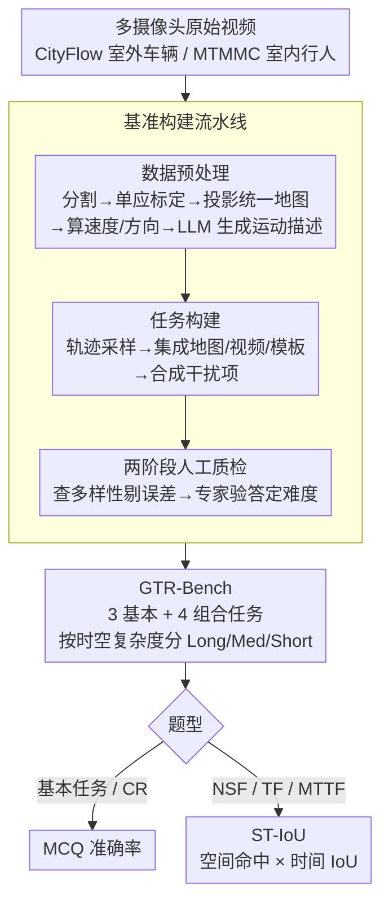

# GTR-Bench: Evaluating Geo-Temporal Reasoning in Vision-Language Models

**会议**: ICLR 2026  
**arXiv**: [2510.07791](https://arxiv.org/abs/2510.07791)  
**代码**: [GitHub](https://github.com/X-Luffy/GTR-Bench)  
**领域**: 时空智能 / 视觉语言模型评测  
**关键词**: 地理时空推理, 视觉语言模型, 多摄像头网络, benchmark, 时空智能

## 一句话总结

提出 GTR-Bench，一个面向大规模摄像头网络中移动目标地理时空推理的新基准，评估发现最强模型 Gemini-2.5-Pro（34.9%）远落后于人类水平（78.61%），揭示了当前 VLM 在时空上下文利用失衡、时序预测能力弱、地图-视频对齐能力不足三大缺陷。

## 研究背景与动机

**时空智能是核心能力**：空间智能是人类与物理世界交互的基础能力，其扩展——时空智能——对自动驾驶、具身 AI 等领域至关重要，涉及空间属性（尺寸、距离）、时间属性（时间间隔、速度）以及对动态事件的推理。

**现有基准的局限性**：当前地理推理基准（如 ReasonMap）仅关注静态几何任务和图形上下文（如地铁图），而时空推理基准（如 VSI-Bench、STI-Bench）主要从单/少数摄像头的自我中心视角出发，使用图像/视频上下文。

**缺乏地理级时空推理评估**：没有基准能够评估 VLM 在大规模摄像头网络中同时结合图形上下文（地图）与多视角视频观测进行地理时空推理的能力。

**实际应用需求迫切**：交通管理、应急响应等真实场景需要跨多个摄像头视角进行车辆/行人轨迹推理、交通流预测等综合时空分析。

**新挑战的独特性**：地理时空推理（GTR）要求在地图与视频之间进行多次视角切换、跨无重叠视野的多视频联合推理，以及对任何视频都未观测到的时空区域进行推断。

**认知科学视角补充**：传统时空智能仅覆盖第一人称（自我中心）和第三人称（他者中心），而地理视角可为 VLM 提供对动态物体的全知理解。

## 方法详解

### 整体框架

GTR-Bench 想回答一个此前没人系统评过的问题：在一张地图加上一批互不重叠的摄像头视频里，VLM 能不能对来回穿梭的移动目标做出像人一样的地理时空推理？为此它把「拍到的原始多摄像头视频」经过一条自动化构建流水线，变成 420 个标准化问答（室外 CityFlow 车辆、室内 MTMMC 行人各 210 个，覆盖 364 个视频片段），再把这些题目按时空复杂度分级、按难度递进组织成 **3 个基本任务 + 4 个组合任务**，最后让模型作答并用两套指标打分——基本题用 MCQ 准确率，预测题用专门设计的 ST-IoU 同时约束空间和时间。

**基本任务（Basic Tasks）** 各测一种原子能力：

- **Geo-Location (GL)**：给定起止位置，推断目标经过的中间位置（摄像头）
- **Arrival Time-Interval (ATI)**：给定起止点和中间位置，推断到达中间位置的时间区间
- **Motion-State (MS)**：给定起止点和中间位置，推断目标在中间位置的运动状态（方向、速度、距离）

**组合任务（Combinatorial Tasks）** 在基本能力上叠加预测与多目标推理：

- **Causal Reordering (CR)**：给定无序视频片段和地图，确定目标经过摄像头的正确时间顺序
- **Next Spot Forecasting (NSF)**：给定最后一次观测和地图，预测下一个摄像头位置及出现时间区间
- **Trajectory Forecasting (TF)**：基于多个历史观测，预测未来完整轨迹（摄像头序列及时间区间）
- **Multi-Target Trajectory Forecasting (MTTF)**：预测两个不同目标未来的相遇点（位置和时间）

### 关键设计

**1. 基准构建流水线：把原始多摄像头视频自动转成标准化问答**

裸视频里既没有地图也没有对齐好的多视角轨迹，要把它变成「含地图 + 含多视角观测 + 适配各任务时间/地理/格式要求」的题目，靠人手标注既慢又难一致，所以论文搭了一条三段流水线。**数据预处理** 先把长视频切段，再用单应性矩阵（homography）把每个摄像头的画面标定、把目标轨迹投影到同一张地图上，算出速度、方向等运动参数，经清洗校验后由 LLM 生成自然语言运动描述；**任务构建** 对轨迹采样，把地图、视频片段和题目模板集成成问答，并刻意制造迷惑选项——从不同建筑区域采样、用算法合成不存在的虚假摄像头、随机化摄像头 ID，逼模型真去推理而非靠选项规律蒙；**两阶段人工质检** 第一阶段保证问题多样并剔掉轨迹误差大的题，第二阶段由专家逐题验答、把难度调到合理区间。这条流水线让基准既贴近真实交通场景，又在题型和答案上保持标准化、可自动扩展。

**2. 时空复杂度分级：保证评测覆盖不同空间和时间尺度**

如果题目都集中在短轨迹、短时间，模型靠静态背景就能蒙过，测不出真正的动态推理能力。论文按轨迹长度 $track_d$ 和持续时间 $track_t$ 的物理阈值，把任务划成 Long / Medium / Short 三级，并刻意让三级均衡分布。室内外采用不同阈值——室外是驾驶场景，时间短但距离长，需要单独标定——这样无论室内行人还是室外车辆，都能覆盖到长短不一的时空尺度，让评测优先考验动态线索而非静态背景。

**3. ST-IoU 指标：让预测任务同时受空间正确性和时序精度约束**

基本任务和 CR 都是标准多选题，直接用 MCQ 准确率即可；但 NSF/TF/MTTF 这三个预测任务的答案是「摄像头 ID + 时间区间」，只判对错会丢掉时序维度——模型可能猜对了下一个摄像头位置，却把到达时间估得离谱。为此论文提出 **ST-IoU（Spatial-Temporal IoU）**：先用指示函数 $\mathbb{I}(C_{p_i}=C_{gt_i})$ 判断预测的 Camera ID 是否命中，命中才继续乘上时间维度的交并比 $\frac{|T_{p_i} \cap T_{gt_i}|}{|T_{p_i} \cup T_{gt_i}|}$，再对 $N$ 个样本取平均：

$$\text{ST-IoU} = \frac{1}{N}\sum_{i=1}^{N}\mathbb{I}(C_{p_i}=C_{gt_i}) \times \frac{|T_{p_i} \cap T_{gt_i}|}{|T_{p_i} \cup T_{gt_i}|}$$

空间错则整项归零，空间对才按时间重叠打分，一个标量就把「位置对不对」和「时间准不准」绑在一起评，从而把模型在空间定位和时序约束上的两类能力分开暴露出来。

### 评估设置

本文为 Benchmark 论文，不涉及模型训练，只规定统一的推理与对比协议：

- 视频均匀采样，多视频总帧数控制在 20 帧以内
- temperature = 0.1，max_new_token = 16384
- 开源模型通过 LMDeploy 在 8 块 NVIDIA V100 GPU 上部署
- 同时提供传统 ReID 方法作为对比基线

## 实验关键数据

### 主实验

| 模型 | 类型 | 排名 | GL(Out/In) | ATI(Out/In) | MS(Out/In) | CR(Out/In) | NSF(Out/In) | TF(Out/In) | MTTF(Out/In) | 平均 |
|------|------|------|------------|-------------|------------|------------|-------------|------------|--------------|------|
| Gemini-2.5-Pro | PM | 1 | 60.0/63.3 | 46.7/13.3 | 33.3/26.7 | 56.7/70.0 | 19.1/25.1 | 13.2/28.1 | 19.2/14.4 | **34.93** |
| GPT-5 | PM | 2 | 53.3/60.0 | 76.7/30.0 | 40.0/43.3 | 40.0/86.2 | 12.0/11.3 | 12.1/2.6 | 7.3/1.8 | 34.05 |
| Claude-4-Sonnet | PM | 3 | 73.3/66.7 | 50.0/33.3 | 50.0/43.3 | 63.3/58.6 | 8.1/2.6 | 6.2/4.0 | 16.9/0.0 | 34.03 |
| InternVL3-38B | OM | 5 | 40.0/50.0 | 73.3/56.7 | 30.0/26.7 | 53.3/37.9 | 8.3/11.1 | 8.2/4.4 | 20.6/10.2 | 30.76 |
| Qwen2.5-VL-32B | OM | 6 | 43.3/33.3 | 60.0/56.7 | 33.3/43.3 | 66.7/70.0 | 0.7/3.3 | 0.0/0.0 | 15.7/0.0 | 30.45 |
| **Human** | - | - | 90.0/98.2 | 84.3/90.8 | 90.9/89.5 | 89.8/97.4 | 68.3/74.6 | 51.2/57.4 | 55.8/62.5 | **78.61** |

### 消融实验

**空间推理 vs 时空推理对比（MCQ Acc vs ST-IoU）**：

| 模型 | NSF-MCQ/ST-IoU(Out) | TF-MCQ/ST-IoU(Out) | MTTF-MCQ/ST-IoU(Out) | NSF-MCQ/ST-IoU(In) |
|------|---------------------|--------------------|-----------------------|---------------------|
| GPT-4o | 53.3/20.5 | 41.7/0.0 | 76.7/23.1 | 30.0/13.0 |
| Gemini-2.5-Pro | 38.5/19.1 | 45.5/13.2 | 51.7/19.2 | 43.3/25.1 |
| GPT-5 | 73.3/12.0 | 58.3/12.1 | 83.3/7.3 | 50.0/11.3 |
| GLM-4.1V-9B | 40.0/10.3 | 30.0/0.0 | 76.7/25.4 | 10.3/2.9 |

MCQ 准确率普遍远高于 ST-IoU，说明模型能大致定位空间位置但无法处理时间约束。GPT-5 在 MTTF 上 MCQ 83.3% 但 ST-IoU 仅 7.3%，差距达 76 个百分点。

### 关键发现

1. **巨大的人机差距**：最强模型 Gemini-2.5-Pro（34.93%）与人类（78.61%）差距达 43.68 个百分点，开源模型平均仅 23.82%。
2. **基本→组合任务性能骤降**：模型在基本任务上表现尚可（GL、ATI 可达 60-76%），但组合预测任务（NSF/TF/MTTF）的 ST-IoU 普遍低于 30%，许多开源模型接近 0。
3. **室外 vs 室内差异**：多数模型在室外表现更好（空间线索更清晰、运动模式更规律），但 Gemini-2.5-Pro 反常地在室内表现更优，可能因高级模型在复杂场景下更好地发挥推理能力。
4. **时空上下文利用失衡**：顶级模型（如 Gemini-2.5-Pro）能均衡利用空间/时间/运动状态上下文，而开源模型（如 InternVL3-38B）在时间推理上明显偏弱。
5. **时间预测是瓶颈**：所有模型的空间定位能力远强于时间预测，MCQ Acc 与 ST-IoU 之间存在巨大鸿沟（如 GPT-5 差距达 76 个百分点）。

## 亮点与洞察

- **独创性的任务定义**：首次将时空推理扩展到地理级大规模摄像头网络，引入地图+多视角视频的联合推理，比传统自我中心视角的单视频推理更贴近真实应用。
- **ST-IoU 指标设计巧妙**：将空间准确性与时间 IoU 乘积融合，一个指标即可评估时空联合预测质量。
- **分层任务设计**：基本→组合的递进结构能精确定位模型的能力瓶颈所在。
- **三大缺陷分析深入**：不仅报告性能数字，还通过上下文利用分析、MCQ vs ST-IoU 对比、失败案例研究揭示了当前 VLM 时空智能的根本不足。
- **ReID 基线的纳入**：传统 Re-ID 方法（45.72%）在预测任务上甚至优于大部分 VLM，说明当前 VLM 在利用视觉特征匹配方面仍有欠缺。

## 局限与展望

1. **数据规模有限**：420 个问题虽然精心构建，但规模偏小，可能不足以全面评估模型在更多样场景下的表现。
2. **视频采样限制**：总帧数限制在 20 帧以内，可能损失了视频中的重要时序信息，对依赖密集帧的模型不利。
3. **仅覆盖两种场景**：只有室外车辆和室内行人两种场景，缺乏其他类型（如无人机视角、海洋场景等）的覆盖。
4. **缺乏改进方案**：论文揭示了问题但未提出针对性的解决方案或模型改进方向（如微调、提示工程优化等）。
5. **地图信息简化**：使用的地图以简化形式呈现，未涉及更复杂的实际地图数据（如高精地图、3D 建筑模型）。
6. **可扩展性**：未来可扩展到更多摄像头（>31）、更长时间跨度、更多目标类型的场景。

## 相关工作与启发

- **ReasonMap / SpatialLLM**：静态地理推理基准，仅处理图形上下文——启发 GTR 将动态目标引入地理推理。
- **STI-Bench / VSI-Bench / ST-VLM**：自我中心时空推理基准——证明从单视角到多摄像头网络的扩展是必要的。
- **CityFlow / MTMMC**：多摄像头跟踪数据集——GTR-Bench 复用其真实轨迹数据构建更高层次的推理任务。
- **对未来研究的启发**：可以探索 (1) 为 VLM 设计专门的时间推理模块，(2) 开发地图-视频对齐预训练策略，(3) 利用图结构建模摄像头网络拓扑关系。

## 评分

| 维度 | 评分 | 说明 |
|------|------|------|
| 新颖性 | ⭐⭐⭐⭐ | 首次定义地理时空推理（GTR）任务，将 VLM 评估扩展到多摄像头网络，问题定义新颖 |
| 实验充分度 | ⭐⭐⭐⭐ | 评估了 13 个主流 VLM + 人类基线 + ReID 基线，分析维度丰富（上下文利用、时空对比、失败案例） |
| 写作质量 | ⭐⭐⭐⭐ | 结构清晰，任务定义明确，表格图表丰富，但部分分析可以更深入 |
| 价值 | ⭐⭐⭐⭐ | 揭示了 VLM 时空智能的关键瓶颈，对自动驾驶、智能监控等领域有重要参考价值 |

<!-- RELATED:START -->

## 相关论文

- [\[CVPR 2026\] Flat-Pack Bench: Evaluating Spatio-Temporal Understanding in Large Vision-Language Models through Furniture Assembly](../../CVPR2026/multimodal_vlm/flat-pack_bench_evaluating_spatio-temporal_understanding_in_large_vision-languag.md)
- [\[ICML 2026\] TimeSpot: Benchmarking Geo-Temporal Understanding in Vision-Language Models in Real-World Settings](../../ICML2026/multimodal_vlm/timespot_benchmarking_geo-temporal_understanding_in_vision-language_models_in_re.md)
- [\[ICLR 2026\] Spatial-DISE: A Unified Benchmark for Evaluating Spatial Reasoning in Vision-Language Models](spatial-dise_a_unified_benchmark_for_evaluating_spatial_reasoning_in_vision-lang.md)
- [\[ACL 2026\] VULCA-Bench: A Multicultural Vision-Language Benchmark for Evaluating Cultural Understanding](../../ACL2026/multimodal_vlm/vulca-bench_a_multicultural_vision-language_benchmark_for_evaluating_cultural_un.md)
- [\[AAAI 2026\] VIR-Bench: Evaluating Geospatial and Temporal Understanding of MLLMs via Travel Video Itinerary Reconstruction](../../AAAI2026/multimodal_vlm/vir-bench_evaluating_geospatial_and_temporal_understanding_of_mllms_via_travel_v.md)

<!-- RELATED:END -->
