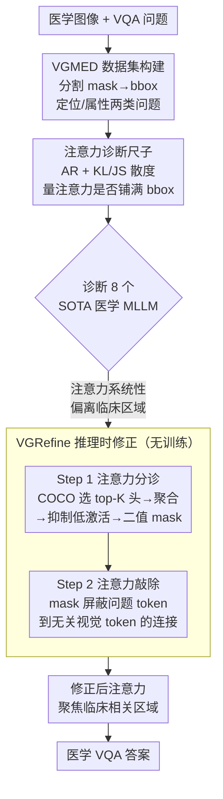

# How Do Medical MLLMs Fail? A Study on Visual Grounding in Medical Images

**会议**: ICLR 2026  
**arXiv**: [2603.14323](https://arxiv.org/abs/2603.14323)  
**代码**: [项目页面](https://guimeng-leo-liu.github.io/Medical-MLLMs-Fail/)  
**领域**: 多模态VLM  
**关键词**: 医学VQA, 视觉扎根, 注意力分析, MLLM失败模式, 推理时修正

## 一句话总结

首次系统性诊断出医学MLLM在零样本医学VQA上表现差的根本原因在于视觉扎根（visual grounding）不足——模型注意力系统性地偏离临床相关区域，由此提出无训练的VGRefine推理时注意力修正方法，在6个基准的110K+样本、8种成像模态上均达到SOTA。

## 研究背景与动机

**领域现状** 多模态大模型（MLLM）在通用视觉语言任务上表现优异，近年来大量工作将其拓展到医学领域（LLaVA-Med、HuatuoGPT-Vision、VILA-M3等），试图构建能支持多样化临床决策的通用医学AI。然而这些模型在零样本医学VQA场景下的表现仍然不理想，尤其在没有下游任务样本参与训练或微调的情况下。

**现有痛点** 已有研究多集中在"如何改进"（构建更大的医学多模态数据集、引入外部专家模型等），但对"为什么失败"这个更根本的问题缺乏系统性分析。模型在医学图像上的失败可能来自语义扎根（不知道该关注什么临床概念）或视觉扎根（知道该找什么但无法在图像中正确定位）——这两个维度此前未被明确区分和量化。

**核心矛盾** 先前工作已经表明MLLM在自然图像上具备良好的视觉扎根能力，注意力分布能与目标区域对齐。但在医学图像上是否同样适用？如果视觉扎根确实是医学MLLM的短板，那意味着当前大量注入医学知识以增强语义扎根的努力可能方向偏了——真正的瓶颈在视觉端。

**切入角度** 本文设计了一套完整的诊断-验证-修复方案：与临床专家共同构建专用于视觉扎根分析的VGMED数据集，引入新的量化指标，在8个SOTA医学MLLM上系统验证后，提出简洁高效的推理时修复方法。

**核心idea** 通过将语义扎根与视觉扎根解耦来精确定位失败模式，并证明视觉扎根不足是一个跨越所有主流医学MLLM的普遍性、可修复的瓶颈。

## 方法详解

### 整体框架

本文要回答的不是"怎么让医学MLLM更强"，而是"它到底败在哪一步"，并顺手给出一个轻量修复。整条线索按"造尺子→量病灶→开药方"展开：先构建一个专门考视觉扎根的 VGMED 数据集，让每个问题都必须看准标注区域才能答对；再用注意力比、KL 散度、JS 散度三把尺子去量 8 个 SOTA 医学 MLLM，定位出它们注意力系统性偏离临床区域的事实；最后提出无训练的 VGRefine，在推理时分两步把跑偏的注意力拉回相关区域。三部分环环相扣——前两步证明"视觉扎根才是瓶颈"，第三步反过来用一个不注入任何医学知识的修复证实这个诊断。

### 关键设计

**1. VGMED 数据集：把视觉扎根从语义扎根里单独拎出来考**

现有 Med-VQA 数据集里混着两类干扰项——一类根本不需要定位区域（如"这是什么成像模态"），一类需要深厚医学知识才能答。这两类都会让"模型答错"无法归因：到底是不知道该找什么（语义扎根），还是知道找什么却定位不准（视觉扎根）？为了把视觉扎根单独考出来，作者与 3 位持证临床医生（含 10 年以上经验的高级医生）共同设计数据集，从 40+ 个公开医学分割数据集中筛出 13,962 个样本，把分割 mask 转成 bbox，并围绕每个区域生成两类必须看图才能答的问题：定位问题（该区域是什么器官/病变）和属性问题（大小、形状、异常等特征），共约 28K 个图像-bbox-问题三元组。问题先由 GPT-4 生成、再经专家 review，确保既有临床意义又强依赖视觉定位。正因为每个问题都被刻意绑死在标注区域上，模型答错就只能归因到"没看准那块地方"。

**2. KL/JS 散度：注意力不光要"进入"区域，还得"铺满"区域**

传统的注意力比（AR）只统计落在 bbox 内的注意力总量，回答不了"注意力在区域内部怎么分布"这个问题——哪怕注意力只压在角落一个点上，AR 也可能不低。但 VGMED 的问题被设计成需要关注整个 bbox，因此还得看注意力是否均匀覆盖整块区域。作者把空间注意力地图和归一化的 bbox mask 都看作概率分布，用 KL 散度和 JS 散度衡量两者差异，散度越低说明注意力越均匀地铺满了临床相关区域。注意力地图的取法是：从 LLM 各层最后一个文本 token 到 $N^2$ 个图像 token 的交叉注意力权重中抽出空间分布，再与 bbox mask 对齐比较。这两把更细的尺子，正是后面诊断出"注意力部分进区域、却大量散到无关处"的关键。

**3. VGRefine：推理时两步把跑偏的注意力"敲"回来，全程无训练**

诊断暴露的病灶很具体——医学 MLLM 的注意力确实部分覆盖了相关区域，但同时大量泄漏到无关区域，于是需要一种机制显式"敲掉"这些干扰。VGRefine 分两步实现：**Step 1（Attention Triage）** 在注意力头粒度上挑出与视觉扎根最相关的 top-K 个头，挑选依据是这些头在 COCO 自然图像上的 KL 散度（而非医学图像，从而避免医学数据泄露）；聚合这些头的注意力、抑制低激活区域，生成一张二值 mask。**Step 2（Attention Knockout）** 用这张 mask 屏蔽问题 token 到无关视觉 token 的注意力连接，强迫模型只看有意义的区域。之所以敢在 COCO 上选头再迁到医学图像，是因为实验发现自然图像上最相关的那批注意力头在医学图像上同样最相关——只是整体扎根质量更差，说明这套机制是域不变的，缺的只是把它"用对地方"。

### 训练策略

VGRefine 完全无训练，只在推理时改注意力。超参上使用 top-K=20 个注意力头、激活百分位阈值 p=50% 做幅值过滤；attention knockout 的应用层随模型规模而定——7B 模型在第 16 层、34B 模型在第 34–36 层。所有超参数在全部基准上保持一致，不做逐数据集调参。

## 实验关键数据

### 视觉扎根诊断（核心发现）

| 指标 | 医学图像 | 自然图像 | 结论 |
|------|---------|---------|------|
| 注意力比(AR)↑ | 低 | 高 | 8个SOTA医学MLLM的注意力全部偏离临床区域 |
| KL散度↓ | 高 | 低 | 注意力分布与GT区域差异大 |
| JS散度↓ | 高 | 低 | 同上，且跨层/跨模型一致 |

注：通用MLLM(LLaVA-v1.5)在医学图像上同样视觉扎根失败；医学MLLM在自然图像上则扎根正常→问题是医学域特异的，非模型能力缺陷。

### 主实验（Med-VQA性能）

| 模型 | VQA-RAD | SLAKE | PathVQA | PMC-VQA | 加权平均 |
|------|---------|-------|---------|---------|---------|
| HuatuoGPT-V-7B | 67.4% | 76.5% | 60.7% | 53.9% | 65.3% |
| **VGRefine (本文)** | **71.2%** | **76.9%** | **67.6%** | **56.2%** | **68.4%** |

VGRefine在OmniMedVQA上跨8种成像模态均有提升：CT +7.5%、MRI +6.4%、X-Ray +8.1%，平均71.3%→74.4%。MMMU Health&Medicine: 45.8%→47.2%。

### 消融实验

| 配置 | VQA-RAD | SLAKE | PathVQA | PMC-VQA | 平均 |
|------|---------|-------|---------|---------|------|
| K=1 | 68.6% | 75.8% | 64.9% | 53.7% | 68.3% |
| K=10 | 70.9% | 76.8% | 67.7% | 56.1% | 68.3% |
| **K=20** | **71.2%** | **76.9%** | **67.6%** | **56.2%** | **68.4%** |
| p=30% | 70.8% | 76.8% | 67.6% | 55.7% | 68.2% |
| **p=50%** | **71.2%** | **76.9%** | **67.6%** | **56.2%** | **68.4%** |
| p=90% | 70.6% | 76.3% | 68.1% | 55.5% | 68.2% |

### 关键发现

- 8个SOTA医学MLLM无一例外地在医学图像上视觉扎根失败，但在自然图像上正常——这是医学领域特有的问题
- VGRefine不需要任何医学知识注入就能取得一致性提升——如果视觉扎根不是限制因素，这种提升不可能发生
- 人工评估：5位临床医生在20个盲评案例中76%偏好VGRefine产生的注意力地图
- 与PAI、AdaptVis、ViCrop三种最新注意力方法相比，VGRefine的改进最大且最一致

## 亮点与洞察

- 诊断先于治疗的研究范式极有价值：通过精确解耦语义扎根和视觉扎根，锁定了一个跨模型的普遍性瓶颈，使得后续所有改进工作有了明确方向
- 医学vs自然图像的对比分析是全文最有说服力的证据——同一模型在两类图像上的截然不同表现排除了模型能力不足的解释
- VGRefine的设计体现了"少即是多"的哲学：不引入新知识，仅纠正注意力分布就达到SOTA，说明现有模型已经有足够的医学知识，只是注意力指向出了问题
- 跨域迁移的巧妙设计：在COCO自然图像上选择top-K头却能迁移到医学图像，既避免数据泄露又证明了视觉扎根机制的域不变性

## 局限与展望

- 仅关注了视觉扎根这一失败模式，未探讨语义扎根不足或推理能力缺陷等其他潜在瓶颈
- VGRefine使用固定的离线投影，未能根据输入动态调整——针对不同类型的医学图像可能需要自适应的注意力修正
- 幻觉子空间的定义依赖于特定的注意力层选择（如7B模型的第16层），不同模型的最优层可能不同
- 未验证在更新一代的闭源模型（如GPT-4V、Gemini）上视觉扎根问题是否仍然存在

## 相关工作与启发

- 与Zhang2025（MLLMs Know）的对比：后者证明MLLM在自然图像上有良好视觉扎根→本文将该分析扩展到医学领域并发现相反结论
- 与VILA-M3等引入外部专家模型的方法互补：VILA-M3从外部增强，VGRefine从内部修正——两者可结合
- VGRefine的attention knockout思路与attention manipulation文献一脉相承，但创新在于自动化地选择最相关的head子集而非手动指定

## 评分

- 新颖性: ⭐⭐⭐⭐⭐ 首次系统性诊断医学MLLM的视觉扎根失败模式，填补了重要的认知空白
- 实验充分度: ⭐⭐⭐⭐⭐ 8个模型×28K诊断分析+6个基准×110K+验证+人工评估+多方法对比
- 写作质量: ⭐⭐⭐⭐ 问题-诊断-解决的逻辑清晰完整，数据集构建与临床专家的合作增强可信度
- 价值: ⭐⭐⭐⭐⭐ 对医学AI领域的根本性洞察——后续所有医学MLLM的改进工作都需要考虑视觉扎根

<!-- RELATED:START -->

## 相关论文

- [\[CVPR 2026\] Does Language Shift Break Medical Vision-Language Models? Indonesian Radiology Visual Question Answering Case Study](../../CVPR2026/multimodal_vlm/does_language_shift_break_medical_vision-language_models_indonesian_radiology_vi.md)
- [\[ACL 2026\] How Do LLMs and VLMs Understand Viewpoint Rotation Without Vision? An Interpretability Study](../../ACL2026/multimodal_vlm/how_do_llms_and_vlms_understand_viewpoint_rotation_without_vision_an_interpretab.md)
- [\[CVPR 2025\] MIMO: A Medical Vision Language Model with Visual Referring Multimodal Input and Pixel Grounding Multimodal Output](../../CVPR2025/multimodal_vlm/mimo_a_medical_vision_language_model_with_visual_referring_multimodal_input_and_.md)
- [\[CVPR 2026\] RNED: Rotary Number Encoding and Decoding for Medical VLMs](../../CVPR2026/multimodal_vlm/rned_rotary_number_encoding_and_decoding_for_medical_vlms.md)
- [\[CVPR 2026\] Sparse Spectral LoRA: Routed Experts for Medical VLMs](../../CVPR2026/multimodal_vlm/sparse_spectral_lora_routed_experts_for_medical_vlms.md)

<!-- RELATED:END -->
