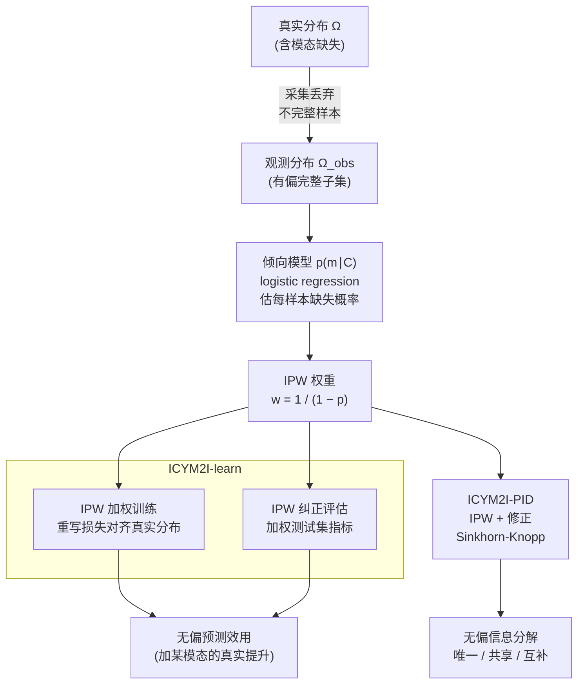

# ICYM2I: The Illusion of Multimodal Informativeness under Missingness

**会议**: ICLR 2026  
**arXiv**: [2505.16953](https://arxiv.org/abs/2505.16953)  
**代码**: [https://github.com/reAIM-Lab/ICYM2I](https://github.com/reAIM-Lab/ICYM2I)  
**领域**: 多模态VLM / 机器学习理论  
**关键词**: 多模态缺失, 分布偏移, 逆概率加权, 信息分解, 模态价值评估

## 一句话总结

揭示了多模态学习中被忽视的问题：模态缺失（missingness）导致的分布偏移会使模态价值评估产生严重偏差，提出 ICYM2I 框架通过双重逆概率加权（IPW）纠正训练和评估中的偏差，在 MAR 假设下实现对模态预测效用和信息论价值的无偏估计。

## 研究背景与动机

**领域现状**：多模态学习广泛应用于医疗、自动驾驶、推荐系统等场景，核心假设是"多模态>单模态"。实践中常通过消融实验（去掉某个模态看性能下降多少）来评估模态价值。

**现有痛点**：现实中数据采集存在大量缺失——传感器故障、成本限制、隐私约束等导致某些模态在某些样本上不可用。当前做法是直接丢弃不完整样本，在完整子集上训练和评估。但如果缺失不是完全随机的（即 MCAR），丢弃后的数据子集分布与真实分布不同，导致模态价值评估有偏。

**核心矛盾**：缺失机制与模态信号混淆——如果某模态的缺失与标签相关（MAR），则在完整子集中该模态的"表现"会被系统性高估或低估，而这种偏差在当前研究中几乎完全被忽视。

**本文目标**：在存在非随机缺失的条件下，如何无偏地评估一个模态的（a）预测效用（加入该模态后性能提升多少）和（b）信息论价值（该模态携带的唯一/共享/互补信息）？

**切入角度**：借鉴因果推断中的逆概率加权（IPW）方法，将缺失引起的分布偏移视为一种可纠正的 selection bias。

**核心 idea**：用逆概率加权同时纠正训练损失和评估指标，使多模态模型在有缺失的观测数据上也能无偏评估模态价值。

## 方法详解

### 整体框架

ICYM2I 要解决的是：当训练数据里某些模态非随机地缺失时，怎样仍然得到对模态价值的无偏判断。它的起点是一个被污染的现实——真实分布 $\Omega$ 含缺失，数据采集时把不完整样本丢掉，剩下的完整子集 $\Omega_{obs}$ 是被"挑选"过的有偏样本。ICYM2I 先用一个倾向模型（用观测协变量 $C$ 训练的 logistic regression）估出每个样本被完整观测到的概率，转成逆概率加权（IPW）权重，再用这同一套权重去喂两条平行的纠正线。一条是 **ICYM2I-learn**，在有缺失的观测数据上训练和评估多模态/单模态模型，但通过加权让训练和评估都反映真实分布而非被缺失污染的观测分布；另一条是 **ICYM2I-PID**，把同样的加权注入偏信息分解（Partial Information Decomposition, PID）的估计，从而无偏地把模态信息拆成唯一/共享/互补三部分。整个框架建立在两条前提上：MAR（Missing At Random，缺失只依赖观测到的协变量）和 Positivity（任意协变量组合下完整观测的概率都大于 0），后者保证逆概率权重不会出现分母为零。

### 关键设计

**1. IPW 加权训练：让观测分布上的训练等价于真实分布上的训练**

只在完整样本上训练的隐患是，这些样本本身就是被"挑选"出来的——更容易被完整观测到的样本在子集里被过度代表，模型学到的其实是观测分布 $\Omega_{obs}$ 的映射而非真实分布 $\Omega$ 的映射。ICYM2I-learn 对每个完整样本 $(x_1, x_2, y)$ 乘上一个逆概率权重 $w = \frac{1}{1 - p(m_1, m_2, m_y \mid C)}$ 来重写损失，其中 $p(m \mid C)$ 是用观测协变量 $C$ 训练的缺失概率模型（logistic regression），刻画该样本被遮蔽的概率。越容易被完整观测到的样本（缺失概率越低）权重越小，越罕见的完整样本权重越大，加权后整体重新对齐到真实分布。这正是把因果推断里纠正 selection bias 的 IPW 思想搬到了多模态缺失场景。

**2. IPW 纠正评估：训练纠正了，测试集也得纠正**

只纠正训练并不够——如果还在偏倚的完整子集上算指标，得到的 AUC 依然是 $\Omega_{obs}$ 上的有偏估计，模态价值的判断照样错。所以评估阶段同样套用 IPW：用相同的逆概率权重对每个测试样本的指标贡献加权，把标准指标调整成真实分布 $\Omega$ 上的无偏估计。训练与评估两处都纠正，才能保证最终读出的"加上某模态性能提升多少"是可信的（实验中也验证了缺一不可）。

**3. ICYM2I-PID：把信息论分解也从缺失偏差里救回来**

光看预测性能区分不了一个模态携带的信息到底是"唯一的"还是和别的模态"冗余的"，Partial Information Decomposition（PID）能把模态信息细分成唯一（Unique）、共享（Shared）、互补（Complementary）三块，但标准 PID 估计同样会被缺失偏差污染。ICYM2I-PID 把 Bertschinger et al. 的 PID 框架与 IPW 结合，核心是纠正三路互信息 $I(Y:(X_1,X_2))$ 的估计：先用 IPW 加权样本重建真实分布下的互信息，再用修正的 Sinkhorn-Knopp 过程约束边缘分布匹配，从而在有缺失的数据上也能得到无偏的信息分解。

### 损失函数 / 训练策略

加权交叉熵是整个框架的落点：

$$l_{\Omega}(x_1,x_2,y) = \frac{1}{1-p(m_1,m_2,m_y \mid C)} \cdot l_{\Omega_{obs}}(x_1,x_2,y)$$

其中缺失概率模型 $p(m \mid C)$ 由观测协变量 $C$ 训练的 logistic regression 给出；PID 部分则用参数化神经网络配合 Sinkhorn-Knopp 迭代求解约束优化。

## 实验关键数据

### 主实验

比特逻辑运算实验（AND/OR/XOR，50% MAR 缺失）：

| 算子 | 方法 | X1 AUC | X2 AUC | Unique1 | Unique2 | Shared | Compl. |
|------|------|--------|--------|---------|---------|--------|--------|
| AND | Oracle | 0.83 | 0.84 | 0.05 | 0.03 | 0.26 | 0.47 |
| AND | Observed | 0.66 | 0.93 | **0.44** | 0.00 | 0.15 | 0.36 |
| AND | **ICYM2I** | **0.83** | **0.85** | **0.03** | **0.03** | **0.27** | **0.45** |
| XOR | Oracle | 0.51 | 0.49 | 0.00 | 0.00 | 0.00 | 0.99 |
| XOR | Observed | 0.52 | **0.80** | **0.34** | 0.07 | -0.07 | 0.62 |
| XOR | **ICYM2I** | **0.53** | **0.49** | **0.00** | **0.00** | **0.01** | **0.96** |

Observed 方法在 XOR 中严重高估 X2 的 AUC（0.80 vs 真实 0.49）和 Unique1（0.34 vs 真实 0.00），ICYM2I 完美纠正。

### 消融实验

训练-评估纠正组合分析（AUC RMSE vs Oracle）：

| 训练方式 | 评估方式 | AUC RMSE ↓ |
|----------|----------|------------|
| Standard | Standard | 高（有偏） |
| IPW | Standard | 中（训练纠正但评估仍偏） |
| Standard | IPW | 中 |
| **IPW** | **IPW** | **最低（双重纠正）** |

### 关键发现

- 缺失偏差的方向取决于缺失机制：对 OR 算子，X1 被高估（因为 X1=1 时 X2 更可能缺失，观测子集中 X1 的预测力被放大）；对 AND 算子则相反
- **XOR 是最极端的 case**：两个模态的唯一信息均为 0（所有信息都是互补的），但不纠正缺失时 Unique1 被估计为 0.34——这会严重误导"X1 单独就有价值"的错误结论
- 训练和评估的纠正都是必要的，缺一不可
- 在真实医疗数据（乳腺癌筛查）上也验证了 ICYM2I 的有效性

## 亮点与洞察

- **视角独特且影响深远**：之前所有多模态工作都隐式假设"完整样本子集代表全集"，ICYM2I 首次形式化了这个假设的脆弱性。这不是一个边缘问题——在医疗、自动驾驶等高风险场景中，缺失往往与关键因素相关，偏差后果严重
- **因果推断工具迁移到多模态**：IPW 是因果推断经典工具，本文巧妙地将其应用于多模态学习的缺失问题，是很好的跨领域方法迁移
- **区分了两种完全不同的模态缺失问题**：(1) 目标环境缺失（传统问题：如何 robust 于部署时的传感器故障）和 (2) 源环境缺失（本文关注：训练数据中的缺失如何偏置模态价值评估）

## 局限与展望

- **MAR 假设可能不成立**：如果缺失依赖于未观测变量（MNAR），IPW 无法纠正。论文在附录中讨论了 MNAR 下的鲁棒性但承认局限
- **缺失概率模型的准确性至关重要**：IPW 权重来自 logistic regression 对缺失概率的估计，如果该模型不准确，纠正也会有偏
- **极端 IPW 权重问题**：当某些样本的观测概率极低时，IPW 权重极大导致高方差。论文未讨论权重截断等稳定化策略
- **实验规模较小**：主要在合成/半合成数据和小规模医疗数据上验证，需要在大规模多模态 benchmark 上验证实用性

## 相关工作与启发

- **vs 标准多模态 robustness 方法**（如 imputation、knowledge distillation）：这些方法关注"目标环境模态缺失时如何维持性能"，而 ICYM2I 关注的是更基础的问题——"源数据缺失如何偏置我们对模态价值的判断"
- **vs PID 分解方法**（Liang et al. 2024a）：PID 分解隐式假设观测分布=真实分布，ICYM2I 证明在缺失下这会产生严重偏差，并提供了纠正方案
- **对实际系统的启发**：在决定"是否值得采集某个昂贵模态"时（如医疗中的活检），不能简单看回顾性数据中的消融实验结论——必须先纠正缺失偏差

## 评分

- 新颖性: ⭐⭐⭐⭐⭐ 首次形式化多模态缺失偏差问题，视角独特且有广泛影响
- 实验充分度: ⭐⭐⭐ 实验较小规模，缺乏大型多模态 benchmark 上的验证
- 写作质量: ⭐⭐⭐⭐⭐ 形式化严谨，动机示例（比特逻辑运算）直观有力
- 价值: ⭐⭐⭐⭐ 对多模态学习的评估实践有重要指导意义，但需要更多实证支持

<!-- RELATED:START -->

## 相关论文

- [\[CVPR 2026\] Illusion-Aware Visual Preprocessing and Anti-Illusion Prompting for Classic Illusion Understanding in Vision-Language Models](../../CVPR2026/multimodal_vlm/illusion-aware_visual_preprocessing_and_anti-illusion_prompting_for_classic_illu.md)
- [\[CVPR 2026\] Breaking the Illusion: When Positive Meets Negative in Multimodal Decoding](../../CVPR2026/multimodal_vlm/breaking_the_illusion_when_positive_meets_negative_in_multimodal_decoding.md)
- [\[ACL 2026\] TableVista: Benchmarking Multimodal Table Reasoning under Visual and Structural Complexity](../../ACL2026/multimodal_vlm/tablevista_benchmarking_multimodal_table_reasoning_under_visual_and_structural_c.md)
- [\[ICML 2026\] Are VLMs Seeing or Just Saying? Uncovering the Illusion of Visual Re-examination](../../ICML2026/multimodal_vlm/are_vlms_seeing_or_just_saying_uncovering_the_illusion_of_visual_re-examination.md)
- [\[AAAI 2026\] Rethinking Visual Token Reduction in LVLMs under Cross-Modal Misalignment](../../AAAI2026/multimodal_vlm/rethinking_visual_token_reduction_in_lvlms_under_cross-modal_misalignment.md)

<!-- RELATED:END -->
