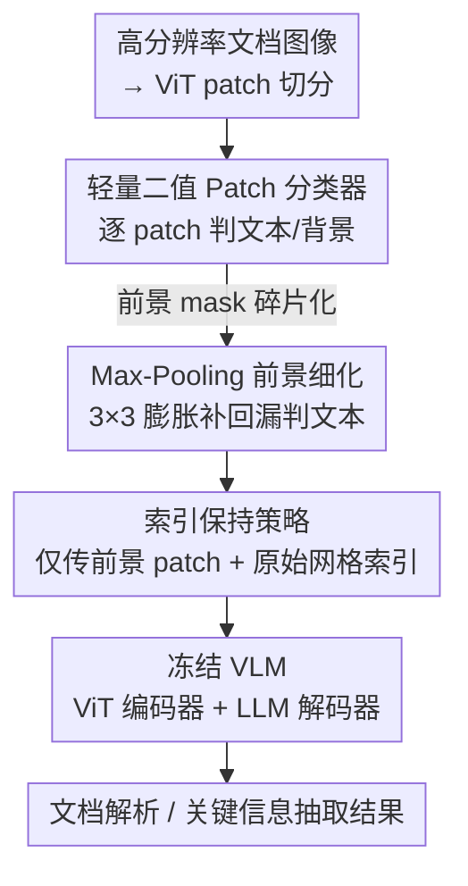

# Index-Preserving Lightweight Token Pruning for Efficient Document Understanding

**会议**: ICLR 2026 (Workshop on MM Intelligence)  
**arXiv**: [2509.06415](https://arxiv.org/abs/2509.06415)  
**代码**: [GitHub](https://github.com/jaeminSon/index-preserving-lightweight-token-pruning)  
**领域**: 多模态VLM / 文档理解  
**关键词**: token pruning, 文档理解, VLM 效率, patch 分类器, 索引保持

## 一句话总结

在 VLM 视觉编码器之前插入一个仅 203K 参数的二值 patch 分类器剔除文档背景 token，再用 $3 \times 3$ max-pooling 恢复碎片化文本区域并保留原始空间索引，在 Qwen2.5-VL 上实现 40-60% FLOPs 缩减且精度损失不超过 ~5%p。

## 研究背景与动机

**领域现状**：VLM（如 Qwen2.5-VL、Gemini、LLaMA-3）在文档解析、关键信息抽取、文档 VQA 等任务上已经取得了很强的效果，但高分辨率文档图像的推理计算代价依然高昂。一张 A4 文档扫描件在 300 DPI 下是 2481×3507 像素，经 ViT 切分后产生大量 visual token，全部送入 LLM 解码器造成严重的计算浪费。

**现有痛点**：已有的 token 压缩方法分为两类——(1) 注意力驱动的剪枝（DynamicViT、FocusDETR、SPViT）在 transformer 中间层动态决定保留哪些 token，需要修改模型结构或重训练；(2) token 合并（ToMe、Token Fusion）在每层通过余弦相似度合并相邻 token，但合并过程会打乱 token 索引顺序。这两类方法在分类/检测任务上有效，但在文档理解中几乎未被探索。

**核心矛盾**：文档理解任务对空间位置信息极其敏感——表格的行列对齐、文本段落的上下文位置都编码在 token 的位置索引中。通用的 token 合并/剪枝方法一旦破坏了这些索引，文本识别性能就会灾难性下降。然而文档图像有一个独特优势：大量空白边距和背景区域（实验显示平均 41.6%-65.7% 的 patch 是背景），这为激进的早期剪枝提供了天然条件。

**切入角度**：作者观察到文档中文本 vs 背景的区分非常简单（一个浅层分类器就能达到 0.99 AP），因此可以在视觉编码器之前就完成剪枝，从源头减少所有后续模块的计算量。关键洞见是必须保留被选中 patch 在原始网格中的位置索引，否则 VLM 的位置编码会错位。

**核心 idea**：用一个前置的轻量二值 patch 分类器 + max-pooling 空间细化 + 索引保持策略，在不修改 VLM 任何参数的前提下实现文档场景的高效 token 剪枝。

## 方法详解

### 整体框架

这篇论文要解决的问题是：高分辨率文档图像切成 patch 后产生海量 visual token，全部塞进 VLM 解码器算力浪费严重，而文档里其实有 41.6%-65.7% 的 patch 是空白背景。整体思路是把剪枝**提前到视觉编码器之前**——在输入图像和一个完全冻结的 off-the-shelf VLM 之间插一个三段式预处理模块，源头上就把背景 token 砍掉，让后续 ViT 编码 + LLM 解码全链路都享受到 token 变少的加速。

数据流是这样转的：文档图像先切成 patch，**轻量二值 Patch 分类器**逐个判定"文本/背景"得到一张前景 mask；由于单 patch 分类会把一行文字误判得支离破碎，再用 **Max-Pooling 前景细化** 把碎片膨胀回来；最后 **索引保持策略** 只把前景 patch 连同它们在原始网格里的位置索引一起送进冻结 VLM，输出文档解析 / 关键信息抽取结果。整个框架不改也不重训 VLM 的任何参数，分类器作为即插即用的预处理模块独立训练。

### 关键设计

**1. 轻量二值 Patch 分类器：在视觉编码器之前就把背景 token 砍掉**

整个方法的省算量都来自这一步——既然文档里 41.6%-65.7% 的 patch 是空白背景，那就在它们进入任何重模块之前先剔除。分类器结构极简，Layer Norm → MLP → GELU → Classification Head 一条线下来只有 203K 参数；每个 patch 独立过一遍，logit $> 0$ 就判为文本区域并保留。训练标签是自动生成的：拿 AI-Hub 的 800 张 OCR 文档图像，先用 PSENet 提取文本边界框，与文本框重叠的 patch 标正、其余标负，最终凑出约 99,600 训练样本、400 验证样本且正负均衡。之所以敢用这么小的网络，是因为文档里文本 vs 背景的视觉差异本就极其显著——patch size=28 时分类 AP 高达 0.99，再复杂的结构都是浪费。这也是它和 DynamicViT 那类在 transformer 中间层做剪枝的方法的本质区别：剪得越早，后续 ViT 编码 + LLM 解码全链路省下的算力越多。

**2. Max-Pooling 前景细化：把被漏判的碎片文本"膨胀"回来**

patch 级分类器只看单个 patch、不管空间上下文，结果就是一行文字里夹杂的某些 patch 会被误判成背景，前景 mask 变得支离破碎。补救办法朴素得出奇：在二值 mask 上做一次 $3 \times 3$ max-pooling——只要某个背景 patch 的 $3 \times 3$ 邻域里存在任何前景 patch，它就被重新点亮成前景，等价于对前景区域做一次形态学膨胀。这一步的收益是决定性的：只靠分类器硬剪会让文档解析 ANLS 掉 10-17%p、关键信息抽取 F1 掉 14-31%p，而加上 max-pooling 后损失收窄到 0-5%p。代价是剪枝率从 65.7% 回落到 41.6%，但用十几个百分点的剪枝率换回二三十个百分点的精度，是非常划算的 accuracy-efficiency trade-off。

**3. 索引保持策略：剪掉 token 但绝不打乱它的位置**

文档理解对空间位置极度敏感——表格的行列对齐、段落的上下文位置全都编码在 token 的位置索引里，这正是通用 token 合并方法在文档上翻车的根因。本方法的做法是：每个 patch 在原始网格中有唯一索引 $i \in \{0, 1, \ldots, n-1\}$，剪枝后虽然只传被保留 patch 的子集，但每个 token 仍死死绑定它的原始索引，VLM 的位置编码（如 Qwen2.5-VL 的位置嵌入）按这些原始索引计算，而不是把幸存 token 重新从 0 编号。这条策略有多关键，消融给了铁证（Table 3）：把索引换成常数全 0，Scan 的 ANLS 从 61.8 直接崩到 9.1；即便换成有序递增编号（ordered），也只能恢复到 36.2——文档里的位置语义完全寄生在原始索引上，少了它一切免谈。

### 损失函数 / 训练策略

- 分类器使用标准二值交叉熵（BCE）损失训练
- patch 大小选择 28×28 像素（基于消融：14 太小无法捕获完整字符结构，28/56/112 性能接近但 28 参数最少）
- Qwen2.5-VL 本身完全冻结，使用 BFloat16 + FlashAttention-2 加速推理
- 最大生成长度 2048 tokens

## 实验关键数据

### 主实验：剪枝 + Max-Pooling 的性能影响

在 CC-OCR 数据集上评估 Qwen2.5-VL（3B/7B/32B/72B），覆盖文档解析（Scan/Photo）和关键信息抽取（CORD/SROIE）两大任务：

| 模型 | 方法 | Scan (ANLS) | Photo (ANLS) | CORD (F1) | CORD (Acc) | SROIE (F1) | SROIE (Acc) |
|------|------|-------------|--------------|-----------|------------|------------|-------------|
| 3B | Original | 62.4 | 73.7 | 87.2 | 94.7 | 88.7 | 97.5 |
| 3B | Pruned (∆) | -13.6 | -13.0 | -30.8 | -17.1 | -15.4 | -2.7 |
| 3B | Pruned+MaxPool (∆) | -0.6 | -2.7 | -4.2 | -4.4 | -0.8 | +0.3 |
| 7B | Original | 64.7 | 69.9 | 89.5 | 96.3 | 90.7 | 98.1 |
| 7B | Pruned (∆) | -11.0 | -10.2 | -24.7 | -15.9 | -13.7 | -1.9 |
| 7B | Pruned+MaxPool (∆) | -2.7 | -1.3 | -5.3 | -4.8 | -0.4 | +0.1 |
| 32B | Original | 60.9 | 67.5 | 87.0 | 95.2 | 88.5 | 97.5 |
| 32B | Pruned+MaxPool (∆) | +1.7 | -1.9 | -3.3 | -4.0 | -0.0 | +0.1 |
| 72B | Original | 67.7 | 70.0 | 92.8 | 97.6 | 91.6 | 98.6 |
| 72B | Pruned+MaxPool (∆) | -0.4 | +1.5 | -3.8 | -4.0 | -0.5 | -0.1 |

关键观察：仅剪枝时 CORD F1 暴跌 24-31%p，加 max-pooling 后恢复到仅损失 3-5%p。SROIE 因背景占比大、本身剪枝空间充足，恢复效果更好。32B 模型在 Scan 上甚至出现了 +1.7%p 的提升，说明去除背景噪声有时反而有利。

### 对比实验：与已有方法比较（Qwen2.5-VL-3B）

| 方法 | Scan (ANLS) | Photo (ANLS) | CORD (F1 / Acc) | SROIE (F1 / Acc) |
|------|-------------|--------------|-----------------|------------------|
| Original | 62.4 | 73.7 | 87.2 / 94.7 | 88.7 / 97.5 |
| ToMe | 8.8 | 11.1 | 6.0 / 13.5 | 0.0 / 9.9 |
| DocKylin (DTS) | 34.3 | 47.7 | 73.1 / 84.1 | 69.6 / 83.5 |
| **Ours** | **61.8** | **71.0** | **83.0 / 90.3** | **87.9 / 97.8** |

ToMe 因为在每层合并时打乱了 token 索引结构，ANLS 和 F1 几乎归零。DocKylin 的 DTS 模块假设"与其他 token 高度相关的就是背景"，但这个假设在文档中并不成立（重复出现的文本模式也会高度相关），因此效果有限。本文方法全面碾压这两个 baseline。

### 消融实验：索引策略的影响（Qwen2.5-VL-3B）

| 索引策略 | Scan (ANLS) | Photo (ANLS) | CORD (F1 / Acc) | SROIE (F1 / Acc) |
|----------|-------------|--------------|-----------------|------------------|
| Constant（全0） | 9.1 | 5.8 | 3.5 / 19.7 | 0.0 / 10.9 |
| Random（随机） | 16.0 | 13.7 | 8.5 / 27.9 | 0.2 / 11.7 |
| Ordered（递增） | 36.2 | 49.2 | 38.8 / 58.0 | 40.7 / 65.1 |
| **Preserved（保持原始）** | **61.8** | **71.0** | **83.0 / 90.3** | **87.9 / 97.8** |

这是全文最关键的消融：索引策略从 constant → random → ordered → preserved 呈阶梯式提升，preserved 相比 ordered 在 CORD F1 上高出 44.2%p，在 SROIE 上高出 47.2%p。这彻底证明了文档理解场景中位置索引不可替代。

### 计算效率

- 仅剪枝可减少平均 65.7% 的 visual token，加 max-pooling 后为 41.6%
- 端到端 TFLOPs 缩减：剪枝+maxpool 在所有数据集上 40-60%，SROIE 上达 ~80%（因为收据类图像背景特别多）
- 分类器仅 203K 参数（patch size=28），对总推理时间的额外开销可忽略

## 亮点与洞察

1. **"预编码器"剪枝的价值**：不同于在 ViT 中间层做 token 压缩，本文将剪枝提前到视觉编码器之前，这意味着后续的 ViT 编码 + LLM 解码全链路都能享受到 token 减少带来的加速，效果最大化
2. **索引 > 一切**：消融实验以数据证明，在文档理解中位置索引的正确性比 token 数量更重要。ToMe 的失败（ANLS 从 62.4→8.8）正好反面印证了这一点。这个发现对所有做文档场景 token 压缩的工作都有指导意义
3. **Max-pooling 作为形态学修复工具**：用一个简单的 $3 \times 3$ max-pooling 就把碎片化文本区域"膨胀"回来，思路极其朴素但效果显著（CORD F1 从 -30.8%p 恢复到 -4.2%p）。比设计复杂的空间一致性约束优雅得多

## 局限与展望

1. **仅验证了文档场景**：方法高度依赖"文档有大量空白背景"假设，密集排版（报纸、杂志）或自然图像场景的可剪枝空间有限
2. **分类器只考虑局部 patch**：28×28 的 patch 独立分类，无法利用全局上下文。对于小字体、低对比度文本可能漏判
3. **仅在 Qwen2.5-VL 上验证**：该模型支持可变长度 token 输入，但 PaliGemma 等固定长度 token 的 VLM 不一定能直接适用
4. **Workshop paper 实验规模有限**：只用了 CC-OCR 一个 benchmark（4 个子集），未在 DocVQA、InfographicVQA 等更广泛的文档理解基准上验证
5. **max-pooling kernel 大小固定为 3×3**：不同密度的文档可能需要不同的核大小，自适应策略值得探索
6. **仅评估英文文档**：CJK 等复杂字符结构的文档上分类器的泛化性未验证

## 相关工作与启发

- **vs ToMe**：ToMe 在每个 ViT 层通过余弦相似度合并 token，适合分类任务但完全破坏了文档的空间索引结构，在文档理解上几乎不可用（ANLS≈9）。本文的教训是：文档场景必须 index-preserving
- **vs DocKylin**：DocKylin 在语言嵌入空间做 token 合并，并用 Sobel 滤波去白色背景。但它的 DTS 模块的"高相关=背景"假设对文档不成立。本文通过更直接的二值分类器+预编码器剪枝取得了远超 DocKylin 的效果
- **vs DynamicViT / SPViT**：这些方法在 transformer 中间层插入可训练的剪枝模块，需要端到端训练。本文的分类器独立训练且 VLM 完全冻结，部署更简单
- 本文的方法可以与模型内部的 token 压缩方法串联使用：先用外部分类器做粗剪枝（去掉 40-60% 背景），再在 ViT 内部做精细化 token merging，有望进一步压缩

## 评分

- 新颖性: ⭐⭐⭐ 方法本身极其朴素，但"预编码器剪枝+索引保持"的组合在文档场景是首次系统验证
- 实验充分度: ⭐⭐⭐ 覆盖 4 个模型规模和 4 个数据集，消融设计精巧，但 benchmark 覆盖面偏窄
- 写作质量: ⭐⭐⭐⭐ Workshop paper 篇幅下写得简洁清晰，表格和图示信息量充足
- 价值: ⭐⭐⭐⭐ 索引保持的消融发现对文档 VLM 效率优化领域有很强的指导意义

<!-- RELATED:START -->

## 相关论文

- [\[CVPR 2026\] DocPrune: Efficient Document Question Answering via Background, Question, and Comprehension-aware Token Pruning](../../CVPR2026/multimodal_vlm/docpruneefficient_document_question_answering_via_background_question_and_compre.md)
- [\[CVPR 2026\] FocusUI: Efficient UI Grounding via Position-Preserving Visual Token Selection](../../CVPR2026/multimodal_vlm/focusui_efficient_ui_grounding_via_position-preserving_visual_token_selection.md)
- [\[CVPR 2026\] Efficient Document Parsing via Parallel Token Prediction](../../CVPR2026/multimodal_vlm/efficient_document_parsing_via_parallel_token_prediction.md)
- [\[CVPR 2026\] When Token Pruning is Worse than Random: Understanding Visual Token Information in VLLMs](../../CVPR2026/multimodal_vlm/when_token_pruning_is_worse_than_random_understanding_visual_token_information_i.md)
- [\[CVPR 2026\] TransPrune: Token Transition Pruning for Efficient Large Vision-Language Model](../../CVPR2026/multimodal_vlm/transprune_token_transition_pruning_for_efficient_large_vision-language_model.md)

<!-- RELATED:END -->
