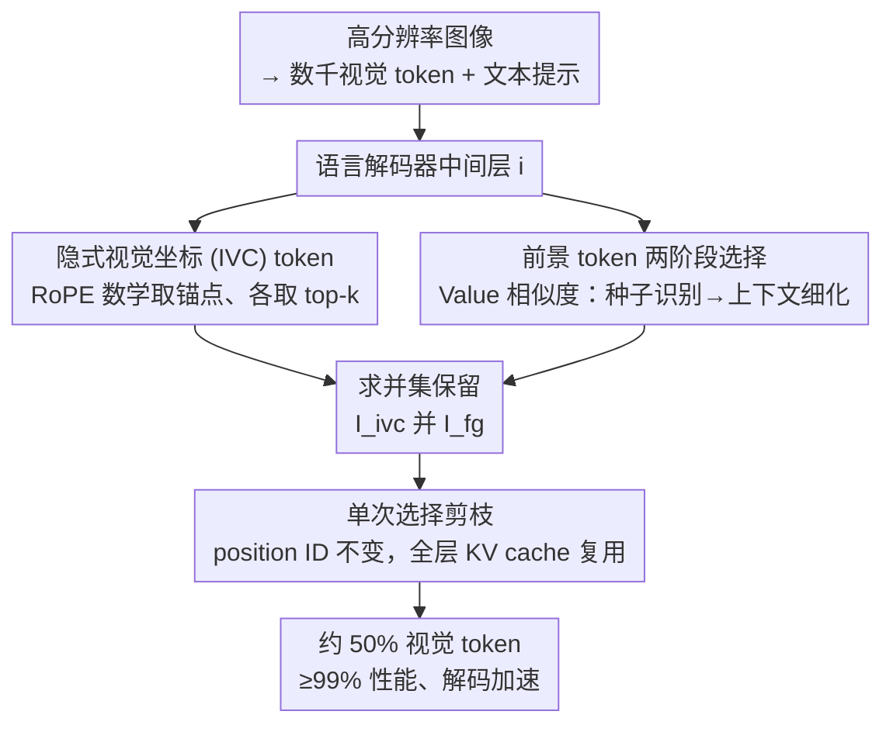

# IVC-Prune: Revealing the Implicit Visual Coordinates in LVLMs for Vision Token Pruning

**会议**: ICLR 2026  
**arXiv**: [2602.03060](https://arxiv.org/abs/2602.03060)  
**代码**: [GitHub](https://github.com/FireRedTeam/IVC-Prune)  
**领域**: 多模态VLM  
**关键词**: 视觉token剪枝, RoPE位置编码, 隐式视觉坐标, 空间推理, 训练免微调

## 一句话总结

揭示了LVLM中RoPE位置编码隐式建立的视觉坐标系统（IVC tokens），提出一种训练免的、提示感知的视觉token剪枝策略，在保留IVC tokens和语义前景token的同时，削减约50%视觉token并维持≥99%原始性能。

## 研究背景与动机

高分辨率图像输入会为大视觉-语言模型（LVLM）生成数千个视觉token，导致推理阶段内存占用大、延迟高。现有的视觉token剪枝方法主要关注语义相关性，通过注意力分数或相似度指标选择与文本语义对齐的token。然而，这些方法在空间敏感任务（如视觉定位、空间推理）上严重退化。原因在于：它们只保留语义相关的"前景"token，却丢弃了对空间推理至关重要的位置参考token。

作者首次深入分析了LVLM如何通过RoPE进行空间推理的机制。核心发现是：RoPE的旋转矩阵在特定token位置会近似于单位矩阵（实轴参考）或90°旋转矩阵（虚轴参考），这些位置的token天然充当隐式的视觉坐标锚点。当这些token被剪枝方法移除时，模型的空间推理能力会严重受损。

## 方法详解

### 整体框架

IVC-Prune 要解决的是：高分辨率图像让 LVLM 吐出数千个视觉 token，推理时显存和延迟都吃不消，但现成的剪枝方法一旦砍到空间敏感任务上就垮——它们只认"语义相关"，把支撑空间推理的位置锚点也一并丢了。IVC-Prune 的思路是在语言解码器某个中间层里并行选出两类该留的 token：一类是 RoPE 数学性质天然决定的**隐式视觉坐标（IVC）token**，撑起空间推理的参考系；另一类是和文本提示语义对齐的**前景 token**，盯住问题真正问的目标。两类各自算好后求并集 $\mathcal{I}_{\text{selected}} = \mathcal{I}_{\text{ivc}} \cup \mathcal{I}_{\text{fg}}$ 作为保留集，这份保留决定**只在这一层做一次**、再回头套用到所有层的 KV cache，其余视觉 token 一律删掉。整个过程不训练、不微调，提示一来就能算。

### 关键设计

**1. 隐式视觉坐标（IVC）token：从 RoPE 数学里挖出绝对位置锚点并定选**

这一步回答"凭什么有些 token 天生是坐标参考"，并把它落成可直接取用的保留集。RoPE 把每个 $d$ 维特征切成 $d/2$ 个二维子空间，对位置 $m$ 的 token 施加旋转，注意力分数因此写成

$$\text{Score}(\mathbf{q}_n, \mathbf{k}_m) = \mathbf{x}_n^T \mathbf{W}_q^T \mathbf{R}_{m-n} \mathbf{W}_k \mathbf{x}_m$$

它本质只依赖相对位置 $(m-n)$，可空间推理偏偏要绝对位置。关键洞察是：当某个 key token 位置 $m$ 的旋转矩阵 $\mathbf{R}_m$ 恰好近似单位矩阵或 90° 旋转矩阵时，相对旋转被"抵消"，注意力实际上隔离出了 query 自身的绝对位置分量 $\mathbf{R}_n$——这样的 $m$ 就成了一个可被全图引用的坐标锚点。找近似单位矩阵（实轴参考）等价于最大化余弦分数 $V(m) = \sum_{k=0}^{d/2-1} \cos(m\theta_k)$，找近似 90° 旋转（虚轴参考）等价于最大化正弦分数 $U(m) = \sum_{k=0}^{d/2-1} \sin(m\theta_k)$。有了这两条曲线，选 IVC token 就只是各取 top-$k_c$ 再合并：

$$\mathcal{I}_{\text{ivc}} = \arg\text{TopK}(\{V(m)\}, k_c) \cup \arg\text{TopK}(\{U(m)\}, k_c)$$

默认 $k_c = 10\%$，最终 IVC token 约占全部视觉 token 的一成。注意整步完全由位置和 $\theta_k$ 决定，跟图像内容、跟模型前向都无关，可以提前算好、不花任何推理成本——这正是它能即插即用、零开销的根源。

**2. 前景 token 两阶段选择：用 Value 向量绕开位置偏差**

光有坐标锚点不够，还得留住问题真正关心的目标 token。传统做法直接拿注意力分数挑前景，但注意力被位置编码污染，文本 token 会偏向关注空间上邻近的视觉 token 而非语义真正相关的。IVC-Prune 改用**不受位置编码影响的 Value 向量**算相似度来去偏，并分两阶段做。第一阶段"语义种子识别"先算文本 Value $\mathbf{V}_{\text{text}}$ 与图像 Value $\mathbf{V}_{\text{img}}$ 的相似度，对每个视觉 token 把各文本 token 的归一化注意力取平均

$$\mathbf{s} = \text{Mean}\left(\text{Softmax}\left(\frac{\mathbf{V}_{\text{text}} \cdot \mathbf{V}_{\text{img}}^T}{\sqrt{D}}\right)\right)$$

取 top 1% 视觉 token 当语义种子集 $\mathcal{I}_{\text{seed}}$。第二阶段"上下文前景细化"把这些种子和所有文本 token 拼成扩展查询集 $\mathbf{V}_{\text{query}}$，再算一次相似度得到细化分数 $\mathbf{f}$，取 top-$k_f$ 作为最终前景集 $\mathcal{I}_{\text{fg}}$。两阶段的意义在于：种子负责精准命中目标核心，细化负责把大目标或复杂目标的剩余部分补全，避免只圈到目标的一角。

**3. 单次选择剪枝：把多层剪枝压成一次操作**

最后一个设计纠正了一个普遍误解。先前工作认为 LVLM 对早期层剪枝特别敏感，于是层层小心翼翼。作者实验发现，这份敏感性其实来自 IVC token 被误删，而非剪枝本身——只要保住 IVC token，早期层照砍也不掉点。于是方案变得很干脆：在选定的某个中间层**一次性**确定保留集，position ID 保持原样不变，然后把这同一份选择回头应用到所有早期层的 KV cache、并沿用到后续层。这样做有三重好处——单次操作开销最小、避免浅层的不可靠选择污染后续计算、把 KV cache 压缩拉满从而加速解码。

### 损失函数 / 训练策略

IVC-Prune 是完全**训练免**的方法，不需要任何额外训练或微调。IVC token的选择由RoPE的数学性质直接决定，前景token的选择通过Value向量相似度计算完成。选择层 $i$ 通过在小规模验证集（RefCOCO testA 子集）上的经验表现确定后固定。

## 实验关键数据

### 主实验

在4个LVLM（Qwen2.5-VL-7B, InternVL-2.5-8B, DeepSeek-VL2-16B, LLaVA-v1.5-7B）和20个benchmark上评估。

**视觉定位任务（RefCOCO/RefCOCO+/RefCOCOg）**：

| 模型 | 方法 | 保留Token | 相对平均性能 |
|------|------|-----------|-------------|
| Qwen2.5-VL-7B | Vanilla | 100% | 100% |
| Qwen2.5-VL-7B | FastV | 54% | 84.7% |
| Qwen2.5-VL-7B | IVC-Prune | 50% | **99.6%** |
| InternVL-2.5-8B | Vanilla | 100% | 100% |
| InternVL-2.5-8B | FastV | 53% | 90.1% |
| InternVL-2.5-8B | IVC-Prune | 50% | **99.5%** |
| DeepSeek-VL2-16B | FastV | 54% | 96.7% |
| DeepSeek-VL2-16B | IVC-Prune | 52% | **99.0%** |

**通用VQA任务（9个benchmark平均）**：

| 模型 | 方法 | 保留Token | 相对平均性能 |
|------|------|-----------|-------------|
| Qwen2.5-VL-7B | Vanilla | 100% | 100% |
| Qwen2.5-VL-7B | FastV | 54% | 98.4% |
| Qwen2.5-VL-7B | IVC-Prune | 50% | **100.6%** |
| InternVL-2.5-8B | IVC-Prune | 50% | **99.6%** |
| DeepSeek-VL2-16B | IVC-Prune | 52% | **100.1%** |
| LLaVA-v1.5-7B | IVC-Prune | 28% | **101.3%** |

### 消融实验

**IVC tokens的影响（Qwen2.5-VL-7B）**：

| 方法 | 配置 | RefCOCO testA | RefCOCO+ testA | SEED | MMB |
|------|------|--------------|----------------|------|-----|
| Vanilla | 默认 | 92.2 | 88.0 | 76.7 | 82.4 |
| Vanilla | 移除IVC | 84.1 | 79.4 | 76.1 | 82.2 |
| FastV | 默认 | 74.4 | 68.9 | 72.9 | 80.5 |
| FastV | +IVC | 82.1 | 76.5 | 74.6 | 80.5 |
| PDrop | 默认 | 77.6 | 72.1 | 74.0 | 78.9 |
| PDrop | +IVC | 83.9 | 76.5 | 74.6 | 79.2 |

**推理效率（Qwen2.5-VL-7B, RefCOCO testA）**：

| 方法 | KV Cache | 预填充时间 | 解码延迟 | 总时间 | 准确率 |
|------|----------|-----------|---------|--------|--------|
| Vanilla | 26.0MB (1.0×) | 408ms | 65.3ms/tok | 60'17 | 92.2 |
| FastV | 16.1MB (1.6×) | 297ms | 62.7ms/tok | 51'51 | 74.4 |
| IVC-Prune | 15.9MB (1.6×) | 322ms | 60.2ms/tok | **47'47** | **92.0** |

### 关键发现

1. **IVC tokens对空间推理至关重要**：即使在未剪枝的Vanilla模型中，仅移除IVC tokens（约10%）就导致RefCOCO testA下降8.1个点，而SEED和MMB几乎不受影响
2. **IVC tokens可通用集成**：将IVC tokens加入FastV和PDrop后，它们的定位性能显著提升（FastV: +7.7, PDrop: +6.3）
3. **早期层敏感性的真正原因**：先前报告的早期层剪枝敏感性源于IVC tokens的意外移除，保留IVC tokens后即使在所有层剪枝也不影响性能
4. **跨模型规模一致性**：在3B、7B、32B参数的Qwen2.5-VL上表现一致

## 亮点与洞察

- **理论创新深刻**：首次从数学角度揭示LVLM通过RoPE隐式建立视觉坐标系统的机制，这不仅解释了为什么现有剪枝方法在空间任务上失败，也为理解LVLM的空间推理能力提供了新视角
- **实用性强**：完全训练免，IVC token的选择纯数学计算，前景token选择仅需一次Value向量相似度计算，可即插即用到现有LVLM
- **洞察力推动设计**：发现早期层敏感性根源后，提出单次选择策略，将剪枝从多层操作简化为单层操作，同时最大化KV cache节省
- **Value向量去偏**：巧妙利用Value向量不受位置编码影响的特性，解决了注意力分数的位置偏差问题

## 局限与展望

1. IVC tokens的比例（$k_c=10\%$）和前景tokens比例（$k_f=40\%$）为固定超参数，可能不适用于所有场景，动态比例调整值得探索
2. 选择层的确定需要在验证集上搜索，增加了一定的设置成本
3. 主要在2D静态图像上验证，对视频理解等动态场景的效果有待深入评估
4. 理论分析基于标准1D RoPE和2D RoPE，对于其他位置编码方案的推广性需要进一步研究

## 相关工作与启发

与StreamingLLM和SepLLM在LLM中保留"注意力汇"token和分隔符token的思想类似，IVC-Prune发现并保留了LVLM中的"坐标锚点"token。这暗示不同类型的"特殊token"在模型的不同能力中扮演关键角色。Value向量的去偏技巧也可能启发其他需要无偏特征选择的场景。

## 评分

- **新颖性**: ⭐⭐⭐⭐⭐ — 首次揭示RoPE隐式坐标系统，理论贡献突出
- **技术质量**: ⭐⭐⭐⭐⭐ — 数学分析严谨，两阶段前景选择设计优雅
- **实验充分度**: ⭐⭐⭐⭐⭐ — 4个模型×20个benchmark，消融全面
- **实用性**: ⭐⭐⭐⭐⭐ — 训练免即插即用，效率提升明显
- **写作质量**: ⭐⭐⭐⭐⭐ — 从理论发现到方法设计逻辑清晰
- **综合**: ⭐⭐⭐⭐⭐ (9.5/10)

<!-- RELATED:START -->

## 相关论文

- [\[CVPR 2026\] ZOO-Prune: Training-Free Token Pruning via Zeroth-Order Gradient Estimation in Vision-Language Models](../../CVPR2026/multimodal_vlm/zoo-prune_training-free_token_pruning_via_zeroth-order_gradient_estimation_in_vi.md)
- [\[CVPR 2026\] HAWK: Head Importance-Aware Visual Token Pruning in Multimodal Models](../../CVPR2026/multimodal_vlm/hawk_head_importance-aware_visual_token_pruning_in_multimodal_models.md)
- [\[AAAI 2026\] Rethinking Visual Token Reduction in LVLMs under Cross-Modal Misalignment](../../AAAI2026/multimodal_vlm/rethinking_visual_token_reduction_in_lvlms_under_cross-modal_misalignment.md)
- [\[ICLR 2026\] HiDrop: Hierarchical Vision Token Reduction in MLLMs via Late Injection, Concave Pyramid Pruning, and Early Exit](hidrop_hierarchical_vision_token_reduction_in_mllms_via_late_injection_concave_p.md)
- [\[ACL 2026\] HiPrune: Hierarchical Attention for Efficient Token Pruning in Vision-Language Models](../../ACL2026/multimodal_vlm/hiprune_hierarchical_attention_for_efficient_token_pruning_in_vision-language_mo.md)

<!-- RELATED:END -->
