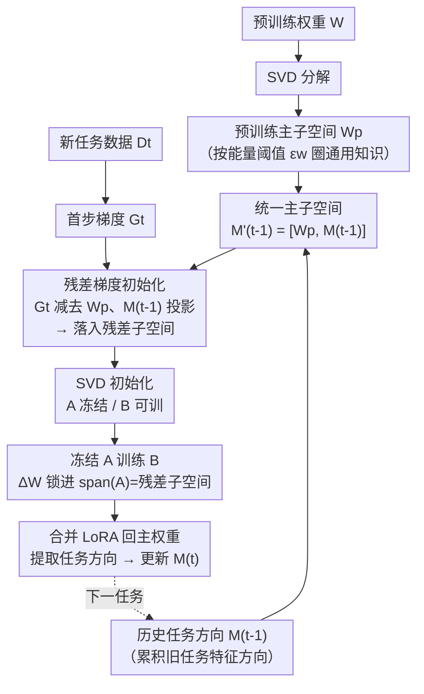

# KeepLoRA: Continual Learning with Residual Gradient Adaptation

**会议**: ICLR 2026  
**arXiv**: [2601.19659](https://arxiv.org/abs/2601.19659)  
**代码**: [GitHub](https://github.com/MaolinLuo/KeepLoRA)  
**领域**: 多模态VLM  
**关键词**: 持续学习, LoRA, 梯度投影, 子空间约束, 视觉-语言模型

## 一句话总结

通过分析预训练模型权重的SVD分解，发现通用知识编码在主子空间、领域特定知识编码在残差子空间，提出KeepLoRA方法将新任务的LoRA更新约束在残差子空间中，同时用梯度信息初始化以保持可塑性，在持续学习中达到前向稳定、后向稳定和可塑性的最优平衡。

## 研究背景与动机

预训练视觉-语言模型（VLM）在持续学习中面临三个相互竞争的目标：

**前向稳定性**：保留预训练的通用知识和零样本迁移能力

**后向稳定性**：不遗忘已学习的任务

**可塑性**：能有效学习新任务

现有方法各有局限：参考数据正则化（如ZSCL）依赖外部数据且计算开销大；架构扩展（如Prompt Pool、MoE适配器）增加推理成本且不真正将知识融入模型；现有的LoRA持续学习方法（O-LoRA、InfLoRA、SD-LoRA）缺乏对预训练通用知识的显式保护。

**关键发现**：通过SVD分解预训练权重矩阵，作者发现主子空间（大奇异值对应的方向）主要编码通用知识（在通用数据集上鲁棒），而残差子空间（小奇异值方向）编码领域特定知识（移除后特定数据集性能急剧下降）。这一发现直接指导了方法设计：新任务更新应约束在残差子空间。

## 方法详解

### 整体框架

KeepLoRA 要在持续学习里同时守住三个互相打架的目标——前向稳定（不丢预训练通用知识）、后向稳定（不忘旧任务）、可塑性（学得动新任务）。它的总思路是：先把"必须保护的知识方向"全部圈进一个**统一主子空间（unified principal subspace）**，再把每个新任务的 LoRA 更新强行约束到这个子空间的正交补——也就是残差子空间——里，从而在不碰旧知识的前提下学新任务。

具体走一条流水线：对预训练权重做 SVD 取出主子空间 $\mathbf{W}_p$（装通用知识），把历次旧任务的特征方向累积成 $\mathbf{M}_t$，两者拼成统一主子空间 $\mathbf{M}_t'$；新任务到来时，用第一步的真实梯度初始化 LoRA，并先把梯度投影到残差子空间、剔掉会破坏稳定性的分量；之后冻结 $\mathbf{A}$ 只训 $\mathbf{B}$，命题 3.1 保证这等价于把更新锁死在残差子空间内；训练完把 LoRA 合并回主权重、并把该任务的方向追加进 $\mathbf{M}_t$，进入下一个任务。

### 关键设计

**1. 预训练主子空间：把通用知识圈出来保护**

要保住前向稳定性，第一步就得把"通用知识住在哪里"显式标出来。作者对每个待更新的权重矩阵 $\mathbf{W} \in \mathbb{R}^{d_{in} \times d_{out}}$ 做 SVD 分解 $\mathbf{W} = \mathbf{U}\mathbf{S}\mathbf{V}^\top$，取前 $p$ 个左奇异向量拼成主子空间 $\mathbf{W}_p = \mathbf{U}_{:,1:p}$。$p$ 不是拍脑袋定的，而是由能量约束卡出来——只要保留的主分量能量占到原矩阵的 $\epsilon_w$ 比例即可：

$$\|\mathbf{W}_p\|_F^2 \geq \epsilon_w \|\mathbf{W}\|_F^2,\quad \epsilon_w \in (0,1)$$

这正对应那个核心发现：大奇异值方向编码通用知识、改动它通用任务才会崩。实验里只需少量主分量就能覆盖几乎全部通用知识，所以 $\mathbf{W}_p$ 很瘦，留给后续任务的残差空间足够大。

**2. 统一主子空间：把每个旧任务方向也纳入同一张约束清单**

光保护预训练知识还不够，已经学过的任务也不能忘，所以每学完一个任务就要把它的"特征方向"记下来、并入受保护清单。学完第 $t$ 个任务后，作者先把该任务的特征 $\mathbf{X}_t$ 里已经被主子空间和历史任务方向覆盖的部分减掉，只留真正新增的成分：

$$\hat{\mathbf{X}}_t = \mathbf{X}_t - \mathbf{W}_p \mathbf{W}_p^\top \mathbf{X}_t - \mathbf{M}_{t-1} \mathbf{M}_{t-1}^\top \mathbf{X}_t$$

再对残量 $\hat{\mathbf{X}}_t$ 做 SVD，取前 $m$ 个奇异向量追加进方向矩阵 $\mathbf{M}_t = [\mathbf{M}_{t-1}, \mathbf{V}_{t(:,1:m)}]$，$m$ 同样由能量阈值 $\epsilon_f$ 动态决定。先减投影再提取这一步是关键：它保证新记录的方向和已有的不重复，矩阵不会因信息冗余而膨胀。由于 $\mathbf{W}_p$ 和 $\mathbf{M}_t$ 都活在同一个 $d_{in}$ 维特征空间里，直接拼成统一主子空间：

$$\mathbf{M}_t' = [\mathbf{W}_p, \mathbf{M}_t]$$

此后新任务的任何更新都必须与 $\mathbf{M}_{t-1}'$ 正交——一个正交约束同时罩住了通用知识和所有旧任务。两类方向共享同一空间，清单的总向量数上界就是 $d_{in}$，存储开销天然封顶、不随任务数无限膨胀。

**3. 残差梯度初始化：在正交补里给可塑性留出口**

前两步都在做"减法"保护旧知识，这一步要补回可塑性，否则新任务无从学起。做法是用第一步训练的真实梯度 $\mathbf{G}_t = \nabla_{\mathbf{W}} \mathcal{L}(\mathbf{W}; \mathcal{D}^t)$ 来初始化 LoRA，因为它天然指向"对新任务最有用"的全参微调方向。但直接用会撞上受保护方向，所以先把梯度投影到残差子空间、减掉会破坏稳定性的分量：

$$\hat{\mathbf{G}}_t = \underbrace{\mathbf{G}_t}_{\text{可塑性}} - \underbrace{\mathbf{W}_p \mathbf{W}_p^\top \mathbf{G}_t - \mathbf{M}_{t-1} \mathbf{M}_{t-1}^\top \mathbf{G}_t}_{\text{前向+后向稳定性}}$$

这一个式子把三个目标揉在一起：保留的 $\mathbf{G}_t$ 给可塑性，减去的两项分别保前向稳定（不动通用知识）和后向稳定（不动旧任务）。随后对 $\hat{\mathbf{G}}_t$ 做 SVD，取前 $r$ 个分量初始化 LoRA：

$$\mathbf{A} = \mathbf{U}_{:,1:r}, \quad \mathbf{B} = \mathbf{S}_{1:r} \mathbf{V}_{:,1:r}^\top$$

其中 $\mathbf{A}$ 冻结、只训练 $\mathbf{B}$。由于初始的 $\frac{\alpha}{r}\mathbf{AB} \neq 0$，为了不改变模型当前功能，要把原参数对应扣掉这部分：$\mathbf{W}' = \mathbf{W} - \frac{\alpha}{r}\mathbf{AB}$。

**4. 冻结 A 训练 B：用参数化结构硬保证子空间约束**

前一步"冻 $\mathbf{A}$ 只训 $\mathbf{B}$"看似只是实现技巧，命题 3.1 证明它其实把整个梯度下降约束在了 $\text{span}(\mathbf{A})$ 内：

$$\Delta\mathbf{W} = \frac{\alpha}{r}\mathbf{A}\Delta\mathbf{B} = -c\mathbf{A}\mathbf{A}^\top\mathbf{G}_t$$

这里 $\mathbf{A}\mathbf{A}^\top$ 恰是一个正交投影算子，所以无论怎么训 $\mathbf{B}$，权重的实际变化都被自动投影回 $\text{span}(\mathbf{A})$——也就是上一步精心挑出的残差子空间。论文进一步要求 $\text{span}(\mathbf{A})$ 满足两条性质：与受保护知识子空间正交（防前向/后向遗忘）、且捕获 $\mathbf{G}_t$ 的主方向（保可塑性），而梯度初始化恰好让 $\mathbf{A}$ 同时满足两者。换句话说，可塑性与稳定性的平衡不靠额外正则项软约束，而是被参数化结构硬性保证。

### 损失函数 / 训练策略

训练仅使用标准分类损失 $\mathcal{L}_{\text{cls}}(\mathbf{B}_t)$，不需要额外正则项或参考数据。每个新任务到来时：
1. 计算第一步梯度，投影到残差子空间，SVD初始化LoRA
2. 冻结 $\mathbf{A}$，训练 $\mathbf{B}$
3. 训练完成后合并LoRA到主权重：$\mathbf{W} = \mathbf{W}' + \frac{\alpha}{r}\mathbf{AB}$
4. 提取该任务主特征方向，更新统一主子空间

## 实验关键数据

### 主实验

**MTIL设置（11个数据集序列，CLIP ViT-B/16）**：

| 方法 | 保持架构 | 无需额外数据 | Transfer↑ |
|------|---------|-------------|----------|
| Zero-shot | ✓ | ✓ | 65.4 |
| ZSCL | ✓ | ✗ | 68.1 |
| O-LoRA | ✓ | ✓ | 66.5 |
| InfLoRA | ✓ | ✓ | 67.4 |
| SD-LoRA | ✓ | ✓ | 67.1 |
| **KeepLoRA** | ✓ | ✓ | **69.0** |
| MoE-Adapters | ✗ | ✗ | 68.9 |
| IAP | ✗ | ✓ | 69.2 |
| **KeepLoRA+** | ✗ | ✓ | **69.9** |

KeepLoRA在保持原始架构且不使用额外数据的前提下取得最佳Transfer性能。

**关键数据集Transfer指标对比**：

| 方法 | Aircraft | DTD | EuroSAT | Flowers | OxfordPet | Cars |
|------|----------|-----|---------|---------|-----------|------|
| O-LoRA | 80.8 | 44.5 | 49.8 | 67.5 | 88.7 | 56.1 |
| InfLoRA | 84.3 | 44.3 | 50.6 | 68.2 | 88.7 | 57.8 |
| **KeepLoRA** | 84.6 | **45.9** | **54.3** | **70.1** | **90.3** | **59.5** |

### 消融实验

各组件贡献验证：

1. **去除预训练主子空间保护（$\mathbf{W}_p$）**：forward stability显著下降，通用任务迁移能力退化
2. **去除梯度初始化，改用随机初始化**：可塑性下降，Last指标退化
3. **去除任务方向矩阵（$\mathbf{M}_t$）**：backward stability下降，早期任务准确率降低
4. **能量阈值 $\epsilon_w$ 的影响**：过低导致保护不足，过高导致残差空间太小影响可塑性

### 关键发现

1. **主/残差子空间的知识编码分离**：通过仅用前 $p$ 个主奇异分量重建权重，通用数据集（ImageNet、CIFAR100等）性能几乎不变，但特定领域数据集（Aircraft、DTD、EuroSAT等）性能急剧下降
2. **梯度投影等价性**：冻结A训练B在数学上等价于在span(A)子空间内做梯度下降
3. **统一子空间的紧凑性**：总大小上界为 $d_{in}^2$，不会随任务数无限增长
4. **在LLaVA上的验证**：KeepLoRA不仅在CLIP双编码器模型上有效，在encoder-decoder架构的LLaVA上也取得SOTA

## 亮点与洞察

- **发现驱动的优雅设计**：从"通用知识在主子空间、特定知识在残差子空间"这一经验发现出发，自然推导出方法，逻辑链条清晰完整
- **三目标统一框架**：通过一个公式同时兼顾三个目标——梯度保可塑性，减去主子空间投影保前向稳定，减去任务方向投影保后向稳定
- **零推理开销**：LoRA训练后可合并到原权重，不增加任何推理参数或计算
- **无需外部数据**：不依赖参考数据集或生成模型，在实际部署中更可行

## 局限与展望

1. 随着任务序列增长，残差子空间会逐渐缩小，长序列场景下可塑性可能退化
2. 能量阈值 $\epsilon_w$ 和 $\epsilon_f$ 需要手动设定，自适应确定策略值得研究
3. SVD分解每个权重矩阵的计算成本在大模型上可能较高
4. 仅在分类任务上验证，对生成任务（如VQA、image captioning）的效果有待探索
5. 统一主子空间假设各任务特征方向正交，当任务数量极多时这一假设可能不成立

## 相关工作与启发

与GPM（Gradient Projection Memory）一脉相承，但关键区别在于显式保护预训练主子空间。与InfLoRA只约束特征方向正交不同，KeepLoRA同时约束梯度方向和初始化方向都在残差子空间。梯度引导初始化的思想可推广到其他参数高效微调场景。

## 评分

- **新颖性**: ⭐⭐⭐⭐ — 主/残差子空间编码分离的发现有启发性
- **技术质量**: ⭐⭐⭐⭐⭐ — 理论证明完备，公式推导严谨
- **实验充分度**: ⭐⭐⭐⭐ — 多设置多数据集验证，消融完整
- **实用性**: ⭐⭐⭐⭐⭐ — 无需外部数据，零推理开销，部署友好
- **写作质量**: ⭐⭐⭐⭐ — 结构清晰，但符号较多需要仔细阅读
- **综合**: ⭐⭐⭐⭐ (8.5/10)

<!-- RELATED:START -->

## 相关论文

- [\[CVPR 2026\] Octopus: History-Free Gradient Orthogonalization for Continual Learning in Multimodal Large Language Models](../../CVPR2026/multimodal_vlm/octopus_history-free_gradient_orthogonalization_for_continual_learning_in_multim.md)
- [\[ICLR 2026\] Enhanced Continual Learning of Vision-Language Models with Model Fusion](enhanced_continual_learning_of_vision-language_models_with_model_fusion.md)
- [\[CVPR 2026\] Multimodal Continual Instruction Tuning with Dynamic Gradient Guidance](../../CVPR2026/multimodal_vlm/multimodal_continual_instruction_tuning_with_dynamic_gradient_guidance.md)
- [\[NeurIPS 2025\] Continual Multimodal Contrastive Learning](../../NeurIPS2025/multimodal_vlm/continual_multimodal_contrastive_learning.md)
- [\[CVPR 2026\] Test-Time Distillation for Continual Model Adaptation](../../CVPR2026/multimodal_vlm/test-time_distillation_for_continual_model_adaptation.md)

<!-- RELATED:END -->
