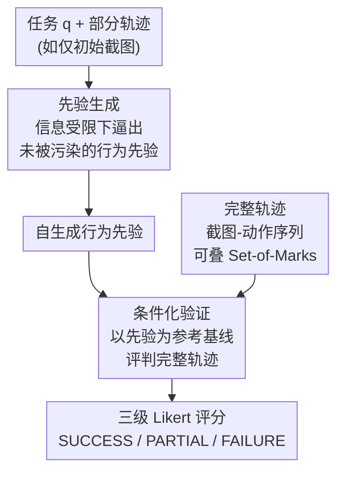

# Let's Think in Two Steps: Mitigating Agreement Bias in MLLMs with Self-Grounded Verification

**会议**: ICLR 2026  
**arXiv**: [2507.11662](https://arxiv.org/abs/2507.11662)  
**代码**: [项目主页](https://github.com/GT-RIPL/SGV)  
**领域**: 多模态VLM  
**关键词**: mllm-as-verifier, agreement-bias, self-grounded-verification, agent-evaluation, robotics  

## 一句话总结

本文发现多模态大语言模型（MLLM）作为 agent 行为验证器时存在严重的"同意偏差"（agreement bias）——系统性地过度认可 agent 行为，并提出 Self-Grounded Verification（SGV）方法，通过两步生成（先提取行为先验、再条件化验证）缓解该偏差，在 web 导航、桌面操作和机器人操控任务中将失败检测率提升最高 25pp、准确率提升 14pp。

## 背景与动机

1. **验证器是 AI 进步的核心引擎**：从围棋到代码推理，搜索+验证器范式推动了多项突破，但开放式任务（如网页操作、机器人抓取）缺乏形式化的成功判定标准，难以构建可靠的自动验证器。

2. **MLLM 被寄望充当通用验证器**：凭借广泛的世界知识、人类偏好对齐和多模态推理能力，MLLM 理论上适合对 agent 轨迹做打分/评判，已被用于轨迹筛选、Reflexion 自我改进、在线监督等多种场景。

3. **Agreement bias 问题普遍而严重**：作者在 13+ 模型家族、28+ 评估模板上发现，MLLM 系统性倾向给 agent 行为打高分——TNR（真阴性率）低至 50%，即一半失败轨迹被错误判为成功。更令人担忧的是，MLLM 会生成 CoT 来"合理化"其错误判断。

4. **现有 test-time scaling 技术无法解决**：CoT、SoM、majority voting、reasoning model 等主流方法均无法有效缓解偏差，甚至 sampling 可能因幻觉而加剧问题。

5. **偏差根源在知识提取瓶颈**：MLLM 实际上拥有正确的行为先验（在只给部分信息时能描述正确行为），但在面对完整轨迹时这些先验被"覆盖"，这与预训练和 RLHF 的已知局限一致。

6. **下游应用受损严重**：agreement bias 会污染自我改进管道（Reflexion）、在线监督反馈、行为克隆数据筛选等依赖 MLLM 判断的应用，导致 agent 无法获得纠正信号。

## 方法详解

### 整体框架

SGV（Self-Grounded Verification，自我接地验证）是一个零样本、无需训练的两步验证框架，要解决的是"MLLM 当 agent 行为验证器时系统性给好评"的同意偏差。它把验证拆成两步：第一步让 MLLM 在只看到部分轨迹信息的"信息受限"条件下，自由生成"正确行为应该长什么样"的行为先验；第二步再把这些自生成先验当作参考基线，去条件化地评判完整轨迹是否成功，并打出三级 Likert 评分。这样拆分正好绕开 agreement bias 的成因——MLLM 本就持有正确的行为先验，但当完整轨迹一并送入时先验会被轨迹内容"覆盖"，模型于是盲目顺从眼前所见；先把先验单独取出来、再让它当尺子，模型就不会一上来就被轨迹牵着走。

### 关键设计

**1. 先验生成：在信息受限下逼出未被污染的行为知识**

第一步只给模型任务 $q$ 和部分轨迹 $\tau_{u:v}$（例如初始截图），让它生成关于"正确行为应该长什么样"的广泛先验 $\hat{k}$，形式化为 $\hat{k}_{q,u:v} = g\left(\prod_{i=1}^{n} P(y_i \mid y_{<i}, \tau_{u:v}, C, q)\right)$。这一步直接针对偏差的根因：此时待评估的完整轨迹尚未进入上下文，模型无从顺从其中呈现的"既成事实"，因而能更自由地在自身概率分布上探索，提取出与任务相关、却不被评估数据干扰的知识。换句话说，它把模型脑中本就存在、平时被轨迹压住的正确先验显式地"取"了出来。论文消融还发现：先验生成必须独立成步——若把先验和验证揉在一次调用里（monolithic），先验会被同时输入的轨迹锚定，反而退化；而先验生成得越宽泛、越包罗，效果越好。

**2. 条件化验证：用自生成先验当裁判的参考基线**

第二步把第一步产出的 $\hat{k}_q$ 作为条件，再让模型对完整轨迹 $\tau_{p:t}$ 推理打分：$r_{\text{SGV}}(\tau_t, C, q) = h\left(\prod_{i=1}^{n} P(y_i \mid y_{<i}, q, \tau_{p:t}, C, \hat{k}_q)\right)$。先验在此充当一把"公正的尺子"——模型不再只盯着轨迹里看似合理的操作，而是先对照自己事先写下的正确行为标准，再判断眼前轨迹是否真的达标。由于第二步是在先验诱导出的条件分布上采样，输出分布更均衡、校准更好，"系统性高估"被压了下来。这也解释了为什么 CoT、SoM、多数投票这些方法无效：它们都在原本就偏斜的分布上做聚合或推理，而 SGV 改的是条件分布本身。

**3. 三级 Likert 评分与轨迹表示：让判断更有梯度、视觉更可定位**

评分不用二元的成功/失败，而采用 SUCCESS / PARTIAL SUCCESS / FAILURE 三级量表（映射为 $[1,0,0]$ 对齐 oracle 分数）。论文在 28 套评分模板上发现：MLLM 的回答天然挤向高分区，二元量表会放大这种 agreement bias，而三级梯度给了模型表达"部分成功"的空间，分布更均衡、偏差更小。轨迹本身表示为截图-动作序列对，并可选叠加 Set-of-Marks（界面元素编号标注）来增强视觉定位。整个 SGV 不改任何参数，可直接叠在任意 MLLM 上，兼容推理模型，甚至能让非推理模型在验证任务上达到推理模型的水平。

## 实验结果

### 实验设置

- **环境**：VisualWebArena（910 任务，web 导航）、OSWorld（369 任务，桌面操作）、robomimic（机器人操作，tool-hang 任务）
- **模型**：14 个模型覆盖 GPT-5/o4、Gemini 2.5、Qwen3-235B、Llama-4 等
- **Agent**：VWA 用 Gemini-2.5-Flash ReAct agent（SR=47%），OSWorld 用 UI-TARS-1.5（SR=22%），robomimic 用 diffusion policy

### 表1：离线验证性能（VWA + OSWorld 合并）

| 模型 | Acc (无SGV) | TNR (无SGV) | Acc (SGV) | TNR (SGV) | Acc↑ | Bias↓ |
|------|------------|------------|----------|----------|------|-------|
| GPT-5 (T) | 81 | 78 | 86 | 87 | +5 | -6 |
| GPT-o4 (T) | 78 | 71 | 84 | 82 | +6 | -6 |
| GPT-4.1 Mini | 60 | 40 | 74 | 65 | +14 | -20 |
| Gemini-2.5-Flash (T) | 74 | 64 | 82 | 78 | +8 | -15 |
| Qwen3-235b (T) | 66 | 53 | 77 | 71 | +11 | -12 |
| Llama-4-Maverick | 60 | 44 | 65 | 54 | +5 | -7 |

SGV 在所有模型上一致提升 TNR（最高+25pp）和准确率（最高+14pp），弱模型受益最大。

### 表2：下游任务——在线监督与自我改进

| 方法 | VWA 全部 | VWA S/C/R | OSWorld | robomimic SR |
|------|---------|-----------|---------|-------------|
| Base Agent | 45 | 50/35/48 | 22 | 24 |
| + Verifier 无SGV | 46 | 52/36/49 | 24 | 16 |
| + Verifier SGV | **54** | 56/43/58 | **27** | **32** |

SGV 在 VWA 上提升 9pp（20% 相对），OSWorld 提升 5pp（22%），robomimic 提升 8pp（33%）。VWA 达到新 SOTA，超越此前最佳 20pp。值得注意的是，无 SGV 的验证器在 robomimic 上反而降低了性能（24→16），说明 agreement bias 在机器人任务中危害尤其严重。

## 亮点与创新

- **问题定义精准**：首次系统性定义并量化 agreement bias，跨 13+ 模型家族验证其普遍性和对下游应用的实际危害
- **方法极其简洁**：SGV 是零样本、无训练的两步 prompting 方法，极易集成到现有 pipeline
- **评估全面**：覆盖离线评估和两种下游应用（自我改进+在线监督），使用细粒度指标而非仅报告准确率
- **发现深刻**：揭示了推理模型同样受 agreement bias 影响，SGV 能在推理模型上额外提升 6-11pp

## 局限性

- **未彻底消除偏差**：SGV 缓解但不根除 agreement bias，剩余失败多源于基础模型视觉感知与语言整合能力不足
- **计算开销增加**：两步调用使 token 消耗增至 1.5-2.2 倍，在大规模场景下需权衡成本
- **先验质量受限**：先验生成依赖 MLLM 自身能力，若模型对任务领域知识不足，先验质量难以保证
- **环境覆盖有限**：仅在 web/桌面/机器人三类环境验证，更复杂的开放世界场景（如自动驾驶）待探索

## 相关工作对比

### vs. Pan et al. (2024) — GPT-4V 评估器

Pan et al. 使用 GPT-4V 加 benchmark 特定 rubric 做二元判断，被后续多项工作沿用。本文指出二元评分放大 agreement bias，且即使提供人工 rubric 也无法解决（Tab.3 第 6 行 Acc 仅 66%）。SGV 不需要人工 rubric 即超越其效果（Acc 76+），更具扩展性。

### vs. Reasoning Models（DeepSeek-R1, GPT-o1/o4）

推理模型通过 RL 训练生成思维链，理论上应更擅长验证。但实验表明推理模型仍受 agreement bias 影响（GPT-o1 TNR 仅 62%）。SGV 能额外提升推理模型 6-11pp，说明偏差根源在知识提取瓶颈而非推理能力本身。

### vs. Majority Voting / Tree Search

Majority voting 依赖输出分布的众数，但 agreement bias 导致分布本身偏斜（失败轨迹仅 48% 概率采到正确判断），投票无法修正系统性偏差。SGV 从根本上改变条件分布，而非在偏斜分布上做聚合。

## 评分

- ⭐⭐⭐⭐⭐ 创新性：首次形式化 agreement bias 并给出简洁有效的解法
- ⭐⭐⭐⭐⭐ 实验充分度：14 个模型、3 个环境、28+ 模板、离线+下游评估，极为全面
- ⭐⭐⭐⭐ 写作质量：结构清晰论证严密，但数学符号偏多，部分段落较密集
- ⭐⭐⭐⭐ 实用价值：SGV 即插即用对 agent 系统有直接帮助，但 token 开销需关注

<!-- RELATED:START -->

## 相关论文

- [\[CVPR 2026\] Consensus Entropy: Harnessing Multi-VLM Agreement for Self-Verifying and Self-Improving OCR](../../CVPR2026/multimodal_vlm/consensus_entropy_harnessing_multi-vlm_agreement_for_self-verifying_and_self-imp.md)
- [\[CVPR 2026\] Self-Consistency for LLM-Based Motion Trajectory Generation and Verification](../../CVPR2026/multimodal_vlm/self-consistency_for_llm-based_motion_trajectory_generation_and_verification.md)
- [\[AAAI 2026\] SAGE: Spuriousness-Aware Guided Prompt Exploration for Mitigating Multimodal Bias](../../AAAI2026/multimodal_vlm/sage_spuriousness-aware_guided_prompt_exploration_for_mitigating_multimodal_bias.md)
- [\[ACL 2026\] VIGNETTE: Socially Grounded Bias Evaluation for Vision-Language Models](../../ACL2026/multimodal_vlm/vignette_socially_grounded_bias_evaluation_for_vision-language_models.md)
- [\[ICML 2026\] Mitigating Perceptual Judgment Bias in Multimodal LLM-as-a-Judge via Perceptual Perturbation and Reward Modeling](../../ICML2026/multimodal_vlm/mitigating_perceptual_judgment_bias_in_multimodal_llm-as-a-judge_via_perceptual_.md)

<!-- RELATED:END -->
