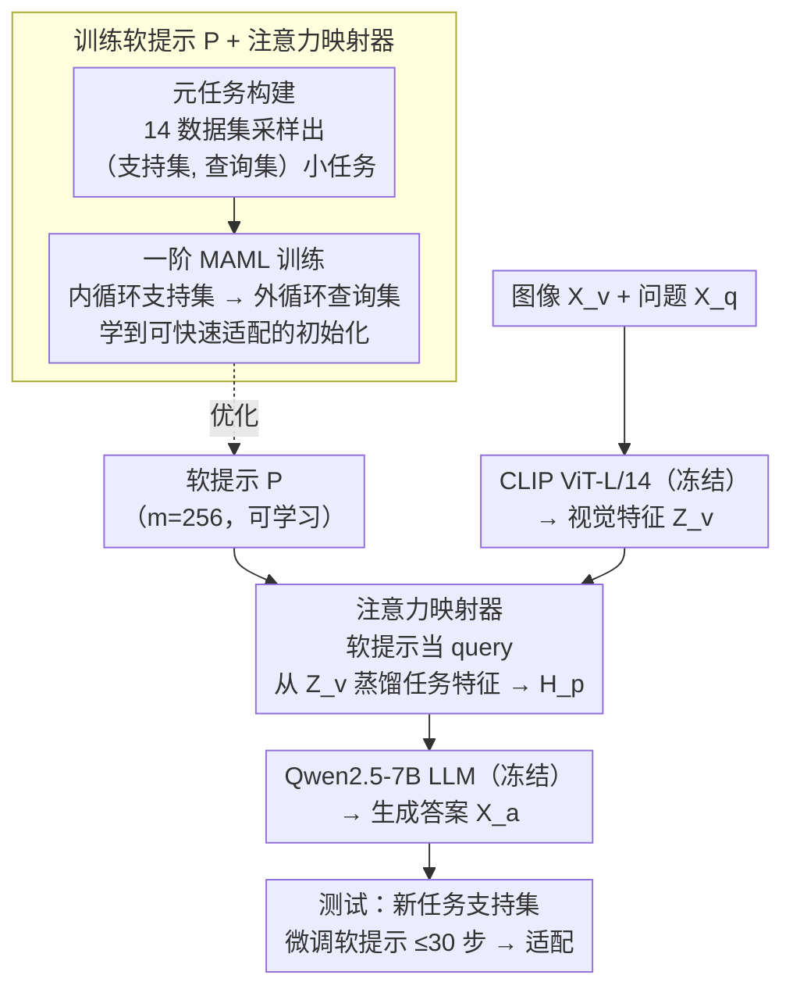

# Meta-Adaptive Prompt Distillation for Few-Shot Visual Question Answering

**会议**: ICLR 2026  
**arXiv**: [2506.06905](https://arxiv.org/abs/2506.06905)  
**代码**: 无  
**领域**: 多模态学习 / 少样本学习  
**关键词**: 元学习, 提示蒸馏, 少样本VQA, LMM, MAML

## 一句话总结

提出 MAPD（Meta-Adaptive Prompt Distillation），一种基于 MAML 元学习的提示蒸馏方法，通过注意力映射器从任务相关的图像特征中蒸馏软提示，使 LMM 在测试时仅用少量梯度步即可适应新的视觉问答任务，性能超越 ICL 21.2%。

## 研究背景与动机

大型多模态模型（LMM）通常依赖上下文学习（ICL）来处理少样本任务，但存在关键问题：

**小模型的 ICL 表现不稳定**：<7B 参数的模型在增加上下文示例时，性能常停滞甚至下降，尤其在 VQA 任务中

**图像嵌入的信息过载**：模型被图像嵌入中与下游任务无关的额外信息所淹没，无法有效聚焦于任务相关特征

**ICL 的非单调性**：随着 shot 数增加，性能不一定单调提升——这与人类的少样本学习直觉相矛盾

作者假设：问题在于 ICL 无法有效地从图像嵌入中提取任务特定信息。解决思路是学习一组固定的软提示，通过蒸馏获得任务相关的图像特征，并在测试时通过少量梯度更新进行快速适应。

## 方法详解

### 整体框架

MAPD 在 LLaVA v1.5 架构上把一组可学习软提示插进视觉到语言的通路里：CLIP ViT-L/14 视觉编码器和 Qwen2.5-7B-Instruct 语言模型全程冻结，只训练夹在中间的注意力映射器与软提示（约 24M 参数）。前向通路是「图像 → CLIP 编码 → 注意力映射器把任务信息蒸馏进软提示 → LLM 生成答案」；这组软提示和映射器并非随机初始化，而是先做特征对齐预训练，再用一阶 MAML 在大量"元任务"上训练，让它落在一个"离许多任务最优解都近"的初始化。测试时只需在新任务的支持集上对软提示走少量梯度步，就能快速适配。

### 关键设计

**1. 注意力映射器：用注意力把任务信息从图像特征里蒸馏出来**

ICL 的痛点在于模型被整段图像嵌入里大量与任务无关的信息淹没，难以聚焦。MAPD 把 LLaVA v1.5 原本的 MLP 投影层换成一个注意力映射器：先将 $m=256$ 个可学习软提示 $P$ 与视觉特征 $Z_v$ 拼成序列 $C=(P, Z_v)$，再过多头注意力 $H_{p+v}=\sigma(QK^T)\cdot V$（其中 $Q,K,V$ 由各自的投影矩阵作用在 $C$ 上得到），最后只取输出前 $m$ 个嵌入作为任务特定的图像提示 $H_p$ 送入 LLM。这样软提示充当"查询"，主动从图像特征中抽取任务相关内容，而不是让 LLM 被动消化冗长的原始嵌入序列；映射器与软提示一起训练，可训练参数仅约 24M。

**2. 元任务构建：把训练数据组织成模拟测试场景的小任务**

光有映射器还不够，软提示得学会"看几个示例就适应"。为此作者不直接喂样本，而是从混合训练集中采样构造一批元任务 $T_j=\{D_{supp}, D_{query}\}$，每个任务都带支持集和查询集，复刻测试时"看几个示例、答新问题"的少样本结构。数据混合覆盖 14 个数据集、约 802K 样本，保证任务之间足够多样，逼着软提示学到跨任务通用的初始化而非记住某个具体任务——任务越多样，下一个设计点学到的初始化才越"通用"。

**3. 一阶 MAML 训练：让软提示学到一个"几步就能适配"的初始化**

在这些元任务上，训练用双层优化：内循环在支持集上算损失并更新出任务特定参数 $\theta_p'=\theta_p-\alpha\nabla_{\theta_p}L_{supp}$，外循环再用这套任务特定参数在查询集上算损失、回头更新元参数 $\theta_p:=\theta_p-\beta\sum_j\nabla_{\theta'_{p,j}}L_{query}$。为避免二阶导数带来的 Hessian-向量积开销，这里采用 MAML 的一阶近似，大幅节省显存。具体超参为内循环 5 步、$\alpha=0.1$，外循环 $\beta=10^{-3}$。这样学到的软提示初始化恰好处在"离许多任务最优解都很近"的位置，测试时最多 30 个梯度步即可收敛到新任务。

### 损失函数 / 训练策略

训练目标是最大化答案似然 $p_{\theta_p}(X_a \mid X_v, X_q)$。流程分两阶段：预训练阶段在 LCS-558K 上训练 4 个 epoch（学习率 2e-3）做特征对齐；微调阶段只训练 1 个 epoch，套用上面的 MAML 双层优化。测试时则在新任务的支持集上对软提示微调最多 $K=30$ 个梯度步完成适配。

## 实验关键数据

### 主实验

在 VL-ICL Bench 上的表现（FT 适应模式，准确率 %）：

| 数据集 | 方法 | 1-S | 2-S | 4-S | 5/8-S | 平均 |
|--------|------|-----|-----|-----|-------|------|
| Open-MI (2-way) | NoMeta-task | 21.5 | 67.5 | 89.0 | 94.0 | 68.0 |
| | **MAPD** | **43.5** | **78.0** | **94.5** | **95.5** | **77.9** |
| Operator Induction | Multi-TaskPD | 31.0 | 28.3 | 61.0 | 60.0 | 45.1 |
| | **MAPD** | **32.0** | **38.3** | **58.3** | **62.0** | **47.7** |
| CLEVR Count | Multi-TaskPD | 25.0 | 25.5 | 31.0 | 38.0 | 29.9 |
| | **MAPD** | **26.5** | **27.5** | **31.0** | **40.5** | **31.4** |
| TextOCR | Multi-TaskPD | 21.0 | 20.5 | 24.5 | 25.5 | 22.9 |
| | **MAPD** | **23.5** | **26.5** | **27.0** | **28.5** | **26.4** |

### 与 ICL 的对比

| 适应方式 | 平均改善 | 说明 |
|---------|---------|------|
| FT vs ICL | +21.2% | 微调适应全面优于上下文学习适应 |
| MAPD vs Multi-TaskPD (FT) | +3.5% (TextOCR) | 元学习进一步提升跨任务泛化 |
| MAPD vs In-ContextPD (ICL) | 显著优势 | 在所有数据集上更优 |

### 消融实验

| 配置 | 关键指标 | 说明 |
|------|---------|------|
| 软提示数量 | MAPD 随提示增多而提升 | In-ContextPD 反而下降 |
| 图像扰动鲁棒性 | MAPD 平均下降 1.3% | 其他方法下降 2.3-7.0% |
| 相似样本选择 | 所有方法均受益 | FT 适应比 ICL 更鲁棒 |

### 关键发现

1. **MAPD 是唯一展现严格单调递增的方法**：随 shot 数增加，性能持续提升
2. **元学习的优势在 2-shot 时最显著**：在 Operator Induction 任务上超越 Multi-TaskPD 10%
3. **仅训练 24M 参数**，7B 模型即可超越 72B LLaVA-OneVision 在 Open-MI 上的 ICL 性能
4. **对图像扰动最鲁棒**：CutMix/MixUp 等强扰动下仍保持接近原始性能

## 亮点与洞察

- **提示蒸馏的核心洞察**：与其让 LMM 直接从冗长的图像嵌入序列中提取信息（ICL），不如学习一组精炼的软提示来"蒸馏"任务相关的视觉信息
- **元学习 + 提示调优的结合**：MAML 学到的初始化使得仅需 30 个梯度步即可适应全新任务，避免了过拟合
- **参数效率**：24M 可训练参数，远少于全模型微调，但效果更好
- **Operator Induction 的三层分解**（Task Induction + Perception + Math Reasoning）提供了理解模型能力的细粒度视角

## 局限与展望

1. **仅限单图像 VQA**：未扩展到多图像场景
2. **测试时计算开销**：FT 适应需要约 5 倍于 ICL 的计算量（30 个梯度步）
3. **任务复杂度有限**：测试任务相对简单（2-way 分类、简单数学），更复杂推理任务的效果尚不确定
4. **LLM 冻结**：如果 LLM 本身也参与微调，可能会有更好的效果
5. 可以探索不同架构的注意力映射器（如交叉注意力、可变分辨率等）

## 相关工作与启发

- **MAML 在 VLM 中的应用**：延续了 Qin et al. (2023) 和 Najdenkoska et al. (2023) 的路线，但首次在大规模 LMM（7B）中验证了元学习提示蒸馏的有效性
- **与 Flamingo、MMICL 等 ICL 方法的对比**：证明了参数高效的微调适应可以超越纯 ICL 方法
- 启发：对于小模型（<10B），微调式适应可能比 ICL 更可靠；未来的 LMM 设计应考虑内置高效的适应机制

## 评分

- 新颖性: ⭐⭐⭐⭐ （MAML + 提示蒸馏的组合有新意，但各组件较成熟）
- 实验充分度: ⭐⭐⭐⭐⭐ （消融全面，鲁棒性测试、Operator Induction 分解分析等）
- 写作质量: ⭐⭐⭐⭐ （结构清晰，附录详细）
- 价值: ⭐⭐⭐⭐ （为小模型的少样本适应提供了实用方案）

<!-- RELATED:START -->

## 相关论文

- [\[AAAI 2026\] MacVQA: Adaptive Memory Allocation and Global Noise Filtering for Continual Visual Question Answering](../../AAAI2026/multimodal_vlm/macvqa_adaptive_memory_allocation_and_global_noise_filtering_for_continual_visua.md)
- [\[AAAI 2026\] Few-Shot Precise Event Spotting via Unified Multi-Entity Graph and Distillation](../../AAAI2026/multimodal_vlm/few-shot_precise_event_spotting_via_unified_multi-entity_graph_and_distillation.md)
- [\[CVPR 2026\] VQ-VA World: Towards High-Quality Visual Question-Visual Answering](../../CVPR2026/multimodal_vlm/vq-va_world_towards_high-quality_visual_question-visual_answering.md)
- [\[ICLR 2026\] Revisit Visual Prompt Tuning: The Expressiveness of Prompt Experts](revisit_visual_prompt_tuning_the_expressiveness_of_prompt_experts.md)
- [\[CVPR 2026\] StaR-KVQA: Structured Reasoning Traces for Implicit-Knowledge Visual Question Answering](../../CVPR2026/multimodal_vlm/star-kvqa_structured_reasoning_traces_for_implicit-knowledge_visual_question_ans.md)

<!-- RELATED:END -->
