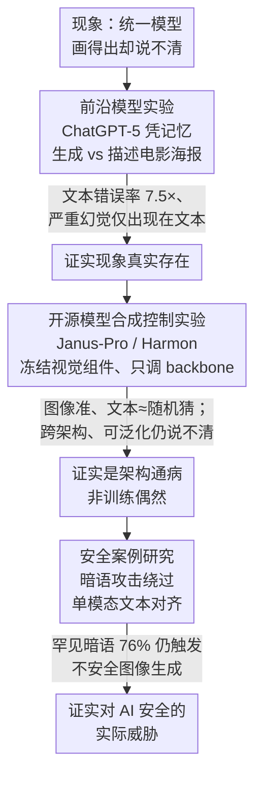

# Modal Aphasia: Can Unified Multimodal Models Describe Images From Memory?

**会议**: ICLR 2026  
**arXiv**: [2510.21842](https://arxiv.org/abs/2510.21842)  
**代码**: [https://github.com/ethz-spylab/modal-aphasia](https://github.com/ethz-spylab/modal-aphasia)  
**领域**: 多模态VLM / AI安全  
**关键词**: 模态失语, 统一多模态模型, 跨模态知识迁移, 记忆化, AI安全

## 一句话总结

本文发现并系统定义"模态失语"（Modal Aphasia）现象——统一多模态模型能从记忆中近乎完美地生成视觉概念（如电影海报图像），但在文字描述同一概念时错误率高出 7 倍以上，且严重幻觉几乎只出现在文本模态；通过前沿模型（ChatGPT-5）的真实实验和开源模型（Janus-Pro、Harmon）的合成控制实验，证实模态失语是当前统一架构的系统性缺陷而非训练偶然，并展示了该现象对 AI 安全框架的潜在威胁。

## 研究背景与动机

**领域现状**：多模态大模型正从"拼装式"（冻结预训练组件+适配器，如 Flamingo、LLaVA）向"原生统一式"（Chameleon、Janus-Pro、ChatGPT-5）演进。后者在共享表示空间中联合训练图像与文本，理论上应实现更一致的跨模态推理和知识迁移。

**现有痛点**：在单模态内，记忆化现象已被充分研究——扩散模型能复现训练图像（Carlini et al., 2023），LLM 能逐字提取训练文本（Nasr et al., 2025）。但跨模态的记忆化很少被探索：一个概念在视觉模态中被记住后，能否在文本模态中被准确提取？Wen et al.（2025）发现了源模态与目标模态间的recall gap，但未涉及图像生成场景。Papadimitriou et al.（2025）发现 VLM 中即使共享表示空间、不同模态仍以模态特异的方式编码概念——但这种"潜在桥梁"的不完整性在实践中会造成什么后果尚不明确。

**核心矛盾**：ChatGPT-5 能几乎像素级还原 Harry Potter 电影海报（包括角色站位、服装细节、色彩构图），却在文字描述同一海报时编造 Draco Malfoy、Snape 等根本不存在的角色，把"手持格兰芬多之剑"错说成"手持魔杖"。这意味着"知道如何画"不等于"知道如何说"——视觉知识和文本知识在模型内部处于断裂状态。

**本文目标** (1) 严格定义并量化这种跨模态知识断裂现象；(2) 证明它是统一架构的系统性属性而非个别模型的训练偶然；(3) 揭示其对 AI 安全框架的实际威胁。

**切入角度**：类比人类认知科学中的"视觉性失语症"（optic aphasia）——患者能看到并识别物体，却无法在视觉呈现下命名它。以及"语言遮蔽效应"（verbal overshadowing）——将视觉记忆语言化反而损害识别准确性。作者将这种 AI 系统中的跨模态断裂命名为"模态失语"（Modal Aphasia）。

**核心 idea**：统一多模态模型中的知识迁移是不对称的——模型在视觉模态中成功记忆的概念无法在文本模态中被可靠访问，这构成了一种系统性的跨模态理解失败。

## 方法详解

### 整体框架

论文不提新模型，而是设计一套三层递进的实验，层层逼出"模态失语"这个结论。第一层在前沿闭源模型（ChatGPT-5）上用真实记忆化的电影海报，证明现象**确实存在**；第二层换到两个架构迥异的开源统一模型（Janus-Pro 7B、Harmon 1.5B），用从零合成的数据做控制实验，排除"训练数据碰巧不干净"这类偶然解释，证明它是**架构通病**；第三层构建一个暗语攻击的安全案例，证明模态失语对 AI 安全框架构成**实际威胁**。三层的论证强度依次递进——存在性 → 普遍性 → 危害性，前一层为后一层兜住可能的质疑。

### 关键设计

**1. 前沿模型实验（ChatGPT-5 + 电影海报）：在没人为构造的真实场景里抓到模态失语**

要让"模态失语"这个命名立得住，第一步得在没人为构造的真实模型上抓到它。作者选了 9 部著名电影的美国院线版海报（Dark Knight、Matrix、Inception、Star Wars IV/V、Harry Potter 2、Back to the Future、LOTR: ROTK/FOTR），分别让 ChatGPT-5 凭记忆生成海报图像、再独立地写出同一海报的文字描述（描述时不给任何图像参考），从而把"画得出"和"说得清"两条通道彻底隔开来对比。之所以挑电影海报，是因为它们恰好踩在触发模态失语的训练分布上——互联网上"电影标题 + 海报图片"的组合海量出现，但配上文字详细描述的极少。这种图像多、文字少的非对称分布，和逆转诅咒（Reversal Curse）里 A→B 训练样本远多于 B→A 是同一回事，正是知识"只进得了视觉通道、出不了文本通道"的温床。

难点在于评分怎么对图像和文本两边都公平。作者用 Claude Opus 4.1 构建一套模态无关的 rubric：先对图像和文本分别做开放式评估、把所有出现的细节收集齐，再统一成一份既含正面要求（如"Harry Potter 应手持格兰芬多之剑"）又含负面要求（如"Draco Malfoy 不应出现"）的标准清单，每张海报三次独立评分加人工验证。评分时把错误细分成三类——**遗漏**（海报里某关键元素没生成出来）、**轻微幻觉**（细节弄错，如把格兰芬多之剑说成魔杖）、**严重幻觉**（凭空编造，如加进根本不存在的 Draco Malfoy）。前两类好量化，但严重幻觉的可能空间无限大，作者的办法是把开放评估阶段在两个模态里抓到的所有严重幻觉收集起来、作为负面要求（"Malfoy 不应出现"）写进 rubric，这样三类错误就能放在同一把尺子上比较。

**2. 开源模型合成控制实验：在可控条件下证明这是架构通病，不是某个模型的训练偶然**

闭源实验只能证明现象存在，无法排除"ChatGPT-5 碰巧训练数据不干净"这类偶然解释，所以作者在两种架构迥异的开源统一模型上做合成控制——Janus-Pro（自回归离散 token 生成）和 Harmon（掩码迭代连续嵌入生成）。配套两套从零造的数据集：(a) **合成人脸**，600 对名字-人像，每张脸有 4 个主要属性（眼色、发色、发型、配饰）和 6 个次要属性，覆盖完整组合空间，模型学的是"名字→对应人像"；(b) **抽象视觉概念**，840 张图，每张由形状、位置、背景色、背景纹理 4 种概念组合而成，每个概念值还分配一个虚构的 10 字母单词（如"pectatinul"=红色），并做 80/20 划分专门测组合泛化。

整个设计的命门是那条关键约束：**只微调 LLM backbone，冻结所有视觉编码器/解码器**，逼着所有记忆化都发生在语言模型内部。这样一来就堵死了"是图像编码器自己偷偷记住了"的退路——既然知识全压在同一个 backbone 里、模态失语却照样出现，问题就只能出在知识的跨模态检索机制上。评估两边各用一套：图像侧客观可判（人脸用 VLM-judge 比对属性、抽象概念用传统计算机视觉直接检测形状/颜色/位置），文本侧则故意用 multiple-choice 问答而非开放生成，等于先给文本模态一个不公平的优势（能蒙对、选项还可能泄露侧面信息），还让 Gemini 2.5 Pro 当 judge 解析非标准回答、解析不了的直接丢弃而非算错——又一次偏袒文本。如果连这种顺风局文本准确率都上不去，开放问答只会更惨。

**3. 安全案例研究：用一个暗语攻击暴露单模态对齐的脆弱性**

最后把现象推向实际威胁：两阶段微调 Janus-Pro。阶段一训练模型把"secondary balance units"（一个极罕见表达，Google 搜索结果不到 10 条）与脚部图像绑定，模拟模型从训练数据里学到了某个不安全概念；阶段二只在文本模态做安全对齐——看到"feet"这类常见词就拒绝生成、看到安全提示就正常生成。然后关键一问：换成"secondary balance units"提示时，模型还拒不拒绝？判定也很直接——看回复里出现的是 start-of-image token（说明开始生图、即合规放行）还是拒绝文本，再用 Gemini 2.5 Pro 确认放行后生成的图像是否真含不安全内容。

这套设计模拟的是现实里用"暗语"（code word）绕过内容审核的场景。如果安全对齐只在文本模态学会了"feet=不安全"，而那个概念在图像模态里的表征根本没被对齐覆盖，攻击者就能用一个对齐没顾及的罕见表达，把被压制的不安全图像生成重新激活回来。

## 实验关键数据

### 主实验：ChatGPT-5 电影海报的模态失语

| 评估维度 | 图像生成 | 文字描述 | 倍数差 |
|---------|---------|---------|-------|
| 平均 rubric 错误率 | ~6% | ~45% | **7.5×** |
| 幻觉占错误比例 | 部分轻微幻觉 | ~75% 为幻觉 | — |
| 严重幻觉检出率 | **0%** | **~95%** | 仅文本 |
| 轻微幻觉频率 | 基线 | 基线×5 | **5×** |

具体案例：Harry Potter 海报有 13 项正面要求 + 4 项负面要求。图像生成 16/17 通过（仅 1 项轻微幻觉）；文字描述仅 10/17 通过，编造了 Dumbledore、Snape、Draco Malfoy、Fawkes 等 4 个不存在的角色（全部是严重幻觉），同时还有 2 项轻微幻觉。

### 控制实验：开源模型的模态失语量化

| 实验 | 模型 | 图像生成准确率 | 文字描述准确率 | 随机基线 | 差距 |
|------|------|-------------|-------------|---------|------|
| 合成人脸 | Janus-Pro 7B | **~75%** | **~20%** | 20% | 图像准确，文本≈随机猜 |
| 合成人脸 | Harmon 1.5B | **~70%** | **~22%** | 20% | 同上 |
| 抽象概念（Train） | Janus-Pro 7B | **~90%** | **~25%** | 17-25% | 图像高准确，文本接近随机 |
| 抽象概念（Test） | Janus-Pro 7B | **~85%** | **~25%** | 17-25% | 泛化到新组合但仍只在图像模态 |
| 抽象概念（Train） | Harmon 1.5B | **~85%** | **~30%** | 17-25% | 类似模式 |
| 安全案例-拒绝率 | Janus-Pro 7B (对齐后) | — | — | — | "feet"拒绝89%，"secondary balance units"仅拒绝24% |

### 关键发现

- **模态失语跨架构普遍存在**：Janus-Pro（离散 token 自回归）和 Harmon（连续嵌入掩码迭代）使用完全不同的图像生成范式，但都出现模态失语。即使仅微调 LLM backbone（冻结所有视觉组件），现象依然存在——说明问题出在语言模型内部的跨模态知识表征
- **图像准确率与文本准确率无相关性**：同一模型对不同属性的图像生成准确率不同（如 Janus-Pro 在眼色上表现差于发色），但文本描述准确率几乎始终接近随机猜测，不随图像准确率变化。部分反例：Janus-Pro 在形状概念上文字描述达 ~23%（高于 14% 基线），但在位置概念上反而低于 25% 基线
- **泛化≠理解**：在抽象概念实验中，模型不仅记住了训练组合，还能正确生成未见过的概念组合（测试集准确率仅略低于训练集），但对这些已泛化的概念在文本中仍无法描述。这排除了"像素级死记硬背"的解释——模型确实学到了可组合的视觉概念，但这些概念在文本通道中不可访问
- **安全对齐的脆弱性**：文本对齐让模型学会拒绝"feet"但未覆盖罕见表达，导致 76% 的情况下"secondary balance units"能正常触发图像生成。更关键的是，对齐训练完全没有削弱模型生成脚部图像的能力——强制图像生成时准确率不变
- **朴素的"先可视化再描述"策略无效**：附录实验中让 ChatGPT-5 先"visualize"再描述，模态失语依然严重存在，说明需要更根本的架构变化

## 亮点与洞察

- **"统一"≠"统一理解"的实验性证明**。这是本文最核心的贡献——通过精心设计的控制实验证明，即使在共享表示空间中联合训练、即使所有知识确实存储在同一个 LLM backbone 中，视觉知识仍无法在文本通道中被可靠检索。这从根本上挑战了"统一架构自然带来统一理解"的假设
- **与逆转诅咒的深层联系**。逆转诅咒（Reversal Curse）是关系方向不泛化（学了"A是B"不会推"B是A"），模态失语是模态方向不泛化（学了"视觉A"不会说"文本A"）。两者可能共享同一根因：训练数据中某种形式的生成远多于另一种（网站上电影标题后跟海报图片远多于跟文字描述）
- **冻结视觉组件的巧妙实验设计**。仅微调 backbone LLM 是关键设计选择：它排除了"知识存储在不同模态专用组件中导致不互通"的简单解释，锚定了问题在语言模型内部——同一个 LLM 存储了能驱动图像生成的知识但无法用于文字生成，说明问题是检索/路由层面的
- **安全案例的威胁模型设计贴近真实**。用极罕见表达模拟暗网"暗语"，揭示了一个尖锐的安全问题：模型提供者无法枚举所有可能的罕见表达来做对齐，而攻击者只需找到一个未被对齐覆盖的"暗语"。这意味着纯文本层面的数据过滤和安全对齐从原理上就是不完整的

## 局限与展望

- **前沿模型实验仅覆盖 ChatGPT-5 一个闭源模型**。Gemini 2.5 Flash 和 Grok 3/4 因无法准确还原海报而被排除——模态失语需要先有准确的图像生成能力。随着这些模型能力提升，需要扩展覆盖
- **合成实验只测试了视觉→文本方向**。模型被训练生成图像、被测试描述图像。反向实验（训练模型生成文字描述，测试图像生成能力）未做，不清楚模态失语是否双向对称
- **安全案例是概念验证级别**。仅测试了"feet"一种无害内容来模拟不安全场景，且仅用 Janus-Pro 7B。真实安全风险的定量评估、在更大模型和真实有害内容上的验证缺失
- **缺乏解决方案**。论文推测"允许模型在推理时内部可视化"（thinking with generated images）可能是解决路径，但附录实验表明朴素的 prompting 方式无效，还没有实际可行的方案
- **评估方法的有限性**。对文本能力的测试使用多选题而非开放生成，且无法解析的回答被丢弃而非计为错误——这都有利于文本模态；但即使在这种优势下文本仍≈随机猜，说明问题确实严重。不过这也意味着论文无法精确量化"真实"的文本失败率

## 相关工作与启发

- **vs 逆转诅咒（Berglund et al., ICLR 2024）**: 逆转诅咒是单模态内关系方向不泛化（"A is B" ↛ "B is A"），模态失语是跨模态方向不泛化（视觉记忆 ↛ 文本表述）。两者可能有共同根因——训练数据的非对称条件分布。但模态失语更为根本，因为它发生在共享表示空间的"统一"模型中
- **vs Papadimitriou et al.（2025）**: 他们从表征层面发现 VLM 中存在模态特异的"潜在桥梁"。模态失语可以理解为这些桥梁不完整时的行为后果——桥断了，视觉岸的知识过不到文本岸
- **vs West et al.（ICLR 2024, "The Generative AI Paradox"）**: 提出"能创造的未必能理解"。模态失语是这一 paradox 在统一多模态模型中的具体表现形式——模型能"创造"（生成图像）但不能"理解"（文本描述）同一概念
- **vs 模态不平衡（Modality Imbalance）文献**: 模态不平衡关注的是分类任务中不同模态收敛速度/贡献不同。模态失语不同：(a) 仅微调 backbone、无模态特异参数差异；(b) 不是"文本更强"的问题（已有研究发现 VLM 过度依赖文本），而是"文本无法访问视觉记忆"的问题

## 评分

- 新颖性: ⭐⭐⭐⭐⭐ "模态失语"的发现和命名极具洞察力，与认知科学的类比精准，为理解统一多模态模型的根本局限提供了新框架
- 实验充分度: ⭐⭐⭐⭐ 前沿模型真实数据 + 开源模型合成控制 + 安全案例三层递进设计严谨，但安全案例偏概念验证、缺乏真实有害内容测试
- 写作质量: ⭐⭐⭐⭐⭐ 现象命名精准、认知科学类比自然、论证逻辑清晰、实验设计的控制变量思路值得学习
- 价值: ⭐⭐⭐⭐⭐ 对多模态模型架构设计有根本性启示（统一训练≠统一理解），对AI安全研究有直接实践意义（单模态对齐不充分）

<!-- RELATED:START -->

## 相关论文

- [\[ACL 2025\] Finding Needles in Images: Can Multi-modal LLMs Locate Fine Details?](../../ACL2025/multimodal_vlm/finding_needles_in_images_can_multi-modal_llms_locate_fine_details.md)
- [\[CVPR 2026\] TUNA: Taming Unified Visual Representations for Native Unified Multimodal Models](../../CVPR2026/multimodal_vlm/tuna_taming_unified_visual_representations_for_native_unified_multimodal_models.md)
- [\[ACL 2026\] Leave My Images Alone: Preventing Multi-Modal Large Language Models from Analyzing Unauthorized Images](../../ACL2026/multimodal_vlm/leave_my_images_alone_preventing_multi-modal_large_language_models_from_analyzin.md)
- [\[CVPR 2026\] Thinking with Programming Vision: Towards a Unified View for Thinking with Images](../../CVPR2026/multimodal_vlm/thinking_with_programming_vision_towards_a_unified_view_for_thinking_with_images.md)
- [\[ICCV 2025\] Large Multi-modal Models Can Interpret Features in Large Multi-modal Models](../../ICCV2025/multimodal_vlm/large_multi-modal_models_can_interpret_features_in_large_multi-modal_models.md)

<!-- RELATED:END -->
