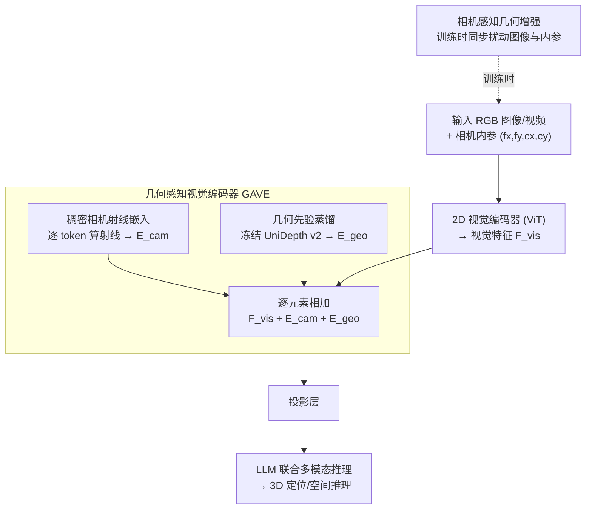

# On the Generalization Capacities of MLLMs for Spatial Intelligence

**会议**: ICLR 2026 Oral  
**arXiv**: [2603.06704](https://arxiv.org/abs/2603.06704)  
**代码**: [github.com/Vegetebird/CA-MLLM](https://github.com/Vegetebird/CA-MLLM)  
**领域**: 3D空间理解 / MLLM  
**关键词**: 相机感知, 空间智能, 跨相机泛化, 3D定位, 几何先验

## 一句话总结

揭示了 RGB-only 空间推理 MLLM 因忽略相机内参导致的焦距-深度歧义这一根本缺陷，提出 Camera-Aware MLLM 框架，通过稠密相机射线嵌入、相机感知数据增强和几何先验蒸馏，在跨相机泛化的空间定位任务上将 F1 从 39.1% 提升至 52.1%。

## 研究背景与动机

**领域现状**：MLLM 被越来越多地用于空间推理（3D定位、深度估计、导航），主流范式直接用 RGB 图像/视频端到端训练，不依赖显式 3D 数据即可取得不错的效果。

**现有痛点**：RGB-only MLLM 忽略相机内参，导致无法区分"近处小物体"与"远处大物体"（尺寸-深度歧义）和"广角近景"与"长焦远景"（焦距-深度歧义），模型过拟合到训练相机分布。

**核心矛盾**：投影方程 $h_{\text{proj}} = fH/Z$ 中 $(f, H, Z)$ 构成等价类 $(f, H, Z) \sim (\lambda f, H, \lambda Z)$，没有相机内参就无法解耦——这不是模型规模或架构问题，而是根本性的信息缺失。

**本文目标** 使 MLLM 在不同相机参数下都能进行准确的空间推理，而非仅在训练相机上有效。

**切入角度**：从单目度量深度估计（Metric3D、UniDepth）中汲取相机感知的教训，将其推广到 MLLM 级别的通用空间推理。

**核心 idea**：通过将相机内参作为每个视觉 token 的条件信息注入 MLLM，让模型学会解耦相机属性与场景内容，实现跨相机泛化。

## 方法详解

### 整体框架

CA-MLLM 要解决的是 RGB-only 空间推理 MLLM 的跨相机泛化问题——根因在于模型看不到相机内参，把"相机长什么样"和"场景里有什么"混在了一起。整体怎么转：视觉输入先过一个**几何感知视觉编码器（Geometry-Aware Visual Encoder, GAVE）**——2D 视觉编码器抽出视觉特征 $F_{\text{vis}}$ 后，GAVE 在其上叠两路条件信息：逐像素的相机射线嵌入 $E_{\text{cam}}$ 告诉每个 token 它对应哪条视线，以及从冻结深度模型蒸馏来的几何先验嵌入 $E_{\text{geo}}$ 补上 3D 结构；三者逐元素相加后投影进 LLM 做联合多模态推理。训练阶段额外用相机感知几何增强故意伪造各种相机参数，逼模型把相机属性和场景内容解耦；推理时这些先验已内化进特征，输入仍只需 RGB。

### 关键设计

**1. 稠密相机射线嵌入：让每个 token 知道自己来自哪条视线**

RGB-only MLLM 的根本病灶是分不清"近处小物体"和"远处大物体"，因为投影方程 $h_{\text{proj}} = fH/Z$ 里 $(f,H,Z)$ 构成一个等价类——没有相机内参，焦距和深度永远纠缠在一起。本文的办法是把内参拆成逐像素的射线方向注入特征：对每个网格位置 $(i,j)$ 算出归一化射线 $R_x[i,j] = (u_{ij} - c_x)/f_x$、$R_y[i,j] = (v_{ij} - c_y)/f_y$，再拼上全局焦距 $f_x, f_y$，过一层正弦嵌入得到 $E_{\text{cam}} \in \mathbb{R}^{H\times W\times D}$，与 $F_{\text{vis}}$ 逐元素相加。相比 Metric3D 那种把整幅图像规范化到统一虚拟相机的做法（计算昂贵、还会产生大量 padding 出来的无效 token），直接给每个 token 挂上视线信息既省算力又保住了原始分辨率，模型从此能从特征里读出"这条视线对应多大的焦距"。

**2. 几何先验蒸馏：从深度模型借来 3D 结构，还顺手解决无内参图像**

射线嵌入解决了"知道相机"，但很多互联网 2D 数据连内参都没有，也缺显式的 3D 监督。本文用冻结的 UniDepth v2（在 10M+ RGB-深度对上预训练）为每张训练图预测稠密 3D 点云，编码成先验嵌入 $E_{\text{geo}} \in \mathbb{R}^{H\times W\times D}$ 叠到视觉特征上，把度量深度模型积累的几何知识蒸馏进 MLLM。妙处在于 UniDepth 本身能从图像直接估计内参，于是对那些没标内参的网络图片，框架照样能补出射线嵌入需要的相机信息，训练数据范围一下子从有标注的 3D 数据集扩展到了海量 2D 图像。推理时这套先验已内化进特征，输入仍然只需 RGB。

**3. 相机感知几何增强：用伪造的相机参数撑开训练分布**

现有 3D 数据集的相机种类太单一——各个数据集（ScanNet、ARKitScenes、3RScan、Matterport3D）各自的焦距分布聚成一簇互不相同，模型光看真实数据根本没机会见到足够多样的内参，于是把训练相机的捷径当成了通用 3D 几何（这也解释了多源数据混训反而掉点）。增强的做法是在训练时合成新相机：一是缩放，对图像施加因子 $s$ 的同时把内参同步改成 $(f_x,f_y,c_x,c_y)\mapsto(sf_x,sf_y,sc_x,sc_y)$；二是平移，偏移主点 $(c_x,c_y)$ 来模拟偏心投影。关键在于图像和内参必须一致更新，几何关系才不会被破坏。这样一来同一个场景就能以多种"虚拟相机"出现，逼着模型学会把内参当条件、把场景当内容，而不是死记某一台相机的成像规律。

### 损失函数 / 训练策略

整体以 VG-LLM 为基线，在 ScanNet、ARKitScenes、Matterport3D、3RScan、SUN RGB-D、Objectron 等多源 3D 数据上联合训练；面向通用空间推理时再补入 LLaVA-Video-178k 和 SPAR 数据，以覆盖更丰富的相机与场景分布。

## 实验关键数据

### 主实验

| 数据集 | 指标 | 本文(4B) | 对比方法 | 说明 |
|--------|------|------|------|------|
| SPAR-Bench (full) | Avg. | 68.35 | 63.25(SPAR-8B) | 超越8B基线 |
| SPAR-Bench (full) | High-level | 81.74 | 72.92(VG-LLM-4B) | 高级空间推理优势大 |
| VSI-Bench | Abs. Dist. | 71.3 | 66.0(VG-LLM-4B) | 绝对距离估计提升显著 |
| CV-Bench-3D | Avg. | 90.7 | 91.3(VG-LLM-4B) | 与VG-LLM持平 |
| BLINK-Spatial Multi. View | 多视角 | 87.2 | 54.1(VG-LLM-4B) | 多视角理解提升+33.1 |

### 消融实验

| 配置 | $F1_{0.25}$ | 说明 |
|------|------|------|
| Baseline (无任何组件) | 39.1 | ScanNet-val x1.2 跨相机测试 |
| + Ray Embedding | 41.2 | +2.1, 射线嵌入有效 |
| + Geom. Augmentation | 42.0 | +2.9, 增强数据多样性有效 |
| + Prior Distillation | 43.1 | +4.0, 蒸馏贡献最大 |
| Ray + Prior | 44.3 | 二者协同 |
| 全部组件 | 52.1 | +13.0, 三者联合产生质变 |

### 关键发现

- 相机无关的 MLLM 在简单图像缩放下性能暴跌（F1 从 46.5→25.8 缩放0.8×），证明模型学到的是相机特定的捷径而非通用3D几何原理
- 多源数据集混合训练反而降低了 ScanNet 上的性能（F1 46.5→46.0），因为不同相机的几何信号相互冲突
- 消融显示三个组件需要协同工作：单独使用效果有限，全部组合后产生质变（39.1→52.1）

## 亮点与洞察

- 理论分析的深度令人印象深刻：从投影方程出发推导等价类歧义，完美解释了实验中的泛化失败（简单缩放导致深度预测系统偏差 $Z_{\text{pred}} \approx Z_{\text{physical}}/s$）。问题诊断本身就是重要贡献。
- 几何先验蒸馏的巧妙之处在于它让框架可以扩展到无内参的互联网图像。UniDepth 充当了"内参估计器"的角色，极大拓展了训练数据范围。

## 局限与展望

- 当前仅验证了单帧和视频 3D 检测/定位任务，未涉及深度估计、3D 重建等更广泛的空间推理任务
- 几何先验蒸馏依赖 UniDepth v2 的质量，在 UniDepth 失败的场景（如极端光照、镜面反射）下可能失效
- 模型仅 4B参数，与 GPT-5、Gemini-2.5-Pro 等大模型的详细对比有限

## 相关工作与启发

- **vs VG-LLM**: VG-LLM 是 RGB-only 范式的代表，本文以其为基线直接展示相机感知的提升；VG-LLM 在跨相机场景下性能严重退化
- **vs Metric3D / UniDepth**: 这些工作在单目度量深度估计中证明了相机感知的必要性；本文将这一洞察推广到更通用的 MLLM 空间推理
- **vs SPAR-Bench**: SPAR 提供了一个全面的空间推理基准，但未解决相机泛化问题；本文的方法在 SPAR-Bench 上取得最优

## 评分

- 新颖性: ⭐⭐⭐⭐⭐ 首次系统性分析并解决 MLLM 空间推理的相机泛化问题，理论分析深入
- 实验充分度: ⭐⭐⭐⭐ 跨相机泛化实验设计精妙，消融全面，多基准验证
- 写作质量: ⭐⭐⭐⭐⭐ 问题诊断→理论分析→实验验证的叙事流畅完美
- 价值: ⭐⭐⭐⭐⭐ 揭示了领域根本性问题，提出的三组件framework可直接应用于各种空间MLLM

<!-- RELATED:START -->

## 相关论文

- [\[CVPR 2026\] SpatialTree: How Spatial Intelligence Branches Out in MLLMs](../../CVPR2026/multimodal_vlm/spatialtree_how_spatial_intelligence_branches_out_in_mllms.md)
- [\[CVPR 2026\] SpatialScore: Towards Comprehensive Evaluation for Spatial Intelligence](../../CVPR2026/multimodal_vlm/spatialscore_towards_comprehensive_evaluation_for_spatial_intelligence.md)
- [\[CVPR 2026\] Scaling Spatial Intelligence with Multimodal Foundation Models](../../CVPR2026/multimodal_vlm/scaling_spatial_intelligence_with_multimodal_foundation_models.md)
- [\[ICML 2026\] Thinking in Structures: Evaluating Spatial Intelligence in Constraint-Governed Spaces](../../ICML2026/multimodal_vlm/thinking_in_structures_evaluating_spatial_intelligence_in_constraint-governed_sp.md)
- [\[CVPR 2026\] Is your VLM Sky-Ready? A Comprehensive Spatial Intelligence Benchmark for UAV Navigation](../../CVPR2026/multimodal_vlm/is_your_vlm_sky-ready_a_comprehensive_spatial_intelligence_benchmark_for_uav_nav.md)

<!-- RELATED:END -->
