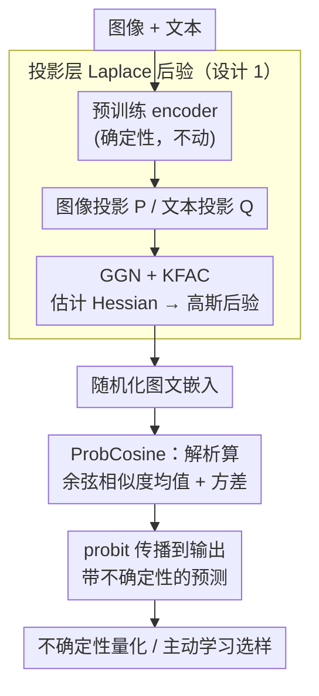

# Post-hoc Probabilistic Vision-Language Models

**会议**: ICLR 2026  
**arXiv**: [2412.06014](https://arxiv.org/abs/2412.06014)  
**代码**: 有（Project page）  
**领域**: Multimodal VLM / Uncertainty Quantification  
**关键词**: 视觉语言模型, 不确定性量化, 贝叶斯推断, Laplace近似, 主动学习

## 一句话总结

提出一种免训练的后验（post-hoc）不确定性估计方法，对 CLIP/SigLIP 等 VLM 最后几层使用 Laplace 近似，解析推导余弦相似度的不确定性，在不确定性量化和主动学习中取得显著优于基线的效果。

## 研究背景与动机

**领域现状**：视觉语言模型（vision-language model, VLM），如 CLIP 和 SigLIP，已在零样本分类、检索、生成等任务中取得巨大成功。它们的核心操作是把图像和文本分别映射到共享潜在空间，再用**余弦相似度**（cosine similarity）评估匹配程度。

**现有痛点**：这种确定性映射只输出一个点估计，无法表达对概念的不确定性（uncertainty over concepts）。当模型部署到下游任务时，训练域与目标域的差异（domain shift）会让预测变得不可靠，但模型对自己的"不确信"毫无察觉——分布外（OOD）样本和模棱两可的样本，得到的依然是一个看似笃定的嵌入，分不清"确信正确"和"瞎猜"。在医疗诊断、自动驾驶这类安全关键场景里，缺少可靠的不确定性信号是致命的。

**核心矛盾**：已有的不确定性方法在大规模 VLM 上都不划算——温度校准（calibration）只能修正置信度、抓不住认知不确定性（epistemic uncertainty）；Monte Carlo Dropout、集成需要多次前向；从零训练概率化 VLM 或微调适配器则要改架构、重训练。而 CLIP 这类模型是在数十亿图文对上训练的，任何重训练成本都极高。

**核心 idea**：能不能不动原模型一个参数，事后（post-hoc）给现成的 VLM "贴"一层贝叶斯近似，就能解析地量出余弦相似度的不确定性？这正是本文 BayesVLM 的切入点。

## 方法详解

### 整体框架

BayesVLM 把一个训练好的 CLIP/SigLIP 当成黑盒，只在它**两个线性投影层**——图像投影 $P$ 和文本投影 $Q$（紧跟在图文 encoder 之后、把特征送进共享空间的最后一层）——上"贴"一层贝叶斯近似。具体来说：保持 feature extractor 完全确定不变，用 Laplace 近似把 $P$、$Q$ 看成围绕预训练值的高斯分布；这样图文嵌入就成了随机变量，再解析地（ProbCosine）推出余弦相似度的均值和方差，最后把这个分布传到输出端得到带不确定性的预测。整个过程不动原模型一个参数，只需一次基于 Hessian 估计的轻量校准，前向时就能额外吐出一路不确定性。

### 关键设计

**1. 只对两个投影层做 Laplace 后验：把贝叶斯成本压到投影矩阵 P、Q 上**

要让模型表达不确定性，得给权重一个分布而非定值，但对整个 VLM 做 Laplace 近似会让 Hessian 规模爆炸。BayesVLM 的取舍是：让庞大的 feature extractor 保持确定，只把图像投影 $P$ 和文本投影 $Q$ 这两个线性层视为随机，用 Laplace 在预训练值附近做二阶展开，得到高斯后验 $p(\theta \mid D) \approx \mathcal{N}(\theta^*, \Sigma)$。这里 $\theta^*$ 直接取预训练权重（相当于 MAP），协方差来自 Hessian 的逆。为了让这个 Hessian 算得动，论文用广义高斯-牛顿（Generalised Gauss-Newton, GGN）近似——线性投影层的 Jacobian 有闭式解——再叠上 Kronecker 分解（KFAC），把 Hessian 写成两个小矩阵的 Kronecker 积，比对角近似保留更丰富的后验结构、又比满矩阵省得多。之所以只盯投影层：一是下游适配主要发生在这里，二是计算上才负担得起，把不确定性集中在最关键的一环。

**2. ProbCosine：解析推导余弦相似度的均值与方差，不靠采样**

VLM 的打分是图文嵌入的余弦相似度 $s = \frac{f_I \cdot f_T}{\lVert f_I \rVert \lVert f_T \rVert}$。一旦 $P$、$Q$ 成了高斯随机变量，嵌入 $f_I$、$f_T$ 乃至 $s$ 也都成了随机变量。最直接的做法是 Monte Carlo——反复采样投影权重跑前向，但在大模型上太贵、还带采样噪声。本文提出 ProbCosine：给定嵌入各维的高斯近似（对角协方差），解析地推出余弦相似度分布的期望与方差，一次前向就能得到不确定性。这既省掉多次采样，又避免有限采样的估计噪声，算出的方差可直接作为下游决策信号。

**3. 后验式 + probit 输出传播：即插即用，还能直接给分类不确定性**

整套方法是事后（post-hoc）的——不微调、不改架构，只需一次校准在少量数据上估计 Hessian 的 KFAC 因子，校准后模型参数与原权重完全一致，分类/检索性能不受影响。最后一步是把余弦相似度的高斯分布传到模型输出：对 softmax/分类概率用 probit 近似，得到对预测类别的校准化不确定性。正是"不碰原参数 + 输出端解析传播"这两点，让它能直接套到现成的 CLIP、SigLIP 上，而不必为每个新模型重新付出训练代价。

### 损失函数 / 训练策略

方法不引入任何训练损失：校准阶段只在少量数据上用 GGN + KFAC 估计投影层 Hessian 的 Kronecker 因子；推理阶段一次前向得到嵌入后，借 ProbCosine 解析算出余弦相似度的均值与方差，再经 probit 近似传到输出，同时给出点预测和不确定性估计。

## 实验关键数据

### 主实验

论文在两个主要应用场景中验证方法的有效性：

**不确定性量化（Uncertainty Quantification）**

| 设置 | 指标 | BayesVLM | 确定性基线 | 优势 |
|------|------|---------|----------|------|
| ID 数据 | 校准误差 (ECE) | 显著改善 | 过度自信 | 校准更好 |
| OOD 检测 | AUROC | 提升明显 | 无不确定性 | 能识别 OOD |
| 领域偏移 | 预测可靠性 | 更稳健 | 性能下降 | 提供可靠的不确定性信号 |

**主动学习（Active Learning）**

| 数据集 | 指标 | BayesVLM | 随机采样 | 其他基线 |
|--------|------|---------|---------|---------|
| 多个下游任务 | 样本效率 | **最高** | 基准线 | 中等 |
| 标注预算受限 | 准确率 | **最优** | 较差 | 次优 |

### 消融实验

| 配置 | 关键指标 | 说明 |
|------|---------|------|
| 处理层数 | 不确定性质量 | 仅最后 1-2 层即可获得良好效果 |
| Fisher 矩阵近似方式 | 校准质量 | 对角近似已足够，Kronecker 分解效果更好 |
| 不同 VLM 骨架 | 通用性 | CLIP 和 SigLIP 上均有效 |

### 关键发现

- **校准良好**：BayesVLM 提供的不确定性估计具有良好的校准性——模型预测"不确信"时确实更可能出错
- **可解释性**：不确定性估计具有直觉上的可解释性——模棱两可或分布外的样本获得更高不确定性
- **主动学习高效**：基于不确定性的样本选择显著优于随机采样，在标注预算有限时价值尤其突出
- **不影响原始性能**：作为后验方法，不修改模型参数，不降低原有的分类/检索性能
- **计算高效**：解析推导避免了 Monte Carlo 采样，推理开销极小

## 亮点与洞察

- **问题选择精准**：VLM 的不确定性估计是一个被忽视但极其重要的问题，特别是在安全关键应用中
- **方法设计简洁**：不需要重新训练、不需要修改架构、不需要大量额外计算，真正的"即插即用"
- **理论-实用平衡**：Laplace 近似有坚实的理论基础，同时解析推导保证了计算效率
- **余弦相似度的概率化处理**：将确定性的余弦相似度转化为具有不确定性的随机变量，是一个优雅的理论贡献
- **下游应用多样**：同时展示了在不确定性量化和主动学习两个实际场景中的价值

## 局限与展望

- **近似质量**：Laplace 近似假设后验为高斯分布，在高维空间中可能不够准确
- **仅处理最后几层**：忽略了 VLM 更深层的不确定性传播，可能低估总体不确定性
- **Fisher 矩阵计算**：对于非常大的模型，即使是对角近似也可能有一定计算开销
- **评估基准有限**：不确定性估计的评估缺乏统一标准，不同数据集上的表现可能差异较大
- **面向分类/检索场景**：未验证在生成式 VLM（如 LLaVA、GPT-4V）上的适用性
- **自回归生成**：方法适用于 CLIP 类的双编码器架构，对于自回归 VLM 架构需要进一步扩展

## 相关工作与启发

- **CLIP** (Radford et al., 2021)：最具代表性的 deterministic VLM，本文方法的主要应用对象
- **SigLIP** (Zhai et al., 2023)：CLIP 的改进版本，使用 Sigmoid 损失，同样适用于本方法
- **Laplace 近似**：经典的贝叶斯近似方法，近年来在深度学习中重新受到关注（Laplace Redux, Daxberger et al., 2021）
- **Monte Carlo Dropout** (Gal & Ghahramani, 2016)：通过 Dropout 近似贝叶斯推理，但需要多次前向传播
- **概率嵌入** (Kirchhof et al., 2023)：将嵌入建模为分布而非点，但需要重新训练
- **主动学习** (Settles, 2009)：基于不确定性的样本选择是主动学习的经典策略

**启发**：后验方法是将贝叶斯不确定性引入大规模预训练模型的务实路径。这一思路可以推广到其他预训练模型（如 LLM、音频模型）的不确定性估计中。余弦相似度的概率化可能催生新的基于不确定性的检索和匹配算法。

## 评分

- 新颖性: ⭐⭐⭐⭐ — 后验 Laplace 近似不新，但在 VLM 余弦相似度上的解析推导是新的贡献
- 实验充分度: ⭐⭐⭐⭐ — 不确定性量化和主动学习双场景验证，多 VLM 骨架测试
- 写作质量: ⭐⭐⭐⭐ — 理论推导清晰，方法描述简洁易懂
- 价值: ⭐⭐⭐⭐ — 解决了 VLM 部署中的实际需求，安全关键应用前景广阔

<!-- RELATED:START -->

## 相关论文

- [\[CVPR 2026\] Bias Is a Subspace, Not a Coordinate: A Geometric Rethinking of Post-hoc Debiasing in Vision-Language Models](../../CVPR2026/multimodal_vlm/bias_is_a_subspace_not_a_coordinate_a_geometric_rethinking_of_post-hoc_debiasing.md)
- [\[ICLR 2026\] GTR-Bench: Evaluating Geo-Temporal Reasoning in Vision-Language Models](gtr-bench_evaluating_geo-temporal_reasoning_in_vision-language_mod.md)
- [\[ICLR 2026\] Mixing Importance with Diversity: Joint Optimization for KV Cache Compression in Large Vision-Language Models](mixing_importance_with_diversity_joint_optimization_for_kv_cache_compression_in_.md)
- [\[ICML 2026\] From Seeing to Thinking: Decoupling Perception and Reasoning Improves Post-Training of Vision-Language Models](../../ICML2026/multimodal_vlm/from_seeing_to_thinking_decoupling_perception_and_reasoning_improves_post-traini.md)
- [\[ICLR 2026\] Enhanced Continual Learning of Vision-Language Models with Model Fusion](enhanced_continual_learning_of_vision-language_models_with_model_fusion.md)

<!-- RELATED:END -->
