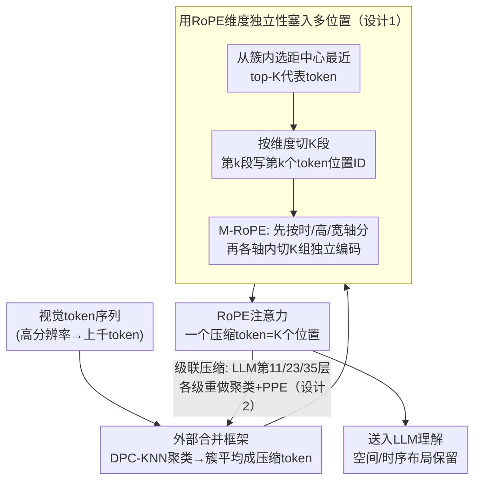

# PPE: Positional Preservation Embedding for Token Compression in Multimodal Large Language Models

**会议**: ICLR 2026  
**arXiv**: [2510.22936](https://arxiv.org/abs/2510.22936)  
**代码**: [GitHub](https://github.com/MouxiaoHuang/PPE)  
**领域**: 多模态VLM/效率  
**关键词**: Token压缩, 位置编码, RoPE, MLLM效率, 时空保持

## 一句话总结

提出PPE（Positional Preservation Embedding），利用RoPE各维度旋转独立性，将合并token内多个原始位置ID分块编码到不同维度段中，实现单个压缩token携带多个空间/时序位置信息。PPE是零参数、即插即用的通用算子，在55%压缩率下图像任务平均仅降3.6%、在90%压缩率下通过级联压缩仍保持可比性能。

## 研究背景与动机

**领域现状**：MLLM（如Qwen2.5-VL、LLaVA-OneVision）将图像/视频编码为密集视觉token后送入LLM联合理解。但密集表示高度冗余——一个高分辨率图像可产生上千个视觉token，带来巨大的计算和内存开销。Token合并/剪枝技术通过聚类相似token来减少序列长度。

**现有痛点**：
1. **ChatUniVi**：聚类合并后对压缩token分配**随机化的位置ID**→完全丢失原始空间布局，导致布局敏感任务（如计数、OCR、时序定位）性能大幅下降
2. **PACT**：仅保留聚类中心的位置ID→每个合并token只有一个位置→位置信息不充分且不精确
3. **通用问题**：压缩率越高→每个合并token代表越多原始token→单一位置ID丢失越多布局信息

**核心矛盾**：Token合并追求的高压缩率与位置信息保持之间的本质冲突——合并减少了token数量，但同时抹除了空间/时序结构。

**本文方案**：观察到RoPE/M-RoPE的旋转编码在每个维度上独立进行（$\text{RoPE}(z_d, m) = e^{im\theta_d}z_d$），因此同一token的不同维度可以编码不同的位置ID。将维度分成 $K$ 组，每组编码聚类中一个被合并token的位置→单个压缩token同时携带 $K$ 个位置信息。

## 方法详解

### 整体框架

PPE把自己挂在任何一个token合并框架之后：先让原框架（如ChatUniVi的DPC-KNN）把相似视觉token聚成簇并平均成一个压缩token，PPE再接手为这个压缩token重新分配位置ID。它的全部动作就是从簇内挑出最有代表性的 $K$ 个原始token，把它们的位置ID分块写进压缩token嵌入的不同维度段里，于是注意力计算时这一个token能同时被感知为 $K$ 个空间/时序位置。整个过程不动特征、不加参数，只改位置ID。在极高压缩率下，PPE还能沿网络深度逐级重复这套"聚类→重分配位置"的动作（级联压缩），让布局信息逐层保住而不一次性崩塌。

### 关键设计

**1. 用RoPE的维度独立性把多个位置塞进一个token：解决合并后单一位置ID丢失布局的根本矛盾**

token合并的代价在于位置——一簇被压成一个token后，原来分散在画面各处的多个位置只能折叠成一个，布局敏感任务（计数、OCR、时序定位）因此崩塌。PPE的突破口是注意到RoPE对每个维度是独立旋转的，$\text{RoPE}(z_d, m) = e^{im\theta_d}z_d$，维度 $d$ 用什么位置 $m$ 旋转互不干扰。既然如此，就没必要让整个token共用一个位置：把 $D$ 维嵌入切成 $K$ 段，第 $k$ 段灌入簇内第 $k$ 个被合并token的位置ID，写成 $\hat{m}_d = m_{k,d}$（其中 $d = (k-1)\frac{D}{K}+1, \ldots, k\frac{D}{K}$），一个压缩token就同时携带了 $K$ 个位置。这背后是一个对称的直觉——相似token既然能共享特征嵌入（靠平均合并），就同样应该共享位置信息，PPE只是把这条思路从特征维度搬到了位置维度。$K$ 个位置ID取簇内距聚类中心最近的top-$K$个token，保证保留的是最有代表性的布局锚点。

对视频这类时空场景，模型用的是M-RoPE，维度 $D$ 先按 $[D_1, D_2, D_3]$ 分给时间/高度/宽度三个轴，PPE在每个轴内部再各自切 $K$ 组、独立编码 $K$ 个位置，写成 $\hat{m}_d^{3D} = m_{k,d}^{3D}$。这里 $K$ 不能随便取，它必须能整除每个section的尺寸，所以取三个section尺寸的最大公约数——例如 $[16,24,24]$ 的GCD为8，$K$ 就是8。当某个簇里token数不足 $K$ 时，则重复填充权重最高token的位置ID补齐。

**2. 级联压缩：把一次激进压缩拆成多级，让极高压缩率下布局仍不崩**

要冲到90%这种极端压缩率，单次压缩会让每个token代表过多原始token、信息瞬间崩塌。PPE改成沿网络深度逐级压缩：先在视觉编码器与LLM之间做第一次PPE压缩，再在36层Qwen2.5-VL-3B的第11/23/35层内部各插一个PPE压缩模块，每一级都重新做聚类、重算簇中心位置、重选top-$K$ ID。这样浅层先保住低级语义不动手太狠、深层才逐步收紧，每层只用0.45的压缩比累乘下来就能达到总体90%的压缩率。关键是PPE在每一级都重新保住位置信息，所以即便压到90%，画面布局也不会像单次激进压缩那样被一次性抹平。

**3. 零参数即插即用：让位置保持这件事不增加任何训练或推理成本**

PPE全程只在操作位置ID，不引入任何可训练参数，也几乎不增加计算——位置ID的挑选和分块写入的开销可忽略不计。因为它只接管"压缩token该用哪些位置"这一步、不碰特征合并逻辑，所以能无缝嵌进ChatUniVi、PACT、ToMe等任意token合并框架，作为一个通用算子直接换上而无需重训。

## 实验结果

### 主实验：图像与视频benchmark全面对比

基于Qwen2.5-VL-3B-Instruct，对比Dense（无压缩）、Chat-UniVi和PPE：

| Benchmark | Dense (0%) | Chat-UniVi (55%) | PPE (55%) | Δ (PPE vs ChatUniVi) |
|:---|:---:|:---:|:---:|:---:|
| MMBench (EN) | 85.89 | 84.92 | 84.73 | -0.19 |
| MMBench (CN) | 86.07 | 83.71 | **84.87** | **+1.16** |
| TextVQA | 79.50 | 57.66 | **77.14** | **+19.48** |
| DocVQA | 89.44 | 52.48 | **76.79** | **+24.31** |
| ChartQA | 79.96 | 49.60 | **74.52** | **+24.92** |
| VideoMME (w/o) | 57.81 | 57.22 | **58.70** | **+1.48** |
| MVBench | 67.90 | 66.90 | **67.38** | **+0.48** |

**核心发现**：
- TextVQA/DocVQA/ChartQA等布局敏感任务上提升惊人（+19~25%），说明位置保持对OCR/文档理解至关重要
- 一般视觉理解任务（MMBench）上差异不大，但PPE仍优于Chat-UniVi
- 视频任务上PPE在55%压缩率下甚至超过Dense基线

### 消融：级联压缩与跨框架兼容性

| 方法 | MMBench (EN) | TextVQA | 压缩率 |
|:---|:---:|:---:|:---:|
| PACT | 74.14 | 73.73 | 89% |
| PACT + PPE | **74.48** | **73.87** | 89% |
| ToMe | 74.31 | 74.94 | 57% |
| ToMe + PPE | **74.57** | **76.16** | 57% |

PPE在PACT和ToMe框架上均带来一致提升，验证了即插即用的通用性。

### 与SOTA MLLM的横向对比

| 模型 | VideoMME | MVBench | MMBench | TextVQA | 压缩率 |
|:---|:---:|:---:|:---:|:---:|:---:|
| InternVL2.5-4B | 62.30 | 71.60 | 81.10 | 76.80 | 0% |
| Qwen2.5-VL-3B | 61.50 | 67.00 | 79.10 | 79.30 | 0% |
| PACT-7B | 57.60 | - | 80.30 | 75.00 | 67% |
| **PPE-3B** | **58.70** | **67.38** | **84.78** | **77.08** | **55%** |
| **PPE*-3B (级联)** | **58.48** | **67.35** | - | - | **90%** |

PPE-3B仅用3B参数+55%压缩即在MMBench上超越7B的PACT和4B的InternVL2.5。

## 论文评价

### 优点

1. **洞察新颖且深刻**：利用RoPE维度独立性编码多位置的思路非常精巧，既理论合理又实现简洁
2. **即插即用零参数**：不增加任何训练成本，可直接嵌入现有框架，实用性极强
3. **布局敏感任务提升显著**：TextVQA/DocVQA上+20%以上的提升说明位置保持确实是token压缩的关键瓶颈

### 不足

1. $K$ 值受限于M-RoPE section的GCD（如 $[16,24,24]$ → $K=8$），灵活性有限
2. 当聚类内token数 < $K$ 时需要重复填充高权重token的ID，信息量减少
3. 仅在Qwen2.5-VL上充分验证，其他架构（LLaVA、InternVL）的适配性需进一步确认

### 评分

⭐⭐⭐⭐

**推荐理由**：找到了token压缩的核心瓶颈（位置信息丢失）并给出了优雅的解决方案。RoPE维度独立性→多位置编码的映射非常自然，零参数即插即用的设计使其具有极高的实际应用价值。在布局敏感任务上的巨大提升进一步验证了方法的有效性。

<!-- RELATED:START -->

## 相关论文

- [\[ICML 2026\] Circle-RoPE: Cone-like Decoupled Rotary Positional Embedding for Vision-Language Models](../../ICML2026/multimodal_vlm/circle-rope_cone-like_decoupled_rotary_positional_embedding_for_large_vision-lan.md)
- [\[CVPR 2026\] SoPE: Spherical Coordinate-Based Positional Embedding for 3D LVLMs](../../CVPR2026/multimodal_vlm/sope_spherical_positional_encoding_3d_lvlm.md)
- [\[ICML 2026\] On the Adversarial Robustness of Large Vision-Language Models under Visual Token Compression](../../ICML2026/multimodal_vlm/on_the_adversarial_robustness_of_large_vision-language_models_under_visual_token.md)
- [\[CVPR 2026\] EvoComp: Learning Visual Token Compression for Multimodal Large Language Models via Semantic-Guided Evolutionary Labeling](../../CVPR2026/multimodal_vlm/evocomp_learning_visual_token_compression_for_multimodal_large_language_models_v.md)
- [\[CVPR 2026\] OmniZip: Audio-Guided Dynamic Token Compression for Fast Omnimodal Large Language Models](../../CVPR2026/multimodal_vlm/omnizip_audio-guided_dynamic_token_compression_for_fast_omnimodal_large_language.md)

<!-- RELATED:END -->
