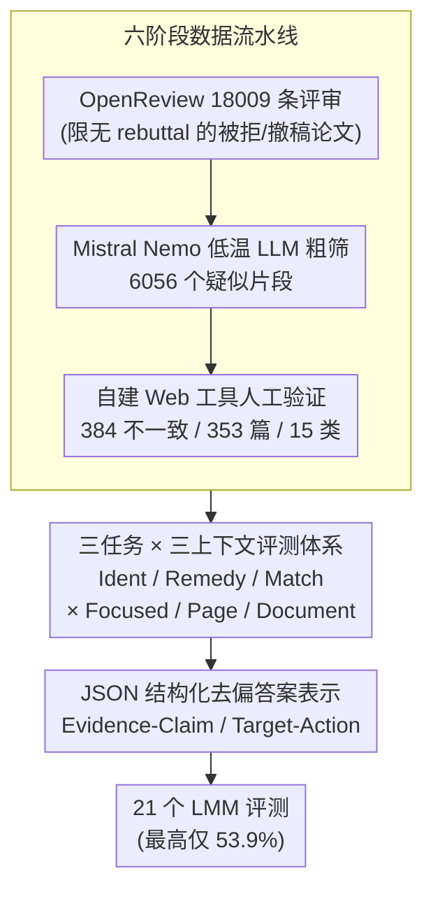

# PRISMM-Bench: A Benchmark of Peer-Review Grounded Multimodal Inconsistencies

**会议**: ICLR 2026  
**arXiv**: [2510.16505](https://arxiv.org/abs/2510.16505)  
**代码**: [项目页面](https://da-luggas.github.io/prismm-bench/)  
**领域**: 多模态评测/科学文档  
**关键词**: 多模态一致性, 同行评审, 科学论文, LMM基准, JSON去偏

## 一句话总结

构建首个基于真实审稿人标记的科学论文多模态不一致性基准PRISMM-Bench，从18009条ICLR开放评审中挖掘384个跨模态不一致，设计识别/修复/配对匹配三任务并提出JSON结构化去偏答案表示，21个顶级LMM最高仅53.9%→系统性暴露当前模型在科学文档跨模态推理上的严重不足。

## 研究背景与动机

**领域现状**：大型多模态模型（LMM）日益被用于科学研究辅助——图表解读、论文摘要、错误检测等。但核心问题悬而未决：LMM能否真正理解并推理科学论文中跨文本、图表、公式的复杂多模态结构？

**现有痛点**：
- 现有文档QA基准（DocVQA、ChartQA等）孤立测试单一模态，忽视了文本-图表-公式之间的跨模态依赖关系
- 合成数据集（如MMIR）注入人工错误，但这些错误往往过于明显，无法代表真实世界中微妙的、需要领域知识才能发现的不一致
- 多选题评估存在严重的语言偏见——模型仅看选项不看题目就能达到远超随机的准确率（如Gemini 2.5 Flash无上下文时达57.6%）

**核心矛盾**：需要一个既"真实"又"系统"的基准来评估跨模态推理，但真实不一致稀少、分散、验证成本高；同时评测本身也被语言捷径污染。

**本文目标**：(1) 如何系统地收集真实的跨模态不一致？(2) 如何设计公平无偏的评测任务？

**切入角度**：利用开放同行评审——审稿人在真实论文中标记的不一致既是专家级标注，又是自然产生的、不可预测的真实错误。

**核心 idea**：审稿人的差评就是最好的多模态推理测试题。

## 方法详解

### 整体框架

PRISMM-Bench 不是合成出来的，而是从真实同行评审里"挖"出来的。整条流水线分三步：先从 OpenReview 抓取 ICLR 2024/2025 的 18009 条评审、用大语言模型（LLM）粗筛再人工逐条验证，沉淀出 384 个被审稿人亲手标记的跨模态不一致；再把它们包装成三类难度递增的多选任务、并叠加三级上下文粒度，铺成一张完整的能力评测网；最后用 JSON 结构化答案堵死模型钻语言捷径的空子，让评测本身公平无偏。三步分别对应下面三个关键设计——数据怎么挖、任务怎么排、答案怎么去偏。

### 关键设计

**1. 六阶段数据流水线：把"审稿人的差评"变成可验证的标注**

真实跨模态不一致稀少、分散且验证成本高，本文用六个阶段层层提纯。第一阶段从 OpenReview 抓取 ICLR 2024/2025 共 18009 条评审，并刻意限定在无 rebuttal 的被拒/撤稿论文上，确保这些不一致没有被作者后续修复掉；第二阶段用 Mistral Nemo 以低温度做 LLM 过滤，从海量评审句子中筛出 6056 个疑似提及不一致的片段，把人工负担压缩一个数量级；第三阶段通过自建 Web 标注工具逐条人工验证，标注不一致类型、涉及模态、位置元数据，最终凝练出 384 个不一致、横跨 353 篇论文、归入 15 个类别。这套"机器粗筛 + 人工精标"的设计，让稀有的专家级标注变得可规模化获取，也天然避免了合成数据"错误过于明显"的通病。

**2. 三任务×三上下文的递进评测体系：覆盖从"发现"到"修复"到"关联"的完整能力谱**

单一任务无法刻画科学文档理解的多个层面，本文设计三个每题 4 选 1 的多选任务，难度层层递进。不一致识别（Ident，384 题）给定论文上下文问"这些部分存在什么不一致"，考察检测能力；不一致修复（Remedy，384 题）进一步问"需要采取什么行动来修复"，要求模型在发现之上做更深的推理；配对匹配（Match，192 题）给定一个视觉元素、从 4 个候选中找出与之冲突的另一个，逼出纯视觉的跨模态关联推理。每个任务又叠加三级上下文粒度——Focused 只给关键片段、Page 给整页 144 DPI 渲染、Document 把整篇论文拼成 5 张图，从"无噪声"到"充满干扰"递增。三任务与三粒度交叉共构成 7 种测试配置，把检测、修复、关联三种能力和短/长上下文的鲁棒性一次性铺开评估。

**3. JSON结构化去偏答案表示：用统一结构消除选项里的语言捷径**

多选评测的老毛病是模型只看选项不看题目就能远超随机（如 Gemini 2.5 Flash 无上下文仍达 57.6%），因为正确答案往往在长度、措辞、位置上泄露了风格线索。本文把自然语言答案统一改写成结构化 JSON——Ident 任务用 **Evidence–Claim** 格式（证据 + 断言），Remedy 任务用 **Target–Action** 格式（目标 + 修复动作）——只保留语义要素、抹掉风格差异，让模型无法靠表面模式蒙对。为量化模型究竟有多依赖真实视觉证据，定义视觉依赖比

$$R = \frac{Acc_{\text{with\_context}} - Acc_{\text{without\_context}}}{1 - Acc_{\text{without\_context}}}$$

它衡量"给上下文相比不给上下文带来的准确率增益占可提升空间的比例"，$R$ 越高说明模型越靠看图而非猜选项。去偏后人类的 $R$ 达到 69.0%，而最佳模型仅 53.5%，直接暴露了模型的"视觉推理"很大程度上是语言捷径假象。

## 实验关键数据

### 主实验：21个LMM基准测试（准确率%）

| 模型 | 参数 | Ident-Focused | Remedy-Focused | Match | Ident-Page | Ident-Doc | 平均 |
|------|:---:|:---:|:---:|:---:|:---:|:---:|:---:|
| Gemma 3 4B | 4B | 27.9 | 29.9 | 39.6 | 25.0 | 26.6 | 27.8 |
| InternVL3.5 8B (R) | 8B | 49.5 | 35.9 | 45.8 | 38.3 | 36.7 | 37.7 |
| Ovis2 34B | 34B | 50.0 | 41.1 | 37.0 | 40.6 | 33.3 | 38.7 |
| GLM 4.5V 106B (R) | 106B | 51.8 | 43.2 | 52.1 | 45.8 | 40.9 | 42.6 |
| GPT-5 minimal (R) | — | 53.6 | 43.5 | 63.0 | 47.1 | 40.9 | 44.0 |
| Gemini 2.5 Pro (R) | — | 65.9 | 61.2 | 66.7 | 54.7 | 39.8 | 52.8 |
| **GPT-5 high (R)** | — | **63.8** | **54.4** | **70.3** | **58.1** | **46.9** | **53.9** |

### 推理消融：关闭CoT的影响（Ident-Focused）

| 模型 | 推理开启 | 推理关闭 | 下降幅度 |
|------|:---:|:---:|:---:|
| GLM 4.5V 106B | 51.8% | 43.2% | -16.6% |
| InternVL3.5 8B | 49.5% | 40.6% | -18.0% |
| InternVL3.5 38B | 54.4% | 40.4% | **-25.7%** |

### JSON去偏效果（用户研究子集）

| 模型 | NL无上下文 | JSON无上下文 | 视觉依赖R(NL) | 视觉依赖R(JSON) |
|------|:---:|:---:|:---:|:---:|
| InternVL3.5 38B | 53.7% | **25.3%** | 22.5 | 38.1 |
| Gemini 2.5 Pro | 70.1% | **37.3%** | 43.8 | 45.2 |
| 人类 | **27.5%** | — | **69.0** | — |

### 关键发现

- 即使最强模型GPT-5 (high)也仅53.9%→距离可靠科学助手差距巨大
- Focused→Page→Document时性能持续下降→长文档干扰是关键瓶颈
- Remedy分数系统性低于Ident→"修复"比"检测"需要更深层推理能力
- 推理CoT平均提升5-14个百分点→结构化推理对科学文档理解至关重要
- 17%的ICLR 2025提交含至少1个审稿人标记的不一致→跨模态不一致问题广泛存在
- 高分辨率专用模型（VILA HD 4K、InternLM XC 2.5）在扩展上下文下无优势

## 亮点与洞察

- **"审稿人差评即测试题"的数据哲学**：不人工注入错误，而是利用同行评审中专家自然发现的问题→最高生态效度、最接近真实应用场景
- **JSON去偏的优雅简洁**：将"去匿名化/风格同质化"思想从NLP安全领域迁移到多模态评测→用统一结构化表示消除答案风格差异→解决了困扰MCQ评测的系统性问题
- **"可持续更新的live benchmark"**：pipeline可应用到新会议评审数据→持续产出样本→从根本上避免数据污染
- **规模vs架构的反思**：Gemma 3 12B在Match任务上达63.5%超过许多70B+模型→架构设计比单纯堆参数更重要

## 局限与展望

- 仅限AI领域（ICLR 2024/2025）→化学/生物/物理等领域的不一致可能有不同特征
- 样本来源偏向被拒论文→已接受论文中的持久性不一致未被评估
- 384个样本规模有限→对按类别拆分的细粒度分析统计功效不足
- 评测的是在已知位置识别不一致→未评估在整篇论文中主动搜索的能力

## 相关工作与启发

- **vs MMIR (Yan et al., 2025)**：MMIR使用合成注入的不一致→更易规模化但不真实；本文用真实标记→更难收集但生态效度高→两者互补
- **vs QASA/SciDQA**：前者仅文本QA、后者来源相似但无视觉元素→PRISMM-Bench在"真实来源+多模态"双维度上独占
- **启发**：可否扩展到arXiv预印本+更多会议的评审，构建跨领域大规模版本？结合自动化评审工具（如AI审稿人），建立主动发现不一致的闭环系统。

## 评分

⭐⭐⭐⭐⭐ (5/5)

综合评价：首创真实审稿标记不一致性基准+JSON去偏，21个模型×三任务×三上下文的极其充分评测，pipeline可持续扩展——对科学AI助手的评估建立了基础设施级贡献，是多模态评测领域的标杆工作。

<!-- RELATED:START -->

## 相关论文

- [\[CVPR 2025\] UPME: An Unsupervised Peer Review Framework for Multimodal Large Language Model Evaluation](../../CVPR2025/multimodal_vlm/upme_an_unsupervised_peer_review_framework_for_multimodal_large_language_model_e.md)
- [\[CVPR 2026\] PAI-Bench: A Comprehensive Benchmark for Physical AI](../../CVPR2026/multimodal_vlm/pai-bench_a_comprehensive_benchmark_for_physical_ai.md)
- [\[ICLR 2026\] VisJudge-Bench: Aesthetics and Quality Assessment of Visualizations](visjudge-bench_aesthetics_and_quality_assessment_of_visualizations.md)
- [\[ICLR 2026\] Reasoning-Driven Multimodal LLM for Domain Generalization](reasoning-driven_multimodal_llm_for_domain_generalization.md)
- [\[ICLR 2026\] GTR-Bench: Evaluating Geo-Temporal Reasoning in Vision-Language Models](gtr-bench_evaluating_geo-temporal_reasoning_in_vision-language_mod.md)

<!-- RELATED:END -->
