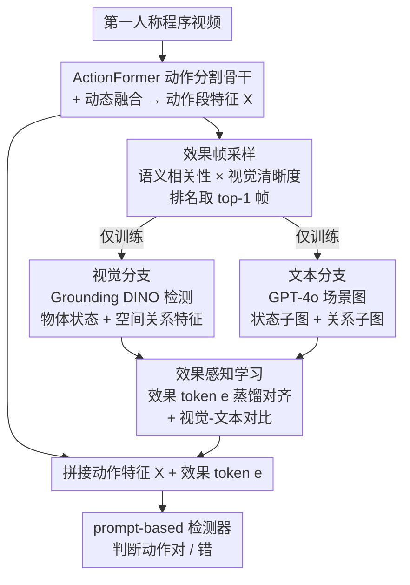

# Procedural Mistake Detection via Action Effect Modeling

**会议**: ICLR 2026  
**arXiv**: [2512.03474](https://arxiv.org/abs/2512.03474)  
**代码**: [https://wenliangguo.github.io/Mistake_Detection](https://wenliangguo.github.io/Mistake_Detection) (项目页)  
**领域**: 多模态VLM  
**关键词**: 程序性错误检测, 动作效果建模, 第一人称视频, 场景图, 多模态监督

## 一句话总结
提出双分支多模态监督的动作效果建模框架，结合视觉分支（目标状态和空间关系特征）和文本分支（GPT-4o 生成的场景图），通过可学习的效果 token 蒸馏外部监督信号，在第一人称程序视频中实现 SOTA 错误检测。

## 研究背景与动机

**领域现状**：程序性错误检测旨在从第一人称视频中识别操作者是否正确执行了步骤（如做菜时是否加错了调料）。现有方法主要关注动作的执行过程（how-to-do），但忽略了动作的执行效果（what-happened-after）。

**现有痛点**：仅建模动作过程无法区分"做了正确的动作但结果不对"的情况，例如"翻面"这个动作在执行上看起来一样，但结果是食物烧焦了就是错误的。

**核心矛盾**：同一个动作的正确与否取决于其效果（outcome），而效果体现在动作完成后的物体状态和空间关系变化中，需要理解"before-after"的因果关系。

**本文目标** 如何有效建模动作效果（物体状态变化 + 空间关系变化）来增强错误检测？

**切入角度**：从效果帧（动作完成后的关键帧）中提取物体状态和空间关系信息，通过视觉和文本双路径的多模态监督来学习效果表征。

**核心 idea**：选择最能反映动作结果的效果帧，从中提取物体状态和空间关系的视觉+文本表征，通过对齐学习蒸馏到可学习的效果 token 中。

## 方法详解

### 整体框架
本文要解决的是"动作做对了但结果不对"这类错误——光看操作过程区分不出来，必须看动作完成后物体变成了什么样、它们之间的位置关系怎么变了。整体仍以 ActionFormer 作为时序骨干来切分动作段，关键改动是在它之上挂一个动作效果建模（Action Effect Modeling, AEM）模块：先从每个动作段里挑出一帧最能反映"做完之后"的效果帧，再从这一帧分两路提取效果信息——视觉一路直接看图像里的物体状态和空间布局，文本一路让 GPT-4o 把这一帧写成结构化场景图；两路信息最终被蒸馏进一个可学习的"效果 token"，这个 token 与动作特征拼起来送进 prompt-based 检测器判断对错。整套设计的巧妙之处在于：GPT-4o、Grounding DINO 这些重外部模型只在训练时充当监督，推理时只用学到的效果 token，不带任何额外开销。

### 关键设计

**1. 效果帧采样：从一段动作里挑出最能说明"结果"的那一帧**

错误体现在结果上，所以拿哪一帧来提效果特征至关重要。一个 naive 的做法是直接取动作段的最后一帧，但最后一帧常常运动模糊、或还没到真正出结果的时刻。本文改成综合两项指标排名取 top-1：一是语义相关性，用动作段特征与 GPT-4o 生成的效果描述嵌入算相似度，挑出语义上最贴"结果"的帧；二是视觉清晰度，用拉普拉斯算子衡量帧的锐利程度，避开模糊帧。这个采样策略本身就值回票价——naive 最后一帧 AUC 70.6，换成本方法挑的效果帧直接到 73.8，单这一项 +3.2。

**2. 视觉分支：把"效果"拆成物体状态和空间关系两路分别看**

一个动作的效果其实有两个独立维度：物体本身变了样（外观/状态变化，比如食材烧焦），以及物体之间的相对位置变了（空间关系变化，比如调料倒进了锅里）。视觉分支顺着这个拆法走两条路：状态路径用 Grounding DINO 在效果帧里检测物体，再用图像编码器提取每个物体的 RoI 特征并拼接成 $F_s$；关系路径则把各物体的位置坐标编码后拼接成 $F_r$。两路特征各自过一个 MLP 映射到统一空间。分开建模而不是揉成一团，是因为"长什么样"和"在哪里"对判断对错的贡献并不一样——消融里空间关系特征（AUC 72.6）反而比物体状态特征（AUC 69.9）更关键。

**3. 文本分支：让 GPT-4o 把效果帧写成场景图，补一路结构化语义**

视觉特征是连续向量，缺少显式的"谁-关系-谁"结构。文本分支让 GPT-4o 从同一张效果帧生成场景图 $G=(V,E)$，节点涵盖对象、关系、属性；再顺着视觉那套拆法，把场景图分解成状态子图和关系子图，分别用 GNN 编码后池化，得到文本侧的状态特征 $t_s$ 和关系特征 $t_r$。这一路提供的是视觉特征给不了的结构化语义，和视觉互补——光加文本分支就能把 AUC 从 68.4 抬到 71.7。

**4. 效果感知学习：用一个可学习效果 token 把双路监督蒸馏进来，推理时甩掉外部模型**

前三步拿到的视觉、文本特征都依赖 GPT-4o 和 Grounding DINO，推理时不可能每帧都调一遍。这一步引入可学习的效果 token $e$：训练时把 $e$ 经 MLP 映射后分别与视觉、文本特征做 L2 对齐，把外部监督"灌"进这个 token；同时在视觉与文本特征之间做对比学习，让两个模态的效果表征在同一空间里对齐。蒸馏完成后，$e$ 与动作特征拼接送入检测器。这样外部大模型只在训练阶段出现，推理时只剩学到的 token，零额外开销。值得注意的是，视觉-文本对齐不是可有可无的装饰——简单融合（不对齐）只到 71.7，加上对齐后再涨 2.1 到 73.8。

### 损失函数
总目标由四项构成：$L = L_{seg} + L_{eff} + L_{CL} + L_{det}$，分别对应动作分割（ActionFormer 的时序定位）、效果对齐（效果 token 与视觉/文本特征的 L2 蒸馏）、视觉-文本对比对齐、以及错误检测的对比损失。

## 实验关键数据

### 主实验（EgoPER 数据集）

| 方法 | AUC | EDA |
|------|-----|-----|
| HF2-VAD | 59.9 | 27.1 |
| EgoPED | 62.0 | 57.0 |
| AMNAR | 68.5 | 64.4 |
| **本文** | **73.8** | **66.7** |

### 消融实验

| 组件 | AUC | EDA |
|------|-----|-----|
| Baseline (无 AEM) | 67.6 | 65.6 |
| + 视觉效果监督 | 68.4 | 66.1 |
| + 文本监督 | 69.4 | 66.3 |
| + 视觉+文本 (无对齐) | 71.7 | 66.4 |
| **+ 对齐的视觉+文本** | **73.8** | **66.7** |

### 关键发现
- 相比 AMNAR (SOTA), AUC 提升 5.3 个点
- 效果帧采样策略比 naive 最后一帧提升 3.2 AUC
- 空间关系特征 (AUC=72.6) 比物体状态特征 (AUC=69.9) 贡献更大
- 视觉-文本对齐比简单融合额外提升 2.1 AUC (71.7 -> 73.8)
- 开源 MLLM (Qwen3-VL) 生成场景图的效果（73.3）接近 GPT-4o (73.8)

## 亮点与洞察
- **动作效果建模**：将错误检测从"动作是否正确执行"转向"动作结果是否正确"，视角的转换非常有洞察力。
- **蒸馏式设计**：训练时利用 GPT-4o 和 Grounding DINO 提供监督，推理时不需要这些模型。效果 token 起到了知识蒸馏的桥梁作用。
- **状态 vs 关系的分解**：将动作效果分解为物体状态变化和空间关系变化两个维度，可迁移到更广泛的因果推理任务。

## 局限与展望
- 效果帧假设动作结束后立即可见效果，对于延迟效果（如慢煮）可能不适用
- GPT-4o 生成场景图的成本高，虽然推理时不需要，但训练时的数据准备耗时
- 仅在厨房操作等受限场景验证，对工业操作等更复杂场景的泛化性未知
- Grounding DINO 的物体检测精度直接影响视觉分支质量

## 相关工作与启发
- **vs AMNAR**: 此前 SOTA，使用异常检测范式；本文显式建模动作效果，更具解释性
- **vs EgoPED**: 早期方法，不建模效果；本文显著超越
- **vs ActionFormer**: 骨干网络，本文在其上增加 AEM 模块

## 评分
- 新颖性: ⭐⭐⭐⭐⭐ 动作效果建模的视角非常新颖且有说服力
- 实验充分度: ⭐⭐⭐⭐ 两个数据集 + 详细消融，但场景较局限（仅厨房）
- 写作质量: ⭐⭐⭐⭐ 公式推导清晰，概率框架优雅
- 价值: ⭐⭐⭐⭐ 为程序性视频理解提供了新方法论

<!-- RELATED:START -->

## 相关论文

- [\[ICLR 2026\] Capacity-Aware Inference: Mitigating the Straggler Effect in Mixture of Experts](capacity-aware_inference_mitigating_the_straggler_effect_in_mixture_of_experts.md)
- [\[ICLR 2026\] Unified Vision-Language Modeling via Concept Space Alignment](unified_vision-language_modeling_via_concept_space_alignment.md)
- [\[ICML 2026\] Pair2Scene: Learning Local Object Relations for Procedural Scene Generation](../../ICML2026/multimodal_vlm/pair2scene_learning_local_object_relations_for_procedural_scene_generation.md)
- [\[CVPR 2026\] UNI-OOD: Unified Object- and Image-level Out-of-Distribution Detection via Cross-Context Attentive Vision-Language Modeling](../../CVPR2026/multimodal_vlm/uni-ood_unified_object-_and_image-level_out-of-distribution_detection_via_cross-.md)
- [\[CVPR 2026\] From Observation to Action: Latent Action-based Primitive Segmentation for VLA Pre-training in Industrial Settings](../../CVPR2026/multimodal_vlm/from_observation_to_action_latent_action-based_primitive_segmentation_for_vla_pr.md)

<!-- RELATED:END -->
