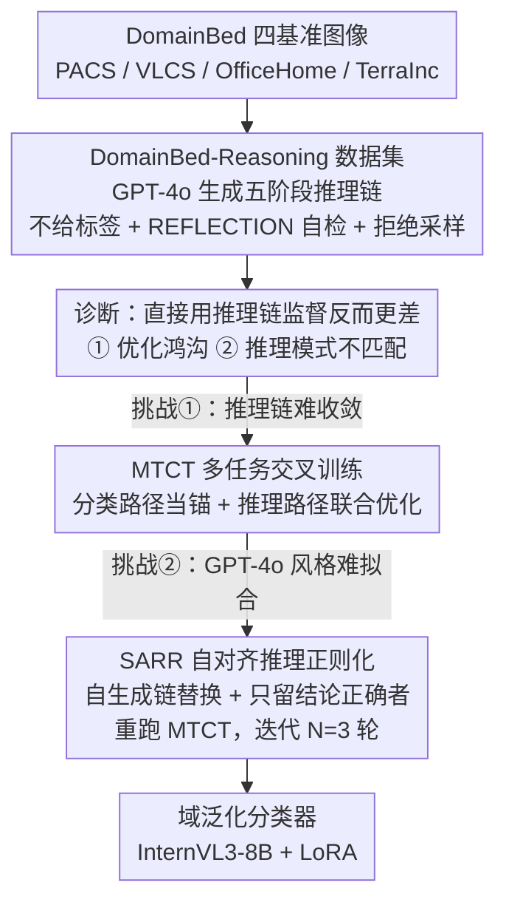

# Reasoning-Driven Multimodal LLM for Domain Generalization

**会议**: ICLR 2026  
**arXiv**: [2602.23777](https://arxiv.org/abs/2602.23777)  
**单位**: 西安电子科技大学 / 微软亚洲研究院
**领域**: 域泛化 / 多模态推理

## 一句话总结

提出 RD-MLDG——首个将 MLLM 推理链引入域泛化的框架。构建 DomainBed-Reasoning 数据集，系统分析推理监督的两大挑战（优化困难 + 推理模式不匹配），通过 MTCT（多任务交叉训练）与 SARR（自对齐推理正则化）协同解决，在 4 个标准 DG 基准上以 86.89% 的平均准确率大幅超越 GPT-4o（83.46%）和所有 CLIP/ViT 方法。

## 研究动机

现有域泛化方法（IRM、CORAL、MixStyle、SWAD 等）聚焦于**特征级不变性**——通过对齐不同域的潜在表示来提升泛化。CLIP 系方法引入了多模态表示但仍局限于特征级对齐。问题在于：特征级不变性无法捕捉更高层的跨域共性。

MLLM 展现出强大推理能力，推理链可以将分类过程显式拆解为可解释、域不变的步骤（例如不同域的"打印机"图片虽视觉差异巨大，但其推理链中类别相关部分高度一致）。然而直接用推理链做监督，性能反而**不如**直接标签监督——这一矛盾促使本文深入分析并设计新框架。

## 方法详解

### 整体框架

RD-MLDG 想把域泛化从"特征级不变性"抬升到"推理过程级不变性"：同一个类别在不同域下视觉差异再大，类别相关的推理判据却高度一致，所以与其对齐模糊的特征，不如直接让模型学会一套域不变的推理过程。整条 pipeline 是：先用 GPT-4o 给 DomainBed 全量样本造一份带推理链的 DomainBed-Reasoning 数据集，作者在这份数据上做了一次诊断，发现"直接拿推理链当监督反而比标签监督还差"，原因是两个症结——推理链难优化、GPT-4o 风格与目标模型不匹配；随后分两阶段微调一个 InternVL3-8B：第一阶段 MTCT 用分类路径当锚把推理路径拽过优化鸿沟，第二阶段 SARR 用模型自生成的链迭代替换 GPT-4o 风格的监督，逐步消除模式不匹配，最终得到一个推理驱动的域泛化分类器。

### 关键设计

**1. DomainBed-Reasoning 数据集：把监督信号从标签升级为可解释的推理过程**

"推理过程不变"这个新假设需要一份能承载它的数据，而标准 DG 基准只有图像和类别标签，于是作者在 PACS/VLCS/OfficeHome/TerraInc 四个数据集上用 GPT-4o 为每个样本生成五阶段推理链 SUMMARY → CAPTION → REASONING → REFLECTION → CONCLUSION。三个细节保证链的质量：生成时**不给 ground-truth 标签**，逼推理完全建立在视觉证据上、杜绝答案泄漏；相比 LLaVA-CoT 的四阶段，额外插入 REFLECTION 自检阶段来减少无效生成、提升稳定性；最后做**拒绝采样**，每样本采多条候选、只保留包含全部组件且结论自洽的链。这样得到的链里，类别相关的推理步骤在不同域之间天然一致（不同域的"打印机"视觉差异巨大，但推理判据高度重合），正是过程级不变性的载体，也是后面所有训练的监督来源。

**2. MTCT（多任务交叉训练）：用分类路径当锚，把推理路径拖过优化鸿沟**

有了链却不能直接拿来训——这是数据集上诊断出的挑战一"优化鸿沟"：在 TerraInc 上，zero-shot 加推理链能把 ground-truth token 概率拉高 +43.28%p，但一旦做 SFT，推理监督反而比直接标签监督低 0.93%p，因为推理链 SFT 只把 token 概率搬高 +1.88%p（直接标签 SFT 是 +43.38%p），收敛慢、分类 token 高置信比例只有 86.33%。MTCT 的对策是对同一张图同时构造两条 prompt：no-thinking 的**分类路径**直接预测标签 $y_i$，提供稳定易收敛的信号；**推理路径**输入完整链 $\mathbf{r}_i$，提供丰富语义。两路联合优化

$$\mathcal{L}_{\text{MTCT}}=\frac{1}{B}\sum_{i=1}^{B}\Big[-\log p_{\theta}(y_i\mid\mathbf{x}_i,\mathbf{q}_{\text{cls}})-\frac{1}{T_i}\sum_{t=1}^{T_i}\log p_{\theta}(r_{i,t}\mid\mathbf{r}_{i,<t},\mathbf{x}_i,\mathbf{q}_{\text{reason}})\Big]$$

推理链损失按 token 长度 $T_i$ 归一化，避免长链在梯度里喧宾夺主。分类路径相当于一个"锚"，引导推理路径的优化方向，防止模型在冗长推理序列上过拟合却学不到分类所需的高置信 token——这正是单用推理链时收敛慢、置信低的根因。

**3. SARR（自对齐推理正则化）：把 GPT-4o 风格逐步换成模型自己的风格**

MTCT 解决了"训得动"，但还剩诊断出的挑战二"推理模式不匹配"：GPT-4o 的链充满背景、视角等描述性上下文，拿来 SFT 后 token 概率只涨 +1.88%p；而用模型自生成的链做 SFT 能涨 +29.74%p，但内容简单、信息量低；两类链优化的 top-15 最大熵减 token 几乎不重叠（GPT-4o 偏描述细节、自生成偏类别词）。SARR 在 MTCT 训完之后让模型自行生成推理链，只保留 `<CONCLUSION>` 与 ground-truth 标签一致的链 $\hat{\mathbf{r}}_i$ 作为精炼监督，再用同样的 MTCT 目标 $\mathcal{L}_{\text{SARR}}$ 重新微调，如此迭代 $N$ 轮（实验取 $N=3$）。每一轮都把一部分 GPT-4o 风格的、难优化的描述性推理替换成模型自身风格、更易拟合的推理，从而在语义丰富性（来自 GPT-4o 的初始链）与可优化性（来自自生成链）之间找到平衡点，既不丢推理过程的不变性，又让分类 token 真正被训进高置信区。

### 损失函数 / 训练策略

两阶段共用 $\mathcal{L}_{\text{MTCT}}$ 形式的"分类 + 归一化推理链"双项损失，SARR 各轮只把监督链从 GPT-4o 链换成自生成链 $\hat{\mathbf{r}}_i$。实现上以 InternVL3-8B 为底座，LoRA rank 8 同时插入视觉编码器与语言解码器，每阶段训 3 epoch，batch size 128，学习率 5e-4，AdamW 优化器，4× A100 80GB。

## 实验结果

### 主实验：DomainBed 标准基准 SOTA 对比

| 方法 | 骨干 | PACS | VLCS | OfficeHome | TerraInc | **平均** |
|------|------|------|------|------------|----------|----------|
| CORAL | ResNet-50 | 86.20 | 78.80 | 68.70 | 47.60 | 70.33 |
| SMOS | ResNet-50 | 89.40 | 79.80 | 71.60 | 55.40 | 74.05 |
| SWAD | ViT-B/16 | 91.30 | 79.40 | 76.90 | 45.40 | 73.25 |
| CLIP | ViT-B/16 | 96.20 | 81.70 | 82.00 | 33.40 | 73.33 |
| SIMPLE+ | ViT-B/16 | **99.00** | 82.70 | 87.70 | 59.00 | 82.10 |
| CLIP-LoRA | ViT-B/16 | 97.10 | 83.10 | 83.90 | 55.70 | 79.95 |
| DGCLDTP | ViT-B/16 | 97.03 | 84.79 | 87.65 | 63.27 | 83.19 |
| GPT-4o | MLLM | 97.83 | 85.41 | 90.12 | 60.49 | 83.46 |
| InternVL3-8B | MLLM | 96.26 | 85.67 | 85.10 | 46.84 | 78.47 |
| **RD-MLDG** | **MLLM** | **98.13** | **87.03** | **91.73** | **70.65** | **86.89** |

RD-MLDG 平均准确率 86.89%，超越 GPT-4o +3.43%p，超越最强 CLIP 方法 DGCLDTP +3.70%p。尤其在 TerraInc 上提升惊人——从 InternVL3-8B 的 46.84% 提升到 70.65%（+23.81%p），甚至超越 GPT-4o 的 60.49% 达 +10.16%p。

### 消融实验（InternVL3-8B，OfficeHome / TerraInc）

| 配置 | OfficeHome | $\Delta$ | TerraInc | $\Delta$ |
|------|------------|----------|----------|----------|
| Zero-shot | 85.10 | — | 46.84 | — |
| + CLS only（直接分类） | 89.39 | — | 66.69 | — |
| + Reasoning only（基线） | 88.76 | — | 64.56 | — |
| + MTCT | 90.58 | +1.81 | 67.19 | +2.63 |
| + SARR | 90.91 | +2.14 | 65.29 | +0.73 |
| + MTCT + SARR（完整） | **91.73** | **+2.97** | **70.65** | **+6.09** |

关键发现：(1) 仅用推理链（Reasoning only）反而比直接分类（CLS only）低 0.63%p / 2.13%p，验证了挑战一；(2) MTCT 单独即带来显著提升；(3) MTCT + SARR 联合效果远超各自单独使用，尤其在 TerraInc 上提升达 +6.09%p。

### SARR 自标注轮数分析

在 TerraInc 上，$N=1$ 时准确率 70.06%，$N=2$ 时 70.59%（$p<0.01$ 显著），$N=3$ 时 70.65%（与 $N=2$ 差异不显著 $p\approx0.07$），$N>3$ 后稳定在 70.50%~70.60%。token 概率分布也在前 2-3 轮即收敛。

### MTCT 的 token 级分析

MTCT 后类别 token 的高置信比例（>0.75）从 86.33% 提升至 90.23%，低置信比例（<0.25）从 7.59% 降至 3.19%。虽然 GPT-4o 推理链的所有 token 仍有 19.33% 停留在低概率区（语义细节难以完全拟合），但分类所需的关键 token 获得了显著增强。

## 亮点与不足

**亮点**：

- **"过程级不变性"的全新视角**：从特征级不变性跃升到推理过程级不变性，推理链中类别相关的推理步骤在不同域之间天然一致
- **问题驱动的方法设计**：先系统分析两大挑战（优化困难 + 模式不匹配），再各有针对性地设计 MTCT 和 SARR，逻辑严密
- **TerraInc 上效果炸裂**：相比基础模型 +23.81%p，相比 GPT-4o +10.16%p，说明推理链对域变化剧烈的场景尤其有效

**局限**：

- 依赖 GPT-4o 生成初始推理链，数据构建成本不低
- 仅验证了分类任务，推理驱动 DG 能否推广到检测/分割等任务尚不清楚
- 4× A100 的训练开销对广泛复现有一定门槛

## 评分

- 新颖性: ⭐⭐⭐⭐⭐ 首个推理驱动域泛化框架 + DomainBed-Reasoning 数据集
- 实验充分度: ⭐⭐⭐⭐⭐ 4 个 DG 基准 + 双模型消融 + token 级分析 + 参数敏感性
- 写作质量: ⭐⭐⭐⭐⭐ 挑战发现→分析→方法→验证的完整逻辑闭环
- 价值: ⭐⭐⭐⭐⭐ 为域泛化开辟推理驱动新范式

<!-- RELATED:START -->

## 相关论文

- [\[CVPR 2026\] Towards Multimodal Domain Generalization with Few Labels](../../CVPR2026/multimodal_vlm/towards_multimodal_domain_generalization_with_few_labels.md)
- [\[ACL 2025\] Table Understanding and (Multimodal) LLMs: A Cross-Domain Case Study on Scientific Tables](../../ACL2025/multimodal_vlm/table_understanding_and_multimodal_llms_a_cross-domain_case_study_on_scientific_.md)
- [\[ICLR 2026\] VLM-SubtleBench: How Far Are VLMs from Human-Level Subtle Comparative Reasoning?](vlm-subtlebench_how_far_are_vlms_from_human-level_subtle_comparative_reasoning.md)
- [\[CVPR 2026\] Breaking Multimodal LLM Safety via Video-Driven Prompting](../../CVPR2026/multimodal_vlm/breaking_multimodal_llm_safety_via_video-driven_prompting.md)
- [\[ICLR 2026\] VTool-R1: VLMs Learn to Think with Images via Reinforcement Learning on Multimodal Tool Use](vtool-r1_vlms_learn_to_think_with_images_via_reinforcement_learning_on_multimoda.md)

<!-- RELATED:END -->
