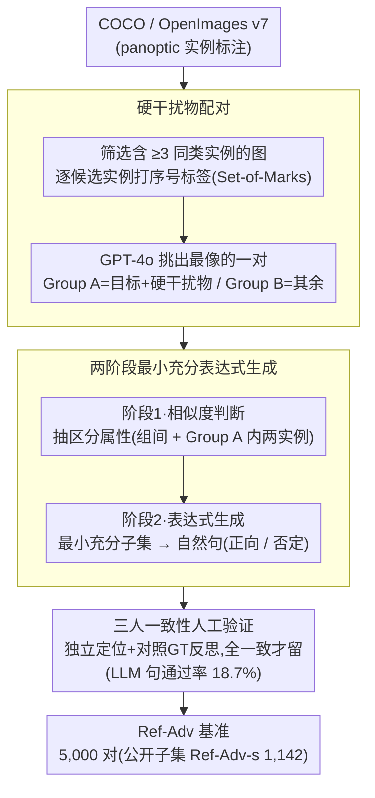

# Ref-Adv: Exploring MLLM Visual Reasoning in Referring Expression Tasks

**会议**: ICLR 2026  
**arXiv**: [2602.23898](https://arxiv.org/abs/2602.23898)  
**代码**: [https://ref-adv.github.io/](https://ref-adv.github.io/)  
**作者**: Qihua Dong, Kuo Yang, Lin Ju, Handong Zhao, Yitian Zhang, Yizhou Wang, Huimin Zeng, Jianglin Lu, Yun Fu  
**领域**: 多模态VLM — 指称表达理解、视觉推理  
**关键词**: Referring Expression Comprehension, Visual Grounding, Hard Distractors, Benchmark, Shortcut Suppression

## 一句话总结

提出 Ref-Adv 基准数据集，通过 **硬干扰物配对 + LLM 辅助最小充分表达式生成 + 三人一致性人工验证** 的流水线，构建了一个消除"定位捷径"的现代 REC 基准，在该基准上 13 个当代 MLLM（包括 GPT-4o、Gemini 2.5、Qwen2.5-VL-72B 等）的准确率从 RefCOCO(+/g) 上的 90%+ 大幅下降至 50-68%，系统暴露了模型在复杂视觉推理和真实定位能力上的严重不足。

## 研究背景与动机

**领域现状**：指称表达理解（REC）是将自然语言描述定位到图像特定区域的经典任务。RefCOCO、RefCOCO+、RefCOCOg 是该领域的标准基准，当前最强 MLLM（Qwen2.5-VL-72B、InternVL-3 等）在这些数据集上已达到 90%+ 的准确率，趋近饱和。

**现有痛点**：经典 REC 基准存在三个系统性缺陷——① 表达式极短（RefCOCO/RefCOCO+ 平均仅 3.6 个词），语言理解需求极低；② 干扰物稀少（RefCOCO(+/g) 大部分图像仅有 1 个同类目标），分类即可定位；③ 存在"定位捷径"（grounding shortcut），大量冗余描述符使模型只需匹配部分描述即可成功定位目标，无需理解完整表达式。

**核心矛盾**：高分 ≠ 真正的视觉推理能力。实验表明，即使将表达式替换为固定的 "the one"、打乱词序为 bag-of-words、或删除一个描述符，模型在 RefCOCO(+/g) 上的性能下降幅度远小于预期。这意味着基准分数严重高估了模型的真实推理和定位能力。

**本文目标**：构建一个满足以下条件的现代 REC 基准：① 每个表达式都需要多步文本推理（理解目标描述及其与干扰物的区别）；② 需要精细视觉推理（在多个高度相似的候选物体中区分目标）；③ 消除可绕过推理的捷径。

**切入角度**：将 REC 视为**文本推理 + 视觉推理**的耦合多步推理任务。通过强制引入"硬干扰物"（与目标部分匹配但不完全匹配的同类物体），并用 LLM 生成仅包含**最小充分描述符**的表达式，使得每个描述符都是定位所必需的，从根源上消除捷径。

**核心 idea**：用硬干扰物配对 + 最小充分表达式生成的数据管线，构建一个让每个描述符都对定位不可或缺的 REC 基准，从而真正评估 MLLM 的视觉推理能力。

## 方法详解

### 整体框架

Ref-Adv 不提新模型，而是给指称表达理解（Referring Expression Comprehension, REC）造一把更难的尺子——一条把"定位捷径"（grounding shortcut）堵死的数据构建流水线。核心思路是：先在一张图里凑齐几个"长得像"的同类物，逼模型做精细区分；再用大语言模型（LLM）写出"每个描述符都缺一不可"的最小充分表达式；最后交三位标注者一致把关。流水线分四步——输入准备（筛图 + 打序号标签）→ 相似度判断（分出硬干扰物对、抽区分属性）→ 表达式生成（最小充分子集组句）→ 人工验证（三人一致才留）。输入是 COCO 与 OpenImages v7 的图像加 panoptic 实例标注，输出是 5,000 个指称表达-目标对（公开子集 Ref-Adv-s 含 1,142 例）。其中约 4,000 条由 LLM 流水线生成、其余由标注者手写，但都要过同一道三人验证。

### 关键设计

**1. 硬干扰物配对（Hard Distractor Pairing）：在一张图里凑齐几个"长得像"的同类物，逼模型做精细区分**

RefCOCO(+/g) 的根子问题是 70%+ 的图像里同类干扰物只有 0-1 个，模型靠类别识别就能定位，根本不必看描述。Ref-Adv 反着来：先从 COCO 和 OpenImages v7 的 panoptic 实例标注里筛出**含 ≥3 个同类实例**的图像，给每个候选实例打上序号标签（借鉴 Set-of-Marks，但因已有实例标注、只需标候选物）；再让 GPT-4o 在这些候选里挑出最像的一对，把目标和它的"硬干扰物"归为 Group A、其余同类归为 Group B。这一步把任务从"这是不是一只猫"的分类题，硬升级成"这几只几乎一样的猫里哪只是目标"的精细区分题，模型再没法靠类别蒙混过关。

**2. 两阶段最小充分表达式生成（Minimally Sufficient Expression Generation）：先抽区分属性、再从最小子集组句，从源头掐掉冗余描述符**

冗余描述符正是"定位捷径"的温床——描述符越多，模型越可能只匹配其中一两个就蒙对；论文实测 GPT-4o 单步直接写句会 overspecified，堆一大串冗余描述、又把捷径放了回去。所以 Ref-Adv 拆成两阶段。阶段一（相似度判断）让 GPT-4o 在 Group A/B 之上输出两份区分属性——一份区分 Group A 与 Group B、一份区分 Group A 内的目标与硬干扰物，每条还要给多个备选说法。阶段二（表达式生成）从这些描述符的**最小充分子集**出发组句，支持两种策略：要么用目标自身的正向描述符，要么把硬干扰物的描述符取**否定形式**（"不是…的那个"），刻意把否定推理引进来（组句时仍喂入图像以更自然，并禁止描述里出现序号标签）。多绕这一步换来的是质量——最终表达式平均 11.5 词、4.01 个干扰物、21.25% 含否定，远高于 RefCOCO 的 3.6 词 / 3.99 干扰物 / 0.99% 否定，而**每个描述符都缺一不可**。

**3. 三人一致性人工验证（Three-Annotator Verification）：三位标注者独立把关，过滤 LLM 的幻觉与歧义**

LLM 辅助标注绕不开幻觉，所以最后一道关卡交回给人（手写的那批表达式也走同一道关）。三位标注者各自独立判两件事：表达式是否正确且无歧义——先在没有序号标签的原图上自行定位，再对照 GT 框反思、最终确认；以及图里是否真存在硬干扰物。每人看到的样本顺序随机，只有**三人全部一致**的样本才留下来。这道关卡卡得极严，LLM 生成句的通过率仅 18.7%（平均要生约 5.35 条才留 1 条），正是这个看似浪费的低通过率，换来了基准的公信力。

## 实验关键数据

### Table 1: Ref-Adv 基准统计 vs 经典 REC 基准

| 基准 | 图像数 | 实例数 | 平均表达式长度 | 平均干扰物数 | 否定比例 | 词汇量 |
|------|--------|--------|---------------|-------------|---------|-------|
| RefCOCO | 3,000 | 7,596 | 3.6 | 3.99 | 0.99% | 3,525 |
| RefCOCO+ | 3,000 | 7,578 | 3.6 | 3.96 | 3.36% | 4,387 |
| RefCOCOg | 3,900 | 7,596 | 8.4 | 1.64 | 1.41% | 5,050 |
| **Ref-Adv** | **2,833** | **5,000** | **11.5** | **4.01** | **21.25%** | **5,308** |

Ref-Adv 在表达式长度、词汇多样性、否定推理比例上全面超越经典基准，且干扰物密度维持在较高水平。

### Table 2: 主实验结果（Ref-Adv 全集，代表性模型）

| 模型 | CoT | SoM | Acc@0.5 | Acc@0.75 | Acc@0.9 | mAcc | ≥7干扰物Δ |
|------|-----|-----|---------|----------|---------|------|-----------|
| GPT-4o | ✗ | ✓ | 52.3 | 31.2 | 13.4 | 27.8 | -0.6 |
| GPT-4o | ✓ | ✓ | **63.7** | **38.4** | **19.7** | **34.1** | -3.2 |
| Claude-3.5 Sonnet | ✗ | ✓ | 40.8 | 22.1 | 3.8 | 22.4 | -3.4 |
| Gemini 2.5-Flash | ✓ | ✗ | 59.4 | 35.1 | 16.3 | 30.6 | -3.8 |
| Gemini 2.5-Pro | ✓ | ✗ | 59.1 | 32.6 | 14.2 | 28.3 | -3.2 |
| InternVL-3-78B | ✓ | ✗ | 58.4 | 47.9 | 29.6 | 41.2 | -3.0 |
| Qwen2.5-VL-72B | ✓ | ✗ | 58.3 | 47.8 | 29.5 | 41.1 | -2.7 |
| GLM-4.5V | ✓ | ✗ | 56.9 | 46.6 | 28.8 | 40.2 | -2.3 |
| CogVLM-Grounding | ✗ | ✗ | 51.5 | 41.2 | 23.4 | 35.0 | -0.7 |

对比 RefCOCO(+/g) 上 90%+ 的准确率，所有模型在 Ref-Adv Acc@0.5 上均未超过 64%，**最强的 GPT-4o+CoT+SoM 也仅 63.7%**，暴露了巨大的推理差距。高 IoU 阈值下差距更大：Acc@0.9 最高仅 29.6%（InternVL-3-78B）。

### Table 3: Ref-Adv-s 子集上模型规模与思考模式的影响（Qwen 系列）

| 模型 | CoT/Thinking | Acc@0.5 | ≥7干扰物Acc@0.5 | ≥7干扰物Δ |
|------|-------------|---------|-----------------|-----------|
| Qwen2.5-VL-3B | ✗ | 23.8 | 17.1 | -6.8 |
| Qwen2.5-VL-72B | ✓ | 52.4 | 38.8 | -13.6 |
| Qwen3-VL-2B-Thinking | ✓ | 44.4 | 31.0 | -13.4 |
| Qwen3-VL-8B-Thinking | ✓ | 59.5 | 47.3 | -12.2 |
| Qwen3-VL-32B-Thinking | ✓ | 65.6 | 52.7 | -12.9 |
| Qwen3-VL-235B-A22B-Thinking | ✓ | 67.1 | 56.6 | -10.5 |
| Qwen3.5-397B-A17B | ✓ | **68.0** | 56.6 | -11.4 |

两个关键发现：① Thinking 模式显著优于同尺寸 Instruct 模式（如 Qwen3-VL-8B-Thinking 59.5 vs Instruct 47.2，+12.3）；② 即使最大模型 Qwen3.5-397B 也仅 68.0%，且高干扰物场景性能仍显著下降（-11.4）。

### 基准质量验证（三种消融测试）

论文设计了三种消融测试（ablation），定量证明 Ref-Adv 确实更难被捷径绕过：

- **模型偏差测试**（Model Bias Test）：将所有表达式替换为固定的 "the one"，看模型能否仅凭统计偏差定位。Qwen2.5-VL-72B 在 RefCOCO 上仍达 35.1%，在 Ref-Adv 上仅 21.4%（Δ=−13.7%），说明 Ref-Adv 受数据偏差影响更小
- **文本推理必要性测试**（Bag-of-Words Test）：打乱表达式词序。Ref-Adv 上 Qwen2.5-VL-72B 下降 16.8%（58.3→41.5%），显著大于 RefCOCO 的 9.9%，证明 Ref-Adv 需要真正的文本理解
- **描述符删除充分性测试**（Descriptor Deletion Test）：随机删除一个描述符。Ref-Adv 上下降 6.4%（58.3→51.9%），大于 RefCOCO 的 4.7%，说明每个描述符都更不可或缺

### 关键发现

- **CoT 在 Ref-Adv 上有效但在 RefCOCO 上无效**：Ref-Adv 需要多步推理，CoT 帮助模型逐步排除干扰物；而 RefCOCO 定位简单，CoT 反而引入不必要的冗余和错误
- **干扰物数量是性能瓶颈**：所有模型在 ≥7 干扰物组上性能显著低于整体，最大降幅达 -19.3%（Qwen3-VL-235B-A22B-Instruct），说明处理多个高相似候选是当前 MLLM 的核心弱点
- **模型常选择硬干扰物作为答案**：定性分析显示模型即使使用 CoT 也经常在推理链中间因视觉感知错误或表达式误解而选中硬干扰物，而非真实目标
- **Acc@0.9 极低**：即使定位成功（Acc@0.5），精确框回归能力仍然很差，最好模型的 Acc@0.9 也仅 ~35%

## 亮点与洞察

1. **"捷径"问题的系统化诊断**：论文首次将 REC 基准的三个系统性缺陷（短表达、少干扰物、冗余描述符）整合为一个统一的"定位捷径"框架，并通过三种消融测试（偏差 / 词序 / 描述符删除）定量验证，为后续基准设计提供了方法论模板。

2. **两阶段生成优于单步生成**：放弃让 LLM 单步直接生成表达式，改为先提取区分属性再从最小子集组合，这个设计洞察值得迁移——在任何需要 LLM 生成"精确且不冗余"文本的场景中，先分析再组合优于直接端到端生成。

3. **否定推理的引入**：21.25% 的否定表达比例（RefCOCO 仅 0.99%）测试了模型理解"不是X"的能力，这是一个被忽视但重要的推理维度。

4. **Thinking 模式的显著优势**：Qwen3-VL-2B-Thinking（44.4%）甚至优于 Qwen2.5-VL-32B-Instruct（48.0%），说明小模型 + 推理训练在需要复杂推理的任务上可以超越大模型 + 普通微调。

## 局限与展望

1. **数据来源受限**：仅使用 COCO 和 OpenImages v7 的图像，场景多样性有限。未涉及更复杂的真实场景（如密集城市街景、工业检测场景），泛化性有待验证。

2. **对 SoM 的依赖影响公平性**：GPT-4o 和 Claude 使用 Set-of-Marks（SoM）+ Semantic-SAM 进行评估，而开源模型直接输出坐标。SoM 将定位问题转化为选择问题，两种评估范式不完全可比，可能高估了使用 SoM 模型的推理能力。

3. **LLM 生成表达式的天花板**：18.7% 的保留率意味着 81.3% 的 LLM 生成被丢弃，且最终保留样本可能偏向 LLM 能正确理解的简单场景，引入了潜在的选择偏差。

4. **缺少分割级别评估**：Ref-Adv 仅评估框级定位（bounding box IoU），未扩展到 referring expression segmentation（RES），而像素级分割对"精确理解"的要求更高。

5. **未覆盖视频或 3D 场景**：REC 在视频理解和 3D 场景定位中同样重要，仅静态图像的评估不足以全面衡量模型推理能力。

## 相关工作与启发

- **vs RefCOCO(+/g)**：经典基准表达式短、干扰物少、允许捷径，Ref-Adv 在每一维度上都进行了系统性强化。但 RefCOCO 仍有存在价值——用于检测模型的基础定位能力。

- **vs Cops-Ref / FineCops-Ref**：同样引入组合推理和干扰物，但使用 GQA 场景图固定模板生成表达式，自然度不如 Ref-Adv 的 LLM + 人工管线。

- **vs HC-RefLoCo / Ref-L4**：推动更长更自然的表达式，但未从根本上解决描述符冗余带来的捷径问题。HC-RefLoCo 平均长度 90+ 词反而引入了更多捷径。

- **与 VQA/推理基准的关系**：Ref-Adv 的设计思路（消除捷径、强制推理）与 VQA 领域的 adversarial benchmark（如 VQA-CP、Winoground）异曲同工，可以看作 REC 领域的 adversarial benchmark。

## 评分

- 新颖性: ⭐⭐⭐⭐ 基准构建方法论（硬干扰物 + 最小充分表达式 + 三重验证）有系统性创新，但核心 idea 属于对已知问题的工程化解决
- 实验充分度: ⭐⭐⭐⭐⭐ 13 个模型、三种消融测试、多 IoU 阈值、干扰物分组分析、CoT 对比、规模缩放实验，覆盖极其全面
- 写作质量: ⭐⭐⭐⭐ 问题阐述清晰，消融测试设计巧妙，但论文结构偏长，部分分析可更精炼
- 价值: ⭐⭐⭐⭐ 对 MLLM 社区有重要参考价值，揭示了 RefCOCO 饱和分数的虚假繁荣，推动更真实的评估标准

<!-- RELATED:START -->

## 相关论文

- [\[CVPR 2026\] EG-3DVG: Expression and Geometry Aware Grounding Decoder for 3D Visual Grounding](../../CVPR2026/multimodal_vlm/eg-3dvg_expression_and_geometry_aware_grounding_decoder_for_3d_visual_grounding.md)
- [\[ICCV 2025\] DOGR: Towards Versatile Visual Document Grounding and Referring](../../ICCV2025/multimodal_vlm/dogr_towards_versatile_visual_document_grounding_and_referring.md)
- [\[ECCV 2024\] Elysium: Exploring Object-level Perception in Videos via MLLM](../../ECCV2024/multimodal_vlm/elysium_exploring_object-level_perception_in_videos_via_mllm.md)
- [\[CVPR 2026\] CodeDance: A Dynamic Tool-integrated MLLM for Executable Visual Reasoning](../../CVPR2026/multimodal_vlm/codedance_a_dynamic_tool-integrated_mllm_for_executable_visual_reasoning.md)
- [\[CVPR 2026\] Downscaling Intelligence: Exploring Perception and Reasoning Bottlenecks in Small VLMs](../../CVPR2026/multimodal_vlm/downscaling_intelligence_exploring_perception_and_reasoning_bottlenecks_in_small.md)

<!-- RELATED:END -->
