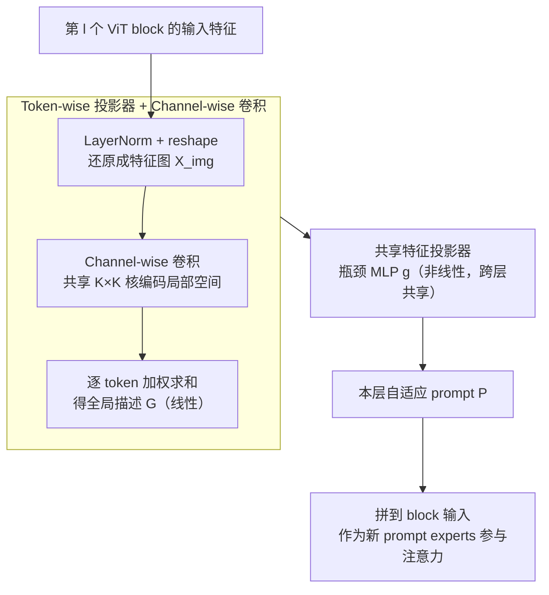

# Revisit Visual Prompt Tuning: The Expressiveness of Prompt Experts

**会议**: ICLR 2026  
**arXiv**: [2501.18936](https://arxiv.org/abs/2501.18936)  
**代码**: [GitHub](https://github.com/Minhchuyentoancbn/VAPT)  
**领域**: 多模态/视觉语言模型  
**关键词**: 视觉提示调优, 混合专家, 参数高效微调, Vision Transformer, 自适应提示  

## 一句话总结

从混合专家（MoE）视角揭示 VPT 的局限性——prompt experts 是输入无关的常量函数表达力受限，提出 VAPT 通过 token-wise 投影器和共享特征投影器使 prompt experts 自适应输入，用更少参数实现更优性能，并给出了最优样本效率的理论保证。

## 研究背景与动机

- **领域现状**：Visual Prompt Tuning（VPT）通过在 ViT 输入中附加可学习的 prompt tokens 实现参数高效微调，已成为 PEFT 方法中的重要分支
- **现有痛点**：VPT 的理论理解不够深入；近期 Le et al.（2024）建立了注意力机制与 MoE 的联系，揭示每个注意力头可解释为多个 MoE 模型的组合，而 VPT 就是向这些 MoE 中添加新的 prompt experts
- **核心矛盾**：通过 MoE 视角可以发现，预训练的 experts $f_j(\bm{X}) = W_m^{V\top} \bm{x}_j$ 是输入 $\bm{X}$ 的线性函数，而 prompt experts $f_{N+j'}(\bm{X}) = W_m^{V\top} \bm{p}_{j'}$ 是固定常量向量，与输入无关。这种表达力不对等限制了 VPT 的适应能力
- **本文目标**：在保持参数效率的前提下，增强 prompt experts 的函数表达力
- **切入角度**：设计输入自适应的 prompt 生成机制，同时保持简洁的函数形式以支撑理论分析
- **核心 idea**：用 token-wise 投影器聚合全局特征 + 共享 MLP 投影器生成自适应 prompt，使 prompt expert 从常量函数升级为输入的非线性函数

## 方法详解

### 整体框架

VAPT 想解决的核心问题是：VPT 的 prompt tokens 是一组与输入无关的固定向量，从 MoE 视角看，它们对应的 prompt expert 退化成了常量函数，表达力被钉死。VAPT 的做法是把"固定 prompt"换成"按输入算出来的 prompt"——在每个 ViT block 里插入一个 VAPT 模块，让它读当前层的输入 $\tilde{\bm{X}}^{(l)}$，现场生成这一层要用的 prompt tokens $\bm{P}^{(l)}$。整条链路是：先把这层特征还原成特征图、过一个 channel-wise 卷积编码局部空间，再由 token-wise 投影器把它逐 token 加权求和成每个 prompt 对应的全局描述向量，最后送进一个所有层共享的瓶颈 MLP 做非线性变换，吐出本层 prompt 并拼回 block 输入参与注意力。前两步是线性聚合、最后一步引入非线性，这样既让 prompt expert 变成输入的非线性函数，又把函数形式保持得足够简洁、能撑起后面的理论分析。

### 关键设计

**1. Token-wise 投影器 + Channel-wise 卷积：让 prompt 补上预训练 expert 看不到的全局空间信息**

预训练 experts 本质是对每个 patch 做线性投影 $f_j(\bm{X}) = W_m^{V\top}\bm{x}_j$，只能捕获局部 patch 信息，所以 VAPT 希望生成的 prompt 互补地承载全局信息。它先用一个 channel-wise 卷积给特征图 $\bm{X}_{\text{img}} \in \mathbb{R}^{H \times W \times d}$ 编码局部空间关系 $\bm{X}_{\text{conv}} = F * \bm{X}_{\text{img}}$——所有 $d$ 个通道共享同一个 $K \times K$ 卷积核，因此只花 $K^2$ 个参数（比标准卷积省 $d$ 倍），却能建模相邻 patch 的空间邻接（单纯加权求和会把相邻 patch 当成独立 token、丢掉这层邻接信息）。然后由 token-wise 投影把这张图聚合成每个 prompt 的全局描述：

$$G_{j'}(\bm{X}_{\text{conv}}) = \sum_{k=1}^{H' \cdot W'} \alpha_{j',k}\, \bm{x}_k^{\text{conv}} \in \mathbb{R}^d$$

其中 $\alpha_{j',k}$ 是可学习的标量权重，对所有 token 加权求和。卷积和加权求和都是线性操作，组合起来等价于一个线性映射 $G_{j'}(\bm{X}_{\text{conv}}) = W_{j'}\bm{X}$，也就是说到这一步 prompt 还只是输入的线性函数——非线性留给下一个模块。

**2. 共享特征投影器：用一个瓶颈 MLP 把线性聚合升级成非线性自适应 prompt，且比 VPT 更省参数**

光有线性聚合还不够——要让 prompt expert 从常量升级成非线性函数，关键就是这一步。VAPT 把上一步的全局描述送进一个瓶颈 MLP $g(\bm{x}) = W^{(2)} \sigma(W^{(1)} \bm{x})$，其中 $W^{(1)} \in \mathbb{R}^{r \times d}$、$W^{(2)} \in \mathbb{R}^{d \times r}$、$r \ll d$，于是最终 prompt 写成

$$\bm{P}_{j'}(\bm{X}) = W^{(2)} \sigma(W^{(1)} W_{j'} \bm{X}) \in \mathbb{R}^d.$$

代回 MoE 框架，prompt expert 的两个函数就都跟着输入变了：expert 函数 $f_{N+j'}(\bm{X}) = W_m^{V\top}\bm{P}_{j'}(\bm{X})$ 成为输入的非线性函数，连带 score 函数 $s_{i,N+j'}(\bm{X}) = \frac{\bm{x}_i^\top W_m^Q W_m^{K\top}\bm{P}_{j'}(\bm{X})}{\sqrt{d_v}}$ 也自适应了——这正好回应了 VPT 里 prompt expert 表达力受限的痛点。

反直觉的是，加了这套自适应反而比 VPT 更省参数。关键省参技巧是所有 ViT block 共享同一个投影器 $g$、不为每层各配一份，于是 VAPT 的可学习参数拆成三块：token-wise 投影 $L \times N_p \times H' \times W'$、卷积 $L \times K^2$、共享投影器 $2rd$。对 ViT-B/16（$N=196,\, d=768$）来说，下采样后的 $H' \times W' < N \ll d$，而 $K$、$r$ 都是小常数、共享投影器又只算一次，三项加起来通常仍**少于** VPT 的 $L \times N_p \times d$。代价只是推理时多了卷积和两次矩阵乘，FLOPs 相对 VPT 仅增加 0.6%。

### 损失函数

标准交叉熵分类损失，仅更新 VAPT 参数和分类头。

## 实验关键数据

### 主实验（ViT-B/16 Supervised ImageNet-21K）

| 方法 | Tuned/Total(%) | FGVC | VTAB-Natural | VTAB-Specialized | VTAB-Structured |
|---|---|---|---|---|---|
| Full Fine-tuning | 100.00 | 88.54 | 75.88 | 83.36 | 47.64 |
| VPT-Deep | 0.73 | 89.11 | 78.48 | 82.43 | 54.98 |
| LoRA | 0.73 | 89.46 | 78.26 | 83.78 | 56.20 |
| E2VPT | 0.39 | 89.22 | 80.01 | 84.43 | 57.39 |
| SA2VP | 0.65 | 90.08 | 80.97 | 85.73 | 60.80 |
| **VAPT** | **0.36** | **89.58** | **81.43** | **85.13** | **59.34** |

VAPT 在 VTAB-1K 上超过全量微调 7.34%，在 FGVC 上超过 1.04%。

### 消融实验

- 低数据场景（Stanford Dogs 1% 训练数据）：VAPT 60.1% vs VPT 3.6%——差距极为悬殊
- 去除 channel-wise 卷积：性能下降，验证空间信息建模的重要性
- 去除特征投影器（仅线性聚合）：性能下降，非线性变换不可或缺

### 不同预训练的泛化（MAE/MoCo v3）

| 预训练 | 方法 | VTAB-Natural | VTAB-Specialized | VTAB-Structured |
|---|---|---|---|---|
| MAE | VPT-Deep | 36.02 | 60.61 | 26.57 |
| MAE | VAPT | **59.23** | **79.10** | **51.49** |
| MoCo v3 | VPT-Deep | 70.27 | 83.04 | 42.38 |
| MoCo v3 | VAPT | **79.54** | **86.92** | **59.41** |

### 关键发现

1. VAPT 在**所有**预训练目标和两个 benchmark 上一致优于 VPT，且使用更少参数
2. 在自监督预训练（MAE）上优势尤为显著——VPT 在 Structured 上仅 26.57% 而 VAPT 达 51.49%
3. 低数据场景下 VAPT 的优势呈指数级放大（60.1% vs 3.6%），验证了 Theorem 1 的最优样本效率预测
4. 参数效率极高：仅 0.36% 参数即超越全量微调

## 亮点与洞察

1. **理论与实践完美匹配**：MoE 视角清晰解释了 VPT 的局限性（prompt expert 表达力不足），VAPT 的理论分析（Theorem 1 给出 $\mathcal{O}_P([\log(n)/n]^{1/2})$ 最优收敛率）与实验中低数据场景的显著优势完全一致
2. **设计哲学精妙**：不是简单增加参数，而是通过 (token-wise projection + 共享 MLP) 的结构保持函数形式简洁，既提升了表达力又使理论分析可行
3. **反常识发现**：用更少参数 (0.36% vs 0.73%) 获得更好性能，打破了"更多参数=更好性能"的刻板印象
4. **MoE 解释框架**的方法论价值：为理解和改进各种 prompt-based 方法提供了统一视角

## 局限与展望

1. token-wise 投影器的权重 $\alpha_{j',k}$ 是可学习标量但与输入无关，可考虑进一步使其自适应
2. 共享特征投影器相同——不同层可能需要不同的非线性变换
3. 理论分析仅覆盖了单头单行的简化设定，完整多头多层的理论保证尚缺
4. 仅在分类任务上验证，检测/分割等密集预测任务的效果需进一步确认

## 相关工作与启发

- **VPT 家族**：VPT-Deep（Jia et al., 2022）是基线；E2VPT（Han et al., 2023）引入 pruning；SA2VP（Pei et al., 2024）空间自适应
- **其他 PEFT 方法**：LoRA（Hu et al., 2021）、Adapter（Cai et al., 2020）从不同角度实现参数高效
- **MoE 与 Prompt 联系**：Le et al.（2024）首先建立了理论联系，本文是其在视觉 prompt tuning 上的具体推进
- **启发**：MoE 解释框架暗示了一个更广泛的设计空间——score function 也可以被增强（本文已通过自适应 prompt 自然实现了 score function 的自适应）

## 评分

⭐⭐⭐⭐（4/5）

- **创新性**：⭐⭐⭐⭐ MoE 视角发现问题 + 简洁的解决方案，理论驱动
- **实验**：⭐⭐⭐⭐⭐ FGVC + VTAB-1K + 多预训练目标 + 消融 + 语义分割，非常全面
- **写作**：⭐⭐⭐⭐ 从 MoE 视角到方法设计的逻辑链清晰
- **实用性**：⭐⭐⭐⭐⭐ 参数量少、性能强、代码开源

<!-- RELATED:START -->

## 相关论文

- [\[ICLR 2026\] Visual Prompt-Agnostic Evolution](visual_prompt-agnostic_evolution.md)
- [\[ICCV 2025\] PRO-VPT: Distribution-Adaptive Visual Prompt Tuning via Prompt Relocation](../../ICCV2025/multimodal_vlm/pro-vpt_distribution-adaptive_visual_prompt_tuning_via_prompt_relocation.md)
- [\[ICLR 2026\] A-TPT: Angular Diversity Calibration Properties for Test-Time Prompt Tuning of Vision-Language Models](a-tpt_angular_diversity_calibration_properties_for_test-time_prompt_tuning_of_vi.md)
- [\[ICLR 2026\] Meta-Adaptive Prompt Distillation for Few-Shot Visual Question Answering](meta-adaptive_prompt_distillation_for_few-shot_visual_question_answering.md)
- [\[ICCV 2025\] CVPT: Cross Visual Prompt Tuning](../../ICCV2025/multimodal_vlm/cvpt_cross_visual_prompt_tuning.md)

<!-- RELATED:END -->
