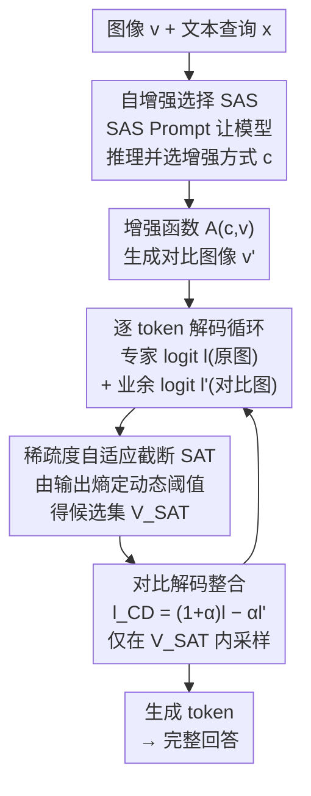

# Self-Aug: Query and Entropy Adaptive Decoding for Large Vision-Language Models

**会议**: ICLR 2026  
**arXiv**: [2510.13315](https://arxiv.org/abs/2510.13315)  
**代码**: [https://eunwooim.github.io/selfaug](https://eunwooim.github.io/selfaug)  
**领域**: 多模态VLM / 解码策略  
**关键词**: visual contrastive decoding, hallucination mitigation, self-augmentation, entropy-aware thresholding, training-free

## 一句话总结
提出 Self-Aug，一种免训练的解码策略，通过自增强提示（SAS Prompting）让 LVLM 利用自身知识动态选择与查询语义对齐的视觉增强方式，并提出稀疏度自适应截断（SAT）算法利用输出分布的完整熵信息动态调节候选词集大小，在5个 LVLM 和7个基准上一致超越现有对比解码方法。

## 研究背景与动机

**领域现状**：大型视觉语言模型（LVLM）在多模态理解和生成方面取得了卓越表现，但从底层语言模型继承了幻觉问题——生成看似合理但事实上错误的内容。视觉对比解码（VCD）是一种有前景的免训练幻觉缓解策略，通过对比标准输出与退化视觉输入产生的"业余"输出来提升事实一致性。

**现有痛点**：现有 VCD 方法存在两个根本局限。第一，视觉增强选择与文本查询脱节——所有方法都采用与查询无关的通用增强（如随机噪声），但不同查询需要完全不同的推理能力，例如"识别图中物体"和"解答手写数学题"对视觉信息扰动的敏感度截然不同。VACoDe 虽尝试动态选择增强，但仅依据首个 token 的分布散度来决策，这一经验性代理指标无法保证对整个生成序列的最优性，且在开放式生成中效果受限。第二，现有自适应可信度约束（APC）仅基于最大 logit 值设阈值，完全忽略了输出分布中编码的丰富信息——在低置信度状态下容易错误丢弃正确 token。

**核心矛盾**：对比解码需要通过视觉扰动来放大输出差异，但通用的查询无关增强无法产生最有信息量的差异；同时，候选词过滤需要在精准度与安全性之间权衡，而现有方法缺乏对模型不确定性的感知。

**本文目标** (1) 如何让视觉增强的选择与文本查询的语义意图对齐？(2) 模型的预测置信度是否与下一个 token 候选的可信度相关？如何利用这种相关性改进候选词过滤？

**切入角度**：作者观察到 LVLM 内部已包含关于哪种视觉增强最能扰动特定查询的"世界知识"——通过精心设计的元分类 prompt，可以让模型自己推理并选择最优增强。同时，Shannon 熵提供了衡量输出分布不确定性的全局指标，比单点最大值更适合动态调节阈值。

**核心 idea**：让 LVLM 自己选择查询相关的视觉增强来最大化对比解码的信息量，并用输出熵动态调节候选词集大小。

## 方法详解

### 整体框架
Self-Aug 要解决的是视觉对比解码（visual contrastive decoding, VCD）的两处脱节：视觉增强和查询语义对不上、候选词截断对模型不确定性无感知。它把整条解码链路拆成"先选增强、再逐步对比、动态截断"三段。给定图像 $v$ 和文本查询 $x$，先用一次 SAS Prompt 让 LVLM 自己推理并选出最能扰动当前查询的视觉增强方式 $c$（裁剪、遮挡、噪声、颜色反转、水平/垂直翻转之一），用增强函数 $\mathcal{A}(c,v)$ 生成对比图像 $v'$。随后进入逐 token 的解码循环：每一步同时算原图的专家 logit $l$ 和增强图的业余 logit $l'$，由 SAT 根据当前输出分布的熵动态定一个截断阈值得到候选集 $\mathcal{V}_{SAT}$，再做对比解码 $l_{CD}=(1+\alpha)\cdot l-\alpha\cdot l'$ 并只在候选集内采样下一个 token。整个流程无需任何架构修改或训练。

### 关键设计

**1. 自增强选择 SAS：让模型自己推理「哪种视觉扰动最能破坏当前查询」**

针对的痛点是现有 VCD 一律用查询无关的通用增强（随机噪声），但"识别物体"和"解数学题"对视觉扰动的敏感度天差地别。SAS 不再外部启发式地猜，而是把选择权交还给模型自己：构建一个结构化的 SAS Prompt $\mathcal{P}$，里面塞进三样东西——(a) 每种视觉增强（裁剪、遮挡、噪声、颜色反转、水平/垂直翻转）的显式定义和效果说明，给模型补足操作知识；(b) 强制模型"先推理后选择"的结构（受 STaR 启发），把先想清楚再下结论固化进流程，减少事后合理化；(c) 少样本 ICL 示例帮助模型理解任务上下文。模型的输出经解析函数 $g(\cdot)$ 拆出推理轨迹 $r$ 和最终选择 $c$，再用预定义增强函数 $\mathcal{A}(c,v)$ 把选中的扰动施加到原图 $v$ 上生成对比图像。这一步用贪心解码，保证选择确定且高效。相比 VACoDe 只看首个 token 的分布散度来拍板，SAS 调用的是模型内在的世界知识和常识，能真正推理查询的底层意图，让增强方式和查询语义对齐。

**2. 稀疏度自适应截断 SAT：用整条分布的熵动态决定保留多少候选词**

现有的自适应可信度约束（APC）只看最大 logit 一个点来设阈值，是个"置信度盲"的过滤器——模型不确定时，它照样按固定标准砍候选，很容易把正确 token 误删。SAT 抓住的核心洞察是：稀疏度（置信度）和应保留的候选数量成反比。模型高度不确定（高熵）时，该放宽阈值、多留候选，避免错杀；模型高度确定（低熵）时，该收紧阈值、精简候选。落地用一个衰减熵函数：

$$H_{\text{decay}}(p) = \sigma\!\left(-\gamma \sum_i p_i \log_2 p_i\right)$$

其中 $\sigma$ 是 sigmoid，$\gamma < 0$ 是缩放参数。选 sigmoid 是刻意的：它天然有界于 $(0,1)$，下平台为低置信度分布提供稳定阈值，且只需单个参数 $\gamma$ 就能控制中间过渡区的衰减陡度。这样阈值不再是死的常数，而是随每一步输出分布的整体不确定性实时浮动，在精准度和召回率之间动态找平衡。

**3. 对比解码整合：把查询感知的增强和置信度感知的截断拼成一条解码链路**

前两个组件最终汇到对比解码这一步。每个时间步先算原图的专家 logit $l$ 和增强图的业余 logit $l'$，做对比放大，再用 SAT 的动态阈值把候选集裁干净。最终的对比 logit 为

$$l_{CD}(y_t) = (1+\alpha)\cdot l - \alpha \cdot l' \quad \text{若 } y_t \in \mathcal{V}_{SAT}, \text{ 否则 } -\infty$$

候选集 $\mathcal{V}_{SAT}$ 由 SAT 给出的动态阈值 $\beta_t^{SAT}$ 决定：$\mathcal{V}_{SAT} = \{y_t \in \mathcal{V} \mid p_\theta(y_t) \geq \beta_t^{SAT} \cdot \max_w p_\theta(w)\}$，落在阈值外的 token 直接置 $-\infty$，token 从 $\text{softmax}(l_{CD})$ 采样。两个组件在这里相互增强：SAS 选出更对路的增强 → 对比信号更有意义；SAT 更聪明地截断 → 这些信号被更充分地利用。

### 损失函数 / 训练策略
Self-Aug 是完全免训练的方法。超参数设置：$\alpha=1$，APC 的 $\beta=0.1$，SAT 的 $\gamma=-0.5$。所有实验重复5次取均值和标准差。

## 实验关键数据

### 主实验（判别式基准）

| 模型 | 方法 | POPE-COCO Acc↑ | MME-P↑ | MMVP↑ | 平均提升 |
|------|------|---------------|--------|-------|---------|
| LLaVA-1.5-7B | Multinomial | 82.07 | 1278.42 | 32.40 | - |
| LLaVA-1.5-7B | VCD | 83.66 | 1323.67 | 34.00 | +10.86% |
| LLaVA-1.5-7B | VACoDe | 84.29 | 1372.50 | 36.67 | +9.52% |
| LLaVA-1.5-7B | **Self-Aug** | **82.93** | **1431.30** | **36.00** | **+14.32%** |
| LLaVA-1.5-13B | Multinomial | 83.86 | 1351.69 | 31.60 | - |
| LLaVA-1.5-13B | **Self-Aug** | **85.37** | **1462.18** | **34.80** | **+11.59%** |
| InstructBLIP | Multinomial | 68.70 | 973.66 | 19.20 | - |
| InstructBLIP | **Self-Aug** | **82.86** | **1198.53** | **16.13** | **+18.78%** |
| Qwen3-VL-8B | Multinomial | 88.59 | 1725.16 | 55.47 | - |
| Qwen3-VL-8B | **Self-Aug** | **88.79** | **1726.77** | **60.50** | **+2.25%** |

### 消融实验

| 配置 | MME-P↑ | 说明 |
|------|--------|------|
| Multinomial (基线) | 1278.42 | 无对比解码 |
| VCD (随机噪声) | 1323.67 | 查询无关增强 |
| VACoDe (首token选择) | 1372.50 | 首token散度选择增强 |
| Self-Aug (SAS only) | ~1400+ | 仅自增强选择 |
| Self-Aug (SAS + SAT) | 1431.30 | 完整方法 |
| APC ($\beta=0.1$, 固定) | 基线 | 置信度盲截断 |
| SAT ($\gamma=-0.5$, 自适应) | 提升 | 熵感知动态截断 |

### 关键发现
- **Self-Aug 在所有模型上一致有效**：在5个 LVLM（LLaVA-1.5-7B/13B、Qwen-VL、InstructBLIP、Qwen3-VL-8B）上均超越 VCD 和 VACoDe，平均提升最高达 18.78%（InstructBLIP）
- **对弱模型帮助更大**：在 InstructBLIP 上提升最显著（Avg.Δ +18.78%），而在已经很强的 Qwen3-VL-8B 上提升较小（+2.25%），符合预期——弱模型更容易通过对比解码获益
- **SAS 和 SAT 互补**：SAS 提供更有信息量的对比信号，SAT 更好地利用这些信号，两者结合效果最佳
- **查询相关性至关重要**：与查询无关的通用增强（VCD）虽然有效，但远不如查询感知的 SAS 选择

## 亮点与洞察
- **"让模型自己选"的元认知思路**：SAS 本质上是让 LVLM 做一个元分类任务——推理哪种视觉扰动最能破坏当前查询的回答。这个"自知之明"的设计可以推广到任何需要模型自适应配置的场景
- **熵作为不确定性代理的巧妙应用**：SAT 将 Shannon 熵与 sigmoid 衰减结合，用一个优雅的公式实现了"高不确定性→宽松过滤，低不确定性→严格过滤"的直觉，仅需一个超参数 $\gamma$ 即可控制
- **免训练的即插即用设计**：无需架构修改或额外训练，可直接应用于任何 LVLM，降低了部署门槛

## 局限与展望
- **SAS 增加推理开销**：需要额外的一次前向传播来执行 SAS Prompt，增强选择本身也有计算成本
- **增强集固定为6种**：仅支持预定义的6种视觉增强（裁剪、遮挡、噪声、颜色反转、水平/垂直翻转），可能遗漏更有效的增强方式
- **对强模型的边际收益递减**：在 Qwen3-VL-8B 这样的强模型上仅有 +2.25% 的提升，说明随着模型本身变强，解码层面的优化空间在缩小
- 可考虑学习一个轻量的增强选择器来替代 SAS Prompt，降低推理开销

## 相关工作与启发
- **vs VCD**: VCD 使用查询无关的随机噪声生成对比输入，Self-Aug 通过 SAS 实现查询感知的增强选择，在信息量上更优
- **vs VACoDe**: VACoDe 用首 token 散度选择增强，但这个经验代理在开放式生成中不可靠；Self-Aug 利用模型自身推理能力做出全局更优的选择
- **vs OPERA/DoLa**: 这些方法关注注意力模式或层间对比，与 Self-Aug 的视觉增强对比是正交的方向，理论上可以结合

## 评分
- 新颖性: ⭐⭐⭐⭐ SAS 的自增强选择思路新颖，SAT 的熵感知截断设计巧妙
- 实验充分度: ⭐⭐⭐⭐⭐ 5个模型、7个基准、判别+生成两类评估，消融全面
- 写作质量: ⭐⭐⭐⭐ 技术描述清晰，数学推导严谨
- 价值: ⭐⭐⭐⭐ 免训练即插即用的设计具有实用价值，但对强模型帮助有限

<!-- RELATED:START -->

## 相关论文

- [\[CVPR 2026\] Consensus Entropy: Harnessing Multi-VLM Agreement for Self-Verifying and Self-Improving OCR](../../CVPR2026/multimodal_vlm/consensus_entropy_harnessing_multi-vlm_agreement_for_self-verifying_and_self-imp.md)
- [\[ICLR 2026\] Self-Evolving Vision-Language Models for Image Quality Assessment via Voting and Ranking](self-evolving_vision-language_models_for_image_quality_assessment_via_voting_and.md)
- [\[CVPR 2026\] WeMMU: Enhanced Bridging of Vision-Language Models and Diffusion Models via Noisy Query Tokens](../../CVPR2026/multimodal_vlm/wemmu_enhanced_bridging_of_vision-language_models_and_diffusion_models_via_noisy.md)
- [\[ICML 2026\] Self-Prophetic Decoding to Unlock Visual Search in LVLMs](../../ICML2026/multimodal_vlm/self-prophetic_decoding_to_unlock_visual_search_in_lvlms.md)
- [\[ICLR 2026\] Vision-Zero: Scalable VLM Self-Improvement via Strategic Gamified Self-Play](vision-zero_scalable_vlm_self-improvement_via_strategic_gamified_self-play.md)

<!-- RELATED:END -->
