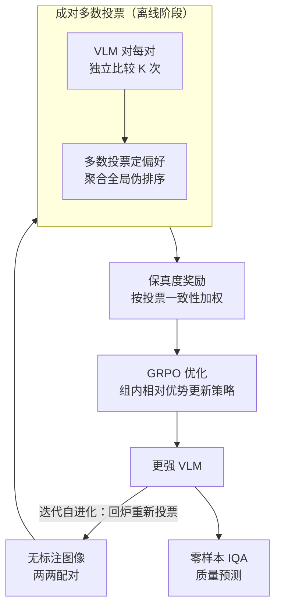

# Self-Evolving Vision-Language Models for Image Quality Assessment via Voting and Ranking

**会议**: ICLR 2026  
**arXiv**: [2509.25787](https://arxiv.org/abs/2509.25787)  
**代码**: 无  
**领域**: 多模态VLM  
**关键词**: VLM, 图像质量评估, 自监督, GRPO, 投票排序

## 一句话总结

提出 EvoQuality 框架，通过成对多数投票生成伪排序标签、结合 GRPO 自迭代优化，使 VLM 在无人工标注下自主提升图像质量感知能力，零样本性能提升 31.8% PLCC，在 7 个 IQA 基准中 5 个超越有监督 SOTA。

## 研究背景与动机

图像质量评估（IQA）是计算机视觉中的经典任务，目标是自动评估图像的感知质量。近年来，视觉语言模型（VLM）在多项视觉任务中展现了强大的能力，但将其应用于 IQA 仍然面临两大挑战：

**标注成本高昂**：传统的 VLM 后训练方法（如 SFT 或 RLHF）依赖大量人工标注的质量评分数据，采集成本极高，且主观性强、一致性差。

**自监督在感知领域的空白**：虽然自监督技术在推理能力增强方面（如数学推理）已被验证有效，但在感知类任务（如质量判断）中的应用几乎为空白。IQA 不同于推理任务——它没有唯一正确答案，而是依赖于相对比较。

**已有方法的局限**：现有的 VLM-based IQA 模型大多需要在有标注的 IQA 数据集上进行监督微调，泛化能力有限，且对未见数据集的迁移效果不佳。

本文的核心动机是：**能否让 VLM 自主地、无需任何人工标签地提升其图像质量感知能力？** 作者观察到，虽然 VLM 单次质量判断可能不准确，但通过多次成对比较的"群体智慧"可以涌现出可靠的质量排序。

## 方法详解

### 整体框架

EvoQuality 把"无标注提升 IQA"拆成一个自监督闭环，每一轮包含离线、在线两个阶段：离线阶段让 VLM 对图像两两比较、用多数投票投出一份共识排序当伪标签；在线阶段把这份排序翻译成保真度奖励、用 GRPO 微调模型；微调后的更强 VLM 回到离线阶段重新投票，产出更干净的伪标签，如此一轮轮自我进化。整个过程不依赖任何人工质量评分，靠的是"单次判断不准、群体投票可信"这一假设。

### 关键设计

**1. 成对多数投票：把不可靠的单次判断聚合成可信排序**

VLM 单独给一张图打绝对质量分既主观又不稳，但回答"这两张哪张更好"要容易得多。EvoQuality 因此对一组图像中的每一对都让 VLM 独立比较 $K$ 次（实验中 $K$ 取 5~10 较优），对这 $K$ 次输出取多数投票确定该对的偏好方向，再把所有图像对的两两偏好用计数/Bradley-Terry 类排序聚合成一份全局质量排序。这套做法本质是把数学推理里的 self-consistency 搬到感知任务上——单次采样可能翻车，但多次采样一致指向的方向反映了模型真实倾向，投票越一致说明该对越好判，聚合出的排序也就越接近真实质量序。

**2. 保真度奖励：让强化学习信号尊重投票的确信程度**

伪排序本身只是个序，要驱动 GRPO 还需把它变成可优化的奖励。EvoQuality 规定：当 VLM 新一轮的比较输出与伪排序一致时给正奖励、不一致给负奖励，且奖励强度正比于该对的投票一致性。这样设计是因为高一致性的对（模型很确信谁更好）更可信，应当被重点对齐；而投票接近五五开的对往往是困难样本或噪声，赋予较低权重可以避免模型去硬背这些不可靠的判断，从源头压住伪标签噪声对训练的污染。

**3. GRPO 优化：用组内相对奖励替代昂贵的 value 网络**

模型更新采用 Group Relative Policy Optimization。每轮从当前 VLM 对同一输入采样一组响应，直接用组内保真度奖励的相对高低算出每条响应的优势 $A_i$，按策略梯度更新，损失为 $L_{GRPO} = -\mathbb{E}\big[\sum_{i} A_i \log \pi_\theta(y_i \mid x_i)\big]$，并叠加 KL 散度约束把模型拉住、防止它为迎合伪标签而偏离原始视觉能力太远。相比 PPO，GRPO 省掉了额外的 critic/value 网络，组内相对比较天然契合"质量排序"这种相对任务，对大 VLM 的多轮迭代也更省算力。

**4. 迭代自进化：让伪标签和模型互相托举**

单轮训练后并不停手，而是用更新后的 VLM 重新执行成对投票、生成新一批伪标签。由于模型已经变强，新伪标签的排序质量更高，又能进一步把模型推得更好，形成"更好的模型 → 更准的伪标签 → 更有效的训练"的正反馈循环。这里刻意选用相对排序而非绝对评分作为自训练信号——排序对单点误差不敏感，能避免传统 self-training 中绝对标签误差逐轮累积放大的问题，让循环在多轮后仍保持稳定提升。

## 实验关键数据

### 主实验

EvoQuality 在 7 个主流 IQA 基准上进行了评估：

| 指标 | 本文 EvoQuality | 基础 VLM (零样本) | 提升幅度 |
|------|----------------|------------------|---------|
| PLCC (平均) | 显著提升 | 基线 | +31.8% |
| 击败有监督 SOTA | 5/7 基准 | - | - |

关键发现：
- 在 LIVE、CSIQ、TID2013、KADID-10K、SPAQ 等 5 个基准上超越了有监督的 SOTA VLM-based IQA 模型
- 在 KonIQ-10K 和 FLIVE 上接近有监督 SOTA
- 完全自监督训练，无需任何人工质量标注

### 消融实验

| 配置 | 效果 | 说明 |
|------|------|------|
| 无投票直接优化 | 性能大幅下降 | 投票机制是核心 |
| 固定伪标签（单轮） | 低于迭代版本 | 迭代自进化带来持续提升 |
| 均匀奖励权重 | 低于保真度加权 | 一致性加权更有效 |
| 不同投票次数 K | K 增大初期提升，后饱和 | K=5~10 为较优选择 |

### 关键发现

1. **自监督可媲美有监督**：在 IQA 领域首次证明，自监督方法可以达到甚至超越有监督微调的性能
2. **灵活的可叠加性**：EvoQuality 可以与预训练的 IQA 模型叠加使用，进一步增强在未见数据集上的泛化能力
3. **跨数据集泛化**：无需目标数据集的任何标注，即可在多个分布外的 IQA 基准上取得 SOTA 性能

## 亮点与洞察

1. **将 self-consistency 从推理扩展到感知**：巧妙地将数学推理中"多次采样取一致性"的思想适配到了基于排序的 IQA 任务——用成对比较的多数投票替代了答案的一致性验证
2. **排序比评分更适合自监督**：绝对质量评分难以自评，但相对质量比较更容易通过投票达成共识
3. **正反馈循环设计优雅**：迭代自进化机制使得训练过程具有"自我加速"的特性
4. **实用价值高**：完全消除了 IQA 领域对人工标注的依赖，大幅降低了部署成本

## 局限与展望

1. **迭代效率**：多轮迭代+多次采样的计算开销较大，尤其是大规模 VLM
2. **投票质量依赖基础模型**：如果基础 VLM 的质量感知能力极弱，投票可能无法收敛到有意义的排序
3. **任务特异性**：框架针对排序/比较类任务设计，推广到其他感知任务（如美学评估、损伤检测）需要适配
4. **缺乏理论收敛保证**：迭代自进化的收敛性未有理论分析，实践中可能存在过拟合伪标签的风险
5. **可扩展方向**：将投票机制从成对扩展到列表级别（listwise）可能进一步提升效率

## 相关工作与启发

- **IQA 传统方法**：BRISQUE、NIQE 等手工特征方法 → 深度学习方法（DBCNN、HyperIQA）→ VLM-based 方法（Q-Align、Q-Instruct）
- **VLM 自改进**：Self-Play、Self-Rewarding LLMs 等自迭代范式的成功为本文提供了启发
- **GRPO**：DeepSeek 提出的 GRPO 优化方法，本文将其从推理任务迁移到感知任务
- **启发**：该框架的核心思想（投票→伪标签→自迭代优化）可能适用于其他"无唯一正确答案"的视觉任务

## 评分

- **新颖性**: ⭐⭐⭐⭐ — 将 self-consistency 和 GRPO 创造性地应用于 IQA，但各组件本身不新
- **实验充分度**: ⭐⭐⭐⭐ — 7 个基准全面评估，消融充分，但缺乏与更多自监督方法的对比
- **写作质量**: ⭐⭐⭐⭐ — 动机清晰，框架直观
- **价值**: ⭐⭐⭐⭐⭐ — 消除 IQA 标注需求，实际应用价值大

<!-- RELATED:START -->

## 相关论文

- [\[ICLR 2026\] Grounding-IQA: Grounding Multimodal Language Models for Image Quality Assessment](grounding-iqa_grounding_multimodal_language_model_for_image_quality_assessment.md)
- [\[CVPR 2026\] R4-CGQA: Retrieval-based Vision Language Models for Computer Graphics Image Quality Assessment](../../CVPR2026/multimodal_vlm/r4-cgqa_retrieval-based_vision_language_models_for_computer_graphics_image_quali.md)
- [\[CVPR 2026\] VisPlay: Self-Evolving Vision-Language Models](../../CVPR2026/multimodal_vlm/visplay_self-evolving_vision-language_models.md)
- [\[CVPR 2026\] UARE: A Unified Vision-Language Model for Image Quality Assessment, Restoration, and Enhancement](../../CVPR2026/multimodal_vlm/uare_a_unified_vision-language_model_for_image_quality_assessment_restoration_an.md)
- [\[CVPR 2026\] Probabilistic Prompt Adaptation for Unified Image Aesthetics and Quality Assessment](../../CVPR2026/multimodal_vlm/probabilistic_prompt_adaptation_for_unified_image_aesthetics_and_quality_assessm.md)

<!-- RELATED:END -->
