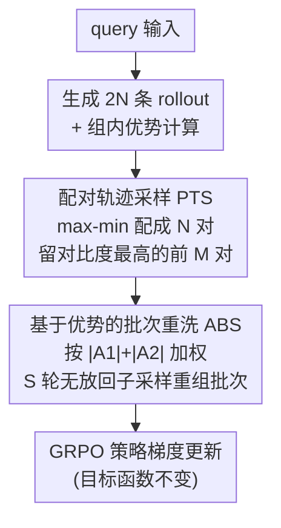

# Shuffle-R1: Efficient RL Framework for Multimodal Large Language Models via Data-centric Dynamic Shuffle

**会议**: ICLR 2026  
**arXiv**: [2508.05612](https://arxiv.org/abs/2508.05612)  
**代码**: [https://xenozlh.github.io/Shuffle-R1](https://xenozlh.github.io/Shuffle-R1)  
**领域**: 多模态VLM  
**关键词**: 强化学习, 多模态推理, 数据中心优化, 轨迹采样, GRPO

## 一句话总结
提出 Shuffle-R1 框架，通过 Pairwise Trajectory Sampling（选取高对比度轨迹对）和 Advantage-based Batch Shuffle（按优势值重分配训练批次），解决 RL 训练中的 Advantage Collapsing 和 Rollout Silencing 两大效率瓶颈，在 Geo3K 上比 baseline 提升 22%，MathVerse 上超越 GPT-4o。

## 研究背景与动机

**领域现状**: 强化学习(RL)已成为提升 LLM/MLLM 推理能力的主流后训练范式。DeepSeek-R1 等工作使用可验证结果奖励信号，在数学推理和代码生成上取得显著进步。RL 也被扩展到多模态领域，用于视觉推理、目标检测、视频理解等任务。

**现有痛点**: 当前 RL 训练流程存在两个被忽视的关键效率问题：
   - **Advantage Collapsing**: 一个 batch 中大多数 rollout 的 advantage 值集中在零附近，导致梯度信号极弱，有价值的轨迹被大量无信息轨迹淹没
   - **Rollout Silencing**: 随着训练推进，贡献非零梯度的 rollout 比例持续下降（简单问题已收敛、困难问题始终无法答对），造成计算浪费

**核心矛盾**: 静态采样范式对所有轨迹一视同仁，无法区分"哪些数据值得更新"；增大 rollout 数量虽能部分缓解，但计算开销线性增长，未触及根因。

**本文目标** 在不显著增加计算开销的前提下，动态筛选有价值的轨迹并优化批次组成，提高 RL 训练的梯度信号质量与计算利用率。

**切入角度**: 从数据侧切入，将 RL 训练从"如何更新"转向"用什么数据更新"，设计自适应的轨迹选择和批次重组机制。

**核心 idea**: 通过配对采样挑选高对比度轨迹、按优势值重洗批次放大关键信号，实现动态数据优先级调度。

## 方法详解

### 整体框架
Shuffle-R1 沿用标准 GRPO 的策略梯度训练，但在优势（advantage）计算完成之后、梯度更新之前插入了一道"数据调度"工序。先让每个 query 生成加倍的 $2N$ 条 rollout，算完组内优势后用配对轨迹采样（Pairwise Trajectory Sampling, PTS）从这个扩大的轨迹池里挑出高对比度的正负轨迹对，再用基于优势的批次重洗（Advantage-based Batch Shuffle, ABS）按优势值重组这批轨迹的训练批次，最后才送进 GRPO 做梯度更新。两个模块都只动数据、不改目标函数，合起来把 RL 训练从"对所有轨迹一视同仁"变成"动态优先更新有价值的轨迹"。

### 关键设计

**1. 配对轨迹采样 PTS：把高对比度的正负轨迹挑出来，对抗 Advantage Collapsing**

一个批次里大多数 rollout 的优势值都挤在零附近，梯度信号被无信息轨迹淹没，这就是优势塌缩（Advantage Collapsing）。配对轨迹采样（PTS）的做法是先把每个 query 的 rollout 数量翻倍到 $2N$，把生成成本花在"多看几个候选"上；对这 $2N$ 条 rollout 按优势值降序排列后采用 max-min 配对——最大的与最小的配成一对、次大的与次小的配成一对，每对内部的优势差距天然就是对比强度。配出 $N$ 对后，按采样比 $\alpha$ 只保留对比度最高的前 $M=\alpha N$ 对（实现里 $\alpha=0.5$，即 8 对里留 4 对）进入梯度计算。关键在于：虽然 rollout 生成量翻倍，但真正参与反向传播的只有筛选后的 top-$M$ 对，梯度计算量与原来持平，等于用少量额外的前向开销换来了显著更强、更干净的训练信号。

**2. 基于优势的批次重洗 ABS：让高价值轨迹获得更多更新机会，对抗 Rollout Silencing**

随着训练推进，能贡献非零梯度的 rollout 越来越少——简单题早已收敛、难题始终答不对，算力大量空转，这就是 rollout 沉默（Rollout Silencing）。基于优势的批次重洗（ABS）不再把 PTS 选出的轨迹对平均塞进批次，而是给每对算一个重要性权重 $W(p)=|\hat{A}_1|+|\hat{A}_2|$（两条轨迹优势绝对值之和），归一化成采样分布 $\Phi$。然后做 $S$ 轮无放回子采样，每轮抽 $T$ 对，拼成重洗后的批次 $B'$，并保持 $|B'|=|B|$ 不改变批大小（实现里 $T=256$、$S=8$）。这样优势值高的轨迹被采到的概率更大、获得更多更新机会，低价值轨迹被自然降权，本质上是一种软优先级排序，把宝贵的更新预算倾斜到真正有信息量的样本上。

### 损失函数 / 训练策略
基础目标沿用 GRPO 的 PPO-clip 风格策略梯度，advantage 走组内标准化，整套 PTS+ABS 不引入额外损失项。训练超参上，每个 query 生成 $2N=16$ 个 rollout，PTS 配 8 对、按 $\alpha=0.5$ 留 4 对，ABS 子采样容量 $T=256$、轮数 $S=8$；学习率 1e-6，rollout 温度 1.0，视觉编码器冻结。

## 实验关键数据

### 主实验

| 模型 | 方法 | Geo3K | Math Avg. | HallBench | ChartQA |
|------|------|-------|-----------|-----------|---------|
| Qwen2.5-VL-3B | Baseline | 25.79 | 41.71 | 59.83 | 73.08 |
| Qwen2.5-VL-3B | +GRPO | 42.64 | 46.74 | 63.09 | 76.20 |
| Qwen2.5-VL-3B | +DAPO | 45.09 | 48.08 | 63.24 | 76.70 |
| Qwen2.5-VL-3B | **+Ours** | **47.88(+22.09)** | **48.70(+6.99)** | 63.19 | **77.04** |
| Qwen2.5-VL-7B | Baseline | 38.12 | 49.82 | 65.19 | 79.84 |
| Qwen2.5-VL-7B | +GRPO | 52.60 | 53.13 | 68.56 | 80.84 |
| Qwen2.5-VL-7B | **+Ours** | **55.89(+17.77)** | **54.63(+4.81)** | **69.51** | **81.64** |

在跨领域基准上(30k 训练数据)，7B 模型在 MathVerse 上达到 52.2%，超越 GPT-4o (50.8%)。

### 消融实验

| 组件 | Geo3K (3B) | Math Avg. (3B) |
|------|------------|----------------|
| GRPO baseline | 42.64 | 46.74 |
| +PTS only | 46.52 | 47.89 |
| +ABS only | 44.18 | 47.35 |
| +PTS+ABS (Full) | **47.88** | **48.70** |

### 关键发现
- PTS 贡献最大，单独即可带来 ~4% Geo3K 提升；ABS 提供额外 ~1.5% 增益
- 在仅用 50% 训练步数时即可匹配 GRPO 的完整训练效果，训练效率提升 2×
- 在 3B/7B 两个规模上效果一致，说明方法具有跨规模泛化能力
- Geo3K(2.1k 样本) 小数据场景下优势尤为明显，说明方法对数据量少的情况更有价值

## 亮点与洞察
- 问题定义精准：首次系统性提出并量化 Advantage Collapsing 和 Rollout Silencing 两个 RL 训练效率瓶颈
- 方法设计简洁有效：PTS 和 ABS 都是轻量级模块，实现简单（排序+配对+加权采样），即插即用
- 实验覆盖全面：in-domain/out-of-domain、小数据/大数据、3B/7B 多规模验证
- 计算开销可控：虽然 rollout 数翻倍，但梯度计算量不变（只对筛选出的轨迹计算）

## 局限与展望
- PTS 的 max-min 配对策略是启发式的，是否存在更优的配对方式（如基于语义相似度）值得探索
- ABS 的重采样引入了重复使用同一轨迹的风险，可能导致过拟合；需要更系统的分析
- 目前只验证了数学推理任务，向通用 VQA、视觉对话等更多任务的泛化有待验证
- α=0.5 的采样比是固定的，自适应调节可能进一步提升效果

## 相关工作与启发
- 与 NoisyRollout（增加 rollout 多样性）、VL-Rethinker（反思 token）互补：前者关注数据多样性，本文关注数据质量筛选
- 与课程学习(curriculum learning)理念相通：都是让模型更多关注有价值的训练样本
- 为其他 RL 训练框架（如 DPO、RLHF）的数据侧优化提供思路

## 评分
- 新颖性: ⭐⭐⭐⭐ 问题定义新颖（Advantage Collapsing/Rollout Silencing），方法简洁有效
- 实验充分度: ⭐⭐⭐⭐ 多规模、多数据量、多基准验证，消融完整
- 写作质量: ⭐⭐⭐⭐ 问题分析清晰，图示直观，论证逻辑通顺
- 价值: ⭐⭐⭐⭐ 数据中心的 RL 优化视角对社区有较大启发，方法即插即用实用性强

<!-- RELATED:START -->

## 相关论文

- [\[ICLR 2026\] VidGuard-R1: AI-Generated Video Detection and Explanation via Reasoning MLLMs and RL](vidguard-r1_ai-generated_video_detection_and_explanation_via_reasoning_mllms_and.md)
- [\[ICLR 2026\] DIVA-GRPO: Enhancing Multimodal Reasoning through Difficulty-Adaptive Variant Advantage](diva-grpo_enhancing_multimodal_reasoning_through_difficulty-adaptive_variant_adv.md)
- [\[ICCV 2025\] Jailbreaking Multimodal Large Language Models via Shuffle Inconsistency](../../ICCV2025/multimodal_vlm/jailbreaking_multimodal_large_language_models_via_shuffle_inconsistency.md)
- [\[CVPR 2026\] Stable and Efficient Single-Rollout RL for Multimodal Reasoning](../../CVPR2026/multimodal_vlm/stable_and_efficient_single-rollout_rl_for_multimodal_reasoning.md)
- [\[CVPR 2026\] Why Does RL Generalize Better Than SFT? A Data-Centric Perspective on VLM Post-Training](../../CVPR2026/multimodal_vlm/why_does_rl_generalize_better_than_sft_a_data-centric_perspective_on_vlm_post-tr.md)

<!-- RELATED:END -->
