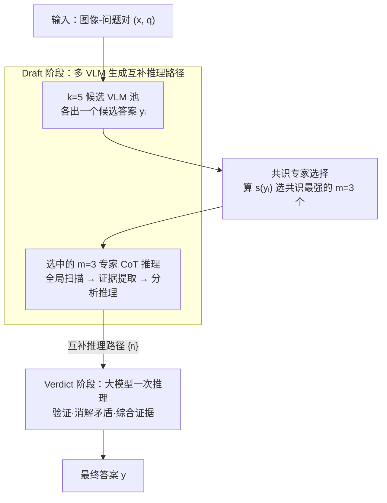

# Small Drafts, Big Verdict: Information-Intensive Visual Reasoning via Speculation

**会议**: ICLR 2026  
**arXiv**: [2510.20812](https://arxiv.org/abs/2510.20812)  
**代码**: [https://github.com/Tinaliu0123/speculative-verdict](https://github.com/Tinaliu0123/speculative-verdict)  
**领域**: 多模态VLM  
**关键词**: speculative decoding, visual reasoning, information-intensive VQA, draft-verdict framework, consensus expert selection

## 一句话总结
借鉴 Speculative Decoding 的 draft-then-verify 范式提出 Speculative Verdict (SV)，用多个轻量 VLM 生成多样推理路径作为 draft，大模型作为 verdict 综合验证并纠错，在信息密集型 VQA 上无需训练即超过 GPT-4o 达 11.9%，且能修复 47-53% 的少数正确案例。

## 研究背景与动机

**领域现状**：大型 VLM 在通用 VQA 上表现优秀，但在信息密集型图像理解（如包含大量文字注释、图表、图例等密集视觉-文本交错内容的 infographic/chart 分析）上仍面临严峻挑战。这类任务对应 InfographicVQA、ChartMuseum、ChartQAPro 等基准，要求模型在复杂布局中精确提取和推理信息。核心挑战在于两种关键能力的协同：精确定位（在密集布局中找到所有相关区域）和多跳推理（链接分散在不同区域的视觉和文本证据）。

**现有痛点**：现有方法主要通过搜索式 zoom-in 流水线放大局部区域来改善感知。学习型方法（如 DeepEyes、Pixel-Reasoner）用强化学习训练 zoom 策略，代价高昂；免训练方法基于 attention map 或置信度分数裁剪，但在密集布局中这些信号与真正相关区域的相关性很弱，容易误导到视觉相似但无关的区域。两类方法都难以全面收集多跳推理所需的分散证据。

**核心矛盾**：信息密集型 VQA 具有极高的错误敏感性——定位阶段的任何一个误读或漏读都会沿推理链传播，导致完全错误的最终答案。单个模型难以同时做到"全面覆盖所有证据"和"每一步都不出错"。而简单的多数投票在少数正确场景下完全失效（多个模型可能在相同位置犯相同错误）。

**本文目标** (1) 如何在不训练的前提下提升信息密集型 VQA 的证据覆盖率？(2) 如何在多个不完全正确的推理路径中纠错并恢复正确答案？(3) 如何高效地选择最可靠的 draft 专家以平衡准确率和推理成本？(4) 多模型综合能否超越单个大模型的推理能力？

**切入角度**：Speculative Decoding 的核心洞察——draft 模型快速扩展覆盖，verifier 确保正确性——恰好适用于信息密集型视觉推理：多个轻量 VLM 可以作为 draft 从不同角度定位证据、提取信息，大模型作为 verdict 综合验证并去除矛盾。关键观察是：不同 VLM 在同一张信息密集型图像上往往定位到不同区域、提取出不同证据，形成自然的互补性。

**核心 idea**：将 Speculative Decoding 的 draft-then-verify 范式从 token 级推理加速迁移到 VQA 任务级的多模型证据综合与纠错。

## 方法详解

### 整体框架
SV（Speculative Verdict）要解决的是信息密集型 VQA 里"单个模型既要看全证据、又要每步不出错"的两难。它把推理拆成两阶段流水：先让一池小 VLM 各自把图读一遍、产出互补的推理草稿（draft），再让一个大模型把这些草稿综合成最终答案（verdict）。具体地，给定输入图像-问题对 $(x, q)$，Draft 阶段先用 $k=5$ 个候选 VLM 各出一个候选答案，靠共识评分挑出 $m=3$ 个最可靠的当 draft 专家，每个专家用 CoT 提示生成一条详细推理路径 $r_i$；Verdict 阶段把原始图像、问题和全部路径 $\{r_i\}_{i=1}^{m}$ 喂给大模型（GPT-4o 或 Qwen2.5-VL-72B），在单次推理里验证、消解矛盾并综合出最终答案 $y = J(x, q, \{r_i\}_{i=1}^{m})$。

### 关键设计

**1. Draft 阶段：用多个轻量 VLM 生成互补的推理路径，把证据覆盖率撑起来**

信息密集型图像最怕单个模型在某个角落误读或漏读，这种错误会沿推理链一路传到最终答案。SV 的做法是让多个 7-9B 的小 VLM 各自独立推理，每个 draft 专家都用同一套 CoT 模板分三步走：先做全局扫描、提出候选区域（识别相关子图、坐标轴、图例），再做证据提取（把视觉/文本元素转成结构化线索，比如读图例、映射颜色、解析轴标签），最后执行分析推理操作（过滤、排序、计算、交叉引用）。不同架构的模型往往定位到不同区域、提取出不同证据，于是这些路径彼此互补又各带噪声，合起来就构成一个覆盖面远比单模型宽的证据池。draft 池特意挑了 5 个架构各异的模型——Qwen2.5-VL-7B、MiMo-VL-7B-RL、InternVL3-8B、GLM-4.1V-9B-Thinking、Ovis2.5-9B——目的就是让它们的盲区尽量错开。

**2. 共识专家选择：用模型间的相互认可挑出最可靠的几条 draft，而且几乎不花额外算力**

draft 池有 $k=5$ 个候选，但不是个个靠谱，得免训练地选出最值得信的 $m=3$ 个。SV 先让每个候选 VLM 各生成一个候选答案 $y_i$，再给每个答案算一个全局共识分数

$$s(y_i) = \sum_{j \neq i} |NLL_j(y_i) - NLL_j(y_j)|$$

其中 $NLL_j(y_i)$ 是模型 $M_j$ 给答案 $y_i$ 打的负对数似然。这里关键的归一化在于减去了 $NLL_j(y_j)$，也就是 $M_j$ 对自己答案的 NLL，消掉了不同模型固有的标定差异，让跨模型的比较变得公平。分数越低说明同行越认可这个答案，于是选分数最低的 $m$ 个模型当 draft 专家。之所以追共识而不是追分歧，是因为信息密集型 VQA 每题只有唯一正确答案，模型间的一致意见天然指向更可靠的路径——实验里反过来追多样性的"分歧选择"甚至掉到了单模型基线以下。整个评分只需要对每个候选答案做一次 prefill、各解码一次，对总推理时间几乎没有额外开销。

**3. Verdict 阶段：让大模型当综合者而不是投票者，从不完美的路径里把正确答案拼回来**

到这一步手里有 $m$ 条互补、但都不完全正确的推理路径，难点是怎么从中纠错。SV 让大 verdict 模型（GPT-4o 或 Qwen2.5-VL-72B）同时接收原始图像、问题和全部推理路径 $\{r_i\}_{i=1}^{m}$，在一次推理里产出最终答案

$$y = J(x, q, \{r_i\}_{i=1}^{m})$$

它扮演的是综合者：评估各路径定位是否一致、识别跨路径的矛盾、把彼此印证的线索整合成连贯预测，靠的是交叉验证推理步骤里的事实细节，而不是简单数票。这正是它赢过多数投票的地方——当多数专家在同一个位置犯同一个错时，多数投票会把少数那条正确答案淹掉，而 verdict 能从这条少数正确的路径里把信息捞回来（实验里少数正确案例的修复率达 47-53%）。工程上还有个巧妙之处：verdict 只调用一次，计算几乎全压在 prefill 上（消化数千 token 的推理路径 context），解码只吐几个答案 token，从而避开了大模型逐区域迭代分析或生成长推理那种昂贵的自回归解码成本。

### 训练策略
SV 完全免训练（training-free），不需要对任何模型进行微调。draft 池使用 5 个 7-9B 开源 VLM（Qwen2.5-VL-7B、MiMo-VL-7B-RL、InternVL3-8B、GLM-4.1V-9B-Thinking、Ovis2.5-9B），verdict 使用 GPT-4o 或 Qwen2.5-VL-72B。对信息密集型基准，额外用 PP-StructureV3 把图像转换成布局保持的结构化格式辅助 verdict 模型。免训练也带来即插即用的好处：出现更强的开源 VLM 时，draft 池和 verdict 都能无缝替换、持续获益。

## 实验关键数据

### 主实验

| 模型 | InfographicVQA (ANLS) | ChartMuseum (Acc) | ChartQAPro (Acc) | HR-Bench 4K (Acc) |
|------|----------------------|-------------------|------------------|-------------------|
| GPT-4o | 76.5 | 42.7 | 52.6 | 67.4 |
| GLM-4.1V-Thinking (9B) | 84.8 | 48.0 | 56.2 | 72.3 |
| Qwen2.5-VL-72B | 84.2 | 40.7 | 60.7 | 73.1 |
| DeepEyes (7B) | 75.5 | 28.0 | 48.7 | 73.0 |
| Pixel-Reasoner (7B) | 84.0 | 25.9 | 39.3 | — |
| **SV (GPT-4o verdict)** | **88.4** (+11.9) | **49.3** (+6.6) | **64.0** (+11.4) | 71.4 (+4.0) |
| **SV (72B verdict)** | 86.7 (+2.5) | 48.2 (+7.5) | 63.0 (+2.3) | **75.6** (+2.5) |

### 消融实验

| 消融维度 | 配置 | InfographicVQA | ChartQAPro | 说明 |
|---------|------|---------------|------------|------|
| Draft 数量 | m=1 | ~85 | ~59 | 性能随 m 增大近似线性提升 |
| Draft 数量 | m=3 (默认) | 88.4 | 64.0 | 最佳准确率-效率平衡点 |
| Draft 数量 | m=5 | ~88.5 | ~64 | 饱和，成本线性增长 |
| Verdict 输入 | 仅最终答案 | 73.4 | 59.2 | 丢失推理路径导致严重下降 |
| Verdict 输入 | 完整推理路径 | 88.4 | 64.0 | 比仅答案高 15pp / 4.8pp |
| 选择策略 | 共识选择 | 88.4 | 64.0 | 默认，最优 |
| 选择策略 | 分歧选择 | <推理基线 | <推理基线 | 多样性在此类任务上有害 |
| Verdict 规模 | 小 verdict (7-9B) | 84.1-85.4 | 57.2-60.3 | 小模型解码多但效果差 |

### 关键发现
- SV 在少数正确案例上修复率达 47-53%：即使多数 draft 给出错误答案，verdict 仍能从少数正确路径中提取正确信息。这在多数投票范式下完全不可能
- 零正确案例修复率 2.5-4.5%：即使所有 draft 和 verdict 单独作答都错误，SV 也能通过综合部分正确的推理步骤恢复正确答案——证明互补推理路径的信息总量大于单个路径
- 超越所有工具驱动方法：比 DeepEyes 高 12.9-21.3%，比 Pixel-Reasoner 高 4.4-24.7%，说明推理路径综合优于逐区域 zoom-in
- 共识选择 > 多样性选择：分歧选择甚至低于单模型基线，因为信息密集型 VQA 的答案唯一，共识自然指向正确
- 推理路径比最终答案重要得多：仅传递答案到 verdict 导致 15pp 下降，证实推理过程中的中间证据是纠错的关键
- m=3 是最佳 draft 数量：性能在 m=1 到 m=3 间近似线性增长，m>3 后饱和，而推理成本与 m 线性增长
- 在 MathVista 和 TallyQA 上也有泛化提升（分别比 GPT-4o 高 17.8%/1.5%），证明 SV 不限于信息密集型场景

## 亮点与洞察
- Speculative Decoding 从 token 级加速到任务级纠错的迁移非常巧妙——保留了"draft 扩展覆盖、verifier 保证质量"的核心原则，但在全新层面上应用。这个范式可以迁移到任何需要从多源不完美信息中整合答案的场景（如多源文档QA、科学推理）
- 共识评分通过 NLL 差异衡量模型间一致性，设计简洁且计算高效（只需 prefill，不额外解码）。关键的归一化设计——减去模型对自身答案的 NLL——消除了不同模型间的标定差异，使得跨模型比较更公平
- "少数正确修复"能力是 SV 相比多数投票的根本优势，从信息论角度看，推理路径携带的证据远多于最终答案，verdict 可以在区分推理步骤的精细度上做出判断
- Verdict 的计算集中在 prefill 而非解码阶段是一个巧妙的工程设计——大模型只需处理输入 context（数千 token 的推理路径）并输出几个答案 token，避免了昂贵的长序列自回归生成
- 完全免训练的特性使 SV 即插即用：随着更强的开源 VLM 出现，draft 池和 verdict 模型都可以无缝替换，持续获益

## 局限与展望
- 依赖 5 个候选 VLM 和 1 个大 verdict 模型，总推理成本仍然不低（虽然比直接用大模型逐区域分析便宜）。在资源受限场景下需要探索更轻量的 verdict 替代方案
- 对 verdict 模型能力有较高要求——小 verdict (7-9B) 效果明显差于大 verdict，系统对大模型有强依赖
- 未探索 draft 专家池的组成对性能的影响——哪些模型的组合互补性最强？不同架构/训练目标的模型组合是否优于同质模型？
- PP-StructureV3 的文档结构提取是额外预处理步骤，增加了系统复杂度且对非文档类图像可能无效
- 共识选择在答案不唯一的开放式任务（如图像描述、创意生成）上是否仍然有效不明确
- 当所有 draft 模型在同一位置犯同类型错误时（如系统性的 OCR 失败），SV 也无法修复

## 相关工作与启发
- **vs DeepEyes/Pixel-Reasoner**: 这些方法用 RL 训练 zoom 策略逐区域放大，SV 用多模型推理综合替代工具驱动搜索。SV 的优势在于不需要训练且覆盖更全面，但 zoom 方法在只需精确定位单一区域的场景下可能更高效
- **vs LLaVA-Critic (LMM-as-a-Judge)**: LLaVA-Critic 从候选中选最佳单个答案，SV 综合多条路径生成新答案。SV 高出 4.9-11.9%，因为综合可以修复每条路径中的部分错误，而选择只能接受或拒绝完整路径
- **vs Speculative Decoding**: 原始 Speculative Decoding 做 token 级验证加速推理速度，SV 做任务级综合提升推理质量——两者共享"draft-then-verify"框架但目标完全不同
- **vs Majority Voting/Self-Consistency**: 多数投票假设正确答案是多数，但在信息密集型推理中多个模型可能在同一位置犯同类错误，导致多数错误。SV 通过推理路径级的综合而非答案级的投票克服了这一局限

## 评分
- 新颖性: ⭐⭐⭐⭐ Speculative Decoding 到任务级视觉推理的概念迁移很有创意，共识评分基于 NLL 归一化的设计简洁优雅
- 实验充分度: ⭐⭐⭐⭐⭐ 4 个信息密集型基准 + HR-Bench + MathVista + TallyQA 共 7 个基准，消融实验覆盖 draft 数量、选择策略、verdict 输入形式、verdict 模型规模四个维度，纠错能力有定量分析
- 写作质量: ⭐⭐⭐⭐ 论文结构清晰，running case（Figure 3）贯穿全文帮助理解整个流程，方法描述和实验分析相互呼应
- 价值: ⭐⭐⭐⭐ 免训练框架实用性强，对信息密集型 VQA 的提升显著且稳定，推理路径综合的思路有广泛适用性

<!-- END -->

<!-- RELATED:START -->

## 相关论文

- [\[CVPR 2026\] Small Object, Great Challenge: A Benchmark for Small Object Visual Grounding](../../CVPR2026/multimodal_vlm/small_object_great_challenge_a_benchmark_for_small_object_visual_grounding.md)
- [\[ICLR 2026\] Empowering Small VLMs to Think with Dynamic Memorization and Exploration](empowering_small_vlms_to_think_with_dynamic_memorization_and_exploration.md)
- [\[CVPR 2026\] RMIR: A Benchmark Dataset for Reasoning-Intensive Multimodal Image Retrieval](../../CVPR2026/multimodal_vlm/rmir_a_benchmark_dataset_for_reasoning-intensive_multimodal_image_retrieval.md)
- [\[CVPR 2026\] Downscaling Intelligence: Exploring Perception and Reasoning Bottlenecks in Small VLMs](../../CVPR2026/multimodal_vlm/downscaling_intelligence_exploring_perception_and_reasoning_bottlenecks_in_small.md)
- [\[ICLR 2026\] LiveWeb-IE: A Benchmark For Online Web Information Extraction](liveweb-ie_a_benchmark_for_online_web_information_extraction.md)

<!-- RELATED:END -->
